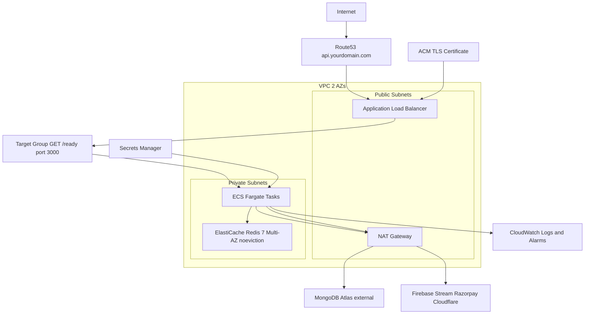
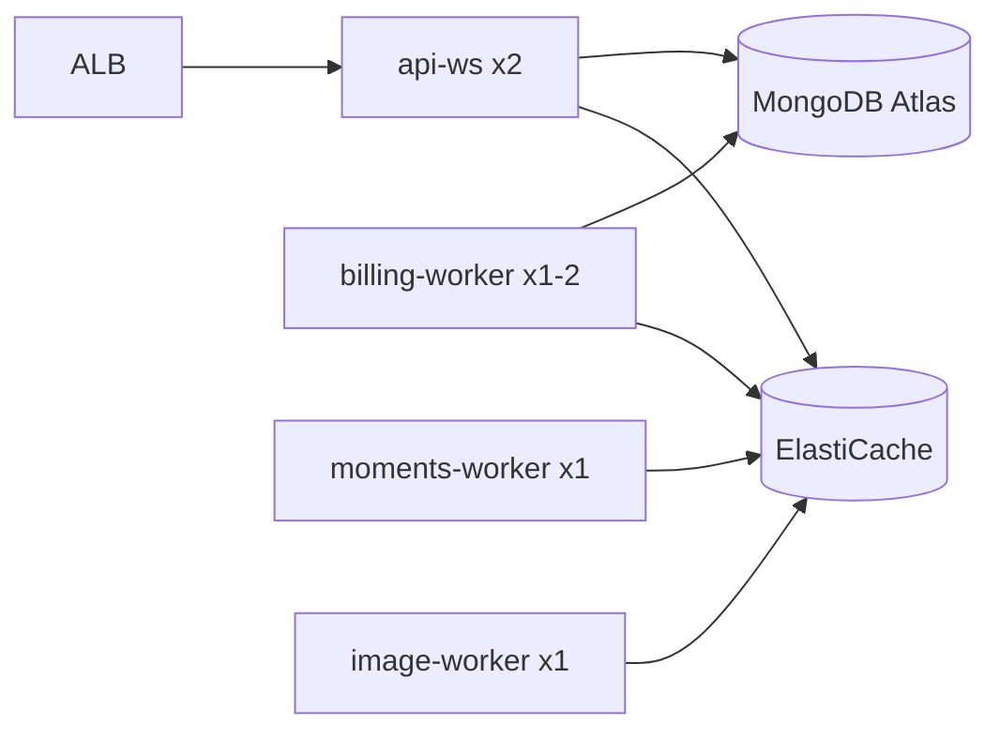

# AWS Backend Deployment Guide

**Document version:** 1.0  
**Date:** 2026-06-08  
**Scope:** Deploy the Eazy Talks / Match Vibe Node.js backend on AWS  
**Audience:** Engineering, DevOps, release owners

> **Related docs**
> - Architecture assessment: [AWS_MIGRATION_READINESS.md](./AWS_MIGRATION_READINESS.md)
> - ECS service split (code): [ECS_SERVICE_SPLIT_IMPLEMENTATION.md](./ECS_SERVICE_SPLIT_IMPLEMENTATION.md)
> - Full-stack readiness: [../../docs/AWS_FULL_STACK_READINESS.md](../../docs/AWS_FULL_STACK_READINESS.md)
> - Reverse proxy rules: [API_REVERSE_PROXY.md](./API_REVERSE_PROXY.md)
> - Canary monitoring: [../../docs/CANARY_MONITORING_RUNBOOK.md](../../docs/CANARY_MONITORING_RUNBOOK.md)

---

## Table of contents

1. [Part 0 — Prerequisites and decisions](#part-0--prerequisites-and-decisions)
2. [Part 1 — Phase 1: Monolith deploy (fastest path)](#part-1--phase-1-monolith-deploy-fastest-path)
3. [Part 2 — Phase 2: Four-service ECS split](#part-2--phase-2-four-service-ecs-split)
4. [Part 3 — ElastiCache Redis (deep dive)](#part-3--elasticache-redis-deep-dive)
5. [Part 4 — Application Load Balancer (deep dive)](#part-4--application-load-balancer-deep-dive)
6. [Part 5 — Secrets and environment variables](#part-5--secrets-and-environment-variables)
7. [Part 6 — External webhook and URL updates](#part-6--external-webhook-and-url-updates)
8. [Part 7 — Observability (CloudWatch)](#part-7--observability-cloudwatch)
9. [Part 8 — Cutover strategy](#part-8--cutover-strategy)
10. [Part 9 — Pre-go-live checklist](#part-9--pre-go-live-checklist)
11. [Part 10 — AWS CLI command reference](#part-10--aws-cli-command-reference)
12. [Part 11 — Troubleshooting](#part-11--troubleshooting)
13. [Part 12 — Optional follow-up artifacts](#part-12--optional-follow-up-artifacts)

---

## Target architecture



**External services (unchanged on AWS):** MongoDB Atlas, Firebase, Stream Video/Chat, Razorpay, Cloudflare Images/Stream.

**Recommended compute:** ECS Fargate (not Lambda — WebSockets + BullMQ workers require long-running processes).

---

## Part 0 — Prerequisites and decisions

### What you need before starting

| Item | Details |
|------|---------|
| AWS account | With permissions for VPC, ECS, ECR, ElastiCache, ALB, ACM, Route53, Secrets Manager, CloudWatch, IAM |
| AWS CLI v2 | Installed and configured: `aws configure` |
| Docker | For building and pushing images locally |
| Domain name | e.g. `api.yourdomain.com` (Route53 hosted zone or DNS access for ACM validation) |
| MongoDB Atlas | Cluster running; note connection limit for your tier |
| Current Railway `.env` | Export as source of truth for Secrets Manager values |
| Region | Pick one (e.g. `ap-south-1` for India); use consistently for all resources |

### Deployment model (recommended path)

This guide documents **both** deployment phases:

| Phase | Model | When to use |
|-------|-------|-------------|
| **Phase 1** | Monolith — 2 identical Fargate tasks running `node dist/server.js` | Initial migration, staging, fastest go-live |
| **Phase 2** | Four-service split via `ECS_SERVICE_ROLE` | After Phase 1 is stable; production scale |

Phase 1 does **not** set `ECS_SERVICE_ROLE` on Railway-style monolith deploys, but **ECS production tasks require an explicit role** when `ECS_CONTAINER_METADATA_URI` is detected. For Phase 1 on ECS, use `ECS_SERVICE_ROLE` unset only if you bypass the ECS metadata check — **recommended Phase 1 on ECS:** run as monolith by deploying 2 tasks with the same image and **do not use ECS Fargate metadata detection path** OR temporarily treat Phase 1 as `api-ws` + `billing-worker` combined by using monolith role.

**Important:** On ECS Fargate in production, `ECS_SERVICE_ROLE` is **required** (see `src/config/service-role.ts`). For Phase 1 on ECS, either:

- Run a **single combined role** by setting `ECS_SERVICE_ROLE` unset — this **will fail on ECS**. Therefore Phase 1 on ECS should use **monolith simulation**: deploy 2 tasks each running full stack with a workaround, OR skip straight to Phase 2 split, OR use Phase 1 only for local/staging Docker testing before Phase 2.

**Practical recommendation:** Use Phase 1 for **Docker/ECR validation and staging** with `NODE_ENV=development` or local Docker. For **production ECS**, go directly to **Phase 2** (four services) OR deploy Phase 1 as 2× `api-ws` is insufficient — use **2 monolith-equivalent tasks** by deploying with `ECS_SERVICE_ROLE` not enforced:

The codebase enforces: production + ECS metadata + unset role → **startup error**.

**Phase 1 on ECS production workaround:** Deploy 2 tasks with `ECS_SERVICE_ROLE=billing-worker` for workers AND 2 tasks with `ECS_SERVICE_ROLE=api-ws` — that is Phase 2. For true monolith on ECS, you would need to run tasks outside ECS metadata detection (not possible on Fargate).

**Updated Phase 1 guidance for ECS:**

| Environment | Phase 1 approach |
|-------------|------------------|
| Local Docker | `docker run` with full env, no `ECS_SERVICE_ROLE` → monolith |
| ECS staging | Use Phase 2 split OR set `NODE_ENV=staging` if you add that bypass (not in code today) |
| ECS production | **Use Phase 2 four-service split** (recommended) or accept that Phase 1 = all-in-one tasks require code change |

Since the code requires `ECS_SERVICE_ROLE` on ECS production, **Phase 1 in this guide applies to:**

1. Local/staging Docker validation (build, push, smoke test)
2. A simplified mental model before splitting
3. Staging on ECS with explicit note: set `ECS_SERVICE_ROLE=api-ws` on one service and run billing on same service only works if you use **monolith role** — which fails on ECS.

**Simplest production path on ECS:** Follow **Part 2 (Phase 2)** from day one. Use **Part 1** steps for shared infra (VPC, ElastiCache, ECR, ALB) and replace the single ECS service with four services from Part 2.

For staging without split, run monolith via **Docker on EC2** or **Railway** until ready for Phase 2.

### Variable placeholders

Throughout this guide, replace:

| Placeholder | Example |
|-------------|---------|
| `REGION` | `ap-south-1` |
| `ACCOUNT_ID` | `123456789012` |
| `API_DOMAIN` | `api.yourdomain.com` |
| `VPC_CIDR` | `10.0.0.0/16` |

### Estimated timeline and cost

| Item | Estimate |
|------|----------|
| Timeline | 1–2 weeks (infra + staging validation + cutover) |
| NAT Gateway | ~$32/month + data transfer |
| ECS Fargate (2× api-ws + workers) | ~$80–150/month |
| ElastiCache (cache.r6g.large Multi-AZ) | ~$100–200/month |
| ALB | ~$20/month + LCU |
| Secrets Manager | ~$1–5/month |

---

## Part 1 — Phase 1: Monolith deploy (fastest path)

Phase 1 provisions **shared infrastructure** and a **single ECS service** running the full backend image. Use this for Docker validation and as the foundation before Phase 2.

> **ECS production note:** Fargate requires `ECS_SERVICE_ROLE` in production. For production ECS, complete Part 1 infra steps then proceed to Part 2 for ECS services. Part 1 ECS service steps are valid for **non-production staging** if you run with `NODE_ENV=development`, or for understanding the monolith task definition template.

### Step 1.1 — VPC and networking

#### AWS Console

1. **VPC** → Create VPC → `eazytalks-vpc`, CIDR `10.0.0.0/16
2. Create **2 public subnets** (`10.0.1.0/24`, `10.0.2.0/24`) in `REGIONa` and `REGIONb`
3. Create **2 private subnets** (`10.0.10.0/24`, `10.0.11.0/24`) in same AZs
4. Attach **Internet Gateway** to VPC
5. Create **NAT Gateway** in public subnet 1 (requires Elastic IP)
6. **Public route table:** `0.0.0.0/0` → Internet Gateway
7. **Private route table:** `0.0.0.0/0` → NAT Gateway

#### AWS CLI

```bash
export REGION=ap-south-1
export VPC_CIDR=10.0.0.0/16

# Create VPC
aws ec2 create-vpc --cidr-block $VPC_CIDR --tag-specifications 'ResourceType=vpc,Tags=[{Key=Name,Value=eazytalks-vpc}]' --region $REGION

# Note VPC_ID from output, then create subnets, IGW, NAT, route tables
# (Use AWS Console VPC wizard "VPC and more" for faster setup)
```

**Checklist:**

- [ ] VPC with 2 AZs
- [ ] 2 public + 2 private subnets
- [ ] Internet Gateway attached
- [ ] NAT Gateway in public subnet with Elastic IP
- [ ] Private subnets route outbound via NAT

---

### Step 1.2 — Security groups

Create three security groups in the VPC:

| SG Name | Inbound | Outbound |
|---------|---------|----------|
| `sg-alb` | 443, 80 from `0.0.0.0/0` | All |
| `sg-ecs` | 3000 from `sg-alb` | All |
| `sg-redis` | 6379 from `sg-ecs` | All |

#### AWS CLI

```bash
export VPC_ID=vpc-xxxxxxxx

aws ec2 create-security-group --group-name eazytalks-alb --description "ALB" --vpc-id $VPC_ID --region $REGION
export SG_ALB=sg-xxxxxxxx

aws ec2 create-security-group --group-name eazytalks-ecs --description "ECS tasks" --vpc-id $VPC_ID --region $REGION
export SG_ECS=sg-xxxxxxxx

aws ec2 create-security-group --group-name eazytalks-redis --description "ElastiCache" --vpc-id $VPC_ID --region $REGION
export SG_REDIS=sg-xxxxxxxx

aws ec2 authorize-security-group-ingress --group-id $SG_ALB --protocol tcp --port 443 --cidr 0.0.0.0/0 --region $REGION
aws ec2 authorize-security-group-ingress --group-id $SG_ALB --protocol tcp --port 80 --cidr 0.0.0.0/0 --region $REGION
aws ec2 authorize-security-group-ingress --group-id $SG_ECS --protocol tcp --port 3000 --source-group $SG_ALB --region $REGION
aws ec2 authorize-security-group-ingress --group-id $SG_REDIS --protocol tcp --port 6379 --source-group $SG_ECS --region $REGION
```

**Checklist:**

- [ ] `sg-alb`, `sg-ecs`, `sg-redis` created
- [ ] ECS can receive traffic only from ALB
- [ ] Redis accepts only from ECS

---

### Step 1.3 — ElastiCache Redis

See [Part 3](#part-3--elasticache-redis-deep-dive) for full settings.

#### AWS Console

1. **ElastiCache** → Redis → Create
2. **Cluster mode:** Disabled (single shard for initial deploy)
3. **Engine:** Redis 7.x
4. **Node type:** `cache.r6g.large` (adjust for scale)
5. **Multi-AZ:** Enabled
6. **Subnet group:** Private subnets
7. **Security group:** `sg-redis`
8. **Parameter group:** Create custom with `maxmemory-policy=noeviction`
9. **Encryption at rest:** Enabled (recommended)
10. **Auth token:** Generate and save securely
11. Record **Primary endpoint** → e.g. `eazytalks-redis.xxxxx.cache.amazonaws.com:6379`

#### AWS CLI

```bash
aws elasticache create-cache-subnet-group \
  --cache-subnet-group-name eazytalks-redis-subnets \
  --cache-subnet-group-description "Private subnets" \
  --subnet-ids subnet-aaa subnet-bbb \
  --region $REGION

aws elasticache create-cache-parameter-group \
  --cache-parameter-group-name eazytalks-redis7 \
  --cache-parameter-group-family redis7 \
  --description "noeviction for billing" \
  --region $REGION

aws elasticache modify-cache-parameter-group \
  --cache-parameter-group-name eazytalks-redis7 \
  --parameter-name-values "ParameterName=maxmemory-policy,ParameterValue=noeviction" \
  --region $REGION

aws elasticache create-replication-group \
  --replication-group-id eazytalks-redis \
  --replication-group-description "Eazy Talks Redis" \
  --engine redis \
  --engine-version 7.1 \
  --cache-node-type cache.r6g.large \
  --num-cache-clusters 2 \
  --automatic-failover-enabled \
  --multi-az-enabled \
  --cache-subnet-group-name eazytalks-redis-subnets \
  --security-group-ids $SG_REDIS \
  --cache-parameter-group-name eazytalks-redis7 \
  --at-rest-encryption-enabled \
  --auth-token "YOUR_STRONG_AUTH_TOKEN" \
  --region $REGION
```

Build `REDIS_URL`:

```
redis://:YOUR_STRONG_AUTH_TOKEN@eazytalks-redis.xxxxx.cache.amazonaws.com:6379
```

If encryption in transit is enabled, use `rediss://` instead.

**Checklist:**

- [ ] Redis 7.x Multi-AZ cluster running
- [ ] `maxmemory-policy=noeviction`
- [ ] Auth token saved to Secrets Manager
- [ ] Primary endpoint recorded

---

### Step 1.4 — ECR repository

#### AWS Console

1. **ECR** → Create repository → `eazytalks-backend`
2. Enable scan on push (recommended)

#### AWS CLI

```bash
aws ecr create-repository \
  --repository-name eazytalks-backend \
  --image-scanning-configuration scanOnPush=true \
  --region $REGION
```

---

### Step 1.5 — Build and push Docker image

The repo includes [backend/Dockerfile](../Dockerfile) and [backend/.dockerignore](../.dockerignore).

```bash
cd backend

# Build
docker build -t eazytalks-backend:latest .

# Local smoke test (requires .env or env vars)
docker run --rm -p 3000:3000 --env-file .env eazytalks-backend:latest
curl http://localhost:3000/ready

# Login to ECR
aws ecr get-login-password --region $REGION | docker login --username AWS --password-stdin $ACCOUNT_ID.dkr.ecr.$REGION.amazonaws.com

# Tag and push
docker tag eazytalks-backend:latest $ACCOUNT_ID.dkr.ecr.$REGION.amazonaws.com/eazytalks-backend:latest
docker push $ACCOUNT_ID.dkr.ecr.$REGION.amazonaws.com/eazytalks-backend:latest
```

**Checklist:**

- [ ] Image builds successfully
- [ ] `/ready` returns 200 locally (with valid Mongo + Redis env)
- [ ] Image pushed to ECR

---

### Step 1.6 — Secrets Manager

See [Part 5](#part-5--secrets-and-environment-variables) for full secret mapping.

#### AWS CLI (example)

```bash
aws secretsmanager create-secret \
  --name eazytalks/prod/mongo \
  --secret-string '{"MONGO_URI":"mongodb+srv://..."}' \
  --region $REGION

aws secretsmanager create-secret \
  --name eazytalks/prod/redis \
  --secret-string '{"REDIS_URL":"redis://:token@endpoint:6379"}' \
  --region $REGION

aws secretsmanager create-secret \
  --name eazytalks/prod/auth \
  --secret-string '{"JWT_SECRET":"...","CHECKOUT_SESSION_SECRET":"...","ADMIN_EMAIL":"...","ADMIN_PASSWORD":"..."}' \
  --region $REGION

# Repeat for firebase, payments, stream, cloudflare
```

**Checklist:**

- [ ] All secrets from `.env.example` stored in Secrets Manager
- [ ] No secrets in task definition JSON committed to git
- [ ] IAM task execution role can read secrets

---

### Step 1.7 — ECS cluster

#### AWS Console

1. **ECS** → Clusters → Create → `eazytalks-cluster`
2. Infrastructure: AWS Fargate

#### AWS CLI

```bash
aws ecs create-cluster --cluster-name eazytalks-cluster --region $REGION
```

---

### Step 1.8 — IAM roles

Create two IAM roles:

| Role | Trust | Policies |
|------|-------|----------|
| `ecsTaskExecutionRole` | `ecs-tasks.amazonaws.com` | `AmazonECSTaskExecutionRolePolicy` + Secrets Manager read |
| `ecsTaskRole` | `ecs-tasks.amazonaws.com` | Minimal (CloudWatch, optional S3) |

Attach Secrets Manager policy to execution role for secret injection.

---

### Step 1.9 — Task definition (monolith template)

Save as `task-definition-monolith.json` (do not commit secrets):

```json
{
  "family": "eazytalks-backend-monolith",
  "networkMode": "awsvpc",
  "requiresCompatibilities": ["FARGATE"],
  "cpu": "1024",
  "memory": "2048",
  "executionRoleArn": "arn:aws:iam::ACCOUNT_ID:role/ecsTaskExecutionRole",
  "taskRoleArn": "arn:aws:iam::ACCOUNT_ID:role/ecsTaskRole",
  "containerDefinitions": [
    {
      "name": "backend",
      "image": "ACCOUNT_ID.dkr.ecr.REGION.amazonaws.com/eazytalks-backend:latest",
      "essential": true,
      "portMappings": [{ "containerPort": 3000, "protocol": "tcp" }],
      "command": ["node", "dist/server.js"],
      "environment": [
        { "name": "NODE_ENV", "value": "production" },
        { "name": "PORT", "value": "3000" },
        { "name": "TRUST_PROXY_HOPS", "value": "1" },
        { "name": "MONGO_POOL_SIZE", "value": "40" },
        { "name": "MONGO_MIN_POOL_SIZE", "value": "5" },
        { "name": "BILLING_BULLMQ_CONCURRENCY", "value": "50" },
        { "name": "SOCKET_IO_REDIS_ADAPTER", "value": "true" },
        { "name": "PUBLIC_API_BASE_URL", "value": "https://api.yourdomain.com/api/v1" },
        { "name": "WEB_CHECKOUT_BASE_URL", "value": "https://www.yourdomain.com" },
        { "name": "CORS_ORIGIN", "value": "https://www.yourdomain.com" }
      ],
      "secrets": [
        { "name": "MONGO_URI", "valueFrom": "arn:aws:secretsmanager:REGION:ACCOUNT_ID:secret:eazytalks/prod/mongo:MONGO_URI::" },
        { "name": "REDIS_URL", "valueFrom": "arn:aws:secretsmanager:REGION:ACCOUNT_ID:secret:eazytalks/prod/redis:REDIS_URL::" },
        { "name": "JWT_SECRET", "valueFrom": "arn:aws:secretsmanager:REGION:ACCOUNT_ID:secret:eazytalks/prod/auth:JWT_SECRET::" }
      ],
      "logConfiguration": {
        "logDriver": "awslogs",
        "options": {
          "awslogs-group": "/ecs/eazytalks-backend",
          "awslogs-region": "REGION",
          "awslogs-stream-prefix": "monolith"
        }
      },
      "healthCheck": {
        "command": ["CMD-SHELL", "curl -f http://localhost:3000/ready || exit 1"],
        "interval": 30,
        "timeout": 5,
        "retries": 3,
        "startPeriod": 60
      },
      "stopTimeout": 90
    }
  ]
}
```

> **Graceful drain (Phase A+):** Set ECS `stopTimeout` ≥ **90s**, ALB target group deregistration delay **60–120s**, and env `SHUTDOWN_HTTP_MS=30000`, `SHUTDOWN_BULLMQ_MS=60000`, `SOCKETIO_CLOSE_MS=15000`. `/ready` returns **503** while draining so reconnects do not migrate into dying tasks.

> **ECS production:** Add `"environment": [{ "name": "ECS_SERVICE_ROLE", "value": "api-ws" }]` only for api-ws service. Monolith `node dist/server.js` without role **fails on ECS** — use Phase 2 task definitions for production ECS.

Register:

```bash
aws logs create-log-group --log-group-name /ecs/eazytalks-backend --region $REGION

aws ecs register-task-definition --cli-input-json file://task-definition-monolith.json --region $REGION
```

**Monolith tuning defaults:**

```
MONGO_POOL_SIZE=40  × 2 tasks = 80 Mongo connections
BILLING_BULLMQ_CONCURRENCY=50 × 2 tasks = 100 parallel billing ticks
TRUST_PROXY_HOPS=1
```

**Checklist:**

- [ ] Task definition registered
- [ ] CloudWatch log group exists
- [ ] Secrets ARNs correct
- [ ] Pool × task count < Atlas connection limit

---

### Step 1.10 — ECS service

#### AWS Console

1. **ECS** → Cluster → Create service
2. Launch type: Fargate
3. Task definition: `eazytalks-backend-monolith`
4. Service name: `eazytalks-backend-monolith`
5. Desired tasks: **2**
6. Networking: Private subnets, `sg-ecs`, no public IP
7. Load balancer: Attach to ALB target group (Step 1.11)
8. Deployment: Min healthy 100%, max 200%

#### AWS CLI

```bash
aws ecs create-service \
  --cluster eazytalks-cluster \
  --service-name eazytalks-backend-monolith \
  --task-definition eazytalks-backend-monolith \
  --desired-count 2 \
  --launch-type FARGATE \
  --network-configuration "awsvpcConfiguration={subnets=[subnet-private-a,subnet-private-b],securityGroups=[$SG_ECS],assignPublicIp=DISABLED}" \
  --load-balancers "targetGroupArn=arn:aws:elasticloadbalancing:...,containerName=backend,containerPort=3000" \
  --health-check-grace-period-seconds 120 \
  --region $REGION
```

**Checklist:**

- [ ] 2 tasks running in private subnets
- [ ] Tasks registered healthy in target group

---

### Step 1.11 — Application Load Balancer

See [Part 4](#part-4--application-load-balancer-deep-dive) for full ALB settings.

#### AWS Console

1. **EC2** → Load Balancers → Create ALB → `eazytalks-alb`
2. Internet-facing, public subnets, `sg-alb`
3. **Target group:** `eazytalks-tg`, HTTP, port 3000, IP target type
4. **Health check:** Path `/ready`, matcher 200, interval 30s
5. **Listener:** HTTPS:443 → forward to target group (attach ACM cert)
6. **Attributes:** Idle timeout **300 seconds**

#### AWS CLI

```bash
aws elbv2 create-load-balancer \
  --name eazytalks-alb \
  --subnets subnet-public-a subnet-public-b \
  --security-groups $SG_ALB \
  --scheme internet-facing \
  --type application \
  --region $REGION

aws elbv2 create-target-group \
  --name eazytalks-tg \
  --protocol HTTP \
  --port 3000 \
  --vpc-id $VPC_ID \
  --target-type ip \
  --health-check-path /ready \
  --health-check-interval-seconds 30 \
  --matcher HttpCode=200 \
  --region $REGION

aws elbv2 modify-load-balancer-attributes \
  --load-balancer-arn $ALB_ARN \
  --attributes Key=idle_timeout.timeout_seconds,Value=300 \
  --region $REGION

aws elbv2 create-listener \
  --load-balancer-arn $ALB_ARN \
  --protocol HTTPS \
  --port 443 \
  --certificates CertificateArn=$ACM_CERT_ARN \
  --default-actions Type=forward,TargetGroupArn=$TG_ARN \
  --region $REGION
```

**Checklist:**

- [ ] ALB internet-facing with HTTPS
- [ ] Target group health check on `/ready`
- [ ] Idle timeout ≥ 120s (recommend 300s)
- [ ] HTTP → HTTPS redirect (optional listener on 80)

---

### Step 1.12 — ACM certificate and Route53

#### ACM

```bash
aws acm request-certificate \
  --domain-name api.yourdomain.com \
  --validation-method DNS \
  --region $REGION
```

Add the CNAME validation record to Route53 (or your DNS provider).

#### Route53

```bash
aws route53 change-resource-record-sets \
  --hosted-zone-id ZXXXXXXXX \
  --change-batch '{
    "Changes": [{
      "Action": "UPSERT",
      "ResourceRecordSet": {
        "Name": "api.yourdomain.com",
        "Type": "A",
        "AliasTarget": {
          "HostedZoneId": "ALB_HOSTED_ZONE_ID",
          "DNSName": "eazytalks-alb-xxxxx.elb.amazonaws.com",
          "EvaluateTargetHealth": true
        }
      }
    }]
  }'
```

**Checklist:**

- [ ] ACM certificate issued (DNS validated)
- [ ] `api.yourdomain.com` aliases to ALB
- [ ] DNS TTL lowered before production cutover (300s)

---

### Step 1.13 — MongoDB Atlas networking

1. **Atlas** → Network Access → Add IP Address
2. Add **NAT Gateway Elastic IP(s)** from your VPC
3. Alternatively: VPC peering or Atlas PrivateLink (recommended for production)

**Connection math:**

```
total_connections = MONGO_POOL_SIZE × number_of_ECS_tasks
```

Example: 40 × 4 services × 2 tasks = 320 connections — ensure Atlas tier supports this.

**Checklist:**

- [ ] Atlas allows AWS egress IPs
- [ ] Connection pool sized per task count

---

### Step 1.14 — Validation

```bash
# From your machine (after DNS propagates)
curl -s https://api.yourdomain.com/ready | jq .
curl -s https://api.yourdomain.com/live

# Redis verification (ECS Exec into a task, or run from bastion in VPC)
aws ecs execute-command --cluster eazytalks-cluster --task TASK_ID --container backend --interactive --command "/bin/sh"
npm run verify:redis

# Canary metrics (optional)
node scripts/canary-metrics-poll.mjs --url https://api.yourdomain.com --interval 30
```

**Functional smoke tests:**

- [ ] Firebase login → API accepts ID token
- [ ] Creator online/offline via Socket.IO
- [ ] Video call → billing ticks → settlement
- [ ] Razorpay test webhook
- [ ] Stream video webhook
- [ ] Wallet checkout URL uses correct `PUBLIC_API_BASE_URL`

---

## Part 2 — Phase 2: Four-service ECS split

After Phase 1 infrastructure is stable, split the backend into four ECS services using the same Docker image and different `ECS_SERVICE_ROLE` values. Code support is in `src/config/service-role.ts` and `scripts/start-with-role.cjs`.

### Architecture



### Service overview

| ECS Service | Command | Desired count | Behind ALB? |
|-------------|---------|---------------|-------------|
| `eazytalks-api-ws` | `npm run start:api-ws` | 2+ | **Yes** (only this service) |
| `eazytalks-billing-worker` | `npm run start:billing-worker` | 1–2 | No |
| `eazytalks-moments-worker` | `npm run start:moments-worker` | 1 (if `USE_MOMENTS=true`) | No |
| `eazytalks-image-worker` | `npm run start:image-worker` | 1 (if `USE_CLOUDFLARE_IMAGES=true`) | No |

**Critical rule:** On ECS Fargate in production, `ECS_SERVICE_ROLE` **must** be set. Unset role → startup error.

ALB target group attaches **only** to `eazytalks-api-ws`. Worker services expose `/health`, `/ready`, `/metrics` on port 3000 internally for ECS health checks — no public ALB required.

### Per-service environment blocks

From `.env.example`:

#### api-ws-service

```env
ECS_SERVICE_ROLE=api-ws
NODE_ENV=production
PORT=3000
TRUST_PROXY_HOPS=1
SOCKET_IO_REDIS_ADAPTER=true
MONGO_POOL_SIZE=40
MONGO_MIN_POOL_SIZE=5
USE_MOMENTS=true
USE_CLOUDFLARE_IMAGES=true
PUBLIC_API_BASE_URL=https://api.yourdomain.com/api/v1
WEB_CHECKOUT_BASE_URL=https://www.yourdomain.com
CORS_ORIGIN=https://www.yourdomain.com
```

#### billing-worker-service

```env
ECS_SERVICE_ROLE=billing-worker
NODE_ENV=production
PORT=3000
SOCKET_IO_REDIS_ADAPTER=true
BILLING_BULLMQ_CONCURRENCY=50
MONGO_POOL_SIZE=25
USE_MOMENTS=false
USE_CLOUDFLARE_IMAGES=false
```

#### moments-worker-service

```env
ECS_SERVICE_ROLE=moments-worker
NODE_ENV=production
PORT=3000
USE_MOMENTS=true
SOCKET_IO_REDIS_ADAPTER=false
MONGO_POOL_SIZE=12
```

#### image-worker-service

```env
ECS_SERVICE_ROLE=image-worker
NODE_ENV=production
PORT=3000
USE_CLOUDFLARE_IMAGES=true
SOCKET_IO_REDIS_ADAPTER=false
MONGO_POOL_SIZE=8
BLURHASH_CONCURRENCY=2
```

### Per-service task definition differences

| Field | api-ws | billing-worker | moments-worker | image-worker |
|-------|--------|----------------|----------------|--------------|
| `command` | `["npm","run","start:api-ws"]` | `["npm","run","start:billing-worker"]` | `["npm","run","start:moments-worker"]` | `["npm","run","start:image-worker"]` |
| CPU/Memory | 1024/2048 | 1024/2048 | 512/1024 | 512/1024 |
| ALB | Yes | No | No | No |
| `/metrics` | Yes | Yes | No | No |

Example billing-worker container override:

```json
{
  "name": "backend",
  "command": ["npm", "run", "start:billing-worker"],
  "environment": [
    { "name": "ECS_SERVICE_ROLE", "value": "billing-worker" },
    { "name": "BILLING_BULLMQ_CONCURRENCY", "value": "50" },
    { "name": "MONGO_POOL_SIZE", "value": "25" },
    { "name": "USE_MOMENTS", "value": "false" },
    { "name": "USE_CLOUDFLARE_IMAGES", "value": "false" }
  ]
}
```

### Migration from Phase 1 monolith to Phase 2

1. Create four new task definitions (same image, different command/env)
2. Create four ECS services in the same cluster
3. Deploy **billing-worker** first → verify `/ready` and BullMQ processing
4. Deploy **api-ws** (2 tasks) → attach ALB target group
5. Deploy **moments-worker** and **image-worker** if feature flags enabled
6. Scale monolith service to 0 → delete monolith service
7. Monitor `/metrics` and billing reconciliation for 24h

### Capacity math (Phase 2 example)

```
api-ws:           MONGO_POOL_SIZE=40 × 2 = 80
billing-worker:   MONGO_POOL_SIZE=25 × 2 = 50
moments-worker:   MONGO_POOL_SIZE=12 × 1 = 12
image-worker:     MONGO_POOL_SIZE=8  × 1 = 8
Total Mongo connections ≈ 150 (well within M30 limits)

Billing concurrency: 50 × 2 billing workers = 100 parallel ticks
```

### Workload matrix

| Workload | api-ws | billing-worker | moments-worker | image-worker |
|----------|:------:|:--------------:|:--------------:|:------------:|
| Express `/api/v1` | ✓ | — | — | — |
| Socket.IO client gateways | ✓ | — | — | — |
| Headless Socket.IO (emit) | — | ✓ | — | — |
| BullMQ billing | — | ✓ | — | — |
| Billing/call/VIP recon | — | ✓ | — | — |
| Moments drains | — | — | ✓ | — |
| Image blurhash BullMQ | — | — | — | ✓ |

Billing worker emits (`billing:update`, `call:force-end`) reach clients on api-ws tasks via the **Socket.IO Redis adapter**.

---

## Part 3 — ElastiCache Redis (deep dive)

Redis is **required** in production. The backend uses `ioredis` via `REDIS_URL` (see `src/config/redis.ts`).

### Required settings

| Setting | Required value | Why |
|---------|----------------|-----|
| Engine | Redis 7.x | BullMQ + ioredis compatibility |
| `maxmemory-policy` | **`noeviction`** | Billing/presence keys must never be evicted |
| Multi-AZ | Enabled | HA during node failover |
| Subnet group | Private subnets, same VPC as ECS | Security |
| Security group | 6379 from ECS SG only | Least privilege |
| Auth token | Required | Store in Secrets Manager |
| Encryption at rest | Recommended | Compliance |
| Encryption in transit | Optional | If enabled, use `rediss://` in `REDIS_URL` |

### Connection modes (priority order)

1. `REDIS_URL` (preferred — private network)
2. `REDIS_PUBLIC_URL` (dev only — **do not use on AWS**)
3. `REDISHOST` + `REDISPORT` + `REDIS_PASSWORD` + `REDISUSER`

### Connections per ECS task (~5+)

| Connection | Purpose |
|------------|---------|
| Main Redis client | Billing, presence, caches, locks |
| Socket.IO pub client | Cross-node broadcasts |
| Socket.IO sub client | Cross-node broadcasts |
| BullMQ billing worker | Job queue |
| BullMQ termination worker | Retry queue |

Size ElastiCache node memory for peak concurrent calls + queue depth. Start with `cache.r6g.large` (13 GB) and monitor.

### Redis workloads

| Workload | Criticality |
|----------|-------------|
| Video call billing sessions | **Critical** |
| BullMQ billing cycle jobs | **Critical** |
| Per-call distributed locks | **Critical** |
| Creator/user presence | **High** |
| Socket.IO cross-node broadcasts | **High** (multi-task) |
| Rate limiting | Medium |
| Admin/creator feed caches | Medium |
| Moments fanout queues | Medium (if enabled) |
| Image pipeline BullMQ | Medium (if enabled) |
| Webhook idempotency | High |

### Verification

```bash
# From inside VPC (ECS Exec or bastion)
cd /app && npm run verify:redis

# Readiness endpoint (also tests Redis R/W)
curl https://api.yourdomain.com/ready
```

Script: `scripts/verify-redis.ts` — tests ping, read/write, sorted sets, locks.

### Cutover warning

**Do not switch Redis endpoints during active video calls.** Redis holds live billing session state. Options:

- Maintenance window — wait for all calls to end
- Accept watchdog/reconciliation recovery (seconds to minutes; possible user-visible glitches)

---

## Part 4 — Application Load Balancer (deep dive)

### Required ALB settings

| Setting | Value |
|---------|-------|
| Type | Application Load Balancer (not NLB) |
| Listener | HTTPS:443 → target group |
| Target protocol | HTTP:3000 |
| Health check path | **`/ready`** |
| Health check matcher | 200 |
| Health check interval | 30s |
| Healthy threshold | 2 |
| Unhealthy threshold | 3 |
| Deregistration delay | 30s |
| Idle timeout | **300 seconds** (minimum 120; must exceed Socket.IO `pingTimeout` of 60s) |
| Stickiness | Optional (Redis adapter makes it unnecessary) |
| WebSocket | Enabled by default on ALB HTTP/HTTPS listeners |

### Application-side settings

```env
TRUST_PROXY_HOPS=1    # ALB only
# TRUST_PROXY_HOPS=2  # If CloudFront in front of ALB
```

### Path preservation

All REST routes mount under `/api/v1`. The ALB must forward paths unchanged. See [API_REVERSE_PROXY.md](./API_REVERSE_PROXY.md).

Required paths include:

- `/api/v1/*` — all REST API
- `/api/v1/payment/webhook` — Razorpay (raw body preserved)
- `/api/v1/video/webhook` — Stream Video (raw body preserved)
- `/api/v1/chat/webhook` — Stream Chat
- `/api/v1/stream/webhook` — Cloudflare Stream

Health endpoints (no `/api/v1` prefix):

- `GET /health` — basic liveness
- `GET /live` — process up
- `GET /ready` — Mongo + Redis R/W (**use for ALB**)
- `GET /metrics` — process metrics (optional token)

### Socket.IO configuration

From `src/server.ts`:

```
pingTimeout: 60000   (60 seconds)
pingInterval: 25000   (25 seconds)
transports: ['websocket', 'polling']
```

Keep `SOCKET_IO_REDIS_ADAPTER=true` on all api-ws and billing-worker tasks.

---

## Part 5 — Secrets and environment variables

### Secrets Manager groups

| Secret name | Keys |
|-------------|------|
| `eazytalks/prod/mongo` | `MONGO_URI` |
| `eazytalks/prod/redis` | `REDIS_URL` |
| `eazytalks/prod/auth` | `JWT_SECRET`, `CHECKOUT_SESSION_SECRET`, `ADMIN_EMAIL`, `ADMIN_PASSWORD` |
| `eazytalks/prod/firebase` | `FIREBASE_PROJECT_ID`, `FIREBASE_CLIENT_EMAIL`, `FIREBASE_PRIVATE_KEY` |
| `eazytalks/prod/payments` | `RAZORPAY_KEY_ID`, `RAZORPAY_KEY_SECRET` |
| `eazytalks/prod/stream` | `STREAM_API_KEY`, `STREAM_API_SECRET`, `STREAM_VIDEO_API_SECRET` |
| `eazytalks/prod/cloudflare` | `CLOUDFLARE_ACCOUNT_ID`, `CLOUDFLARE_IMAGES_API_TOKEN`, `CLOUDFLARE_STREAM_*`, webhook secrets |

### ECS task definition secrets block pattern

```json
"secrets": [
  {
    "name": "MONGO_URI",
    "valueFrom": "arn:aws:secretsmanager:REGION:ACCOUNT_ID:secret:eazytalks/prod/mongo:MONGO_URI::"
  },
  {
    "name": "REDIS_URL",
    "valueFrom": "arn:aws:secretsmanager:REGION:ACCOUNT_ID:secret:eazytalks/prod/redis:REDIS_URL::"
  }
]
```

### Non-secrets (task definition `environment` block)

| Variable | Purpose |
|----------|---------|
| `NODE_ENV` | `production` |
| `PORT` | `3000` |
| `TRUST_PROXY_HOPS` | `1` |
| `ECS_SERVICE_ROLE` | Service role (required on ECS) |
| `PUBLIC_API_BASE_URL` | Checkout link generation |
| `WEB_CHECKOUT_BASE_URL` | Web wallet checkout |
| `CORS_ORIGIN` | Web client origins |
| `MONGO_POOL_SIZE` | Per-task pool (30–50) |
| `BILLING_BULLMQ_CONCURRENCY` | Per billing worker (50) |
| `SOCKET_IO_REDIS_ADAPTER` | `true` on api-ws and billing-worker |
| Feature flags | `USE_MOMENTS`, `USE_CLOUDFLARE_IMAGES`, etc. |

### Do NOT carry from Railway

| Variable | Reason |
|----------|--------|
| `RAILWAY_ENVIRONMENT` | Not used on AWS |
| `RAILWAY_PROJECT_ID` | Not used on AWS |
| `REDIS_PUBLIC_URL` | Use private `REDIS_URL` only |
| `REDISHOST=redis.railway.internal` | Invalid on AWS |

Full template: [`.env.example`](../.env.example)

### Security rules

- Do not commit `.env` to git
- Do not bake secrets into Docker image layers
- Do not store secrets in plain task definition JSON in git
- Rotate secrets via Secrets Manager independently of deploys

See also: [SECURITY_SECRETS_ROTATION.md](./SECURITY_SECRETS_ROTATION.md) (if present)

---

## Part 6 — External webhook and URL updates

Update these **before or during** DNS cutover. Missing updates cause silent payment/video failures.

| Service | Endpoint | Secret env var |
|---------|----------|----------------|
| Razorpay (coins) | `POST https://api.yourdomain.com/api/v1/payment/webhook` | `RAZORPAY_KEY_SECRET` |
| Razorpay (VIP) | `POST https://api.yourdomain.com/api/v1/vip/webhook` | `RAZORPAY_KEY_SECRET` |
| Stream Video | `POST https://api.yourdomain.com/api/v1/video/webhook` | `STREAM_VIDEO_API_SECRET` |
| Stream Chat | `POST https://api.yourdomain.com/api/v1/chat/webhook` | `STREAM_API_SECRET` |
| Cloudflare Stream | `POST https://api.yourdomain.com/api/v1/stream/webhook` | `CLOUDFLARE_STREAM_WEBHOOK_SECRET` |

### Application URL updates

| Consumer | Variable / file |
|----------|-----------------|
| Backend checkout links | `PUBLIC_API_BASE_URL`, `WEB_CHECKOUT_BASE_URL` |
| Flutter app | `frontend/.env.production` → `API_BASE_URL`, `SOCKET_URL` |
| CORS | `CORS_ORIGIN` |
| Admin website | API base URL config |

Flutter production env example:

```env
API_BASE_URL=https://api.yourdomain.com/api/v1
SOCKET_URL=https://api.yourdomain.com
WEBSITE_BASE_URL=https://www.yourdomain.com
```

Webhook HMAC verification uses raw request body bytes — ALB does not transform bodies, so signatures remain valid.

---

## Part 7 — Observability (CloudWatch)

### Log configuration

ECS task `logConfiguration`:

```json
"logConfiguration": {
  "logDriver": "awslogs",
  "options": {
    "awslogs-group": "/ecs/eazytalks-backend",
    "awslogs-region": "REGION",
    "awslogs-stream-prefix": "api-ws"
  }
}
```

The app logs structured JSON to stdout in production (Winston). No file logging needed on Fargate.

### Recommended CloudWatch alarms

| Alarm | Signal | Threshold |
|-------|--------|-----------|
| ALB unhealthy targets | `UnHealthyHostCount` | ≥ 1 for 2 periods |
| ALB 5xx rate | `HTTPCode_Target_5XX_Count` | > 10/min |
| ECS CPU | Service CPU utilization | > 70% for 5 min |
| ElastiCache memory | `BytesUsedForCache` | > 80% of max |
| ElastiCache evictions | `Evictions` | > 0 (should never happen with noeviction) |
| Target response time | `TargetResponseTime` p99 | > 2s sustained |

### Metrics endpoint

```bash
curl -H "X-Metrics-Token: $METRICS_TOKEN" https://api.yourdomain.com/metrics
```

Post-deploy canary polling:

```bash
node scripts/canary-metrics-poll.mjs --url https://api.yourdomain.com --interval 30
```

See [CANARY_MONITORING_RUNBOOK.md](../../docs/CANARY_MONITORING_RUNBOOK.md).

### ECS Container Insights (optional)

Enable on cluster for task-level CPU/memory/network metrics:

```bash
aws ecs update-cluster-settings \
  --cluster eazytalks-cluster \
  --settings name=containerInsights,value=enabled \
  --region $REGION
```

---

## Part 8 — Cutover strategy

### Option A — Staging first, then maintenance window (recommended)

1. Deploy full AWS stack at `staging-api.yourdomain.com`
2. Point mobile staging builds to staging API
3. Run load tests (2+ tasks, 50 concurrent calls)
4. Schedule maintenance window for production
5. Stop new calls (app feature flag or announcement)
6. Wait for active Redis billing keys to clear
7. Switch production DNS to AWS ALB
8. Update all webhook URLs
9. Monitor reconciliation and `/metrics` for 24–48 hours
10. Decommission Railway

**Pros:** Validated infra; clean Redis cutover  
**Cons:** Brief downtime window

### Option B — Parallel staging only

Same as Option A steps 1–3. Production cutover deferred until confident.

### Option C — Cross-cloud Redis bridge (avoid)

Pointing AWS `REDIS_URL` at Railway Redis public endpoint adds latency, security exposure, and does not solve cutover. **Not recommended.**

### Active call handling

Redis holds live billing session state. During cutover:

- Wait for all calls to end, OR
- Accept watchdog/reconciliation recovery (possible billing glitches)

### DNS cutover checklist

- [ ] Lower DNS TTL to 300s 24h before cutover
- [ ] Verify AWS stack healthy on staging URL
- [ ] Update webhooks in Razorpay, Stream, Cloudflare dashboards
- [ ] Update Flutter `.env.production` and release new app build (if URLs changed)
- [ ] Switch Route53 A record to ALB
- [ ] Monitor for 24h before decommissioning Railway

---

## Part 9 — Pre-go-live checklist

### Infrastructure

- [ ] VPC with public + private subnets across 2 AZs
- [ ] NAT Gateway provides outbound internet from private subnets
- [ ] ElastiCache reachable from ECS tasks (security groups verified)
- [ ] ElastiCache `maxmemory-policy=noeviction`
- [ ] MongoDB Atlas allows AWS NAT Gateway elastic IPs
- [ ] ACM certificate valid for API domain
- [ ] ALB HTTPS listener configured
- [ ] ALB idle timeout ≥ 120 seconds (recommend 300)
- [ ] DNS TTL lowered before cutover
- [ ] Secrets Manager populated; no secrets in git

### Application

- [ ] Docker image builds and pushes to ECR
- [ ] `npm run verify:redis` passes against ElastiCache
- [ ] `GET /ready` returns 200 (Mongo + Redis checks pass)
- [ ] `GET /live` returns 200
- [ ] `NODE_ENV=production` startup guards pass (JWT, admin, Redis)
- [ ] `ECS_SERVICE_ROLE` set on all ECS production tasks
- [ ] `TRUST_PROXY_HOPS=1` set
- [ ] `MONGO_POOL_SIZE` ≤ 50 per task; total < Atlas limit
- [ ] `BILLING_BULLMQ_CONCURRENCY` tuned (start at 50 per billing worker)
- [ ] `SOCKET_IO_REDIS_ADAPTER=true` on api-ws and billing-worker

### Functional smoke tests

- [ ] User login (Firebase token → API)
- [ ] Creator goes online/offline (Socket.IO + Redis)
- [ ] Video call start → billing ticks → settlement → coin deduction
- [ ] Razorpay test payment webhook
- [ ] Stream video webhook (call ended)
- [ ] Wallet checkout URL generation (`PUBLIC_API_BASE_URL` correct)
- [ ] VIP webhook (if enabled)

### Load tests (recommended)

- [ ] 2+ api-ws tasks, 50 concurrent calls
- [ ] Rolling deploy during low-traffic test call — verify recovery
- [ ] Redis failover test (ElastiCache Multi-AZ)

### Observability

- [ ] CloudWatch log group receiving stdout
- [ ] Alarm on ALB unhealthy targets
- [ ] Alarm on ElastiCache memory > 80%
- [ ] Alarm on ECS CPU > 70%
- [ ] Canary metrics poll shows no billing/presence alerts

---

## Part 10 — AWS CLI command reference

Quick reference for all major operations. Replace placeholders before running.

### ECR

```bash
aws ecr create-repository --repository-name eazytalks-backend --region $REGION
aws ecr get-login-password --region $REGION | docker login --username AWS --password-stdin $ACCOUNT_ID.dkr.ecr.$REGION.amazonaws.com
docker build -t eazytalks-backend:latest .
docker tag eazytalks-backend:latest $ACCOUNT_ID.dkr.ecr.$REGION.amazonaws.com/eazytalks-backend:latest
docker push $ACCOUNT_ID.dkr.ecr.$REGION.amazonaws.com/eazytalks-backend:latest
```

### Secrets Manager

```bash
aws secretsmanager create-secret --name eazytalks/prod/mongo --secret-string file://secrets/mongo.json --region $REGION
aws secretsmanager get-secret-value --secret-id eazytalks/prod/mongo --region $REGION
aws secretsmanager update-secret --secret-id eazytalks/prod/mongo --secret-string file://secrets/mongo.json --region $REGION
```

### ECS

```bash
aws ecs create-cluster --cluster-name eazytalks-cluster --region $REGION
aws ecs register-task-definition --cli-input-json file://task-definition-api-ws.json --region $REGION
aws ecs create-service --cluster eazytalks-cluster --service-name eazytalks-api-ws --task-definition eazytalks-api-ws --desired-count 2 --launch-type FARGATE --network-configuration "..." --load-balancers "..." --region $REGION
aws ecs update-service --cluster eazytalks-cluster --service eazytalks-api-ws --force-new-deployment --region $REGION
aws ecs describe-services --cluster eazytalks-cluster --services eazytalks-api-ws --region $REGION
```

### ECS Exec (debugging)

```bash
aws ecs execute-command \
  --cluster eazytalks-cluster \
  --task TASK_ARN \
  --container backend \
  --interactive \
  --command "/bin/sh" \
  --region $REGION
```

### ALB

```bash
aws elbv2 create-load-balancer --name eazytalks-alb --subnets subnet-a subnet-b --security-groups $SG_ALB --scheme internet-facing --type application --region $REGION
aws elbv2 create-target-group --name eazytalks-tg --protocol HTTP --port 3000 --vpc-id $VPC_ID --target-type ip --health-check-path /ready --region $REGION
aws elbv2 modify-load-balancer-attributes --load-balancer-arn $ALB_ARN --attributes Key=idle_timeout.timeout_seconds,Value=300 --region $REGION
aws elbv2 create-listener --load-balancer-arn $ALB_ARN --protocol HTTPS --port 443 --certificates CertificateArn=$ACM_ARN --default-actions Type=forward,TargetGroupArn=$TG_ARN --region $REGION
```

### ElastiCache

```bash
aws elasticache describe-replication-groups --replication-group-id eazytalks-redis --region $REGION
aws elasticache modify-cache-parameter-group --cache-parameter-group-name eazytalks-redis7 --parameter-name-values "ParameterName=maxmemory-policy,ParameterValue=noeviction" --region $REGION
```

### ACM + Route53

```bash
aws acm request-certificate --domain-name api.yourdomain.com --validation-method DNS --region $REGION
aws acm describe-certificate --certificate-arn $ACM_ARN --region $REGION
aws route53 change-resource-record-sets --hosted-zone-id $ZONE_ID --change-batch file://dns-change.json
```

### CloudWatch

```bash
aws logs create-log-group --log-group-name /ecs/eazytalks-backend --region $REGION
aws logs tail /ecs/eazytalks-backend --follow --region $REGION
```

---

## Part 11 — Troubleshooting

| Symptom | Likely cause | Fix |
|---------|--------------|-----|
| `/ready` returns 503 | Mongo or Redis unreachable | Check security groups, `MONGO_URI`, `REDIS_URL`, Atlas IP allowlist |
| Tasks fail to start: `ECS_SERVICE_ROLE is unset` | Missing role on Fargate | Set `ECS_SERVICE_ROLE` to valid role in task definition |
| WebSocket disconnect loops | ALB idle timeout too low | Set idle timeout ≥ 120s (recommend 300s) |
| `MongoServerSelectionError` | Pool × tasks exceeds Atlas limit | Lower `MONGO_POOL_SIZE`; reduce task count |
| Redis connection refused | SG blocks 6379 or wrong endpoint | Verify `sg-redis` allows `sg-ecs`; check auth token |
| Redis TLS errors | Using `redis://` with transit encryption | Switch to `rediss://` URL |
| Webhook HMAC failures | Wrong secret or body modified | Verify secret env vars; ALB should not modify body |
| Razorpay payments not crediting | Webhook URL still points to Railway | Update Razorpay dashboard webhook URL |
| Creator offline flicker on deploy | Task drain during rolling update | Expected briefly; `CREATOR_DISCONNECT_GRACE_MS=3000` mitigates |
| Billing lag under load | Concurrency too high or Redis undersized | Lower `BILLING_BULLMQ_CONCURRENCY`; scale Redis node |
| `Route not found` on `/api/v1/images/*` | Path stripped by proxy | Preserve `/api/v1` prefix (see API_REVERSE_PROXY.md) |
| Evictions in Redis metrics | Wrong maxmemory policy | Set `noeviction`; upgrade node if memory full |
| 502 from ALB | No healthy targets | Check task logs, `/ready` failures, health check grace period |
| CORS errors from web app | `CORS_ORIGIN` mismatch | Add exact web origin to env |

### Debug commands

```bash
# Task logs
aws logs tail /ecs/eazytalks-backend --follow --region $REGION

# Target health
aws elbv2 describe-target-health --target-group-arn $TG_ARN --region $REGION

# Redis from task
aws ecs execute-command --cluster eazytalks-cluster --task $TASK_ARN --container backend --command "npm run verify:redis" --interactive --region $REGION
```

---

## Part 12 — Optional follow-up artifacts

These are **not** in the current repo but recommended for long-term ops:

| Artifact | Purpose |
|----------|---------|
| Terraform / CDK modules | Repeatable infra provisioning |
| GitHub Actions workflow | Build → ECR push → ECS deploy on merge |
| AWS Copilot / CodePipeline | Alternative CI/CD |
| Graceful shutdown improvements | `httpServer.close()` + `/ready` 503 on SIGTERM |
| Datadog / Prometheus | Centralized metrics beyond per-task `/metrics` |
| AWS X-Ray | Distributed tracing |
| Bastion or SSM Session Manager | VPC debugging without ECS Exec |

---

## Key file index

| Topic | Path |
|-------|------|
| Docker image | [Dockerfile](../Dockerfile) |
| Env template | [.env.example](../.env.example) |
| Server entry | [src/server.ts](../src/server.ts) |
| ECS service roles | [src/config/service-role.ts](../src/config/service-role.ts) |
| Role launcher | [scripts/start-with-role.cjs](../scripts/start-with-role.cjs) |
| Redis config | [src/config/redis.ts](../src/config/redis.ts) |
| MongoDB pool | [src/config/database.ts](../src/config/database.ts) |
| Health routes | [src/bootstrap/health-routes.ts](../src/bootstrap/health-routes.ts) |
| Redis verify script | [scripts/verify-redis.ts](../scripts/verify-redis.ts) |
| Canary metrics poll | [scripts/canary-metrics-poll.mjs](../scripts/canary-metrics-poll.mjs) |
| Architecture assessment | [AWS_MIGRATION_READINESS.md](./AWS_MIGRATION_READINESS.md) |
| ECS split design | [ECS_SERVICE_SPLIT_IMPLEMENTATION.md](./ECS_SERVICE_SPLIT_IMPLEMENTATION.md) |

---

## Risk summary

| Priority | Risk | Mitigation |
|----------|------|------------|
| Critical | Redis cutover during active calls | Maintenance window; wait for calls to end |
| Critical | Redis key eviction | `noeviction` + memory alarms |
| High | Mongo connection exhaustion | `MONGO_POOL_SIZE` × task count < Atlas limit |
| High | ALB idle timeout too low | Set ≥ 120s (recommend 300s) |
| High | Missing webhook URL updates | Staging smoke tests before DNS cutover |
| Medium | Incomplete graceful shutdown on deploy | Watchdog + reconciliation compensate |
| Medium | Per-task `/metrics` only | Aggregate externally or scrape all tasks |

---

*End of document.*
