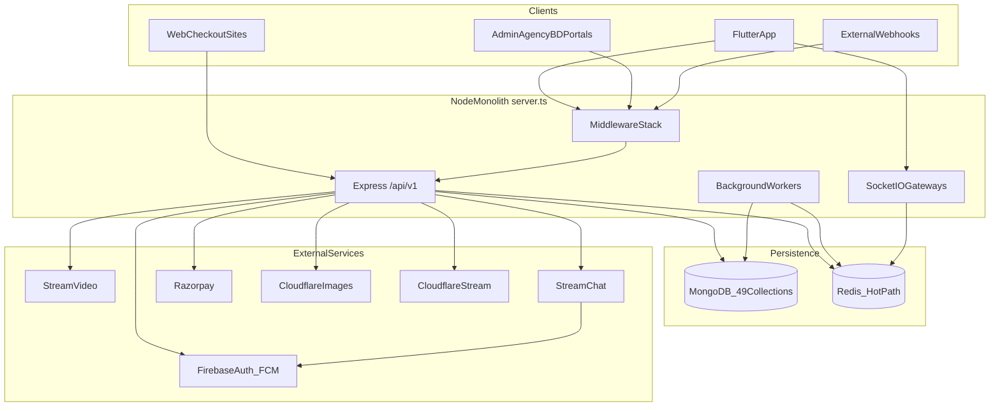
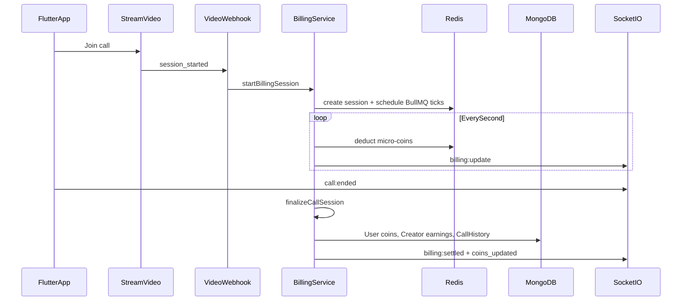

# zztherapy Backend — Complete In-Depth Analysis

> **Package:** `eazy-talks-backend` · **Path:** `backend/`  
> **Generated:** June 2026 · **Status:** Canonical inventory (reviewed against `src/`)  
> **Companion docs:** [BACKEND_COMPREHENSIVE.md](./BACKEND_COMPREHENSIVE.md) (detailed billing/Redis/API tables) · [openapi.yaml](./openapi.yaml) (auto-generated REST spec)

## Review summary

This document is the **complete backend inventory** for zztherapy: one Node.js modular monolith with **21 route modules**, **~170 REST endpoints** (+ infrastructure), **5 Socket.IO gateways**, **6 webhooks**, **49 MongoDB collections**, and **20+ in-process workers**. It was verified against `src/server.ts`, `src/routes.ts`, all `*.routes.ts` files, and `*.model.ts` files. Clients (Flutter, adminWebsite, mannatenterprises) are **not** separate backends.

---

## 1. What This Backend Is

**Single backend codebase:** [`backend/`](../) (npm package `eazy-talks-backend`).

**Not backends (clients only):**
- [`frontend/`](../../frontend) — Flutter mobile app
- [`adminWebsite/`](../../adminWebsite) — React admin dashboard
- [`mannatenterprises/`](../../mannatenterprises) — Vite web wallet checkout
- [`video-love-connect-main/`](../../video-love-connect-main) — sibling web app

**Entry point:** [`backend/src/server.ts`](../src\server.ts) — Express HTTP + Socket.IO + all workers boot in one process.

**Route hub:** [`backend/src/routes.ts`](../src\routes.ts) mounts **21 route modules** at `/api/v1`.

**Existing doc (partial overlap):** [`backend/docs/BACKEND_COMPREHENSIVE.md`](../docs\BACKEND_COMPREHENSIVE.md) — May 2026; this plan extends it with VIP, Moments, Stream, fraud, domain events, and current worker inventory.

---

## 2. High-Level Architecture



**Deployment:** Railway (no Dockerfile in repo). Production requires Redis + `BILLING_DRIVER=bullmq`.

**Pattern:** Modular monolith — each domain under `src/modules/<domain>/` with routes, controllers, services, models, and optional gateways.

---

## 3. Technology Stack (Complete)

| Layer | Technology |
|-------|------------|
| Runtime | Node.js, TypeScript 5 |
| HTTP | Express 4 |
| Real-time | Socket.IO 4 + `@socket.io/redis-adapter` |
| Database | MongoDB via Mongoose 8 |
| Cache/queues | Redis (`ioredis`), BullMQ |
| Mobile auth | Firebase Admin `verifyIdToken` |
| Staff auth | bcrypt + JWT (`JWT_SECRET`) |
| Video calls | Stream Video (`@stream-io/node-sdk`) |
| Chat | Stream Chat (`stream-chat`) |
| Payments | **Razorpay** (not Stripe) |
| Images | Cloudflare Images + Sharp + blurhash |
| Video media | Cloudflare Stream (Moments/Stories) |
| Validation | Zod 4 |
| Logging | Winston + daily rotate |
| Resilience | opossum circuit breakers, express-rate-limit |

**Not present:** GraphQL, SQL/Postgres, S3, transactional email (SendGrid/SES), Stripe, separate worker processes.

---

## 4. Server Bootstrap Sequence

On `startServer()` in [`server.ts`](../src\server.ts):

1. **Security guards:** `assertProductionSecurity()` (JWT_SECRET, ADMIN_EMAIL/PASSWORD), `assertProductionRedis()`, `enforceProductionBillingDriverSafety()` (Railway requires BullMQ)
2. **Firebase init** + pricing config validation
3. **MongoDB connect** + stale creator lock cleanup + CreatorTaskProgress index migration
4. **Stream Chat push** — FCM credentials uploaded to Stream (`configureStreamPush`)
5. **HTTP + Socket.IO** — optional Redis adapter for multi-node
6. **Gateways (order matters):** availability → moments → billing → admin
7. **Workers start:** billing BullMQ, termination retry, reconciliation, watchdog, staff wallet reconcile, domain events, call reconciliation, VIP reconcile, payment webhook retry, image pipeline, moments workers
8. **Startup recovery:** billing session recovery, active-call slot repair, creator presence audit
9. **Health checks:** Redis R/W test, Razorpay config warning
10. **Listen** on `0.0.0.0:PORT`

**Graceful shutdown:** stops billing intervals, reconciliation, watchdog, domain events, call reconciliation, VIP, payment retry, image/moments workers.

---

## 5. Infrastructure Endpoints (Outside `/api/v1`)

| Method | Path | Purpose |
|--------|------|---------|
| GET | `/health` | Liveness — uptime, Redis configured flag |
| GET | `/live` | Simple liveness probe |
| GET | `/ready` | Readiness — Mongo state + Redis R/W (503 if degraded) |
| GET | `/metrics` | Ops dashboard (optional `X-Metrics-Token`) — API latency, billing, presence, moments queues, Mongo pool, event loop lag, alerts |

---

## 6. Middleware Stack (Order Matters)

Applied globally in [`server.ts`](../src\server.ts):

| Layer | File | Role |
|-------|------|------|
| trust proxy | inline | X-Forwarded-For for Railway/nginx |
| helmet | inline | Security headers (CSP disabled for OAuth) |
| cors | inline | Configurable origins (`CORS_ORIGIN`, wildcards) |
| staff rate-limit identity | `staff-rate-limit.middleware.ts` | JWT decode for staff buckets |
| firebase rate-limit identity | `firebase-rate-limit.middleware.ts` | Lightweight Firebase verify for UID buckets |
| general rate limiter | `rate-limit.middleware.ts` | 15-min window, Redis-backed |
| status rate limiter | inline | Stricter for polling paths |
| compression | — | gzip |
| **raw body parser** | inline | Signed webhooks only (exact bytes for HMAC) |
| JSON/urlencoded | inline | 50 MB limit |
| request context | `request-context.middleware.ts` | `X-Request-Id`, correlation ID |
| request logging | Winston | Structured logs |
| request queue | `request-queue.middleware.ts` | Backpressure semaphore (~500 concurrent) |
| API latency metrics | inline | Records latency + 5xx |

**Per-route middleware:** `verifyFirebaseToken`, staff role assertions, named limiters (billing, chat, withdrawal, login, image upload, etc.), webhook signature verification.

---

## 7. Authentication and Authorization

### 7.1 Dual auth path ([`auth.middleware.ts`](../src\middlewares\auth.middleware.ts))

1. **Staff JWT first** — decoded from `Authorization: Bearer`; validated against Mongo `User` (`userId` + `role`)
2. **Firebase ID token fallback** — Firebase Admin `verifyIdToken` for mobile users/creators

### 7.2 Login flows ([`auth` module](../src\modules\auth))

| Endpoint | Auth | Purpose |
|----------|------|---------|
| POST `/auth/login` | Firebase token | Primary app login — upsert User, apply referral, return profile |
| POST `/auth/logout` | Firebase | Server ack (Firebase logout is client-side) |
| POST `/auth/fast-login` | — | **410 Gone** (deprecated) |
| POST `/auth/admin-login` | email/password | Admin JWT |
| POST `/auth/agency-login` | email/password | Agency staff JWT |
| POST `/auth/bd-login` | email/password | BD staff JWT |

### 7.3 Role hierarchy

```
super_admin → bd → agency → creator (assignedAgencyId)
users (role=user) — consumers only
```

**Staff capabilities** (optional on User): `editPricing`, `managePlatformRevenue`.

**Other auth patterns:**
- Checkout session JWT (`CHECKOUT_SESSION_SECRET`) for web payment flows
- Metrics token (`METRICS_TOKEN`) for `/metrics`
- Socket.IO: Firebase token in `handshake.auth.token` (default namespace); Staff JWT on `/admin` namespace

---

## 8. Complete HTTP API Surface (~170 Endpoints)

All mounted at `/api/v1` via [`routes.ts`](../src\routes.ts).

### 8.1 Auth — `/auth` (6 endpoints)
Login, logout, staff logins (admin/agency/bd).

### 8.2 Referral — `/referral` (1 endpoint)
- GET `/preview` — public referral code validation (Redis rate-limited)

### 8.3 User — `/user` (21 endpoints)
Profile (`/me`, `/profile`), referrals, onboarding stages/permissions, coins, transactions, call history, favorites, block creators, delete account, user list/search (role-gated), promote-to-creator (admin).

### 8.4 Creator — `/creator` (24 endpoints)
Feed discovery, dashboard, leaderboard, earnings, tasks/claim, withdrawals, profile/gallery CRUD, status toggle (online/offline), CRUD by admin/agency.

### 8.5 Chat — `/chat` (7 endpoints + webhook)
Stream Chat token, channel creation, pre-send (paid messages), quota, other-member info, creator-call-info, **Stream Chat webhook**.

### 8.6 Video — `/video` (3 endpoints + webhook)
Stream Video token, active calls, **Stream Video webhook** (call lifecycle).

### 8.7 Billing — `/billing` (2 endpoints)
REST fallback when Socket.IO unavailable: `call-started`, `call-ended`.

### 8.8 Payment — `/payment` (7 endpoints + webhook)
Razorpay order/verify, wallet packages, web checkout initiate/create-order/verify, **Razorpay webhook** (coin purchases).

### 8.9 VIP — `/vip` (14 endpoints + webhook)
Plan (public), status, checkout flow, **Razorpay VIP webhook**, scheduled calls (schedule/confirm/cancel), priority call queue.

### 8.10 Stories — `/stories` (9 endpoints)
Create, feed, creator views, view/playback/complete, viewers list, delete.

### 8.11 Moments — `/moments` (16 endpoints)
Create paid/free reels, feeds (public/following), follow/unfollow, purchase, playback, analytics, delete.

### 8.12 Stream (Cloudflare) — `/stream` (4 endpoints + webhook)
Direct upload URL, upload status polling, health, **Cloudflare Stream webhook** (`media:ready`).

### 8.13 Images (Cloudflare) — `/images` (3 endpoints)
Health, direct upload, preset avatars.

### 8.14 Metrics (client telemetry) — `/metrics` (2 endpoints)
Image render + video playback telemetry ingestion.

### 8.15 Availability — `/availability` (2 endpoints)
Online users list, resolve Firebase UIDs (creator/admin only).

### 8.16 Support — `/support` (4 endpoints)
Ticket creation (5/day limit), attachments, call feedback, my-tickets.

### 8.17 App Updates — `/app-updates` (2 endpoints)
Pending update prompt, acknowledge update.

### 8.18 BD Portal — `/bd` (16 endpoints)
Dashboard, agencies CRUD, creators, price updates, wallet/withdrawals, payout account, password change.

### 8.19 Agency Portal — `/agency` (18 endpoints)
Dashboard, referred users approve/reject, creators, withdrawal approve/reject/mark-paid, wallet, staff withdrawals.

### 8.20 Admin — `/admin` (80+ endpoints)
**Analytics:** overview, creator performance, user analytics, revenue split, leaderboards, coin economy, calls, refunds, system health, audit events, integrity checks, fraud signals/investigations.

**Dashboard BFF widgets:** revenue, live calls, realtime, top hosts/BDs/agencies, alerts, heatmap, call analytics, payouts, geo, Razorpay balance.

**Staff CRUD:** BDs, agencies (create/update/delete).

**Mutations:** adjust coins, reset presence, transfer agency, avatar/gallery commit, call refund, wallet pricing, app update publish.

**Ops:** staff wallet reconciliation, domain event replay, analytics rebuild, fraud rules run.

**Moderation:** image pending/approve/reject, moments moderation (pending/escalated/approve/reject/escalate), moment purchase regrant/refund.

**VIP admin:** plan config, members, stats, grant/revoke.

**Support admin:** ticket list, status, assign.

**Withdrawals admin:** list, approve, reject, mark-paid.

---

## 9. Webhooks (6 External Integrations)

All use `express.raw()` + HMAC signature verification:

| Endpoint | Provider | Purpose |
|----------|----------|---------|
| POST `/video/webhook` | Stream Video | Call lifecycle → billing start/end, creator busy lock, presence |
| POST `/chat/webhook` | Stream Chat | Backup paid-message enforcement, attachment rules |
| POST `/payment/webhook` | Razorpay | Coin purchase completion (idempotent credit) |
| POST `/vip/webhook` | Razorpay | VIP membership purchases |
| POST `/stream/webhook` | Cloudflare Stream | Video processing state → `media:ready` Socket event |

Dev bypass: `ALLOW_INSECURE_WEBHOOKS=true` (Stream Video/Chat only).

---

## 10. Socket.IO Real-Time Layer (5 Gateways)

### 10.1 Availability ([`availability.gateway.ts`](../src\modules\availability\availability.gateway.ts))
**Auth:** Firebase token in handshake.

| Client → Server | Purpose |
|-----------------|---------|
| `availability:get` | Batch creator online status |
| `creator:online` / `creator:offline` | Creator availability toggle |
| `user:online` / `user:offline` | User presence for creators |
| `user:availability:get` | Batch user availability |

| Server → Client | Purpose |
|-----------------|---------|
| `availability:batch`, `availability:batch:v2` | Status responses |
| `creator:status` | Real-time creator status + feed card |
| `user:status` | User online/offline (to creators room) |

**Maintenance:** stale socket cleanup (10 min), heartbeat sweep (30s), per-socket heartbeats (~45s).

### 10.2 Billing ([`billing-socket.gateway.ts`](../src\modules\billing\billing-socket.gateway.ts))

| Client → Server | Purpose |
|-----------------|---------|
| `call:started` | Start per-second billing |
| `call:ended` | End/settle billing |
| `billing:recover-state` | Reconnect recovery |
| `billing:sync-warning` | Client sync issue reporting |

| Server → Client | Purpose |
|-----------------|---------|
| `billing:started/update/settled/error` | Billing ticks and settlement |
| `call:force-end` | Force terminate |
| `coins_updated` | Balance changes |

### 10.3 Moments ([`moments.gateway.ts`](../src\modules\moments\moments.gateway.ts))
Broadcasts: `moment:uploaded`, `story:uploaded`, `moment:purchased`, `creator:followed`, `media:ready`.

### 10.4 Admin ([`admin.gateway.ts`](../src\modules\admin\admin.gateway.ts))
**Namespace:** `/admin`. **Auth:** Staff JWT.

Staff join role-scoped rooms (`admin`, `bd:{id}`, `agency:{id}`) for `dashboard:invalidate` events.

### 10.5 Billing orchestration ([`billing.gateway.ts`](../src\modules\billing\billing.gateway.ts))
Wires billing socket + starts global BullMQ processor.

---

## 11. MongoDB Data Model (49 Collections / 47 Model Files)

### 11.1 User domain
| Model | Collection | Stores |
|-------|------------|--------|
| `user.model.ts` | Users | Identity, coins, onboarding, roles, referrals, favorites, blocks, staff wallet, VIP expiry |
| `coin-transaction.model.ts` | CoinTransactions | All coin debits/credits with reason codes |
| `referral-edge.model.ts` | ReferralEdges | Referral graph edges |
| `deleted-user-phone.model.ts` | DeletedUserPhones | Blocks re-registration |
| `deleted-user-identity.model.ts` | DeletedUserIdentities | Blocks re-registration |

### 11.2 Creator domain
| Model | Stores |
|-------|--------|
| `creator.model.ts` | Creator profiles, pricing, gallery, earnings, online state, agency assignment |
| `withdrawal.model.ts` | Creator withdrawal requests |
| `creator-task.model.ts` | Daily/weekly task progress |

### 11.3 Billing domain
| Model | Stores |
|-------|--------|
| `call-history.model.ts` | Settled call records |
| `call-billing-checkpoint.model.ts` | Durability checkpoints during calls |
| `billing-lifecycle-transition.model.ts` | Session state machine transitions |
| `staff-payout-account.model.ts` | BD/agency payout details |
| `staff-wallet-ledger.model.ts` | Staff earnings ledger entries |
| `staff-wallet-reconciliation-log.model.ts` | Reconciliation audit logs |

### 11.4 Video domain
| Model | Stores |
|-------|--------|
| `call.model.ts` | Active/historical Stream call records |
| `webhook-event.model.ts` | Stream webhook idempotency |

### 11.5 Payment domain
| Model | Stores |
|-------|--------|
| `wallet-pricing.model.ts` | Coin package tiers |
| `platform-revenue-config.model.ts` | Platform/agency/BD revenue splits |
| `commission-profile.model.ts` | Commission rules |
| `payment-webhook-event.model.ts` | Razorpay webhook idempotency |

### 11.6 Chat
| Model | Stores |
|-------|--------|
| `chat-message-quota.model.ts` | Free/paid message quotas per channel |

### 11.7 Support
| Model | Stores |
|-------|--------|
| `support.model.ts` | Support tickets |
| `support-daily-counter.model.ts` | Daily ticket rate limiting |

### 11.8 App updates
| Model | Stores |
|-------|--------|
| `app-update.model.ts` | Global forced update prompts |

### 11.9 Admin/Audit
| Model | Stores |
|-------|--------|
| `admin-action-log.model.ts` | Admin mutation audit trail |
| `audit-event.model.ts` | Domain audit events |

### 11.10 Agency
| Model | Stores |
|-------|--------|
| `creator-application.model.ts` | Host onboarding applications |

### 11.11 Availability
| Model | Stores |
|-------|--------|
| `creator-daily-online.model.ts` | Daily online time tracking |

### 11.12 Moments/Stories
| Model | Stores |
|-------|--------|
| `creator-moment.model.ts` | Paid/free reels |
| `moment-purchase.model.ts` | Purchase records |
| `creator-follow.model.ts` | Follow graph |
| `moment-revenue.model.ts` | Creator moment revenue |
| `analytics-event.model.ts` | Moment analytics events |
| `creator-story.model.ts` | Ephemeral stories |
| `story-view.model.ts` | Story view records |

### 11.13 VIP
| Model | Stores |
|-------|--------|
| `vip-membership.model.ts` | Active memberships |
| `vip-plan-config.model.ts` | Plan price/duration/benefits |
| `vip-purchase-event.model.ts` | Purchase audit |
| `vip-daily-moment-usage.model.ts` | Free moments/day tracking |
| `scheduled-call.model.ts` | Scheduled VIP calls |
| `call-queue-entry.model.ts` | Priority queue entries |

### 11.14 Analytics
| Model | Stores |
|-------|--------|
| `platform-revenue-daily.model.ts` | Daily platform revenue rollups |
| `bd-revenue-daily.model.ts` | Daily BD revenue |
| `agency-revenue-daily.model.ts` | Daily agency revenue |

### 11.15 Events/Fraud
| Model | Stores |
|-------|--------|
| `domain-event.model.ts` | Outbox for domain events |
| `fraud-signal.model.ts` | Fraud detection signals |
| `fraud-investigation.model.ts` | Investigation cases |

**Shared embedded type:** `IImageAsset` (Cloudflare Images) used across User, Creator, Moments, Stories.

---

## 12. Redis Usage (Hot Path)

Redis is **required in production** for billing, presence, rate limits, queues, and caches.

**Key categories:**
- **Billing sessions** — active call state, micro-coin balances, settlement locks, BullMQ job metadata
- **Presence** — creator/user availability (`creator:availability:*`, heartbeats, busy state)
- **Rate limiting** — per-UID and per-staff buckets
- **Upload sessions** — Cloudflare Images/Stream upload tracking + orphan indexes
- **Moments caches** — follower feed ZSETs, fanout/warm queues
- **Analytics queue** — `analytics:events` list
- **Metrics** — sorted sets for ops dashboard persistence
- **Checkout sessions** — web payment session state
- **Referral rate limits** — public preview throttling

**Circuit breaker:** [`redis-circuit-breaker.ts`](../src\utils\redis-circuit-breaker.ts) — in-memory fallback when Redis fails.

---

## 13. Background Workers and Scheduled Jobs (All In-Process)

### 13.1 Billing (critical path)
| Worker | Interval/Trigger | Purpose |
|--------|------------------|---------|
| BullMQ billing worker | Continuous | Per-call micro-coin ticks, checkpoints, socket emits |
| Billing reconciliation | ~5 min | DLQ, stuck sessions, balance repairs, stale BullMQ jobs |
| Billing watchdog | ~5s | Stalled session recovery/force-finalize |
| Termination retry worker | BullMQ | Retry Stream `mark_ended` after force-terminate |
| Startup billing recovery | Once on boot | Reschedule BullMQ jobs, reclaim stale ownership |
| Staff wallet reconciliation | ~24h (opt-in) | BD/agency ledger vs balance audit |

### 13.2 Video/Calls
| Job | Interval | Purpose |
|-----|----------|---------|
| Call reconciliation | ~5 min | Mongo `Call` vs Stream Video API; heal presence, settle orphans |
| Stale active-call slot repair | Boot | Redis/Mongo slot drift |
| Creator lock cleanup | Boot + 5 min | Clear stale `Creator.currentCallId` |

### 13.3 Payments
| Job | Interval | Purpose |
|-----|----------|---------|
| Payment webhook retry | ~15s | Redis-locked retry of failed Razorpay webhooks |

### 13.4 VIP
| Job | Interval | Purpose |
|-----|----------|---------|
| VIP reconciliation | ~60s | Expire queue entries; emit scheduled call due events |

### 13.5 Images (when `USE_CLOUDFLARE_IMAGES=true`)
| Worker | Trigger | Purpose |
|--------|---------|---------|
| Blurhash worker | BullMQ | Compute blurhash via Sharp, patch Mongo docs |
| Orphan cleanup | BullMQ ~30 min | Delete uncommitted Cloudflare uploads |

### 13.6 Moments/Stories (when `USE_MOMENTS=true`)
| Job | Interval | Purpose |
|-----|----------|---------|
| Stream upload session sweeper | 15 min | Clean stale upload sessions |
| Analytics queue drainer | 30s | Redis → Mongo analytics events |
| Feed fanout drainer | 5s | Push moments into follower Redis caches |
| Feed warm drainer | 10s | Pre-warm following-feed for large creators |
| Story expiry job | 30 min | Soft-delete expired stories + delete CF assets |
| Thumbnail validation | 10 min | HEAD-check Stream thumbnails |

### 13.7 Domain Events (when `DOMAIN_EVENTS_ENABLED=true`)
| Worker | Interval | Purpose |
|--------|----------|---------|
| Domain event worker | ~5s | Process outbox → dispatcher (handlers currently stub) |

### 13.8 Infrastructure
| Job | Interval | Purpose |
|-----|----------|---------|
| Event loop lag probe | 1s | `system.event_loop_lag_ms` |
| Metrics persistence | 30s | In-memory → Redis sorted sets |
| Rate-limit memory cleanup | 30s | Fallback store hygiene |
| Creator task progress cleanup | 6h | Delete records older than 7 days |

---

## 14. Core Business Flows

### 14.1 Video call + billing


**Critical rules:**
- Integer **micro-coins** (`COIN_MICROS = 1_000_000` per display coin)
- User debit rounds **up**, creator credit rounds **down**
- Settlement idempotent via `settlement:claim:{callId}`
- Redis availability authoritative for call eligibility

### 14.2 Coin purchase (Razorpay)
App/web → Razorpay → webhook → `payment-finalization.service` → User.coins + CoinTransaction → referral reward → VIP recharge discount → Socket `coins_updated`. Failed webhooks retried by worker.

### 14.3 Chat paid messages
Primary: `POST /chat/pre-send` (deduct coins). Backup: Stream Chat webhook enforces policy.

### 14.4 Moments upload
Creator → `/stream/direct-upload` → Cloudflare Stream → webhook → `media:ready` → commit moment → feed fanout queue → follower Redis caches.

### 14.5 Creator presence
Toggle via `PATCH /creator/status` or socket `creator:online` → `presence.service` (Redis) → `creator:status` broadcast → feed merge with `creator-feed-snapshot.service`.

### 14.6 Staff earnings
Call settlement → commission splits → `StaffWalletLedger` entries for BD/agency/platform → staff portals for withdrawal.

### 14.7 VIP membership
Razorpay checkout → webhook → `vip-purchase-finalization.service` → `VipMembership` + User.vipExpiresAt → entitlements (discounts, free moments/day, scheduling, priority queue).

---

## 15. Internal Modules (No Direct HTTP Routes)

| Module | Path | Role |
|--------|------|------|
| analytics | `modules/analytics/` | Revenue aggregation, admin rebuild |
| audit | `modules/audit/` | Audit event stream |
| events | `modules/events/` | Domain event outbox + worker |
| fraud | `modules/fraud/` | Fraud signals/investigations (admin-triggered rules) |
| staff | `modules/staff/` | Socket room constants, dashboard invalidation |
| media-shared | `modules/media-shared/` | Shared media types |

---

## 16. Config Layer ([`src/config/`](../src\config))

| File | Concern |
|------|---------|
| `database.ts` | MongoDB connection + pool tuning |
| `redis.ts` | Redis client, metrics keys, monitoring |
| `firebase.ts` | Firebase Admin init |
| `stream.ts` | Stream Chat + FCM push |
| `stream-video.ts` | Stream Video SDK |
| `razorpay.ts` | Payment gateway |
| `cloudflare.ts` | Cloudflare Images |
| `cloudflare-stream.ts` | Cloudflare Stream |
| `moments.ts` | Moments feature config |
| `feature-flags.ts` | Feature toggles (billing, presence, VIP, onboarding) |
| `pricing.config.ts` | Call pricing validation |
| `host-price.config.ts` / `creator-price.config.ts` | Tier pricing |
| `env.ts` | Env parsing helpers |
| `socket.ts` | Global Socket.IO instance |

---

## 17. Feature Flags ([`feature-flags.ts`](../src\config\feature-flags.ts))

| Flag | Effect |
|------|--------|
| `USE_CLOUDFLARE_IMAGES` | Image pipeline + workers |
| `USE_MOMENTS` / `USE_CLOUDFLARE_STREAM` | Moments module + workers |
| `VIP_ENABLED`, `VIP_SCHEDULING_ENABLED`, `VIP_PRIORITY_QUEUE_ENABLED` | VIP features |
| `BILLING_DRIVER=bullmq` | Production billing worker |
| `DOMAIN_EVENTS_ENABLED` | Outbox worker |
| `STAFF_WALLET_RECONCILE_ENABLED` | Nightly ledger reconciliation |
| `MOCK_PAYMENT_PROVIDER` | Dev payment mocking |
| `SOCKET_IO_REDIS_ADAPTER` | Multi-node Socket.IO |
| Billing/presence rollout flags | Adaptive lag, cursor v3, presence user model, watchdog, auto-repair |

---

## 18. Utils and Cross-Cutting ([`src/utils/`](../src\utils))

| Utility | Role |
|---------|------|
| `logger.ts` | Winston structured logging |
| `monitoring.ts` | Metrics collection + Redis persistence |
| `mongo-pool-monitor.ts` | Connection pool stats |
| `redis-circuit-breaker.ts` | Redis failure fallback |
| `rate-limit.service.ts` | Rate limit config |
| `balance-integrity.ts` | Coin balance verification/repair |
| `driver-metrics.ts` | Driver-level metrics |
| `runtime-signals.ts` | Event loop lag tracking |
| `source-of-truth.service.ts` | System integrity helpers |

---

## 19. CLI Scripts and Migrations

### `backend/scripts/` (ops/build)
- `dev.ps1`, `load-dev-env.ps1`, `with-dev-env.ps1`
- `copy-data-to-dist.cjs`, determinism/hierarchy checks
- `verify-redis.ts`, `canary-metrics-poll.mjs`
- `moments-admin/` (refund, regrant, audit purchases)

### `backend/src/scripts/` (npm-run)
| npm script | Purpose |
|------------|---------|
| `seed:admin` | Seed admin user |
| `migrate:identity-ledger` | Backfill identity ledger |
| `migrate:agency-bd-swap` | Agency/BD hierarchy migration |
| `seed:preset-avatars-cloudflare` | Seed preset avatars |
| `bootstrap:cloudflare-variants` | Cloudflare variant bootstrap |
| `backfill:referral-edges` | Referral graph backfill |
| `reconcile:withdrawal-assignment` | Unassigned withdrawal reconciliation |
| `resync:stream-images` | Resync Stream user images |

---

## 20. Testing

Contract/behavior tests co-located as `*.contract.test.ts` in modules (billing, payment, chat, moments, etc.). Run via `npm test` (Node test runner).

---

## 21. Clients and How They Connect

| Client | Auth | Primary APIs |
|--------|------|--------------|
| Flutter app | Firebase ID token | `/user`, `/creator`, `/billing`, `/chat`, `/video`, `/payment`, `/moments`, `/stories`, `/vip` + Socket.IO |
| Admin dashboard | JWT `/auth/admin-login` | `/admin/*` + `/admin` Socket namespace |
| Agency portal | JWT `/auth/agency-login` | `/agency/*` |
| BD portal | JWT `/auth/bd-login` | `/bd/*` |
| Web checkout | Session JWT | `/payment/web/*`, `/vip/checkout/*` |
| External webhooks | HMAC signatures | `/video/webhook`, `/chat/webhook`, `/payment/webhook`, `/vip/webhook`, `/stream/webhook` |

---

## 22. Related Documentation in Repo

- [`backend/docs/BACKEND_COMPREHENSIVE.md`](../docs\BACKEND_COMPREHENSIVE.md) — detailed billing, Redis keys, API tables
- [`docs/MOMENTS_COMPREHENSIVE_REFERENCE.md`](../../docs\MOMENTS_COMPREHENSIVE_REFERENCE.md) — Moments ops
- [`docs/VIP_COMPREHENSIVE_REFERENCE.md`](../../docs\VIP_COMPREHENSIVE_REFERENCE.md) — VIP ops (if present)
- [`RAILWAY_REDIS_*.md`](d:\zztherapy) — Railway deployment notes

---
