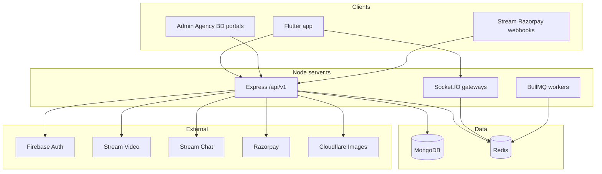
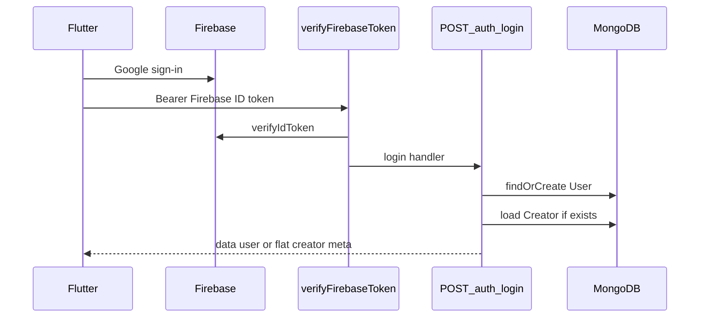
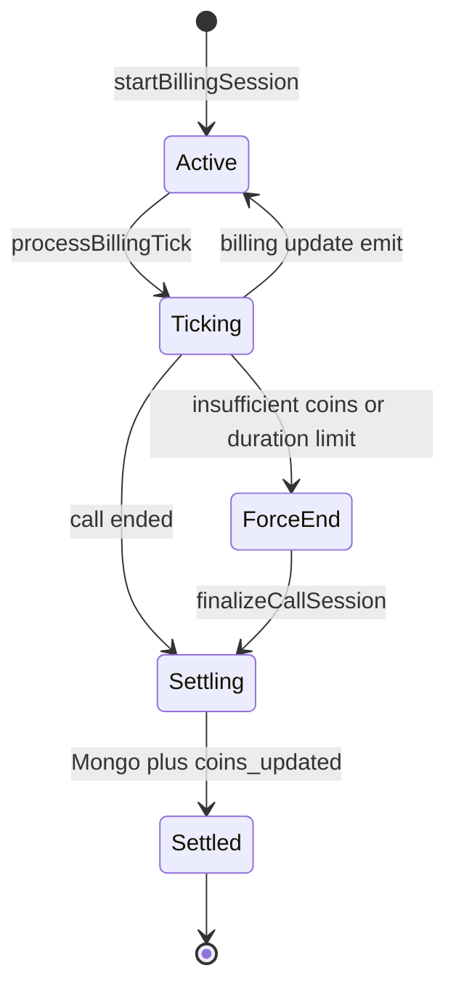
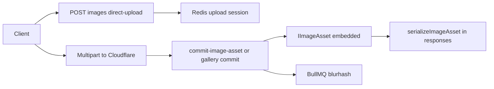

# Match Vibe / Eazy Talks — Backend Comprehensive Reference

> **Package:** `eazy-talks-backend` · **Path:** `D:\zztherapy\backend`  
> **Generated from:** source code analysis (`src/`, `package.json`, `.env.example`) — May 2026

---

## Table of contents

1. [Executive summary](#1-executive-summary)
2. [Architecture](#2-architecture)
3. [Project structure](#3-project-structure)
4. [Server bootstrap and middleware](#4-server-bootstrap-and-middleware)
5. [Routing and HTTP API reference](#5-routing-and-http-api-reference)
6. [Authentication and login](#6-authentication-and-login)
7. [MongoDB models and schemas](#7-mongodb-models-and-schemas)
8. [Redis keys and patterns](#8-redis-keys-and-patterns)
9. [Billing system](#9-billing-system)
10. [Video calls (Stream Video)](#10-video-calls-stream-video)
11. [Chat (Stream Chat)](#11-chat-stream-chat)
12. [Cloudflare Images pipeline](#12-cloudflare-images-pipeline)
13. [Creator feed and user homepage API](#13-creator-feed-and-user-homepage-api)
14. [Payments and wallet](#14-payments-and-wallet)
15. [Socket.IO real-time layer](#15-socketio-real-time-layer)
16. [Availability and presence](#16-availability-and-presence)
17. [Staff portals (admin, agency, BD)](#17-staff-portals-admin-agency-bd)
18. [Background workers and jobs](#18-background-workers-and-jobs)
19. [Cross-cutting concerns](#19-cross-cutting-concerns)
20. [Testing, scripts, and operations](#20-testing-scripts-and-operations)
21. [Appendix](#21-appendix)

---

## 1. Executive summary

The backend is a **modular monolith** Node.js/Express API that powers the Match Vibe Flutter app and staff web portals. It handles user/creator identity, per-second video call billing, real-time presence, Stream Chat/Video, Razorpay payments, and Cloudflare image delivery.

### Clients

| Client | Auth | Primary APIs |
|--------|------|--------------|
| Flutter app (users/creators) | Firebase ID token | `/user`, `/creator`, `/billing`, `/chat`, `/video`, `/payment` |
| Admin dashboard | JWT from `/auth/admin-login` | `/admin/*` |
| Agency portal | JWT from `/auth/agency-login` | `/agency/*` |
| BD portal | JWT from `/auth/bd-login` | `/bd/*` |
| Webhooks | HMAC signatures | `/video/webhook`, `/chat/webhook`, `/payment/webhook` |

### Technology stack

| Layer | Technology |
|-------|------------|
| Runtime | Node.js, TypeScript |
| HTTP | Express 4 |
| Database | MongoDB (Mongoose 8) |
| Cache / billing hot path | Redis (ioredis) — **required in production** |
| Job queues | BullMQ (billing cycles, image workers, termination retry) |
| Real-time | Socket.IO (+ optional Redis adapter for multi-node) |
| Mobile auth | Firebase Admin `verifyIdToken` |
| Staff auth | bcrypt + JWT (`JWT_SECRET`) |
| Video / chat | Stream Video + Stream Chat (`@stream-io/node-sdk`, `stream-chat`) |
| Payments | Razorpay |
| Images | Cloudflare Images API + sharp/blurhash workers |

### Critical design rules

- **Billing math uses integer micro-coins** (`COIN_MICROS = 1_000_000` per display coin); no floats on the hot path.
- **Settlement is idempotent** via `finalizeCallSession` + Redis `settlement:claim:{callId}`.
- **User debit rounds up**, **creator credit rounds down** at settlement (platform-favorable).
- **Creator feed** is `GET /api/v1/creator/feed` — there is no `/homepage` route.
- **Redis availability** (`online` / `busy`) is authoritative for call eligibility; Mongo `isOnline` is secondary.

---

## 2. Architecture



### Module layout

There is **no** top-level `routes/`, `models/`, or `services/` folder. Each feature lives under:

```
src/modules/<feature>/
  <feature>.routes.ts      # Express Router
  <feature>.controller.ts  # HTTP handlers
  *.service.ts             # Business logic
  *.model.ts               # Mongoose schemas
  *.gateway.ts             # Socket.IO (where applicable)
```

Central aggregator: [`src/routes.ts`](backend/src/routes.ts) mounted at `/api/v1` in [`src/server.ts`](backend/src/server.ts).

---

## 3. Project structure

```
backend/
├── src/
│   ├── server.ts           # Entry: Express + Socket.IO + workers
│   ├── routes.ts           # Mounts all module routers
│   ├── config/             # database, redis, firebase, stream, razorpay, cloudflare, pricing
│   ├── middlewares/        # auth, rate limits, webhooks, request queue
│   ├── modules/            # 17+ feature modules (~194 TS files)
│   ├── utils/              # logger, monitoring, circuit breakers
│   ├── scripts/            # migrations, seeds (tsx)
│   └── data/               # preset-image-ids.json
├── scripts/                # dev.ps1, guards, verify-redis
├── docs/                   # This file + operational runbooks
├── dist/                   # tsc output (npm start)
├── package.json
└── .env.example
```

### Feature modules (`src/modules/`)

| Module | Responsibility |
|--------|----------------|
| `auth` | Login, staff JWT issuance, logout |
| `user` | Profile, coins, onboarding, favorites, blocks, referrals, delete |
| `creator` | Feed, profile, gallery, tasks, earnings, withdrawals, online status |
| `video` | Stream Video tokens, webhooks, call records, locks |
| `chat` | Stream Chat tokens, channels, paid message quota, webhooks |
| `billing` | Per-second billing, settlement, Socket gateway, REST fallback |
| `payment` | Razorpay orders, web checkout, webhooks |
| `availability` | Redis presence, online-users REST, Socket gateway |
| `images` | Cloudflare direct upload, commit, presets, blurhash workers |
| `admin` | Super-admin dashboard, moderation, fraud, refunds |
| `agency` / `bd` | Staff portals, wallets, creator assignment |
| `referral` | Public referral preview |
| `support` | Tickets, call feedback |
| `app-update` | Force-update popups |
| `metrics` | Client image-render telemetry |
| `analytics` | Daily revenue rollups |
| `audit` / `events` / `fraud` | Ops and compliance |

---

## 4. Server bootstrap and middleware

**File:** [`src/server.ts`](backend/src/server.ts)

### Startup sequence (`startServer`)

1. `dotenv.config()`
2. `initializeFirebase()` — Firebase Admin SDK
3. Production guards: `JWT_SECRET`, admin creds, Redis required, URL sanity
4. `validatePricingConfig()`
5. `connectDatabase()` — Mongoose → `MONGO_URI`
6. `cleanupStaleCreatorLocks()` — video hygiene
7. Creator task index migration (drop legacy unique index if present)
8. `configureStreamPush()` — FCM for Stream Chat
9. `createServer(app)` + **Socket.IO** (optional **Redis adapter**)
10. `setIO(io)`
11. Gateways (order matters):
    - `setupAvailabilityGateway(io)` — installs global Firebase socket auth
    - `setupBillingGateway(io)`
    - `setupAdminGateway(io)` — namespace `/admin`
12. Background workers:
    - Global billing processor or BullMQ billing worker (`BILLING_DRIVER=bullmq`)
    - Termination retry worker
    - Billing + call reconciliation jobs
    - Staff wallet reconciliation scheduler
    - Domain event worker (if `DOMAIN_EVENTS_ENABLED`)
    - Call reconciliation vs Stream
    - Payment webhook retry worker
    - Image pipeline workers (blurhash, orphan cleanup)
13. Redis health ping
14. `httpServer.listen(PORT, '0.0.0.0')`

### Express middleware (summary)

| Layer | Purpose |
|-------|---------|
| Helmet | Security headers |
| CORS | `CORS_ORIGIN` (supports wildcards) |
| Rate limit identity | Firebase UID + staff JWT buckets on `/api/` |
| General + status limiters | Per-IP / per-user throttling |
| Compression | gzip |
| Raw body | Signed webhooks only (`/video/webhook`, `/chat/webhook`, `/payment/webhook`) |
| JSON parser | 50mb limit elsewhere |
| Request context + logging | Correlation IDs |
| Request queue | Backpressure on `/api/` |
| API latency metrics | `/metrics` persistence |

### Ops endpoints (outside `/api/v1`)

| Method | Path | Purpose |
|--------|------|---------|
| GET | `/health` | Liveness |
| GET | `/live` | Simple alive |
| GET | `/ready` | Readiness (Mongo + Redis) |
| GET | `/metrics` | Ops metrics (optional `X-Metrics-Token`) |

---

## 5. Routing and HTTP API reference

**Base URL:** `/api/v1` (from `AppConstants.baseUrl` on the client).

**Standard success shape:**

```json
{ "success": true, "data": { } }
```

### Module mounts ([`src/routes.ts`](backend/src/routes.ts))

| Mount | Module |
|-------|--------|
| `/auth` | Authentication |
| `/referral` | Referral preview |
| `/user` | User account |
| `/creator` | Creator catalog and profile |
| `/chat` | Stream Chat bridge |
| `/video` | Stream Video bridge |
| `/admin` | Super-admin |
| `/bd` | BD portal |
| `/agency` | Agency portal |
| `/billing` | REST billing fallback |
| `/support` | Support tickets |
| `/payment` | Razorpay |
| `/app-updates` | Force update |
| `/availability` | Presence REST |
| `/images` | Cloudflare pipeline |
| `/metrics` | Telemetry |

---

### Mobile-relevant GET endpoints

Full path = `/api/v1` + table path. Auth = `verifyFirebaseToken` unless noted.

#### User

| GET | Handler | Purpose |
|-----|---------|---------|
| `/user/me` | `getMe` | Current user + creator flags |
| `/user/referrals` | `getReferrals` | Referral list |
| `/user/list` | `getAllUsers` | Paginated users (creator home feed) |
| `/user/search` | `searchUsers` | Admin search |
| `/user/transactions` | `getUserTransactions` | Coin ledger |
| `/user/call-history` | `getCallHistory` | Call history |
| `/user/favorites` | `getFavoriteCreators` | Favorite IDs |
| `/user/favorites/creators` | `getFavoriteCreatorProfiles` | Paginated favorite profiles |
| `/user/blocked-creators/count` | `getBlockedCreatorsCount` | Block count |

#### Creator (consumer homepage catalog)

| GET | Handler | Purpose |
|-----|---------|---------|
| `/creator/feed` | `getCreatorFeed` | **Main user homepage catalog** (paginated) |
| `/creator/uids` | `getCreatorFirebaseUids` | All creator Firebase UIDs (presence hydration) |
| `/creator/by-firebase-uid/:uid` | `getCreatorByFirebaseUid` | Lookup for calls/chat |
| `/creator/:id` | `getCreatorById` | Creator detail |
| `/creator/dashboard` | `getCreatorDashboard` | Creator tasks home (cached) |
| `/creator/earnings` | `getCreatorEarnings` | Earnings summary |
| `/creator/transactions` | `getCreatorTransactions` | Creator earnings history |
| `/creator/tasks` | `getCreatorTasks` | Task progress |
| `/creator/withdrawals` | `getMyWithdrawals` | Withdrawal history |
| `/creator/profile` | `getMyCreatorProfile` | Own creator profile + gallery |
| `/creator/` | `getCreatorCatalogGone` | **410** — legacy root removed |

**Feed access:** `creator`, `agency`, and `bd` roles receive **403** on `/creator/feed`.

#### Chat

| GET | Handler |
|-----|---------|
| `/chat/quota/:channelId` | `getMessageQuota` |
| `/chat/channel/:channelId/other-member` | `getOtherMemberInfo` |
| `/chat/channel/:channelId/creator-call-info` | `getCreatorCallInfo` |

#### Video

| GET | Handler |
|-----|---------|
| `/video/calls/active` | Inline — active call from Redis |

#### Payment / images / support / app / availability

| GET | Handler |
|-----|---------|
| `/payment/packages` | `getWalletPackages` |
| `/images/presets` | `getPresetAvatarsHandler` |
| `/images/health` | `getImagesHealthHandler` (public) |
| `/support/my-tickets` | `getMyTickets` |
| `/app-updates/pending` | `getPendingGlobalAppUpdate` |
| `/availability/online-users` | `getOnlineUsers` |

#### Referral (public)

| GET | Handler |
|-----|---------|
| `/referral/preview` | `getReferralPreview` (rate limited, no auth) |

---

### Mobile-relevant POST / PUT / PATCH / DELETE

#### Auth

| Method | Path | Auth | Handler |
|--------|------|------|---------|
| POST | `/auth/login` | Firebase Bearer | `login` |
| POST | `/auth/logout` | Firebase | `logout` |

#### User

| Method | Path | Handler |
|--------|------|---------|
| POST | `/user/referral/apply` | `applyReferralPost` |
| POST | `/user/referral/apply-agency` | `applyReferralAgencyPost` |
| PUT | `/user/profile` | `updateProfile` |
| POST | `/user/coins` | `addCoins` |
| POST | `/user/onboarding/stage` | `advanceOnboardingStage` |
| POST | `/user/onboarding/permissions-decision` | `submitOnboardingPermissionsDecision` |
| POST | `/user/onboarding/permissions-reconcile` | `reconcileOnboardingPermissionsStatus` |
| POST | `/user/favorites/:creatorId` | `toggleFavoriteCreator` |
| POST | `/user/block-creator` | `toggleBlockCreator` |
| POST | `/user/delete-account` | `deleteAccount` |

#### Creator

| Method | Path | Handler |
|--------|------|---------|
| POST | `/creator/tasks/:taskKey/claim` | `claimTaskReward` |
| POST | `/creator/withdraw` | `requestWithdrawal` |
| POST | `/creator/profile/gallery/commit` | `commitGalleryImage` |
| DELETE | `/creator/profile/gallery/:imageId` | `deleteGalleryImage` |
| PATCH | `/creator/profile/gallery/reorder` | `reorderGalleryImages` |
| PATCH | `/creator/status` | `setCreatorOnlineStatus` |
| PATCH | `/creator/profile` | `updateMyCreatorProfile` |

#### Chat / video / billing

| Method | Path | Handler |
|--------|------|---------|
| POST | `/chat/token` | `getChatToken` |
| POST | `/chat/channel` | `createOrGetChannel` |
| POST | `/chat/pre-send` | `preSendMessage` |
| POST | `/chat/webhook` | Stream HMAC — `handleStreamWebhook` |
| POST | `/video/token` | `getVideoToken` |
| POST | `/video/webhook` | Stream HMAC — `handleStreamVideoWebhook` |
| POST | `/billing/call-started` | `handleCallStartedHttp` |
| POST | `/billing/call-ended` | `settleCallHttp` |

#### Payment / images / support

| Method | Path | Handler |
|--------|------|---------|
| POST | `/payment/web/initiate` | `initiateWebCheckout` |
| POST | `/payment/create-order` | `createOrder` |
| POST | `/payment/verify` | `verifyPayment` |
| POST | `/payment/webhook` | Razorpay HMAC |
| POST | `/images/direct-upload` | `createDirectUploadHandler` |
| POST | `/metrics/image-render` | `postImageRenderMetricsHandler` |
| POST | `/support/ticket` | `createTicket` |
| POST | `/support/call-feedback` | `submitCallFeedback` |
| POST | `/app-updates/:id/ack-update-now` | `ackGlobalAppUpdateNow` |
| POST | `/availability/resolve-users` | `resolveUsersByFirebaseUids` |

---

### Admin / agency / BD routes (summary)

Staff routes use `verifyFirebaseToken` globally on the router; handlers call `assertAdmin`, `assertBd`, or `assertAgency`.

- **Admin** (`admin.routes.ts`): dashboard sections, BDs, agencies, withdrawals, support, coin adjustments, call refunds, image moderation, fraud, analytics rebuild — 40+ GET and many POST/PATCH/DELETE endpoints.
- **Agency** (`agency.routes.ts`): wallet, creators, referred-user approve/reject, withdrawals.
- **BD** (`bd.routes.ts`): agencies, creators, wallet, price patches.

See route files for the full staff surface; mobile clients do not call these.

---

## 6. Authentication and login

### `verifyFirebaseToken`

**File:** [`src/middlewares/auth.middleware.ts`](backend/src/middlewares/auth.middleware.ts)

1. Requires `Authorization: Bearer <token>`.
2. **Try staff JWT** (`JWT_SECRET`) with `{ userId, role, email }` — validates Mongo `User`, checks disabled flags.
3. **Else Firebase Admin** `verifyIdToken(token)` → sets `req.auth = { firebaseUid, email, phone }`.

### Login flow



### `POST /api/v1/auth/login`

**File:** [`src/modules/auth/auth.controller.ts`](backend/src/modules/auth/auth.controller.ts) — `login`

- **Requires** Firebase token already verified by middleware (not password in body).
- Optional body: `referralCode`, `deviceFingerprint`.
- First login: creates `User` with role `user`, default profile (preset avatar, categories, `introFreeCallCredits`).
- Returns `createdNow`, `meta.showWelcomeBackDialog`, `referralApply`, host application flags.

### Dual response shapes (matches Flutter `AuthNotifier`)

1. **Regular user:** `data.user` nested object → serialized with `serializeUserImages`.
2. **Creator:** flat fields at top level of `data` (no nested `user`) — id, name, about, coins, role, avatar, onboarding, etc.

### Staff logins (password → JWT)

| POST | Returns |
|------|---------|
| `/auth/admin-login` | 7-day JWT (`role: super_admin` / `admin`) |
| `/auth/agency-login` | JWT for `role: agency` |
| `/auth/bd-login` | JWT for `role: bd` |

Subsequent staff API calls use the same `verifyFirebaseToken` middleware (JWT branch).

### Webhook authentication

**File:** [`src/middlewares/webhook-signature.middleware.ts`](backend/src/middlewares/webhook-signature.middleware.ts)

- Stream Video, Stream Chat, Razorpay — HMAC on raw body; no Bearer token.

---

## 7. MongoDB models and schemas

**33** `*.model.ts` files under `src/modules/`. MongoDB is the **system of record** for users, financial state, calls, and audits.

### Embedded image schema

**File:** [`src/modules/images/image-asset.schema.ts`](backend/src/modules/images/image-asset.schema.ts)

| Field | Type | Notes |
|-------|------|-------|
| `imageId` | string | Cloudflare image ID |
| `uploadedBy` | ObjectId | User ref |
| `width`, `height` | number | Dimensions |
| `blurhash` | string | Placeholder |
| `mimeType` | string | |
| `moderationStatus` | enum | `pending`, `auto-ok`, `approved`, `rejected` |
| `createdAt` | Date | |

API responses serialize to `avatarUrls` / `galleryUrls` via [`serialize-image-asset.ts`](backend/src/modules/images/serialize-image-asset.ts) — clients never build CDN URLs.

### User (`users`)

**File:** [`src/modules/user/user.model.ts`](backend/src/modules/user/user.model.ts)

| Field | Purpose |
|-------|---------|
| `firebaseUid` | Unique, indexed — primary mobile identity |
| `email`, `phone`, `username`, `gender`, `age` | Profile |
| `avatar`, `previousAvatar` | `IImageAsset` |
| `coins` | Wallet balance (display coins) |
| `introFreeCallCredits` | Promo call credits (not IAP wallet) |
| `welcomeFreeCallConsumedAt` | After first qualifying billed intro call |
| `favoriteCreatorIds`, `blockedCreatorIds` | Social |
| `onboardingStage`, `onboardingFlowVersion` | Server-driven onboarding |
| `role` | `user`, `creator`, `admin`, `super_admin`, `agency`, `bd` |
| `passwordHash` | Staff only (bcrypt) |
| `bdId`, `staffCoinsBalance` | Staff hierarchy |
| `hostOnboardingStatus` | Agency host pipeline |
| `referralCode`, `referredBy`, `referrals[]` | Referral graph |
| `profileRevision` | Admin edit toast dedupe |

### Creator (`creators`)

**File:** [`src/modules/creator/creator.model.ts`](backend/src/modules/creator/creator.model.ts)

| Field | Purpose |
|-------|---------|
| `userId` | Unique link to User |
| `firebaseUid` | Stream Video/Chat identity |
| `name`, `about`, `price`, `age`, `location` | Profile |
| `avatar`, `galleryImages[]` | Cloudflare assets |
| `categories[]` | Tags |
| `isOnline` | Legacy flag; Redis availability is authoritative for calls |
| `currentCallId` | Active Stream call lock |
| `earningsCoins` | Creator earnings balance |
| `assignedAgencyId` | Agency hierarchy |

### Call (`calls`)

**File:** [`src/modules/video/call.model.ts`](backend/src/modules/video/call.model.ts)

| Field | Purpose |
|-------|---------|
| `callId` | Stream call ID |
| `callerUserId`, `creatorUserId` | Participants |
| `status` | Lifecycle |
| Price snapshots, `billedSeconds` | Billing audit |
| `userCoinsSpent`, `creatorCoinsEarned` | Settlement totals |
| `isForceEnded`, `isSettled` | Termination flags |
| `settlement`, `settlementAttempts` | Settlement orchestration |

### Other key models

| Model | File | Purpose |
|-------|------|---------|
| CallHistory | `billing/call-history.model.ts` | Per-user call history rows |
| CallBillingCheckpoint | `billing/call-billing-checkpoint.model.ts` | Optional in-flight Mongo snapshot |
| CoinTransaction | `user/coin-transaction.model.ts` | Immutable ledger |
| ChatMessageQuota | `chat/chat-message-quota.model.ts` | Free/paid messages per user-creator pair |
| Withdrawal | `creator/withdrawal.model.ts` | Payout requests |
| CreatorTaskProgress | `creator/creator-task.model.ts` | Gamification |
| CreatorApplication | `agency/creator-application.model.ts` | Host applications |
| ReferralEdge | `user/referral-edge.model.ts` | Referral graph |
| WebhookEvent | `video/webhook-event.model.ts` | Stream Video idempotency |
| PaymentWebhookEvent | `payment/payment-webhook-event.model.ts` | Razorpay idempotency |
| WalletPricingConfig | `payment/wallet-pricing.model.ts` | Coin packs |
| SupportTicket | `support/support.model.ts` | Support |
| GlobalAppUpdate | `app-update/app-update.model.ts` | Force update |
| FraudSignal / FraudInvestigation | `fraud/*.model.ts` | Fraud ops |
| AuditEvent / AdminActionLog | `audit/`, `admin/` | Compliance |
| DomainEvent | `events/domain-event.model.ts` | Outbox for staff invalidation |
| *RevenueDaily | `analytics/*.model.ts` | Daily rollups |
| StaffWalletLedger | `billing/staff-wallet-ledger.model.ts` | BD/agency wallets |

---

## 8. Redis keys and patterns

**File:** [`src/config/redis.ts`](backend/src/config/redis.ts)

Redis is **required in production** for billing. `@upstash/redis` is in `package.json` but **not used** in application code (ioredis only).

### Billing

| Key pattern | Structure | Purpose |
|-------------|-----------|---------|
| `call:session:{callId}` | JSON string | Active billing session |
| `call:user_intro_micros:{callId}` | integer | Intro credits snapshot |
| `call:user_wallet_micros:{callId}` | integer | Wallet micros snapshot |
| `call:creator_earnings:{callId}` | integer | Accrued creator micros |
| `billing:active_calls` | ZSET (score = next tick ms) | Scheduler |
| `active:call:user:{firebaseUid}` | callId | One active call per user |
| `billing:cycle_lock:{callId}` | lock | Per-tick mutex |
| `idempotency:billing:{callId}:{ts}:{second}` | flag | Tick dedup |
| `settlement:claim:{callId}` | lock | Settlement orchestration |
| `settled:call:{callId}` | flag | Post-settlement dedup (5 min) |
| `billing:settlement-retry` | queue | Failed settlement retry |
| `pending:call:ends:{callId}` | deferred end | Session not ready yet |
| `lock:billing:batch_processor` | lock | Multi-node batch leader |
| `dlq:billing:failed:{callId}:{ts}` | DLQ | Failed ticks (24h) |
| `billing:termination:mark_ended:retry` | ZSET | Stream mark_ended retries |

### Availability

| Key pattern | TTL | Values |
|-------------|-----|--------|
| `creator:availability:{firebaseUid}` | ~120s | `online` \| `busy` |
| `creator:avail_online_since:{firebaseUid}` | — | Daily online-time tracking |

### Catalog caches

| Key pattern | TTL | Purpose |
|-------------|-----|---------|
| `creator:feed:p{page}:l{limit}` | 30s | Paginated feed |
| `creator:feed:index` | SET | Keys for invalidation |
| `creator:uids:v1` | 60s | All creator Firebase UIDs |
| `creator:detail:{creatorId}` | 60s | Creator detail |
| `creator:dashboard:{userId}` | 60s | Creator dashboard |
| `creator:tasks:{userId}` | 30s | Creator tasks |

### Images / chat / ops

| Key pattern | Purpose |
|-------------|---------|
| `image:upload-session:{sessionId}` | Direct upload session |
| `image:quota:avatar:{userId}:{day}` | Daily avatar upload quota |
| `image:quota:gallery:{userId}:{hour}` | Hourly gallery quota |
| `chat:presend:*` | Pre-send idempotency |
| `idempotency:webhook:{eventId}` | Webhook dedup (1h) |
| `metrics:{name}` | Ops metrics ZSET |
| `admin:{section}:v1` | Admin dashboard cache |

### Billing driver

| Env | Behavior |
|-----|----------|
| Default | ZSET `billing:active_calls` + interval batch processor (distributed lock) |
| `BILLING_DRIVER=bullmq` | BullMQ `billing-cycle` jobs — preferred for horizontal scale |

---

## 9. Billing system

**Core files:** `billing.service.ts`, `billing-settlement.service.ts`, `billing-session-finalization.service.ts`, `billing-termination.service.ts`, `billing.constants.ts`

### Constants ([`billing.constants.ts`](backend/src/modules/billing/billing.constants.ts))

| Constant | Default | Meaning |
|----------|---------|---------|
| `COIN_MICROS` | 1_000_000 | 1 display coin |
| `BILLING_PROCESS_INTERVAL_MS` | 450 | Tick wake interval |
| `MAX_BILLING_DELTA_MS` | 5000 | Max wall-clock gap per tick |
| `BILLING_SESSION_SCHEMA_VERSION` | 4 | Redis session schema |
| Emit throttle | ~1000ms | `billing:update` min interval |

### Lifecycle



1. **`startBillingSession`** — snapshots user intro + wallet micros into Redis; reserves `active:call:user:{uid}`; writes `call:session:{callId}`; schedules ticks (ZSET or BullMQ).
2. **`processBillingTick`** — time-diff billing under `billing:cycle_lock`; deducts user micros, accrues creator micros; emits `billing:update` (throttled).
3. **Termination** — out of coins, max duration, intro promo exhausted → `forceTerminateCall` → `call:force-end` socket event.
4. **`finalizeCallSession`** — single settlement entry (`billing-session-finalization.service.ts`); claim via `settlement:claim:{callId}`.
5. **`billing-settlement.service.ts`** — Mongo writes: `User.coins`, `Creator.earningsCoins`, `CoinTransaction`, dual `CallHistory`, `Call` settlement fields; invalidates caches; emits `coins_updated`.

### Rounding at settlement

- User debit: **ceil** micros → whole coins (`microsToUserDebitWholeCoins`)
- Creator credit: **floor** micros → whole coins (`microsToCreatorCreditWholeCoins`)

### Triggers for settlement

- Socket `call:ended`
- REST `POST /billing/call-ended`
- Stream Video webhooks (via call lifecycle)
- Force-end path
- Reconciliation workers

### REST fallback

When Socket.IO is unavailable, Flutter calls `POST /billing/call-started` and `POST /billing/call-ended` (same handlers as socket gateway).

---

## 10. Video calls (Stream Video)

**Files:** `video.controller.ts`, `video.webhook.ts`, `call-lifecycle.service.ts`, `call-finalization.service.ts`, `creator-call-lock.service.ts`

### REST

| Method | Path | Purpose |
|--------|------|---------|
| POST | `/video/token` | JWT for Stream Video (4h, roles) |
| GET | `/video/calls/active` | Active callId from Redis per user |
| POST | `/video/webhook` | Stream Video events (HMAC) |

### Webhook flow

1. Stream sends call lifecycle events.
2. `call-lifecycle.service.ts` persists idempotently (`WebhookEvent`).
3. Routes to billing start/end, creator busy lock, availability updates.
4. On force-end: `billing-termination.service.ts` may call Stream API `mark_ended`.

### Creator call lock

- Mongo: `Creator.currentCallId`
- Redis: availability → `busy`
- Stream Chat partial update for presence

### Startup hygiene

`cleanupStaleCreatorLocks()` on server boot clears stale locks from crashed processes.

---

## 11. Chat (Stream Chat)

**Files:** `chat.controller.ts`, `chat.webhook.ts`, `chat.policy.ts`, `config/stream.ts`

### REST

| Method | Path | Purpose |
|--------|------|---------|
| POST | `/chat/token` | Upsert Stream user + return token |
| POST | `/chat/channel` | Create/get DM channel |
| POST | `/chat/pre-send` | Quota check + coin deduct before send |
| GET | `/chat/quota/:channelId` | Remaining free messages, cost |
| GET | `/chat/channel/:channelId/other-member` | Header metadata |
| GET | `/chat/channel/:channelId/creator-call-info` | Call pricing from chat |
| POST | `/chat/webhook` | Stream Chat events (HMAC) |

### Channel IDs

Deterministic: `uc_<32-hex>` from sorted Firebase UIDs of the two participants.

### Paid messaging

- **10 free messages** per user-creator pair per daily period (`ChatMessageQuota`).
- After free quota: **5 coins per message** (deducted in `preSendMessage`).
- Recorded in `CoinTransaction` with source `chat_message`.

### Push

`configureStreamPush()` wires FCM via Firebase service account for Stream Chat notifications.

---

## 12. Cloudflare Images pipeline

**Files:** `images.controller.ts`, `cloudflare.client.ts`, `upload-session.service.ts`, `commit-image-asset.ts`, `image-url.ts`, `blurhash.worker.ts`



### Config ([`config/cloudflare.ts`](backend/src/config/cloudflare.ts))

| Env | Purpose |
|-----|---------|
| `USE_CLOUDFLARE_IMAGES` | Master flag (503 on `/images/*` when false) |
| `CLOUDFLARE_ACCOUNT_ID`, `CLOUDFLARE_ACCOUNT_HASH`, `CLOUDFLARE_IMAGES_API_TOKEN` | API access |
| `IMAGE_MODERATION_PENDING_BY_DEFAULT` | New uploads start as `pending` |
| `IMAGE_QUOTA_AVATAR_PER_DAY`, `IMAGE_QUOTA_GALLERY_PER_HOUR` | Redis quotas |

### Variants (built server-side only)

Avatar: `xs`, `sm`, `md`, `feedTile`, `callPhoto`, `callBg`  
Gallery: `thumb`, `md`, `xl`

URL form: `https://imagedelivery.net/{hash}/{imageId}/{variant}`

### Endpoints

| Method | Path | Purpose |
|--------|------|---------|
| POST | `/images/direct-upload` | Signed upload URL + session |
| GET | `/images/presets` | Preset avatar IDs for onboarding |
| GET | `/images/health` | Pipeline health (public) |
| POST | `/creator/profile/gallery/commit` | Commit gallery image after upload |

### Degraded mode

API may set `X-Image-Service-Degraded` on responses when Cloudflare pipeline is unhealthy; Flutter shows a banner.

---

## 13. Creator feed and user homepage API

There is **no** `/homepage` route. The Flutter user home screen calls:

### `GET /api/v1/creator/feed`

**Handler:** `getCreatorFeed` in [`creator.controller.ts`](backend/src/modules/creator/creator.controller.ts)

| Param | Default | Max |
|-------|---------|-----|
| `page` | 1 | — |
| `limit` | 20 | 50 |

**Behavior:**

1. Auth required; **403** for `creator`, `agency`, `bd` roles.
2. Try Redis cache `creator:feed:p{page}:l{limit}` (30s TTL, versioned).
3. On miss: Mongo `Creator.find({}).sort({ createdAt: -1 }).skip().limit()` + count.
4. Merge live availability from Redis (`getCreatorAvailabilityBatch`).
5. Attach `isFavorite` from `User.favoriteCreatorIds`.
6. Serialize avatars via `serializeAvatar` / `serializeCreatorGallery` (Cloudflare URLs + blurhash).
7. Return paginated `{ creators, total, page, limit, hasMore }`.

**Companion endpoints for Flutter:**

| Endpoint | Flutter use |
|----------|-------------|
| `GET /creator/uids` | Presence hydration (`presence_hydration_service`) |
| `GET /creator/:id` | Creator detail / profile modal |
| `GET /creator/by-firebase-uid/:uid` | Incoming call / chat avatar lookup |
| `GET /user/favorites/creators` | Favorites screen |
| Socket `availability:get` | Live online/busy updates |

**Creator home (Flutter):** creators do not use `/creator/feed`; they use `GET /creator/dashboard` for the tasks/earnings view.

---

## 14. Payments and wallet

**Files:** `payment.controller.ts`, `payment-finalization.service.ts`, `wallet-pricing.model.ts`

| Method | Path | Purpose |
|--------|------|---------|
| GET | `/payment/packages` | Coin packs from `WalletPricingConfig` |
| POST | `/payment/web/initiate` | Web checkout URL for Flutter (`url_launcher`) |
| POST | `/payment/create-order` | Razorpay order (in-app) |
| POST | `/payment/verify` | Client-side verify |
| POST | `/payment/web/create-order` | Web flow (no auth) |
| POST | `/payment/web/verify` | Web verify |
| POST | `/payment/webhook` | Razorpay HMAC — credits coins, idempotent |

On successful payment: updates `User.coins`, writes `CoinTransaction`, emits `coins_updated` via Socket.IO.

**Env:** `PUBLIC_API_BASE_URL`, `WEB_CHECKOUT_BASE_URL`, `APP_RETURN_DEEP_LINK`, `RAZORPAY_KEY_ID/SECRET`

---

## 15. Socket.IO real-time layer

**Setup:** Same HTTP server as Express; optional Redis adapter for multi-node.

### Gateway install order ([`server.ts`](backend/src/server.ts))

1. `setupAvailabilityGateway` — **global** `io.use` Firebase auth
2. `setupBillingGateway`
3. `setupAdminGateway` — namespace `/admin`

### Default namespace — Firebase auth

**Auth:** `socket.handshake.auth.token` → Firebase `verifyIdToken`  
**Rooms:** `user:{firebaseUid}`, `creators`, `consumers`

#### Client → Server

| Event | Module | Purpose |
|-------|--------|---------|
| `availability:get` | availability | `{ creatorIds: [...] }` batch status |
| `creator:online` / `creator:offline` | availability | Creator presence toggle |
| `user:online` / `user:offline` | availability | User presence |
| `user:availability:get` | availability | `[firebaseUids]` batch |
| `call:started` | billing | Start billing session |
| `call:ended` | billing | End / settle call |
| `billing:recover-state` | billing | Recover active billing after reconnect |

#### Server → Client

| Event | Purpose |
|-------|---------|
| `availability:batch` | Map creatorId → `online` \| `busy` |
| `creator:status` | Single creator status change |
| `user:status` | Fan online/offline (to `creators` room) |
| `user:availability:batch` | Batch user availability |
| `billing:started` | Billing session started |
| `billing:update` | Live coin burn (throttled) |
| `billing:settled` | Final settlement payload |
| `billing:error` | Billing failure |
| `billing:recover-state:response` | Recovery payload |
| `call:duration-warning` | Approaching limit |
| `call:force-end` | Server forced end |
| `coins_updated` | Balance changed |
| `creator:data_updated` | Dashboard refresh signal |
| `wallet_pricing_updated` | Admin changed packages |
| `app_update:published` | Force update popup |

### `/admin` namespace — staff JWT

**File:** [`admin.gateway.ts`](backend/src/modules/admin/admin.gateway.ts)

- Auth: staff JWT in `handshake.auth.token` or `Authorization`
- Rooms: `ADMIN_SOCKET_ROOM`, `bd:{id}`, `agency:{id}`
- Events: `dashboard:invalidate`, domain-specific aliases via [`staff-dashboard-invalidation.service.ts`](backend/src/modules/staff/staff-dashboard-invalidation.service.ts)

---

## 16. Availability and presence

**Files:** `availability.gateway.ts`, `availability.service.ts`, `availability.controller.ts`

### Redis

- Key: `creator:availability:{firebaseUid}` → `online` | `busy` (TTL ~120s, refreshed on heartbeat)
- `busy` when creator is on a call or explicitly unavailable

### REST

| Method | Path | Purpose |
|--------|------|---------|
| GET | `/availability/online-users` | Online users for creator chat tab |
| POST | `/availability/resolve-users` | Batch resolve Firebase UIDs → status |

### Creator online toggle

`PATCH /creator/status` updates Mongo + Redis + emits `creator:status` to Socket rooms.

---

## 17. Staff portals (admin, agency, BD)

### Hierarchy

```
super_admin (admin)
    └── bd (business development)
            └── agency
                    └── creator (assignedAgencyId)
```

### Auth

Password login → JWT → same `verifyFirebaseToken` on all staff routes.

### Admin highlights

- Dashboard: overview, revenue, live calls, top hosts/BDs/agencies, geo, heatmap
- User/creator management, coin adjustments, call refunds
- BD/agency CRUD, withdrawal approval
- Image moderation queue
- Fraud signals/investigations
- Platform revenue + wallet pricing config

### Agency highlights

- Approve/reject referred host applications
- Manage assigned creators
- Wallet, withdrawals, staff-withdrawals

### BD highlights

- Create agencies, list creators, patch creator price
- Wallet and withdrawals

---

## 18. Background workers and jobs

| Worker | Trigger | Purpose |
|--------|---------|---------|
| Global billing processor | `setInterval` + ZSET | Default billing ticks |
| BullMQ billing worker | `BILLING_DRIVER=bullmq` | Per-call billing jobs |
| Termination retry | BullMQ / Redis ZSET | Stream `mark_ended` retries |
| Billing reconciliation | Cron (~5 min) | Heal stuck sessions |
| Call reconciliation | Cron | Sync with Stream state |
| Payment webhook retry | Worker | Failed Razorpay processing |
| Blurhash worker | BullMQ | Compute blurhash after upload |
| Orphan image cleanup | Cron (~30 min) | Delete abandoned Cloudflare uploads |
| Staff wallet reconciliation | Scheduler | BD/agency ledger audit |
| Domain event worker | `DOMAIN_EVENTS_ENABLED` | Staff dashboard outbox |

---

## 19. Cross-cutting concerns

### Rate limiting

**File:** [`middlewares/rate-limit.middleware.ts`](backend/src/middlewares/rate-limit.middleware.ts)

Per-route limiters: `loginLimiter`, `billingLimiter`, `chatLimiter`, `withdrawalLimiter`, `imageUploadLimiter`, `referralPreviewLimiter`, `webhookLimiter`, etc. Uses `rate-limit-redis` store when Redis configured.

### Feature flags

**File:** [`config/feature-flags.ts`](backend/src/config/feature-flags.ts), env vars in `.env.example`

### Pricing

**Files:** [`config/pricing.config.ts`](backend/src/config/pricing.config.ts), `host-price.config.ts`, `creator-price.config.ts`

- Per-minute creator prices, platform share, intro call credits (`WELCOME_INTRO_CALL_CREDITS`)

### Logging and monitoring

- Winston + daily rotate
- `/metrics` endpoint with Redis-backed rolling windows
- `mongo-pool-monitor` on `/ready`

### Idempotency

- Billing ticks: Redis keys per second
- Webhooks: `idempotency:webhook:{eventId}`
- Onboarding: `clientMutationId`, idempotency headers
- Settlement: `settlement:claim:{callId}`

---

## 20. Testing, scripts, and operations

### Tests (`npm test`)

Contract tests (no I/O) for billing, payment webhooks, creator feed, admin dashboard, images serialization, onboarding, hierarchy migrations, etc.

### `src/scripts/` (tsx)

| Script | Purpose |
|--------|---------|
| `seed-admin.ts` | Seed super-admin |
| `migrate-agency-bd-hierarchy-swap.ts` | Hierarchy migration |
| `seed-preset-avatars-cloudflare.ts` | Preset images |
| `resync-stream-user-images.ts` | Stream image sync |

### `scripts/` (ops)

| Script | Purpose |
|--------|---------|
| `dev.ps1` | Local dev with env |
| `verify-redis.ts` | Redis connectivity |
| `check-hierarchy-legacy.cjs` | CI guard |

### Deploy notes

- **Horizontal scale:** configure Redis + `BILLING_DRIVER=bullmq` + Socket.IO Redis adapter
- **Production:** `MONGO_URI`, Redis URL, `JWT_SECRET`, Firebase creds, Stream keys, Razorpay, Cloudflare
- Build: `npm run build` → `dist/server.js`; `npm start`

---

## 21. Appendix

### Environment variables (essential)

| Variable | Purpose |
|----------|---------|
| `PORT` | HTTP port (default 3000) |
| `MONGO_URI` | MongoDB connection |
| `REDIS_URL` / `REDISHOST` | Redis (required prod) |
| `JWT_SECRET` | Staff JWT signing |
| `FIREBASE_*` | Firebase Admin |
| `STREAM_API_KEY`, `STREAM_API_SECRET` | Stream Chat/Video |
| `RAZORPAY_KEY_ID`, `RAZORPAY_KEY_SECRET` | Payments |
| `CLOUDFLARE_*` | Images |
| `USE_CLOUDFLARE_IMAGES` | Image pipeline gate |
| `BILLING_DRIVER` | `bullmq` for scale-out |
| `BILLING_PROCESS_INTERVAL_MS` | Tick interval |
| `CORS_ORIGIN` | Allowed web origins |
| `PUBLIC_API_BASE_URL` | Web checkout API base |
| `WEB_CHECKOUT_BASE_URL` | Checkout page host |

### Mobile API quick index (Flutter parity)

Endpoints consumed by the Flutter app (cross-checked with `frontend/docs/FLUTTER_FRONTEND_COMPREHENSIVE.md`):

| Flutter caller | Backend endpoint |
|----------------|------------------|
| `auth_provider` | `POST /auth/login`, `GET /user/me` |
| `home_provider` | `GET /creator/feed`, `GET /user/list`, `GET /creator/:id` |
| `presence_hydration_service` | `GET /creator/uids`, `GET /user/list` |
| `favorite_creators_provider` | `GET /user/favorites/creators` |
| `call_history_service` | `GET /user/call-history` |
| `chat_service` | `POST /chat/token`, `/channel`, `/pre-send`, GET quota/channel/* |
| `video_service` | `POST /video/token`, `GET /video/calls/active` |
| `image_presets_service` | `GET /images/presets`, `GET /images/health` |
| `transaction_service` | `GET /user/transactions`, `GET /creator/transactions` |
| `creator_dashboard_service` | `GET /creator/dashboard`, `GET /creator/tasks`, `GET /creator/earnings` |
| `withdrawal_service` | `GET /creator/withdrawals` |
| `blocked_buddies_screen` | `GET /user/blocked-creators/count` |
| `payment_service` | `GET /payment/packages`, `POST /payment/web/initiate` |
| `socket_service` | Socket events + `POST /billing/:event` fallback |
| `image_upload_service` | `POST /images/direct-upload` |
| `creator_gallery_service` | `GET /creator/profile`, gallery commit/delete |
| `referral_service` | `GET /referral/preview`, `POST /user/referral/*` |
| `support_service` | `POST /support/ticket`, `GET /support/my-tickets` |
| `app_update_service` | `GET /app-updates/pending` |
| `online_users_provider` | `GET /availability/online-users`, `POST /availability/resolve-users` |

### Glossary

| Term | Meaning |
|------|---------|
| Micro-coin | 1/1,000,000 of a display coin; billing hot-path unit |
| Settlement | Final Mongo writes after call ends |
| Force-end | Server terminates call (insufficient coins, duration cap) |
| Feed | Paginated creator catalog for users (`/creator/feed`) |
| Host | Creator applicant under agency referral |
| Intro credits | `introFreeCallCredits` — promo, not IAP wallet |
| Busy | Creator unavailable for new calls (on call or offline) |

### Known code notes

1. Package name `eazy-talks-backend` vs product branding **Match Vibe**.
2. `@upstash/redis` in `package.json` is unused; all Redis via **ioredis**.
3. `POST /auth/fast-login` returns **410 Gone** (deprecated).
4. Legacy `GET /creator/` returns **410** — use `/creator/feed`.
5. Dual login response shapes must be preserved for Flutter `AuthNotifier` compatibility.

---

*End of document.*
