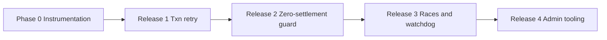

# Video Call Billing & Settlement — Code Walkthrough

This document describes **how billing works in the codebase today** (as of the production logs from 2026-06-29). It is a read-only architecture reference: no behavior changes are proposed here.

Related existing doc: [`VIDEO_BILLING_EXECUTION_TRACE_DEEP.md`](./VIDEO_BILLING_EXECUTION_TRACE_DEEP.md).

---

## 1. High-level architecture

Billing is split into two phases:

| Phase | Where state lives | What happens |
|-------|-------------------|--------------|
| **Live billing** | Redis (`call:session:*`, micro balances, BullMQ tick jobs) | Per-second (or per-cycle) deduction math, socket emits, intro promo drain |
| **Settlement** | MongoDB transaction in `settleCall` | Authoritative wallet debit/credit, `CoinTransaction`, `CallHistory`, `Call.settlement` |

Only **`finalizeCallSession`** is allowed to orchestrate settlement. It calls **`settleCall`** with `_fromFinalizer: true`.

```
Client                    api-ws                         billing-worker
  |                          |                                  |
  |-- call:started --------->| startBillingSession()            |
  |                          | seed Redis + durable session     |
  |                          | schedule BullMQ billing cycle -->| processTick() loop
  |<-- billing:update -------| (socket emits)                   |
  |                          |                                  |
  |-- call:ended ----------->| finalizeCallEnd()                |
  |                          |   -> finalizeCallSession() ----->| (may run on worker via retry)
  |                          |                                  | settleCall() Mongo txn
```

**Important:** Ticks update Redis accumulators (`totalDeductedMicros`, `totalEarnedMicros`, `elapsedSeconds`). Mongo balances and `CoinTransaction` rows are written **at settlement** (unless incremental persist flags are enabled — see §5).

---

## 2. Entry points

### 2.1 `call:started` (Socket — api-ws)

File: `src/modules/billing/billing-socket.gateway.ts`

The socket handler validates the payer, rate-limits, then delegates to `billingService.startBillingSession`:

```typescript
await billingService.startBillingSession(io, payerFirebaseUid, data, {
  source: 'client_socket',
  startIngress: 'socket',
  startCorrelationId,
  requestReceivedAtMs: callStartedRequestAt,
  initiatedByFirebaseUid,
  initiatedByRole,
});
```

Logs you will see: `call:started received`, `billing_lifecycle_start_received`, `billing_session_seeded_early`, `Billing session started - Redis keys seeded`, `billing_lifecycle_scheduler_registered`.

### 2.2 `call:ended` (Socket — api-ws)

File: `src/modules/billing/billing-socket.gateway.ts`

Three outcomes:

1. **Session not ready** → defer (`pendingCallEndKey`), restore creator presence, no settlement yet.
2. **Session owned by another billing-worker instance** → `delegateCallEndSettlementToRetry` (enqueue immediate retry on worker).
3. **Normal path** → `finalizeCallEnd(io, callId, 'socket_call_ended')`.

```typescript
if (!sessionForEnd) {
  // ... wait up to 2s ...
  logInfo('Deferring call:ended (session not ready)', { callId, source: 'socket_call_ended' });
  return;
}

if (sessionForEnd.instanceId && !billingInstanceIdsMatch(sessionForEnd.instanceId, workerInstanceId)) {
  await delegateCallEndSettlementToRetry(io, data.callId, 'socket_call_ended', 'socket_call_ended');
  return;
}

await finalizeCallEnd(io, data.callId, 'socket_call_ended');
```

Log: `Call end settlement delegated to retry queue` comes from `delegateCallEndSettlementToRetry`.

### 2.3 Force end (billing-worker)

When promo or wallet is exhausted during a tick, `billing.service.ts` calls `forceTerminateCall`, which **also** triggers `finalizeCallEnd(..., 'force_end')`:

```typescript
// billing-termination.service.ts
const { finalizeCallEnd } = await import('../video/call-finalization.service');
void finalizeCallEnd(io, callId, 'force_end').catch(...);
```

So for intro-promo exhaustion you often get **two settlement attempts** in quick succession:

- `source: 'billing_tick'` / `reason: 'insufficient_coins'` (from tick → finalize path)
- `source: 'force_end'` / `reason: 'explicit_end'`
- Plus `source: 'socket_call_ended'` when clients hang up

That race is guarded by `finalizeInflightKey` (see §4.3).

---

## 3. Session start & intro promo

File: `src/modules/billing/billing.service.ts` (`startBillingSession` / balance seeding)

Intro promo is enabled when:

```typescript
let introPromoActive =
  isFreeCallEnabled() &&
  user.role === 'user' &&
  !consumedAt &&
  introCreditsLive > 0;

let initialIntroMicros =
  introPromoActive && pricePerSecondMicros > 0
    ? freeCallDurationSeconds * pricePerSecondMicros
    : 0;
let initialWalletMicros = introPromoActive ? 0 : coinsWholeToMicros(user.coins || 0);
```

During ticks, if `introPromoActive`, spend comes from **intro micros**, not wallet:

```typescript
const activeSpendMicros = introPromoBilling ? introMicros : walletMicros;
// ...
if (introPromoBilling) {
  introMicros -= actualDeduct;
  session.totalIntroDeductedMicros = (session.totalIntroDeductedMicros ?? 0) + actualDeduct;
} else {
  walletMicros -= actualDeduct;
  session.totalWalletDeductedMicros = (session.totalWalletDeductedMicros ?? 0) + actualDeduct;
}
```

When intro is exhausted (`activeSpendMicros < pricePerSecondMicros`):

```typescript
const userReason = introPromoBilling ? 'intro_promo_exhausted' : 'insufficient_coins';
void forceTerminateCall(io, { callId, ..., reason: userReason, ... });
return 'stop_needs_settlement';
```

Log: `Server-side Stream mark_ended treated as idempotent not_found` with `reason: intro_promo_exhausted`.

At settlement, intro consumption is persisted on the user document:

```typescript
if (session.introPromoActive === true && introDeductedMicros > 0) {
  await User.findOneAndUpdate(
    { _id: user._id, welcomeFreeCallConsumedAt: null, introFreeCallCredits: { $gt: 0 } },
    { $set: { welcomeFreeCallConsumedAt: new Date(), introFreeCallCredits: 0 } },
    { session: dbSession }
  );
}
```

Wallet debit `CoinTransaction` only applies to **wallet** portion:

```typescript
const targetWalletDebitWhole = Math.max(0, microsToUserDebitWholeCoins(walletDeductedMicros));
```

---

## 4. Live billing ticks (billing-worker)

### 4.1 Scheduling

- Default tick interval: `BILLING_PROCESS_INTERVAL_MS` (1s default) in `billing.constants.ts`
- Driven by BullMQ `scheduleBillingJob` / `billing.queue.ts`
- Each tick runs `billingService.processTick` (or equivalent cycle processor)

### 4.2 Runtime owner lock (multi-worker)

Two ECS billing-worker tasks compete per call. Ownership uses Redis key `billing:runtime:owner:{callId}`.

If the lock holder stalls (~`BILLING_WATCHDOG_CHAIN_HEAL_STALL_MS`, default 7s) or instance mismatches, another worker **takeovers**:

```typescript
logWarning('billing_runtime_owner_takeover', {
  callId,
  previousOwner: current,
  workerInstanceId,
  stallMs,
  nextEpoch,
});
```

This is **expected** with multiple workers but increases finalize races.

### 4.3 Per-tick accounting

Each successful deduct:

- Increments `session.totalDeductedMicros`, `session.totalEarnedMicros`
- Advances `session.lastProcessedAt` by billed wall time
- Bumps `billingSequence`, `version`, `lastSequenceAdvanceAt`
- Emits `billing:update` (log: `🧾 BILLING_HEALTH EMIT_SENT`, `trigger: deduct_path`)

`elapsedSeconds` used at settlement is derived from session state:

```typescript
const billedSeconds = Math.max(0, Math.floor(Number(session.elapsedSeconds) || 0));
```

---

## 5. Call end → `finalizeCallEnd`

File: `src/modules/video/call-finalization.service.ts`

`finalizeCallEnd` is the **call-lifecycle** finalizer (availability, `Call.status`, pending history). It then calls `finalizeCallSession` for money.

Sequence when a `Call` record exists:

1. Release creator lock / restore availability
2. `Call.status = ended`
3. `flushBillingPersistForCallId(callId, 'call_end')`
4. `markDurableCallSessionEnding(callId)`
5. Upsert pending `CallHistory` or enqueue projection event (`call.billing.ending`)
6. **`finalizeCallSession(io, { callId, reason: 'explicit_end', source })`**
7. Set `call.isSettled = true` only if settlement status is `settled` or duplicate-with-already-settled

```typescript
const finalizeResult = await finalizeCallSession(io, {
  callId,
  reason: 'explicit_end',
  source: settlementSource,
});
settlementComplete = await isFinalizeSettlementComplete(finalizeResult, callId);
```

If settlement returns `pending_retry`, `isSettled` stays false and log shows `Call finalization pending settlement retry`.

### Non-owner delegation

```typescript
export async function delegateCallEndSettlementToRetry(...) {
  await markCallEndingForDeferredEnd(callId, source);
  // restore creator presence ...
  await enqueueImmediateSettlementRetry({
    callId,
    reason: 'explicit_end',
    source: settlementSource,
  });
  logInfo('Call end settlement delegated to retry queue', { callId, source, settlementSource });
}
```

---

## 6. Settlement orchestration — `finalizeCallSession`

File: `src/modules/billing/billing-session-finalization.service.ts`

**Canonical entry** for all settlement sources (`billing_tick`, `force_end`, `socket_call_ended`, `reconciliation_worker`, etc.).

### 6.1 Guard chain (in order)

| Step | Mechanism | On failure |
|------|-----------|------------|
| 1 | Invalid callId tombstone | return `duplicate` |
| 2 | Dead-letter key exists | return `dead_lettered` |
| 3 | **`finalizeInflightKey` NX** | return `duplicate` (`inflight_guard_hit`) |
| 4 | Stale worker on ACTIVE session | release inflight → `enqueueImmediateSettlementRetry` → `pending_retry` |
| 5 | Already settled (Redis / durable / CallHistory / Call) | `duplicate` |
| 6 | Stale settling takeover | clear stale claim |
| 7 | **`settlementClaimKey` NX** | poll or `enqueueSettlementRetry` |
| 8 | **`settle:lock:{callId}` NX** | poll or retry |
| 9 | Durable claim / `markCallSettling` | Mongo `Call.settlement.status = settling` |
| 10 | `checkpointLifecycleState('SETTLING')` | retry or dead letter if runtime missing |
| 11 | `flushBillingToQuiescence` | — |
| 12 | **`settleCall(..., { _fromFinalizer: true })`** | catch → `enqueueSettlementRetry` |
| 13 | `markCallSettled`, durable settled, `checkpointLifecycleState('SETTLED')` | — |
| 14 | `emitBillingSettledFromSnapshot`, Redis cleanup | — |

Key constants (env-overridable):

```typescript
const RETRY_MAX_AGE_MS = ... default 900_000 (15 min)
export const BILLING_SETTLEMENT_RETRY_MAX_ATTEMPTS = ... default 8
const FINALIZE_INFLIGHT_TTL_SECONDS = ... default 120
```

### 6.2 Inflight duplicate suppression

```typescript
const inflightOk = await redis.set(finalizeInflightKey(callId), inflightToken, 'EX', FINALIZE_INFLIGHT_TTL_SECONDS, 'NX');
if (inflightOk !== 'OK') {
  logInfo('billing_finalize_duplicate_suppressed', {
    duplicateSuppression: 'inflight_guard_hit',
    suppressionReason: 'inflight_guard_hit',
    ...
  });
  return { status: 'duplicate', callId };
}
```

When `billing_tick` starts settlement and `force_end` / `socket_call_ended` arrive 100ms later, later attempts get `duplicate` — but the **first** attempt must succeed or the call stays in `settling`.

### 6.3 Lifecycle state machine

File: `src/modules/billing/billing-lifecycle.machine.ts`

Allowed transitions include:

- `ACTIVE → SETTLING` (force end / explicit end)
- `SETTLING → SETTLED | FAILED | FAILED_RECOVERY_SETTLEMENT`
- `ACTIVE → ENDING` (insufficient balance pre-deduct)

Invalid transitions are logged as:

```typescript
logWarning('Invalid billing lifecycle transition rejected', {
  callId, from, to, source, reason,
});
```

Production example: `from: SETTLING, to: ENDING, reason: insufficient_balance_post_deduct` — rejected because SETTLING cannot go to ENDING.

### 6.4 Snapshot metadata & `checkpoint_fallback`

`readFinalizationSnapshotMeta` chooses recovery source for logs:

```typescript
if (sessionRaw) {
  return { ..., recoverySource: 'redis_session' };
}
const checkpoint = await getBillingCheckpoint(callId);
if (checkpoint) {
  return { ..., recoverySource: 'checkpoint_fallback' };
}
return { ..., recoverySource: 'missing' };
```

`recoverySource: 'checkpoint_fallback'` in `billing_finalize_success` means Redis session was gone; settlement rebuilt session from Mongo checkpoint via `buildSettlementSessionFromCheckpoint`.

Checkpoint rebuild computes elapsed time from deducted micros:

```typescript
const totalDeductedMicros = Math.max(0, Number(checkpoint.totalDeductedMicros) || 0);
const elapsedSeconds =
  pricePerSecondMicros > 0 ? Math.floor(totalDeductedMicros / pricePerSecondMicros) : 0;
```

If checkpoint has `totalDeductedMicros: 0` (or missing pricing), settlement can finalize as **0 duration / 0 coins** even though live ticks ran — this matches the bogus `billing_finalize_success` with `coinsDeducted: 0` seen in logs after Redis keys were drained.

---

## 7. Financial persistence — `settleCall`

File: `src/modules/billing/billing-settlement.service.ts`

Called **only** from finalizer (or legacy direct path if `BILLING_UNIFIED_FINALIZER_ENABLED=false`).

### 7.1 Read Redis session

Loads `call:session:{callId}`; if missing, tries checkpoint (`buildSettlementSessionFromCheckpoint`) when `billingDeltaCursorV3Enabled`.

Optional incremental ledger path (`isIncrementalBillingPersistEnabled()`):

```typescript
await flushBillingPersist(callId, session, 'call_end');
const ledgerSum = await sumLedgerForCall(callId);
if (ledgerSum.tickCount > 0) {
  session.totalDeductedMicros = ledgerSum.userDebitMicros;
  session.totalEarnedMicros = ledgerSum.creatorCreditMicros;
}
```

### 7.2 Mongo multi-document transaction

```typescript
const dbSession = await mongoose.startSession();
dbSession.startTransaction();
try {
  // 1. Debit user wallet (delta vs existing debit txn)
  // 2. Upsert CoinTransaction debit (wallet only)
  // 3. Mark intro promo consumed on User
  // 4. Credit creator User + CoinTransaction credit
  // 5. Staff wallet ledger (BD/agency cuts)
  // 6. Upsert CallHistory (user + creator rows), settlementStatus: 'settled'
  // 7. Update Call document settlement fields
  await dbSession.commitTransaction();
} catch (err) {
  await dbSession.abortTransaction();
  throw err;  // → finalizeCallSession catch → retry queue
}
```

Production failure:

```
MongoServerError: Please retry your operation or multi-document transaction.
  at async settleCall (...billing-settlement.service.js:650)
```

There is **no automatic retry loop inside `settleCall`** for transient transaction errors — the error propagates to `finalizeCallSession`, which enqueues retry.

### 7.3 What gets written

| Collection | User side | Creator side |
|------------|-----------|--------------|
| `User.coins` | Decremented by wallet debit delta | Incremented by earn delta |
| `CoinTransaction` | `type: 'debit'`, `source: 'video_call'` | `type: 'credit'`, `source: 'video_call'` |
| `CallHistory` | `ownerRole: 'user'`, `coinsDeducted`, `durationSeconds` | `ownerRole: 'creator'`, `coinsEarned` |

Success logs:

- `billing_finalize_success` (orchestrator)
- `billing_lifecycle_settle_success`
- `billing_emit_settled` (socket fanout)

---

## 8. Retry, watchdog, reconciliation, dead letter

### 8.1 Settlement fast retry worker

File: `src/modules/billing/billing-settlement-retry.worker.ts`

- Runs every ~1.5s (`BILLING_SETTLEMENT_FAST_RETRY_INTERVAL_MS`)
- Acquires cluster lock `billing:settlement-fast-retry:lock`
- Calls `processSettlementRetryQueue(io, batchSize)`

Log spam: `distributed_lock` acquire/release on that key.

### 8.2 Retry queue semantics

`enqueueSettlementRetry` — exponential backoff score in Redis ZSET `billing:settlement:retry`.

`enqueueImmediateSettlementRetry` — score = now (used for call end).

Exhaustion:

```typescript
if (ageMs > RETRY_MAX_AGE_MS) {
  await moveCallToRecoveryDeadLetter(params.callId, 'retry_age_exhausted', params.source);
  return;
}
if (attempt > BILLING_SETTLEMENT_RETRY_MAX_ATTEMPTS) {
  await moveCallToRecoveryDeadLetter(params.callId, 'retry_cap_reached', params.source);
  return;
}
```

Dead letter:

```typescript
await drainSettlementArtifacts(callId, 'dead_letter_transition');
// sets Call.settlement.status = 'failed_recovery_settlement'
// lifecycle → FAILED_RECOVERY_SETTLEMENT
logError('billing_recovery_dead_letter_transition', new Error(reason), { callId, ... });
```

### 8.3 Billing watchdog

File: `src/modules/billing/billing-watchdog.service.ts`

Every ~5s, scans active calls and durable Mongo sessions.

For durable sessions stuck in `settling`:

```typescript
if (attempt > WATCHDOG_ATTEMPT_CAP) {  // default 6
  await moveCallToRecoveryDeadLetter(row._id, 'watchdog_attempt_cap_reached', 'reconciliation_worker');
  continue;
}
await finalizeCallSession(io, {
  callId: row._id,
  reason: 'timeout',
  source: 'reconciliation_worker',
});
```

Logs: `billing_watchdog_mongo_stale_alert`, `Watchdog auto-finalize for mongo stale settling durable session`.

### 8.4 Reconciliation job

File: `src/modules/billing/billing-reconciliation.ts`

Periodic job that:

- Processes settlement retry queue (batch 40)
- Finalizes stale `settling` / `ending` durable sessions (`reason: 'reconciliation'`)
- Repairs pending `Call.settlement.status: 'pending'` timeouts
- Scans Redis sessions without `CallHistory` (after min age)
- DLQ tick replay, balance mismatch repair queue, etc.

This is how a call can get a **late** `billing_finalize_success` with `recoverySource: 'checkpoint_fallback'` and zeros — reconciliation retries after Redis cleanup, using a depleted or empty checkpoint.

---

## 9. Runtime resolution & `billing_runtime_missing`

File: `src/modules/billing/billing-runtime-resolver.service.ts`

`resolveBillingRuntimeState(callId)` order:

1. Redis `call:session:{callId}`
2. Mongo billing checkpoint
3. Reconstructed / terminal snapshot
4. `missing`

api-ws logs `billing_runtime_missing` with `reason: no_session_no_checkpoint` when clients call `billing:recover-state` **before** `startBillingSession` finishes seeding Redis (~100–500ms window). Usually harmless.

```typescript
// billing-socket.gateway.ts — recover-state path
logWarning('billing_runtime_missing', { callId, reason: 'no_session_no_checkpoint', source: 'missing' });
```

---

## 10. Admin dashboard mapping

File: `src/modules/admin/admin.controller.ts`

### Calls & Billing table (`GET /admin/calls`)

Data source: **`CallHistory`** (user role rows), joined with `Call` lifecycle and creator-side history.

Flags:

```typescript
isZeroDuration: c.durationSeconds === 0,
isSuspicious: c.durationSeconds === 0 && c.coinsDeducted > 0,
isRefunded: refundedCallIds.has(c.callId),  // admin REFUND CoinTransaction exists
billingStatus: lifecycle?.settlement?.status ?? 'settled',
```

- **`0 dur`** = `CallHistory.durationSeconds === 0` (settlement wrote zero or pending never updated).
- **`—` for coins** = `coinsDeducted` / `coinsEarned` null or zero on that history row.
- **Refund button** = user was charged (`coinsDeducted > 0`) and no admin refund txn yet — not proof settlement failed.

### Integrity banner (`GET /admin/integrity` or similar)

```typescript
// Calls with coinsDeducted > 0 in CallHistory but NO completed CoinTransaction source: video_call
const unsettledCalls = callIds.filter((id) => !settledCallIds.has(id));
```

**50 unsettled calls** = ledger integrity mismatch (history says charged, no matching `CoinTransaction`), not the same as `Call.settlement.status: pending`.

---

## 11. End-to-end timeline (production example `..._1782741669`)

This maps log events to code paths for the failing intro-promo call pattern.

| Time (UTC) | Log | Code path |
|------------|-----|-----------|
| 14:01:14 | `billing_runtime_missing` | Client recover-state before session seeded |
| 14:01:18 | `Billing session started - Redis keys seeded` | `startBillingSession`, intro 30s |
| 14:01:18–14:01:48 | `BILLING_HEALTH EMIT_SENT` seq 2–27 | `processTick`, intro micros drain |
| 14:01:25+ | `billing_runtime_owner_takeover` | Multi-worker owner lock churn |
| 14:01:48 | `billing_finalize_begin` `insufficient_coins` `billing_tick` | Tick exhaustion → finalize |
| 14:01:48 | `intro_promo_exhausted` Stream not_found | `forceTerminateCall` |
| 14:01:48 | `Invalid billing lifecycle transition` SETTLING→ENDING | `billing-lifecycle.machine.ts` |
| 14:01:48 | `call:ended` ×2 (user + creator) | `billing-socket.gateway.ts` |
| 14:01:49 | `billing_finalize_duplicate_suppressed` inflight_guard | Second finalize blocked |
| 14:01:49 | `MongoServerError` multi-document transaction | `settleCall` commit failed |
| 14:01:49 | `Call finalization pending settlement retry` | `finalizeCallEnd` + pending_retry |
| 14:01:49 | `Call end settlement delegated to retry queue` | Non-owner api-ws instances |
| 14:02:35 | `billing_watchdog_mongo_stale_alert` state:settling | Watchdog |
| 14:04:01 | `retry_age_exhausted` | `enqueueSettlementRetry` age cap |
| 14:04:51 | `billing_finalize_success` coins:0 `checkpoint_fallback` | Reconciliation + empty checkpoint |

Successful comparison — `..._1782741711`:

| 14:03:13 | `billing_finalize_success` coinsDeducted:27, durationSeconds:26 | Full happy path |

---

## 12. Settlement sources & reasons (reference)

### `SettlementSource` (who invoked finalize)

| Source | Typical trigger |
|--------|-----------------|
| `billing_tick` | Insufficient balance during tick |
| `force_end` | `forceTerminateCall` → `finalizeCallEnd` |
| `socket_call_ended` | Client hangup |
| `http_call_ended` | HTTP settle endpoint |
| `reconciliation_worker` | Watchdog / reconciliation repair |
| `deferred_pending_end` | Pending call end consumed in tick |

### `SettlementReason`

| Reason | Meaning |
|--------|---------|
| `insufficient_coins` | Wallet empty during tick |
| `explicit_end` | Normal hangup finalization |
| `timeout` | Watchdog / stale settling |
| `reconciliation` | Repair job |
| `duration_limit` | Max call duration |

---

## 13. Key Redis keys

| Key pattern | Purpose |
|-------------|---------|
| `call:session:{callId}` | Authoritative in-call session JSON |
| `call:user:intro_micros:{callId}` | Remaining intro promo micros |
| `call:user:wallet_micros:{callId}` | Remaining wallet micros for call |
| `call:creator:earnings:{callId}` | Creator earnings micros |
| `billing:runtime:owner:{callId}` | Tick worker ownership |
| `billing:finalize:inflight:{callId}` | One finalize at a time |
| `settle:lock:{callId}` | Settlement lock |
| `billing:settlement:claim:{callId}` | Settlement claim token |
| `billing:settlement:retry` (ZSET) | Delayed finalize retries |
| `billing:recovery:deadletter:{callId}` | Dead letter marker |
| `call:settled:{callId}` | Terminal settled flag |

---

## 14. Feature flags & env vars (settlement-related)

| Env / flag | Default | Effect |
|------------|---------|--------|
| `BILLING_UNIFIED_FINALIZER_ENABLED` | true | Use `finalizeCallSession` orchestration |
| `BILLING_SETTLEMENT_FAST_RETRY_ENABLED` | true | Fast retry worker |
| `BILLING_SETTLEMENT_RETRY_MAX_ATTEMPTS` | 8 | Max retries before dead letter |
| `BILLING_SETTLEMENT_RETRY_MAX_AGE_MS` | 900000 (15m) | Max retry window |
| `BILLING_MAX_SETTLING_MS` | 180000 (3m) | Stale settling threshold |
| `BILLING_WATCHDOG_RECOVERY_ATTEMPT_CAP` | 6 | Watchdog finalize cap |
| `BILLING_ACTIVE_RUNTIME_FINALIZE_GUARD_MS` | 45000 | Stale worker finalize guard |
| `BILLING_SERVER_FORCE_END_ENABLED` | true | Server-side force end + finalize |

Phase flags in `billing-phase-flags.ts`: `isDurableCallSessionEnabled()`, `isIncrementalBillingPersistEnabled()`, `isWatchdogAutoFinalizeEnabled()`, etc.

---

## 15. Current system status (interpretation)

Based on code structure + 2026-06-29 logs:

| Component | Status in code | Observed in prod |
|-----------|----------------|------------------|
| Live tick billing (Redis) | Working | `EMIT_SENT`, sequences advance, intro drain OK |
| Multi-worker ownership | By design; takeover allowed | Frequent `billing_runtime_owner_takeover` |
| Finalize orchestration | Strong dedup guards | Many parallel attempts; first must win |
| `settleCall` Mongo txn | Single attempt, throw on error | **Repeated `MongoServerError`** |
| Retry / watchdog / reconciliation | Extensive | Retries exhaust → dead letter |
| Checkpoint fallback | Can settle with 0/0 if session gone | **Incorrect zero settlement** on failed calls |
| Admin `0 dur` / unsettled integrity | Reflects `CallHistory` + `CoinTransaction` gap | Matches dashboard |

The codebase is **designed for resilience** (retries, watchdog, reconciliation, dead letter) but **`settleCall` does not internally retry Mongo transaction conflicts**, and **reconciliation can mark calls settled at zero** when Redis is already drained and checkpoint data is incomplete.

**Remediation:** See [§17 Remediation plan (revised)](#17-remediation-plan-revised) for the staged fix approach (instrumentation first, four releases, no `withTransaction()` until idempotency is proven).

---

## 16. Primary source files (quick index)

| Concern | File |
|---------|------|
| Socket start/end | `billing-socket.gateway.ts` |
| Session start, ticks, intro promo | `billing.service.ts` |
| Call end lifecycle | `call-finalization.service.ts` |
| Force end | `billing-termination.service.ts` |
| Settlement orchestration | `billing-session-finalization.service.ts` |
| Mongo settlement | `billing-settlement.service.ts` |
| Lifecycle FSM | `billing-lifecycle.machine.ts` |
| Runtime lookup | `billing-runtime-resolver.service.ts` |
| Fast retry worker | `billing-settlement-retry.worker.ts` |
| Watchdog | `billing-watchdog.service.ts` |
| Reconciliation | `billing-reconciliation.ts` |
| Durable session (Mongo) | `call-session.service.ts`, `call-session.model.ts` |
| History projection | `call-history-projector.service.ts`, `call-history-pending.service.ts` |
| Admin UI data | `admin.controller.ts` (`getCalls`, `getIntegrityChecks`) |
| Constants | `billing.constants.ts` |

---

## 17. Remediation plan (revised)

This section supersedes any earlier “recommended fixes” from the log analysis. It reflects a **conservative, staged** approach: fix evidence first, retry safely, deploy in small slices.

### 17.1 Guiding principles

| Do | Don't |
|----|--------|
| Retry **inside** existing `startTransaction` / `commitTransaction` / `abortTransaction` boundaries | Replace with `mongoose.withTransaction()` until every write is proven idempotent under **double execution** |
| Block duplicate finalize **triggers** with a small guard | Reroute all settlement through `finalizeCallEnd()` (mixes call lifecycle with billing lifecycle) |
| Investigate **why** ownership flips every ~1s before changing takeover rules | Weaken takeover (e.g. “only after TTL expires”) without proving heartbeat health |
| Ship **one concern per release** | Change settlement + reconciliation + ownership + watchdog + admin in one deploy |

---

### 17.2 Phase 0 — Instrumentation (before any fix)

**Goal:** Answer *why* Mongo transactions conflict — not only *that* they fail — and whether retries will actually fix the problem.

Retries treat the symptom. Concurrent finalize paths (`billing_tick`, `force_end`, `socket_call_ended`) clearly contribute, but Mongo `Please retry your operation or multi-document transaction` usually means **two transactions touched the same document(s)** in overlapping windows.

**Important:** Multiple finalize sources and ownership churn alone **should not** normally produce transaction conflicts on *nearly every* intro-promo settlement. If Phase 0 shows failures on almost every call, look for a **structural** cause (index contention, duplicate insert, upsert race) — not only transient network blips. Retries may reduce failure rate but **will not eliminate** underlying contention until that cause is fixed.

#### Questions to answer with data

| Candidate conflict | Documents / indexes | How to detect |
|--------------------|---------------------|---------------|
| Same user wallet | `User` (`_id: session.userMongoId`) | Two `findByIdAndUpdate` on `coins` in parallel txns |
| Same creator wallet | `User` (creator’s `userId`) | Same |
| Same call history row | `CallHistory` `{ callId, ownerUserId }` | Concurrent `findOneAndUpdate` upserts → **index contention** |
| Same ledger row | `CoinTransaction` `{ callId, userId, type }` / `transactionId` | **Unique index violation** → duplicate insert → txn abort |
| Same call settlement doc | `Call` `{ callId }` + `settlement.*` | `markCallSettling` vs `settleCall` updates |
| Cross-call staff ledger | `StaffWalletLedger` `idempotencyKey` | Less likely per-call but possible under retry |

**Phase 0 must classify failures into buckets**, e.g.:

```
CoinTransaction unique index
  → duplicate insert
  → transaction abort
  → retry may hit same conflict again

CallHistory upsert
  → index contention
  → transaction abort
  → retries reduce rate but don't remove contention

True transient (network / primary step-down)
  → TransientTransactionError on commit
  → retry likely succeeds IF idempotent
```

Do **not** assume `TransientTransactionError → retry → success` until metrics prove it per `failureStage` and root-cause bucket.

#### Transaction correlation ID (`txnId`)

Every settlement attempt gets one ID for the full attempt (each retry iteration gets its own `txnId`):

```typescript
const txnId = `${callId}:${attempt}:${crypto.randomUUID()}`;
```

**Every** structured log and metric for that attempt must include `txnId`. Example trace in production:

```
settlement_transaction_attempt     txnId=EHV9..._1782741669:0:a1b2c3...
settlement_write_user_debit          txnId=EHV9..._1782741669:0:a1b2c3...
settlement_write_creator_credit      txnId=EHV9..._1782741669:0:a1b2c3...
settlement_transaction_commit        txnId=EHV9..._1782741669:0:a1b2c3...
settlement_transaction_commit_failed txnId=EHV9..._1782741669:0:a1b2c3... failureStage=commit
```

Filter logs on `txnId` to reconstruct one transaction in seconds during an incident — no manual timestamp correlation.

Thread `txnId` from `settleCall` into `finalizeCallSession` logs where useful (`finalizeAttemptId` is separate; both can coexist).

#### `failureStage` — where the transaction failed

Distinct from `writeStage` (which operation inside the txn). `failureStage` answers **when** relative to writes:

| `failureStage` | Meaning |
|----------------|---------|
| `before_write` | Failed starting txn or before first Mongo write |
| `during_write` | Failed mid-body (user debit, `CoinTransaction`, creator credit, `CallHistory`, etc.) |
| `commit` | All writes appeared to succeed; `commitTransaction()` failed |

Mongo error labels are **not equivalent**:

| Label | Typical meaning | Retry implication |
|-------|-----------------|-------------------|
| `TransientTransactionError` | Transient failure; safe to retry txn (with idempotency) | Full txn retry is standard |
| `UnknownTransactionCommitResult` | Commit outcome uncertain (e.g. network timeout after commit sent) | **Commit may have succeeded** — blind full retry relies entirely on idempotency |

Example failure shape:

```
Debit → Credit → CallHistory → commit()
                                    ↓
                              Network timeout
                                    ↓
                         UnknownTransactionCommitResult
```

If you rerun the **whole** transaction, every write must be idempotent. Later, if metrics show most failures are `failureStage=commit` with `UnknownTransactionCommitResult`, evaluate **commit-only recovery** (read committed state, reconcile, avoid re-debit) — out of scope for Release 1, but `failureStage` data makes that decision possible.

#### Instrumentation to add in `settleCall` (and optionally `finalizeCallSession`)

Log on **every** transaction attempt:

```typescript
// Pseudocode — structured log / metric fields
{
  message: 'settlement_transaction_attempt',
  txnId,                      // callId:attempt:uuid — on EVERY log in this attempt
  callId,
  attempt,                    // 0, 1, 2 within retry loop
  failureStage: 'before_write' | 'during_write' | 'commit' | null,  // set on failure only
  writeStage?: 'user_debit' | 'user_coin_txn' | 'intro_promo' | 'creator_credit' | 'call_history' | 'call_settlement',
  mongoErrorCode: err.code,
  mongoErrorLabels: err.errorLabels,
  mongoErrorName: err.name,
  userMongoId,
  creatorMongoId,
  finalizeSource,
  finalizeReason,
  concurrentFinalizeInflight: await redis.exists(finalizeInflightKey(callId)),
}
```

Emit metrics:

| Metric | Tags |
|--------|------|
| `settlement_transaction_conflict_total` | `failureStage`, `writeStage`, `errorCode`, `mongoErrorLabel`, `source` |
| `settlement_transaction_committed_total` | `attempt`, `source` |
| `settlement_transaction_unknown_commit_result_total` | `attempt` — watch closely before trusting retries |

**Exit criteria for Phase 0:**

1. Can name the conflicting write / index in **>50%** of txn failures from logs (`txnId` traces).
2. Know the **distribution** of `failureStage` (`before_write` vs `during_write` vs `commit`).
3. Know whether failures are **mostly** `TransientTransactionError` vs `UnknownTransactionCommitResult` vs **non-transient** (e.g. duplicate key `11000`).
4. Can answer: *If we only added retries, what % of failures would retries actually fix vs recur on the same root cause?*

If (4) is “most failures recur on same contention,” prioritize Release 3 duplicate-finalize guard and index/upsert fixes **before** leaning on Release 1 retries alone.

---

### 17.3 Problem 1 — Transaction retry (Release 1 only)

#### Do **not** use `withTransaction()` yet

Current code already uses explicit session control:

```typescript
const dbSession = await mongoose.startSession();
dbSession.startTransaction();
try {
  // debit, credit, CallHistory, CoinTransaction, Call, staff ledger...
  await dbSession.commitTransaction();
} catch (err) {
  await dbSession.abortTransaction();
  throw err;
} finally {
  await dbSession.endSession();
}
```

`withTransaction()` **retries the entire callback**. That changes semantics: debit, credit, `CallHistory`, and `CoinTransaction` must be safe if the callback runs **twice**. Anything that assumes “first execution only” can duplicate writes.

See [`SETTLEMENT_IDEMPOTENCY.md`](./SETTLEMENT_IDEMPOTENCY.md) — upserts help, but **prove** idempotency under double-run before migrating.

#### Do — explicit retry loop (same boundaries)

Release 1 retries the **whole transaction** (start → writes → commit). That is correct for `TransientTransactionError`. It is **not** a substitute for idempotency when `failureStage=commit` and label is `UnknownTransactionCommitResult`.

```typescript
const MAX_TXN_ATTEMPTS = 3;
const TRANSIENT_LABEL = 'TransientTransactionError';
const UNKNOWN_COMMIT_LABEL = 'UnknownTransactionCommitResult';

for (let attempt = 0; attempt < MAX_TXN_ATTEMPTS; attempt++) {
  const txnId = `${callId}:${attempt}:${crypto.randomUUID()}`;
  let failureStage: 'before_write' | 'during_write' | 'commit' = 'before_write';
  const dbSession = await mongoose.startSession();
  try {
    dbSession.startTransaction();
    failureStage = 'during_write';
    // ... existing body unchanged; log each write with txnId + writeStage ...
    failureStage = 'commit';
    await dbSession.commitTransaction();
    mongoTransactionCommitted = true;
    recordBillingMetric('settlement_transaction_committed_total', 1, { callId, attempt: String(attempt) });
    break;
  } catch (err) {
    await dbSession.abortTransaction().catch(() => {});
    const labels = (err as { errorLabels?: string[] })?.errorLabels ?? [];
    logError('settlement_transaction_failed', err, {
      txnId, callId, attempt, failureStage, mongoErrorLabels: labels,
    });
    const transient =
      labels.includes(TRANSIENT_LABEL) ||
      labels.includes(UNKNOWN_COMMIT_LABEL) ||
      (err as { code?: number })?.code === 112; // WriteConflict — verify for your MongoDB version
    if (!transient || attempt === MAX_TXN_ATTEMPTS - 1) {
      throw err;
    }
    if (labels.includes(UNKNOWN_COMMIT_LABEL)) {
      recordBillingMetric('settlement_transaction_unknown_commit_result_total', 1, { callId });
      // Optional Release 1.5: if CallHistory + CoinTransaction already show settled for callId, exit success instead of full retry
    }
    const backoffMs = Math.min(2000, 50 * 2 ** attempt) + Math.floor(Math.random() * 50);
    await sleep(backoffMs);
  } finally {
    await dbSession.endSession();
  }
}
```

**Retry policy notes:**

| Condition | Release 1 action | Later (if metrics justify) |
|-----------|------------------|----------------------------|
| `failureStage=during_write` + `TransientTransactionError` | Full txn retry | Same |
| `failureStage=commit` + `TransientTransactionError` | Full txn retry | Consider commit-only path |
| `failureStage=commit` + `UnknownTransactionCommitResult` | Full txn retry **only if** writes are idempotent; metric spike | Reconcile committed state before re-debit |
| Non-transient (e.g. code `11000` duplicate key) | **Do not** retry in loop; surface to finalizer | Fix upsert / duplicate finalize guard |

Only retry on **transient** labels / allowlisted codes. Non-transient failures propagate to `finalizeCallSession` → retry queue.

**Defer:** Commit-only retry and `withTransaction()` until Phase 0 `failureStage` / `txnId` data proves where failures cluster.

#### Future — retry commit only (when metrics justify)

Release 1 correctly retries the **whole** transaction. That is the right default while idempotency is being proven.

If Phase 0 / Release 1 metrics show a large share of failures at `failureStage=commit` with `UnknownTransactionCommitResult`, evaluate a **commit-only** recovery path before re-running debit/credit/`CallHistory`:

```
Writes succeeded in txn
  → commit() times out
  → UnknownTransactionCommitResult
  → read CallHistory + CoinTransaction for callId
  → if already settled: success, no retry
  → else: retry commit only (or start fresh txn only if reads show no partial commit)
```

That path is **not** Release 1 scope. `failureStage` + `txnId` exist so you can measure whether it is worth building after Release 1, especially before adopting `withTransaction()`.

**Release 1 scope — nothing else:**

- Transaction retry loop + **Phase 0 instrumentation** (`txnId`, `failureStage`, label breakdown)
- Unit/integration tests: `TransientTransactionError` on commit (attempt 0 → success attempt 1); `UnknownTransactionCommitResult` does not double-debit when first commit actually succeeded
- Deploy → watch metrics by `failureStage` and `mongoErrorLabel` — **not** only aggregate success rate

**Do not assume:** `TransientTransactionError → retry → success` until Release 1 prod metrics show it for your dominant `failureStage` bucket.

---

### 17.4 Problem 2 — Duplicate finalize triggers (Release 3, not Release 1)

#### Do **not** reroute everything through `finalizeCallEnd()`

Today there are two intentional paths:

```
billing_tick → (stop_needs_settlement / insufficient) → finalizeCallSession
billing_tick → forceTerminateCall → finalizeCallEnd → finalizeCallSession

socket_call_ended → finalizeCallEnd → finalizeCallSession
```

`finalizeCallEnd` owns **call lifecycle** (creator availability, `Call.status`, pending history). `finalizeCallSession` owns **billing lifecycle** (locks, `settleCall`, Mongo). They were separated on purpose ([`BILLING_SETTLEMENT_ORCHESTRATION_IMPLEMENTATION.md`](./BILLING_SETTLEMENT_ORCHESTRATION_IMPLEMENTATION.md)).

Rerouting tick settlement through `finalizeCallEnd` couples those layers and increases blast radius.

#### Do — prevent the **second** trigger (minimal change)

Keep `forceTerminateCall()` behavior exactly as today. Add a narrow guard so the tick path does not also call `finalizeCallSession` when force-end already owns settlement:

**Option A — session flag (preferred small diff):**

```typescript
// After scheduling forceTerminateCall from tick:
session.finalizeOwner = 'force_end'; // or set Redis key billing:finalize:owner:{callId}
await redis.set(callSessionKey(callId), JSON.stringify(session), 'KEEPTTL');

// At top of finalizeCallSession or tick finalize branch:
if (session.finalizeOwner === 'force_end' && source === 'billing_tick') {
  return { status: 'duplicate', callId }; // force_end path will finalize
}
```

**Option B — extend existing inflight guard:** If `finalizeInflightKey` is set, tick path returns early *before* starting a competing txn (already partially true; ensure tick path respects it **before** `markCallSettling`).

**Option C — `hasCallEndedMarker`:** Tick finalize skips if `forceTerminateCall` already acquired the mark-ended lease.

Pick one; avoid restructuring call finalization.

---

### 17.5 Problem 3 — Runtime owner takeover (Release 3, investigate first)

#### Do **not** weaken takeover preemptively

Proposal “only takeover after TTL expires” risks:

```
Worker A holds lock → crashes
TTL = 120s (BILLING_RUNTIME_OWNER_LOCK_TTL_SECONDS)
No takeover until stall threshold
→ Billing frozen for up to ~2 minutes
```

#### Do — find why takeover fires every ~1s

Logs show `billing_runtime_owner_takeover` with `stallMs: ~1000–1100` and alternating instance IDs. That pattern suggests **heartbeat / lock renewal failure**, not genuine worker death.

Investigate in `billing.service.ts` (`claimRuntimeOwnership` / `BILLING_RUNTIME_OWNER_LOCK_TTL_SECONDS`):

| Hypothesis | What to check |
|------------|----------------|
| Lock TTL too short vs tick duration | TTL vs `BILLING_PROCESS_INTERVAL_MS` + Redis latency |
| `SET XX` heartbeat not running on owner | Owner path renews with `XX`; verify it runs every tick |
| Instance ID mismatch | `getBillingInstanceId()` differs between renew and claim (container restarts, env) |
| Two workers both think they're owner | Race on `NX` after del — metric `billing_runtime_epoch_reject_stale_worker` |

Add metrics: `billing_runtime_lock_renew_success`, `billing_runtime_lock_renew_miss`, time since last renew.

**Only after** heartbeat is verified: consider tuning `getBillingChainHealStallMs()` (default 7s) — not disabling takeover.

---

### 17.6 Problem 4 — Zero settlement & checkpoint (Release 2)

Separate from transaction retry. Scope:

| Item | Intent |
|------|--------|
| **Zero settlement protection** | Reconciliation / `checkpoint_fallback` must not write `coinsDeducted: 0` when checkpoint or durable session shows `totalDeductedMicros > 0` or `billingSequence > 0` |
| **Authoritative totals** | Prefer Redis session at finalize time; if gone, rebuild from checkpoint with `totalDeductedMicros` / `totalEarnedMicros` — never default to zero |
| **Checkpoint fixes** | Ensure `upsertBillingCheckpointSnapshot` on each tick persists deducted/earned micros so fallback has data after Redis drain |

Do **not** ship with Release 1. Deploy Release 2 alone → watch admin `0 dur` count and `billing_finalize_success` with `recoverySource: checkpoint_fallback`.

---

### 17.7 Release schedule (four deploys)



| Release | Scope | Rollback |
|---------|--------|----------|
| **Phase 0** | `txnId` + `failureStage` + label metrics in `settleCall`; no behavior change | Remove metrics only |
| **Release 1** | Transient txn retry loop + tests | Revert retry loop; keep metrics |
| **Release 2** | Zero-settlement protection, checkpoint authoritative totals | Feature flag `BILLING_RECON_ZERO_GUARD` |
| **Release 3** | Finalize duplicate guard; ownership heartbeat fix; watchdog tuning | Flags per sub-change |
| **Release 4** | Admin retry tooling, bulk repair scripts, dashboard clarity | UI-only / script-only |

**Watch between each release (minimum 24–48h prod):**

- `billing_finalize_success` / `billing_finalize_failure`
- `retry_age_exhausted`, `watchdog_attempt_cap_reached`
- `settlement_transaction_conflict_total` by **`failureStage`**, `writeStage`, `mongoErrorLabel`
- `settlement_transaction_unknown_commit_result_total`
- Admin: `unsettledCalls` integrity, `0 dur` page count
- `billing_runtime_owner_takeover` rate per active call
- **Phase 0 decision gate:** If >30% of failures are non-transient duplicate-key / same `writeStage` on every retry attempt → prioritize contention fix (Release 3) over retry tuning

---

### 17.8 What this plan explicitly defers

| Deferred item | Reason |
|---------------|--------|
| `mongoose.withTransaction()` | Requires proven idempotency on all writes inside callback |
| Single entry via `finalizeCallEnd` for ticks | Unnecessary coupling; use duplicate guard instead |
| Weaker runtime takeover | Risk of 2min billing freeze on worker crash |
| Combined mega-deploy | Hard rollback; obscures which change fixed or broke prod |
| Bulk repair / admin UI | Release 4 — after settlement path is stable |

---

### 17.9 Success criteria (overall)

1. **Phase 0:** Can name the conflicting Mongo write / index in >50% of txn failures; have `failureStage` and label distribution; `txnId` traces usable in incidents.
2. **Phase 0 gate:** Documented answer to *why collisions are so frequent* — transient vs structural contention — and expected retry fix rate.
3. **Release 1:** Transient retries improve success rate **for the dominant `failureStage` bucket** without duplicate `CoinTransaction` rows or double-debit on `UnknownTransactionCommitResult` tests.
4. **Release 2:** No new `billing_finalize_success` with `coinsDeducted: 0` when live ticks showed `totalDeductedMicros > 0`.
5. **Release 3:** `billing_runtime_owner_takeover` &lt; 1 per call per 30s; single winning finalize per call end; contention root cause addressed if Phase 0 required it.
6. **Release 4:** Ops can retry/repair stuck calls from admin without manual Mongo edits.

---

*Generated as a code walkthrough for operational debugging. Update this doc when settlement or tick architecture changes.*
