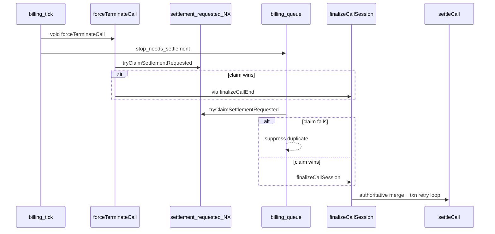

# Billing Settlement Implementation — Code Changes Reference

This document records **all code changes** made across Releases 0–4 of the billing settlement fix, plus the post-audit gap fixes (authoritative merge completion, race NX key, `lastTxnId` correlation, admin list batch meta, and admin UI wiring).

Each section includes **before** (prior behavior) and **after** (current code) snippets with file paths.

**Related docs:** [BILLING_SETTLEMENT_CODE_WALKTHROUGH.md](./BILLING_SETTLEMENT_CODE_WALKTHROUGH.md)

---

## Table of contents

1. [Release overview](#1-release-overview)
2. [Release 0/1 — Instrumentation + manual transaction retry](#2-release-01--instrumentation--manual-transaction-retry)
3. [Release 2 — Zero settlement protection](#3-release-2--zero-settlement-protection)
4. [Release 3 — Race + ownership fixes](#4-release-3--race--ownership-fixes)
5. [Release 4 — Admin re-settle API + UI](#5-release-4--admin-re-settle-api--ui)
6. [Post-audit gap fixes](#6-post-audit-gap-fixes)
7. [Typecheck fixes](#7-typecheck-fixes)
8. [Tests and CI](#8-tests-and-ci)
9. [Deploy order](#9-deploy-order)
10. [Files changed (index)](#10-files-changed-index)

---

## 1. Release overview

| Release | Focus | Key files |
|---------|-------|-----------|
| R0/R1 | Txn instrumentation, manual 3-attempt retry, commit ambiguity | `billing-settlement.service.ts`, `mongo-transaction.ts` |
| R2 | Authoritative totals resolver, zero-block guard | `billing-settlement-totals.service.ts`, `billing-reconciliation.guards.ts` |
| R3 | Duplicate finalize suppression, ownership takeover tightening | `billing-settlement-trigger.guards.ts`, `billing.queue.ts`, `billing.service.ts` |
| R4 | Admin preview/retry/bulk API + `vibemeet-admin` UI | `admin-call-settlement.service.ts`, `CallsPage.tsx` |
| Gap fixes | Complete merge recompute, early NX race key, list batch meta | Same + `admin.controller.ts` |

---

## 2. Release 0/1 — Instrumentation + manual transaction retry

### 2.1 New module: `mongo-transaction.ts`

**File:** `src/utils/mongo-transaction.ts` (new)

Provides transient-error classification, failure-stage labeling, and backoff helpers used by the manual retry loop.

**Before:** No dedicated helpers; settlement used implicit error handling or `withTransaction()` patterns elsewhere.

**After (excerpt):**

```typescript
export type SettlementFailureStage = 'before_write' | 'during_write' | 'commit';

export type SettlementWriteStage =
  | 'read_user'
  | 'debit_user_wallet'
  | 'upsert_user_debit_txn'
  | 'consume_intro_promo'
  | 'credit_creator_wallet'
  | 'upsert_creator_credit_txn'
  | 'staff_revenue_split'
  | 'upsert_call_history'
  | 'update_call_settlement'
  | 'commit';

export function isUnknownCommitResult(err: unknown): boolean {
  return getMongoErrorLabels(err).includes('UnknownTransactionCommitResult');
}

export function isTransientMongoTransactionError(err: unknown): boolean {
  const labels = getMongoErrorLabels(err);
  if (labels.includes('TransientTransactionError')) return true;
  if (labels.includes('UnknownTransactionCommitResult')) return true;
  // ... code 112, WriteConflict message patterns
}

export function classifyFailureStage(err: unknown, writeStage: SettlementWriteStage): SettlementFailureStage {
  if (isUnknownCommitResult(err)) return 'commit';
  if (writeStage === 'commit') return 'commit';
  if (WRITE_STAGES.has(writeStage)) return 'during_write';
  return 'before_write';
}

export function settlementTxnBackoffMs(attempt: number): number {
  return Math.min(2000, 100 * Math.pow(2, attempt));
}
```

---

### 2.2 Manual transaction retry loop (not `withTransaction()`)

**File:** `src/modules/billing/billing-settlement.service.ts`

**Before:** Single `startTransaction` / `commit` attempt; failures surfaced as generic errors with no `txnId`, no stage labels, no retry.

```typescript
// Conceptual prior pattern
const session = await mongoose.startSession();
session.startTransaction();
try {
  // ... writes ...
  await session.commitTransaction();
} catch (err) {
  await session.abortTransaction();
  throw err;
} finally {
  await session.endSession();
}
```

**After:**

```typescript
const SETTLEMENT_TXN_MAX_ATTEMPTS = 3;

for (let attempt = 0; attempt < SETTLEMENT_TXN_MAX_ATTEMPTS; attempt++) {
  const txnId = `${callId}:${attempt}:${crypto.randomUUID()}`;
  lastTxnId = txnId;
  const dbSession = await mongoose.startSession();
  dbSession.startTransaction();

  let mongoTransactionCommitted = false;
  let writeStage: SettlementWriteStage = 'read_user';

  logInfo('settlement_transaction_attempt', { txnId, callId, attempt, source: settlementSource });

  try {
    logInfo('settlement_transaction_stage', { txnId, callId, attempt, writeStage });
    // ... each write stage logs writeStage before executing ...

    writeStage = 'commit';
    await dbSession.commitTransaction();
    mongoTransactionCommitted = true;
    txnPersistSucceeded = true;
    break;
  } catch (err) {
    const failureStage = classifyFailureStage(err, writeStage);
    logError('settlement_transaction_failed', err, {
      txnId, callId, attempt, failureStage, writeStage,
      mongoErrorLabels: getMongoErrorLabels(err),
      mongoErrorCode: getMongoErrorCode(err),
    });
    recordBillingMetric('settlement_transaction_failed', 1, {
      callId, attempt: String(attempt), failureStage, writeStage,
    });

    if (!isTransientMongoTransactionError(err) || attempt === SETTLEMENT_TXN_MAX_ATTEMPTS - 1) {
      throwSettlementTxnError(err, lastTxnId);
    }
    recordBillingMetric('settlement_transaction_retry', 1, { callId, attempt: String(attempt) });
    await sleepMs(settlementTxnBackoffMs(attempt));
  } finally {
    await dbSession.endSession();
  }
}
```

**Metrics / logs added:**

| Name | Purpose |
|------|---------|
| `settlement_transaction_attempt` | One per attempt; includes `txnId` |
| `settlement_transaction_stage` | Per write stage within attempt |
| `settlement_transaction_failed` | Failure with `failureStage` + `writeStage` |
| `settlement_transaction_retry` | Transient retry scheduled |
| `settlement_transaction_committed` | Successful commit |
| `settlement_transaction_commit_ambiguous_resolved` | Commit unknown but idempotency check passed |

---

### 2.3 Commit ambiguity: `UnknownTransactionCommitResult`

**File:** `src/modules/billing/billing-settlement.service.ts`

**Before:** Ambiguous commit treated as hard failure → settlement retry exhaustion → dead letter.

**After:**

```typescript
if (failureStage === 'commit' && isUnknownCommitResult(err)) {
  const { isCallBillingAlreadySettled } = await import('./billing-session-finalization.service');
  if (await isCallBillingAlreadySettled(callId)) {
    recordBillingMetric('settlement_transaction_commit_ambiguous_resolved', 1, { callId, attempt: String(attempt) });
    logInfo('settlement_transaction_commit_ambiguous_resolved', { txnId, callId, attempt, source: settlementSource });
    txnPersistSucceeded = true;
    // Re-read CallHistory + User for emit values
    break;
  }
}
```

---

### 2.4 `throwSettlementTxnError` — attach `lastTxnId` on failure

**File:** `src/modules/billing/billing-settlement.service.ts`

**Before:**

```typescript
throw err;
// or
throw new Error(`Settlement transaction failed after ${SETTLEMENT_TXN_MAX_ATTEMPTS} attempts`);
```

`billing_finalize_failure` in `billing-session-finalization.service.ts` looked for `error.lastTxnId` but never received it.

**After:**

```typescript
function throwSettlementTxnError(err: unknown, lastTxnId?: string): never {
  const wrapped = err instanceof Error ? err : new Error(String(err));
  if (lastTxnId) {
    (wrapped as { lastTxnId?: string }).lastTxnId = lastTxnId;
  }
  throw wrapped;
}

// At terminal failure sites:
throwSettlementTxnError(err, lastTxnId);

if (!txnPersistSucceeded) {
  throwSettlementTxnError(
    new Error(`Settlement transaction failed after ${SETTLEMENT_TXN_MAX_ATTEMPTS} attempts`),
    lastTxnId
  );
}
```

**Consumer (`billing-session-finalization.service.ts`):**

```typescript
logError('billing_finalize_failure', error, {
  callId,
  txnId:
    error && typeof error === 'object' && 'lastTxnId' in error
      ? String((error as { lastTxnId?: string }).lastTxnId)
      : undefined,
  // ...
});
```

---

### 2.5 `CallSession` interface — add `billingSequence`

**File:** `src/modules/billing/billing-settlement.service.ts`

**Before:** `billingSequence` used via cast but missing from interface → TSC error.

**After:**

```typescript
interface CallSession {
  // ...existing fields...
  billingSequence?: number;
  elapsedSeconds: number;
  // ...
}
```

---

## 3. Release 2 — Zero settlement protection

### 3.1 Authoritative totals resolver

**File:** `src/modules/billing/billing-settlement-totals.service.ts` (new)

**Before:** `settleCall` trusted stale Redis session JSON only; checkpoint fallback could write 0 coins / 0 duration after txn failure.

**After — priority chain:**

```typescript
export type AuthoritativeTotalsSource = 'redis' | 'durable' | 'ledger' | 'checkpoint' | 'none';

export async function resolveAuthoritativeSettlementTotals(callId: string): Promise<AuthoritativeSettlementTotals> {
  // 1. Live Redis session (if non-zero totals)
  // 2. DurableCallSession (if enabled)
  // 3. BillingLedger sum
  // 4. Billing checkpoint
  // 5. { source: 'none', zeros }
}

export function applyAuthoritativeTotalsToSession(session, totals): CallSession {
  // Merges totalDeductedMicros, totalEarnedMicros, billingSequence, elapsedSeconds
}
```

Wired into `settleCall` **before** the Mongo transaction (see §6.1 for full recompute).

---

### 3.2 `shouldBlockZeroSettlement()`

**File:** `src/modules/billing/billing-reconciliation.guards.ts` (new)

**Before:** No guard; zero reconciliation could persist when durable/ledger showed billing activity.

**After:**

```typescript
export function isBlockZeroSettlementEnabled(): boolean {
  return process.env.BILLING_BLOCK_ZERO_SETTLEMENT_ENABLED !== 'false';
}

export function shouldBlockZeroSettlement(totals: AuthoritativeSettlementTotals): {
  blocked: boolean;
  reason?: string;
} {
  if (!isBlockZeroSettlementEnabled()) return { blocked: false };
  if (totals.totalDeductedMicros > 0) return { blocked: false };
  if (totals.billingSequence > 0) {
    return { blocked: true, reason: 'zero_deduct_with_positive_sequence' };
  }
  if (totals.source === 'durable' || totals.source === 'ledger') {
    return { blocked: true, reason: `zero_deduct_authoritative_${totals.source}` };
  }
  if (totals.totalEarnedMicros > 0 && totals.totalDeductedMicros === 0 && totals.source !== 'none') {
    return { blocked: true, reason: 'zero_deduct_with_positive_earn' };
  }
  return { blocked: false };
}
```

**Wired into:**

| Location | Behavior |
|----------|----------|
| `finalizeCallSession` | Blocks `settleCall` when authoritative totals say zero but billing occurred |
| `checkpointLifecycleState` | Blocks bogus zero reconstruction |
| `moveCallToRecoveryDeadLetter` | Snapshots durable totals + dead-letter metadata |
| `billing-runtime-resolver.service.ts` | Checkpoint path respects guard |
| `reconcile-stuck-settling-calls.ts` | Snapshots durable before Redis clear |

**Example in `billing-session-finalization.service.ts`:**

```typescript
const { shouldBlockZeroSettlement } = await import('./billing-reconciliation.guards');
const zeroBlock = shouldBlockZeroSettlement(authoritativeTotals);
if (zeroBlock.blocked) {
  recordBillingMetric('billing_finalize_zero_blocked', 1, { callId, reason: zeroBlock.reason });
  // ... dead-letter or retry path
}
```

---

## 4. Release 3 — Race + ownership fixes

### 4.1 `isSettlementAlreadyTriggered()` + early NX claim

**File:** `src/modules/billing/billing-settlement-trigger.guards.ts`

**Before (initial R3):** Passive read of inflight / finalize lock / done / Mongo `settling` — TOCTOU window before keys exist.

```typescript
export async function isSettlementAlreadyTriggered(callId: string): Promise<boolean> {
  const [inflight, lock, done] = await Promise.all([
    redis.get(finalizeInflightKey(callId)),
    redis.get(`call:finalize:lock:${callId}`),
    redis.get(`call:finalize:done:${callId}`),
  ]);
  if (inflight || lock || done) return true;
  const call = await Call.findOne({ callId }).select('settlement.status').lean();
  return call?.settlement?.status === 'settling';
}
```

**After (gap fix — atomic first-writer-wins):**

**Redis key** (`src/config/redis.ts`):

```typescript
export const BILLING_SETTLEMENT_REQUESTED_PREFIX = 'billing:settlement:requested:';
export const billingSettlementRequestedKey = (callId: string): string =>
  `${BILLING_SETTLEMENT_REQUESTED_PREFIX}${callId}`;
// TTL: SETTLEMENT_CLAIM_TTL_SECONDS (default 180s)
```

**Guard helpers:**

```typescript
export async function tryClaimSettlementRequested(callId: string): Promise<boolean> {
  const result = await redis.set(
    billingSettlementRequestedKey(callId),
    '1',
    'EX',
    SETTLEMENT_CLAIM_TTL_SECONDS,
    'NX'
  );
  return result === 'OK';
}

export async function isSettlementAlreadyTriggered(callId: string): Promise<boolean> {
  const [inflight, lock, done, requested] = await Promise.all([
    redis.get(finalizeInflightKey(callId)),
    redis.get(`${CALL_FINALIZE_LOCK_PREFIX}${callId}`),
    redis.get(`${CALL_FINALIZE_DONE_PREFIX}${callId}`),
    redis.get(billingSettlementRequestedKey(callId)),
  ]);
  if (inflight || lock || done || requested) return true;
  // ... Mongo settling check
}
```

---

### 4.2 Queue duplicate suppression (`billing.queue.ts`)

**Before:**

```typescript
} else if (result === 'stop_needs_settlement') {
  const { finalizeCallSession } = await import('./billing-session-finalization.service');
  await finalizeCallSession(io, { callId, reason: 'insufficient_coins', source: 'billing_tick' });
}
```

**After (R3 + gap fix):**

```typescript
} else if (result === 'stop_needs_settlement') {
  const { tryClaimSettlementRequested } = await import('./billing-settlement-trigger.guards');
  if (!(await tryClaimSettlementRequested(callId))) {
    recordBillingMetric('billing_finalize_duplicate_suppressed', 1, {
      callId,
      source: 'billing_tick_queue',
    });
    return result;
  }
  const { finalizeCallSession } = await import('./billing-session-finalization.service');
  await finalizeCallSession(io, {
    callId,
    reason: 'insufficient_coins',
    source: 'billing_tick',
  }).catch((e) => logError('finalizeCallSession failed', e, { callId }));
}
```

`forceTerminateCall` remains **fire-and-forget** for `finalizeCallEnd`; duplicate finalize from `billing_tick` is suppressed at the queue layer (and via shared NX claim).

---

### 4.3 `forceTerminateCall` — claim before finalize

**File:** `src/modules/billing/billing-termination.service.ts`

**Before:**

```typescript
const { finalizeCallEnd } = await import('../video/call-finalization.service');
void finalizeCallEnd(io, callId, 'force_end').catch(/* ... */);
recordBillingMetric('force_terminate_settlement_triggered', 1, { callId, reason });
```

**After:**

```typescript
const { tryClaimSettlementRequested } = await import('./billing-settlement-trigger.guards');
const claimed = await tryClaimSettlementRequested(callId);
if (!claimed) {
  recordBillingMetric('force_terminate_settlement_deduped', 1, { callId, reason });
  logInfo('forceTerminateCall settlement already requested — skipping finalize', { callId, reason });
  return;
}

const { finalizeCallEnd } = await import('../video/call-finalization.service');
void finalizeCallEnd(io, callId, 'force_end').catch((finalizeError) => {
  logError('forceTerminateCall finalization trigger failed', finalizeError, { callId, reason });
});
recordBillingMetric('force_terminate_settlement_triggered', 1, { callId, reason });
```

---

### 4.4 Ownership takeover tightening

**File:** `src/modules/billing/billing.service.ts`

**Before:** Takeover on `ownerInstanceMismatch` alone (could steal healthy worker).

**After:**

```typescript
const ownerInstanceMismatch = /* durable lease owner !== this instance */;
if (stallMs > chainHealStallMs || (ownerInstanceMismatch && stallMs > 0)) {
  // allow takeover
}
```

---

### 4.5 `finalizeCallSession` inflight safety net

**File:** `src/modules/billing/billing-session-finalization.service.ts`

**Added:**

- `finalizeInflightKey` NX at entry; duplicate paths log `billing_finalize_duplicate_suppressed`
- Stale `SETTLING` detection → `enqueueImmediateSettlementRetry`
- `billing_finalize_concurrent_sources` metric when inflight guard hits
- `txnId` on success path from `persistResult.lastTxnId`

---

## 5. Release 4 — Admin re-settle API + UI

### 5.1 Admin service (`admin-call-settlement.service.ts`)

**New exports:**

| Function | Purpose |
|----------|---------|
| `computeSettlementIssue()` | Taxonomy: `zero_duration_with_billing`, `unsettled_ledger`, `failed_recovery`, `stuck_settling` |
| `buildSettlementRetryPreview(callId)` | Full preview with authoritative totals + debit txn check |
| `executeAdminSettlementRetry(io, callId, { force? })` | Clear DLQ, rehydrate session, enqueue retry |
| `executeBulkAdminSettlementRetry(io, callIds, { force? })` | Sequential bulk (max 20) |
| `batchBuildSettlementListMeta(items)` | Page-sized batch for `GET /admin/calls` |

**Routes** (`admin.routes.ts`):

```typescript
router.get('/calls/:callId/settlement-retry-preview', getSettlementRetryPreview);
router.post('/calls/:callId/retry-settlement', retryCallSettlement);
router.post('/calls/retry-settlement-bulk', retryCallSettlementBulk);
```

---

### 5.2 `GET /admin/calls` — real settlement flags

**File:** `src/modules/admin/admin.controller.ts`

**Before:**

```typescript
const settlementIssue = computeSettlementIssue(
  { durationSeconds: c.durationSeconds, coinsDeducted: c.coinsDeducted, settlementStatus: c.settlementStatus },
  { totalDeductedMicros: 0, totalEarnedMicros: 0, billingSequence: 0, source: 'none' },
  billingStatus,
  false  // hasVideoCallDebitTxn hardcoded
);
const canRetrySettlement =
  settlementIssue != null ||
  (c.durationSeconds === 0 && (billingStatus === 'settling' || billingStatus === 'failed_recovery_settlement'));
// ...
authoritativeCoinsDeducted: null,
```

**After:**

```typescript
const settlementMetaByCallId = await batchBuildSettlementListMeta(
  calls.map((c) => ({
    callId: c.callId,
    userCall: {
      durationSeconds: c.durationSeconds,
      coinsDeducted: c.coinsDeducted,
      settlementStatus: c.settlementStatus,
    },
    billingStatus: callById.get(c.callId)?.settlement?.status ?? 'settled',
  }))
);

// Per row:
const settlementMeta = settlementMetaByCallId.get(c.callId);
const settlementIssue = settlementMeta?.settlementIssue ?? null;
const canRetrySettlement = settlementMeta?.canRetrySettlement ?? false;
const authoritativeCoinsDeducted = settlementMeta?.authoritativeCoinsDeducted ?? null;
```

**`batchBuildSettlementListMeta` implementation:**

```typescript
const [totalsList, debitTxns] = await Promise.all([
  Promise.all(callIds.map((callId) => resolveAuthoritativeSettlementTotals(callId))),
  CoinTransaction.find({ callId: { $in: callIds }, type: 'debit', source: 'video_call' }).select('callId').lean(),
]);
const debitTxnCallIds = new Set(debitTxns.map((txn) => txn.callId));
// Per call: computeSettlementIssue + authoritativeCoinsDeducted + canRetrySettlement
```

---

### 5.3 Admin UI — `vibemeet-admin`

#### `adminService.ts` — types + API methods

**Before:** `AdminCall` had no settlement retry fields; no client methods for retry endpoints.

**After — `AdminCall` extension:**

```typescript
export interface AdminCall {
  // ...existing fields...
  canRetrySettlement?: boolean;
  settlementIssue?: 'zero_duration_with_billing' | 'unsettled_ledger' | 'failed_recovery' | 'stuck_settling' | null;
  authoritativeCoinsDeducted?: number | null;
}

export interface SettlementRetryPreview { /* matches backend */ }

getSettlementRetryPreview: async (callId) => api.get(`/admin/calls/${callId}/settlement-retry-preview`),
retryCallSettlement: async (callId, { force? }) => api.post(`/admin/calls/${callId}/retry-settlement`, { force }),
retryCallSettlementBulk: async (callIds, { force? }) => api.post('/admin/calls/retry-settlement-bulk', { callIds, force }),
```

#### `CallsPage.tsx` — `/users/calls`

**Before:** Refund button only; no billing status column; no re-settle UI.

**After — additions:**

| UI element | Implementation |
|------------|----------------|
| **Billing column** | `billingStatus` + `settlementIssue` badge |
| **Auth. coins column** | Shows `authoritativeCoinsDeducted` when it differs from `coinsDeducted` or when recorded 0 but authoritative > 0 |
| **Re-settle button** | Per row when `canRetrySettlement`; opens preview modal |
| **Preview modal** | Issue, current vs proposed duration/coins, `deadLetterPresent`, `hasVideoCallDebitTxn`, force checkbox |
| **Bulk action** | “Re-settle retryable on page (N)” → `retryCallSettlementBulk` → results table |
| **Summary badge** | Count of retryable calls on current page |

**Modal flow (mirrors Refund):**

```typescript
const openResettleModal = async (call: AdminCall) => {
  setResettleTarget(call);
  const preview = await adminService.getSettlementRetryPreview(call.callId);
  setResettlePreview(preview);
};

const handleResettle = async () => {
  const result = await adminService.retryCallSettlement(resettleTarget.callId, {
    force: resettleForce,
  });
  load();
  refreshIntegrity();
};
```

---

### 5.4 OpenAPI

**File:** `docs/openapi.yaml`

**Added paths:**

- `GET /api/v1/admin/calls/:callId/settlement-retry-preview`
- `POST /api/v1/admin/calls/:callId/retry-settlement` (body: `{ force?: boolean }`)
- `POST /api/v1/admin/calls/retry-settlement-bulk` (body: `{ callIds: string[], force?: boolean }`)

---

## 6. Post-audit gap fixes

### 6.1 Complete authoritative merge recompute

**Problem:** After `applyAuthoritativeTotalsToSession`, only `totalDeducted` was recalculated. `durationSeconds`, `totalEarnedCreator`, and `walletDeductedMicros` stayed stale → wrong CallHistory duration, creator earn, and wallet debit txn.

**Before:**

```typescript
const authoritativeTotals = await resolveAuthoritativeSettlementTotals(callId);
const mergedSession = applyAuthoritativeTotalsToSession(session, authoritativeTotals);
session.totalDeductedMicros = mergedSession.totalDeductedMicros;
session.totalEarnedMicros = mergedSession.totalEarnedMicros;
// ... elapsedSeconds copy ...
totalDeducted = microsToUserDebitWholeCoins(session.totalDeductedMicros ?? 0);
// walletDeductedMicros, durationSeconds, totalEarnedCreator still from pre-merge values
```

**After:**

```typescript
const authoritativeTotals = await resolveAuthoritativeSettlementTotals(callId);
const mergedSession = applyAuthoritativeTotalsToSession(session, authoritativeTotals);
session.totalDeductedMicros = mergedSession.totalDeductedMicros;
session.totalEarnedMicros = mergedSession.totalEarnedMicros;
(session as { billingSequence?: number }).billingSequence = mergedSession.billingSequence;
if (mergedSession.elapsedSeconds != null) {
  session.elapsedSeconds = mergedSession.elapsedSeconds;
}

durationSeconds = Math.max(0, Math.floor(Number(session.elapsedSeconds) || 0));
walletDeductedMicros =
  session.totalWalletDeductedMicros ??
  Math.max(0, (session.totalDeductedMicros ?? 0) - introDeductedMicros);
totalEarnedCreator = microsToCreatorCreditWholeCoins(session.totalEarnedMicros ?? 0);
totalDeducted = microsToUserDebitWholeCoins(session.totalDeductedMicros ?? 0);

// Legacy schema override ONLY when authoritative source is 'none'
if (
  authoritativeTotals.source === 'none' &&
  (session.schemaVersion ?? 0) < BILLING_SESSION_SCHEMA_VERSION &&
  session.pricePerSecond
) {
  const legacyDeductMicros = Math.round(billedSeconds * session.pricePerSecond * COIN_MICROS);
  totalDeducted = microsToUserDebitWholeCoins(legacyDeductMicros);
  const legacyEarnMicros = Math.round((earnRaw * COIN_MICROS) / 10000);
  totalEarnedCreator = microsToCreatorCreditWholeCoins(legacyEarnMicros);
}
```

Downstream txn uses corrected values:

```typescript
const targetWalletDebitWhole = Math.max(0, microsToUserDebitWholeCoins(walletDeductedMicros));
// CallHistory description uses durationSeconds
// Creator credit uses totalEarnedCreator
```

---

## 7. Typecheck fixes

| Issue | Fix |
|-------|-----|
| `billingSequence` missing from `CallSession` | Added optional `billingSequence?: number` to interface |
| Durable field type in admin service | Corrected cast/access for `creatorEarningsPerSecondMicros` on durable session |
| Bad import path in `mongo-transaction.behavior.test.ts` | Fixed relative import to `../../utils/mongo-transaction` |

**Verification:** `npx tsc --noEmit` passes cleanly.

---

## 8. Tests and CI

### New / extended test files

| File | Coverage |
|------|----------|
| `src/utils/mongo-transaction.behavior.test.ts` | Transient error detection, `classifyFailureStage`, backoff |
| `src/modules/billing/billing-settlement-fix.contract.test.ts` | Retry loop strings, NX claim, `throwSettlementTxnError`, admin batch meta |
| `src/modules/billing/billing-reconciliation.behavior.test.ts` | `shouldBlockZeroSettlement` including earn-without-deduct |
| `src/scripts/reconcile-stuck-settling-calls.contract.test.ts` | Durable snapshot before Redis clear |

### `package.json` test script

**Added to CI `npm test`:**

```
src/modules/billing/billing-settlement-fix.contract.test.ts
src/utils/mongo-transaction.behavior.test.ts
```

(`billing-reconciliation.behavior.test.ts` was already included.)

### Admin smoke test

**File:** `vibemeet-admin/tests/calls-billing-smoke.test.mjs`

```javascript
test('calls page wires settlement retry UI', () => {
  assert.ok(calls.includes('getSettlementRetryPreview'));
  assert.ok(calls.includes('retryCallSettlement'));
  assert.ok(calls.includes('canRetrySettlement'));
  assert.ok(adminService.includes('retryCallSettlementBulk'));
});
```

---

## 9. Deploy order

```text
1. Backend (all releases R0–R4 + gap fixes) — single deploy acceptable
   - Watch: settlement_transaction_failed by failureStage
   - Toggle: BILLING_BLOCK_ZERO_SETTLEMENT_ENABLED (default on unless 'false')

2. vibemeet-admin frontend
   - Rebuild/deploy so /users/calls shows Re-settle buttons
   - Backfill ~50 unsettled calls via per-row or bulk Re-settle

3. Ops validation
   - GET /admin/calls shows canRetrySettlement + authoritativeCoinsDeducted
   - billing_finalize_failure logs include txnId after txn exhaustion
   - Duplicate path logs billing_finalize_duplicate_suppressed / force_terminate_settlement_deduped
```

**Staged rollout (optional):** Releases were designed to be isolatable; in practice they shipped together. Only `BILLING_BLOCK_ZERO_SETTLEMENT_ENABLED` is independently toggleable at runtime.

---

## 10. Files changed (index)

### Backend (`vibemeet-backend`)

| File | Change |
|------|--------|
| `src/utils/mongo-transaction.ts` | **New** — txn helpers |
| `src/utils/mongo-transaction.behavior.test.ts` | **New** — unit tests |
| `src/config/redis.ts` | `billingSettlementRequestedKey` |
| `src/modules/billing/billing-settlement.service.ts` | Retry loop, merge recompute, `throwSettlementTxnError` |
| `src/modules/billing/billing-settlement-totals.service.ts` | **New** — authoritative resolver |
| `src/modules/billing/billing-reconciliation.guards.ts` | **New** — `shouldBlockZeroSettlement` |
| `src/modules/billing/billing-settlement-trigger.guards.ts` | **New** → extended with NX claim |
| `src/modules/billing/billing.queue.ts` | `tryClaimSettlementRequested` on `stop_needs_settlement` |
| `src/modules/billing/billing-termination.service.ts` | NX claim before `finalizeCallEnd` |
| `src/modules/billing/billing.service.ts` | Ownership takeover guard |
| `src/modules/billing/billing-session-finalization.service.ts` | Zero-block, inflight guard, txnId logging |
| `src/modules/billing/billing-settlement-fix.contract.test.ts` | **New** |
| `src/modules/billing/billing-reconciliation.behavior.test.ts` | Extended |
| `src/modules/admin/admin-call-settlement.service.ts` | **New** — preview/retry/bulk/batch meta |
| `src/modules/admin/admin.controller.ts` | Handlers + fixed `getCallsAdmin` |
| `src/modules/admin/admin.routes.ts` | Three new routes |
| `docs/openapi.yaml` | Documented retry endpoints |
| `package.json` | Test script includes new contract tests |

### Admin frontend (`vibemeet-admin`)

| File | Change |
|------|--------|
| `src/services/adminService.ts` | Types + `getSettlementRetryPreview`, `retryCallSettlement`, `retryCallSettlementBulk` |
| `src/pages/CallsPage.tsx` | Billing columns, Re-settle modal, bulk action |
| `tests/calls-billing-smoke.test.mjs` | Settlement retry wiring test |

---

## Sequence diagram (after all fixes)



---

*Generated: 2026-06-29 — reflects implementation through Settlement Gap Fixes + Admin Re-settle UI plan.*
