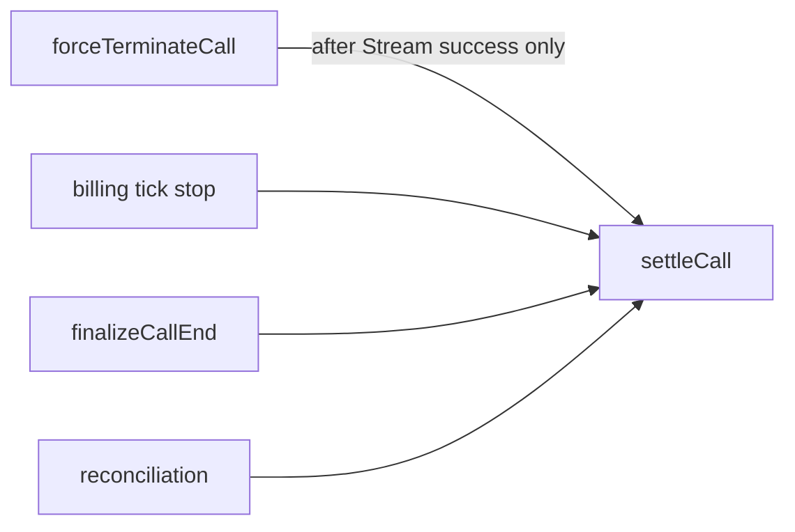
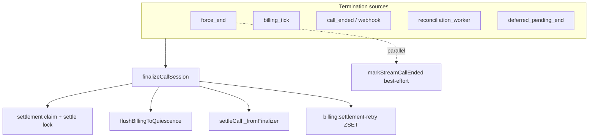

# Billing settlement orchestration — implementation record

**Plan reference:** Cursor plan `billing_settlement_unification_234a46e8` (orchestration hardening spec; plan file not modified as part of this work)  
**Related analysis:** [billing-settlement-flow-analysis.md](./billing-settlement-flow-analysis.md)  
**Date:** 2026-05-18  

This document records **what was implemented in code** for billing settlement orchestration hardening: new modules, modified files, behavioral changes, configuration, and verification hooks.

---

## Executive summary

The production issue addressed is **not** initiator-specific persistence (User→Creator vs Creator→User both already used the same `settleCall` writer). The flaw was **orchestration**:

- Multiple concurrent triggers (`forceTerminateCall`, billing tick `stop_needs_settlement`, `finalizeCallEnd`, reconciliation) could race on `settle:lock:{callId}`.
- The lock **loser exited silently** with no retry.
- **`forceTerminateCall` gated settlement on Stream `mark_ended` success**, so financial persistence could be skipped when Stream failed even though billing had already exhausted the wallet.

The fix introduces a **single orchestration entrypoint** — `finalizeCallSession` — and restricts **financial persistence** to `settleCall` (with a `_fromFinalizer` path). Runtime billing (Redis ticks, CPM, force-end timing) was intentionally **not** redesigned.

---

## Architecture

### Before



### After



| Layer | Function | Module |
|-------|----------|--------|
| **Orchestration** | `finalizeCallSession({ callId, reason, source })` | `src/modules/billing/billing-session-finalization.service.ts` |
| **Persistence** | `settleCall(io, callId, opts?)` | `src/modules/billing/billing-settlement.service.ts` |

**Rule:** Production settlement should go through `finalizeCallSession`. Only that module (plus the legacy fallback inside it when the feature flag is off) calls `settleCall` directly.

---

## New files

| File | Purpose |
|------|---------|
| [`src/modules/billing/billing-session-finalization.service.ts`](../src/modules/billing/billing-session-finalization.service.ts) | Canonical finalizer: claim, lock, flush, persist delegate, Mongo settlement state, retry queue, metrics |
| [`src/modules/billing/billing-session-finalization.contract.test.ts`](../src/modules/billing/billing-session-finalization.contract.test.ts) | Static contract tests (exports, Stream ordering, caller wiring) |
| [`docs/billing-settlement-flow-analysis.md`](./billing-settlement-flow-analysis.md) | Pre/post architecture analysis, Redis keys, failure modes, scaling notes |

---

## Modified files (by area)

### 1. Canonical finalizer (`billing-session-finalization.service.ts`)

**Public API**

- `SettlementReason`: `insufficient_coins` \| `disconnect` \| `timeout` \| `explicit_end` \| `duration_limit` \| `reconciliation` \| `unknown`
- `SettlementSource`: `force_end` \| `billing_tick` \| `socket_call_ended` \| `http_call_ended` \| `webhook` \| `reconciliation_worker` \| `deferred_pending_end`
- `finalizeCallSession(io, { callId, reason, source })` → `FinalizeResult` with `status`: `settled` \| `duplicate` \| `pending_retry` \| `failed`
- `enqueueSettlementRetry(params)` — ZSET enqueue with exponential backoff score
- `processSettlementRetryQueue(io, maxItems)` — consumer invoked from reconciliation

**Orchestration flow (when `BILLING_UNIFIED_FINALIZER_ENABLED` is true)**

1. `isAlreadySettled` — `settled:call:`, user `CallHistory`, or `Call.settlement.status === 'settled'`
2. `tryStaleSettlingTakeover` — if `settling` and `updatedAt` older than `BILLING_MAX_SETTLING_MS`
3. `SET settlement:claim:{callId}` (NX) with JSON `{ token, instanceId, acquiredAt }`
4. On claim miss: **poll** up to `BILLING_SETTLEMENT_POLL_MS`, else **enqueue retry** (no silent return)
5. `SET settle:lock:{callId}` (NX); on miss: poll or enqueue + `billing_finalize_claim_timeout_total`
6. `markCallSettling` on `Call` (owner token / instance id)
7. `billingService.flushBillingToQuiescence`
8. `removeCallFromBilling` (ZSET removal)
9. `settleCall(io, callId, { _fromFinalizer: true, lockToken, settleLockRedisKey })`
10. `markCallSettled`, `runPostPersistRedisCleanup` (session keys + `settled:call:` + claim delete)
11. Append `settlementAttempts`, emit metrics / structured logs

**Feature flag fallback:** If `BILLING_UNIFIED_FINALIZER_ENABLED=false`, `finalizeCallSession` delegates to legacy full `settleCall(io, callId)` (old orchestration inside persistence module).

---

### 2. Persistence layer (`billing-settlement.service.ts`)

**New exports**

- `SettleCallFromFinalizerOptions` — `{ _fromFinalizer: true, lockToken, settleLockRedisKey }`
- `SettlePersistResult` — coins/duration + UIDs for post-persist cleanup
- `removeCallFromBilling` — now **exported** (used by finalizer)
- `deleteBillingSessionRedisKeys` — now **exported** (used by finalizer)
- `persistCallSettlement` — alias of `settleCall` (documented as finalizer-only)

**`settleCall` behavior split**

| Step | Legacy path (`!_fromFinalizer`) | Finalizer path (`_fromFinalizer`) |
|------|--------------------------------|-----------------------------------|
| `settled:call:` early exit | Yes | Skipped (finalizer already checked) |
| `flushBillingToQuiescence` | Yes | **No** (finalizer runs flush) |
| Acquire `settle:lock` | Yes | **No** (finalizer holds lock) |
| `removeCallFromBilling` | Yes | **No** |
| Mongo transaction + CallHistory / CoinTransaction | Yes | Yes |
| Post-commit Redis cleanup | Yes | **No** (finalizer `runPostPersistRedisCleanup`) |
| Socket emits (`coins_updated`, `billing:settled`, chat activity, etc.) | Yes | Yes (still in `settleCall` after commit) |
| Return value | `void` | `SettlePersistResult` |

**Unchanged in persistence:** CPM math, micros deduction logic, staff ledger, idempotent `CoinTransaction` upserts, `CallHistory` upserts, intro promo handling.

---

### 3. Stream decoupling (`billing-termination.service.ts`)

**Before:** `markStreamCallEnded` → on success → `void settleCall(...)`.

**After:**

1. Emit `call:force-end` (unchanged)
2. **`void finalizeCallSession(..., source: 'force_end')`** — authoritative settlement
3. **`await markStreamCallEnded`** — best-effort media cleanup; failures enqueue termination retry only (no longer block settlement)

Settlement reason mapping: `duration_limit_reached` → `duration_limit`; `insufficient_coins` / `intro_promo_exhausted` → `insufficient_coins`.

---

### 4. Callers migrated to `finalizeCallSession`

| File | Previous | Now |
|------|----------|-----|
| [`billing-batch.processor.ts`](../src/modules/billing/billing-batch.processor.ts) | `settleCall` on `stop_needs_settlement` | `finalizeCallSession({ source: 'billing_tick', reason: 'insufficient_coins' })` |
| [`billing.queue.ts`](../src/modules/billing/billing.queue.ts) | `settleCall` | Same as batch |
| [`billing-termination.service.ts`](../src/modules/billing/billing-termination.service.ts) | `settleCall` after Stream | `finalizeCallSession` before Stream |
| [`call-finalization.service.ts`](../src/modules/video/call-finalization.service.ts) | `settleCall` | `finalizeCallSession({ reason: 'explicit_end', source: mapped })` |
| [`billing.gateway.ts`](../src/modules/billing/billing.gateway.ts) | `settleCall` on deferred pending end | `finalizeCallSession({ source: 'deferred_pending_end', ... })` |
| [`billing-socket.gateway.ts`](../src/modules/billing/billing-socket.gateway.ts) | `settleCall` on deferred pending end | Same |
| [`billing-reconciliation.ts`](../src/modules/billing/billing-reconciliation.ts) | `settleCall` in DLQ / stale watchdog | `finalizeCallSession({ source: 'reconciliation_worker', ... })` |

**Unchanged:** Billing socket `disconnect` still does **not** settle (by design). Explicit end still flows: socket/HTTP `call-ended` → `finalizeCallEnd` → `finalizeCallSession`.

**`call-finalization.service.ts` source mapping**

| `source` argument | `SettlementSource` |
|-------------------|------------------|
| `http_settle_call` | `http_call_ended` |
| `socket_call_ended` | `socket_call_ended` |
| `reconciliation_*` | `reconciliation_worker` |
| `webhook_*` | `webhook` |

---

### 5. Reconciliation hardening (`billing-reconciliation.ts`)

Each reconciliation run (5 min interval, global lock) now **starts with**:

1. `processSettlementRetryQueue(io, 40)` — drain `billing:settlement-retry`
2. `runSettlementOrphanRepair(io, startedAt)`:
   - **Stale settling:** `Call.settlement.status === 'settling'` and `updatedAt < now - BILLING_MAX_SETTLING_MS`
   - **Pending timeout:** `settlement.status === 'pending'` and document `updatedAt` too old
   - **Orphan sessions:** SCAN `call:session:*`, `totalDeductedMicros > 0`, no user `CallHistory` → finalize

Then existing DLQ, termination Redis retries, BullMQ watchdog, stale ZSET watchdog (watchdog settlement also uses `finalizeCallSession`).

---

### 6. Mongo `Call` model (`call.model.ts`)

**New subdocuments**

```typescript
settlement?: {
  status: 'pending' | 'settling' | 'settled' | 'failed';
  source?: string;
  reason?: string;
  settledAt?: Date;
  version?: number;
  updatedAt?: Date;
  ownerToken?: string;
  ownerInstanceId?: string;
};
settlementAttempts?: Array<{
  source, reason, timestamp,
  result: 'success' | 'duplicate' | 'retry' | 'failed' | 'stale_takeover';
  error?, ownerToken?, settlementVersion?;
}>;
```

Used for audit, stale takeover, and reconciliation queries — not exposed to clients.

---

### 7. Redis keys (`config/redis.ts`)

| Key | Purpose |
|-----|---------|
| `settlement:claim:{callId}` | Ownership claim JSON; TTL `SETTLEMENT_CLAIM_TTL_SECONDS` (default 180s, env override) |
| `billing:settlement-retry` | ZSET; member = JSON `{ callId, reason, source, attempt }`; score = run-at ms |
| `settle:lock:{callId}` | Existing; coordinated by finalizer |
| `settled:call:{callId}` | Existing idempotency marker |

---

### 8. Constants (`billing.constants.ts`)

| Constant / function | Default | Purpose |
|-------------------|---------|---------|
| `BILLING_MAX_SETTLING_MS` | 180000 | Stale `settling` takeover threshold |
| `BILLING_SETTLEMENT_POLL_MS` | 25000 | Lock-loser poll window |
| `BILLING_SETTLEMENT_PENDING_MAX_MS` | 300000 | Reconciliation repair for long `pending` |
| `BILLING_SETTLEMENT_RETRY_MAX_ATTEMPTS` | 8 | Max retry enqueue generations |
| `isUnifiedBillingFinalizerEnabled()` | true unless `BILLING_UNIFIED_FINALIZER_ENABLED=false` | Feature flag |

---

### 9. Observability

**Structured logs (finalizer)**

- `billing_finalize_begin`
- `billing_finalize_success`
- `billing_finalize_failure`
- `billing_finalize_stale_takeover`
- `billing_reconciliation_repair`

**Metrics (`recordBillingMetric`)**

| Metric | When |
|--------|------|
| `billing_finalize_success` | Successful finalize |
| `billing_finalize_duplicate` | Idempotent coalesce |
| `billing_finalize_failure` | Error / max retries |
| `billing_finalize_retry_total` | Retry enqueued or consumed |
| `billing_finalize_stale_claim_total` | Stale settling takeover |
| `billing_finalize_claim_timeout_total` | `settle:lock` NX failed after claim |
| `billing_reconciliation_repairs_total` | Orphan session repair |
| `billing_orphaned_sessions_total` | Orphan detected (by type tag) |

Existing `settlement_*` and `force_terminate_*` metrics in persistence/termination modules are retained.

---

### 10. Load test harness

**[`scripts/load-test/socket-force-end-test.mjs`](../scripts/load-test/socket-force-end-test.mjs)**

- `FORCE_END_TEST_POST_CALL_ENDED=true|false` — optional `POST /api/v1/billing/call-ended` after force-end
- Meta field `postsCallEnded` reflects actual run configuration

**[`scripts/load-test/query-callhistory-durations.mjs`](../scripts/load-test/query-callhistory-durations.mjs)**

- After attaching `CallHistory` to results JSON, **exits code 1** if any passed session has `recordCount !== 2` or unexpected `coinsDeducted` (60-coin seed runs)

**Recommended 4-combo matrix**

```powershell
cd backend
$env:FORCE_END_TEST_MULTI_N="50"
$env:SEED_FAN_COINS="60"
$env:SEED_CREATOR_PRICE="60"

# 1–4: fan/creator × postsCallEnded true/false
$env:FORCE_END_TEST_INITIATOR="fan"      # or "creator"
$env:FORCE_END_TEST_POST_CALL_ENDED="false"  # or "true"
npm run seed:load-test
npm run loadtest:socket-force-end
node scripts/load-test/query-callhistory-durations.mjs scripts/load-test/<results>.json
```

---

### 11. Tests (`package.json`)

Added to `npm test`:

- `src/modules/billing/billing-session-finalization.contract.test.ts`

**Contract assertions include:**

- Finalizer exports `finalizeCallSession`, retry helpers
- `void finalizeCallSession` appears **before** `await markStreamCallEnded` in termination service
- Batch processor imports finalizer, not `settleCall`
- Legacy `settleCall` flush guarded by `if (!fromFinalizer)`

---

## Environment variables

| Variable | Effect |
|----------|--------|
| `BILLING_UNIFIED_FINALIZER_ENABLED=false` | `finalizeCallSession` → legacy `settleCall` only |
| `BILLING_MAX_SETTLING_MS` | Stale settling takeover |
| `BILLING_SETTLEMENT_POLL_MS` | Lock-loser poll duration |
| `BILLING_SETTLEMENT_PENDING_MAX_MS` | Pending settlement repair |
| `BILLING_SETTLEMENT_RETRY_MAX_ATTEMPTS` | Retry cap |
| `BILLING_SETTLEMENT_CLAIM_TTL_SECONDS` | Redis claim TTL |
| `BILLING_INSTANCE_ID` | Stored on `Call.settlement.ownerInstanceId` (default `hostname:pid`) |
| `BILLING_SERVER_FORCE_END_ENABLED=false` | Force-end emits only; settlement via tick/finalizer elsewhere |
| `FORCE_END_TEST_POST_CALL_ENDED` | Load test optional `call-ended` |

---

## Explicitly out of scope (unchanged)

- Per-second billing loop (`_processBillingCycleInternal`), CPM / micros math
- `BILLING_PROCESS_INTERVAL_MS`, ZSET vs BullMQ tick scheduling
- HTTP `call-started` passing `initiatedByRole` (metadata-only follow-up)
- Requiring client `call-ended` for persistence
- Initiator-specific **persistence** branches in `settleCall`

---

## Operational notes

1. **Rollout:** Default is unified finalizer **on**. Set `BILLING_UNIFIED_FINALIZER_ENABLED=false` to revert to in-module `settleCall` orchestration for emergency rollback.
2. **Multi-instance:** Use Redis adapter for Socket.IO; reconciliation global lock prevents duplicate repair storms; per-`callId` claim + lock reduce double-settle risk.
3. **Monitoring:** Watch `billing_finalize_retry_total` and `billing_finalize_stale_claim_total` — elevated rates indicate contention or crashed workers before takeover.
4. **Cleanup:** Existing `npm run revert:load-test` unchanged; settlement state on `Call` is production data, not load-test specific.

---

## File change checklist

| Path | Change type |
|------|-------------|
| `src/modules/billing/billing-session-finalization.service.ts` | **Added** |
| `src/modules/billing/billing-session-finalization.contract.test.ts` | **Added** |
| `docs/billing-settlement-flow-analysis.md` | **Added** |
| `docs/BILLING_SETTLEMENT_ORCHESTRATION_IMPLEMENTATION.md` | **Added** (this file) |
| `src/modules/billing/billing-settlement.service.ts` | **Modified** — `_fromFinalizer`, exports |
| `src/modules/billing/billing-termination.service.ts` | **Modified** — Stream decouple |
| `src/modules/billing/billing-batch.processor.ts` | **Modified** |
| `src/modules/billing/billing.queue.ts` | **Modified** |
| `src/modules/billing/billing.gateway.ts` | **Modified** |
| `src/modules/billing/billing-socket.gateway.ts` | **Modified** |
| `src/modules/billing/billing-reconciliation.ts` | **Modified** |
| `src/modules/video/call-finalization.service.ts` | **Modified** |
| `src/modules/video/call.model.ts` | **Modified** |
| `src/modules/billing/billing.constants.ts` | **Modified** |
| `src/config/redis.ts` | **Modified** |
| `scripts/load-test/socket-force-end-test.mjs` | **Modified** |
| `scripts/load-test/query-callhistory-durations.mjs` | **Modified** |
| `package.json` | **Modified** — test script entry |

---

## Success criteria (plan alignment)

| Criterion | Status |
|-----------|--------|
| Single orchestration entry (`finalizeCallSession`) | Implemented |
| Persistence remains in `settleCall` | Implemented (`_fromFinalizer` path) |
| No silent lock-loser abandonment | Poll + retry ZSET |
| Stream-independent settlement | `finalizeCallSession` before `markStreamCallEnded` |
| Stale `settling` takeover | Finalizer + reconciliation |
| Ownership tokens on `Call.settlement` | Implemented |
| Reconciliation orphan repair | Implemented |
| Load test matrix + invariant script | Implemented |
| Contract tests | Implemented |
