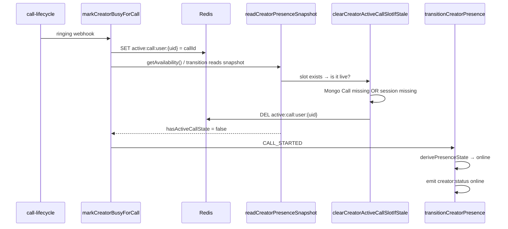

# Creator `on_call` Presence Fix — Implementation Changelog

> **Date:** 2026-06-13  
> **Problem:** Creators showed `online` instead of `on_call` during active video calls.  
> **Root cause:** Presence **reads** were destructively clearing `active:call:user:{firebaseUid}` before derivation completed, and `markCreatorBusyForCall` introduced a self-race between slot write and transition.  
> **Related doc:** [`docs/CREATOR_PRESENCE_ON_CALL_COMPLETE_GUIDE.md`](../../docs/CREATOR_PRESENCE_ON_CALL_COMPLETE_GUIDE.md)

---

## Table of contents

1. [Executive summary](#1-executive-summary)
2. [Symptom and diagnosis](#2-symptom-and-diagnosis)
3. [Files changed](#3-files-changed)
4. [Fix 1 — Read-only presence snapshot](#4-fix-1--read-only-presence-snapshot)
5. [Fix 2 — Remove SET → read → transition self-race](#5-fix-2--remove-set--read--transition-self-race)
6. [Fix 3 — Ringing grace window for slot liveness](#6-fix-3--ringing-grace-window-for-slot-liveness)
7. [Fix 4 — Unified derivation (single-read and batch)](#7-fix-4--unified-derivation-single-read-and-batch)
8. [Where slot cleanup still happens](#8-where-slot-cleanup-still-happens)
9. [Tests added/updated](#9-tests-addedupdated)
10. [Configuration](#10-configuration)
11. [Staging verification checklist](#11-staging-verification-checklist)
12. [Follow-up (not in this change)](#12-follow-up-not-in-this-change)

---

## 1. Executive summary

Effective creator presence (`online` | `on_call` | `offline`) is derived from:

```
derivePresenceState(baseAvailability, hasActiveCallSlot)
```

where `hasActiveCallSlot` is `Boolean(redis.get('active:call:user:{firebaseUid}'))`.

If creators always appeared `online` during calls, **`hasActiveCallSlot` was systematically `false`** at read/emit time — not a websocket or frontend bug.

This change set:

| Priority | Fix | Effect |
|----------|-----|--------|
| **P0** | Make `readCreatorPresenceSnapshot()` read-only | Stops presence reads from deleting slots |
| **P1** | Simplify `markCreatorBusyForCall` write sequence | `SET slot → transitionCreatorPresence(CALL_STARTED)` with no intermediate read |
| **P2** | Ringing grace in `isCreatorActiveCallSlotLive` | Pre-Mongo / pre-session slots treated as live |
| **P3** | `derivePresenceSnapshotFromRedisFields()` shared helper | Single-read and batch paths use identical pure derivation |

---

## 2. Symptom and diagnosis

### Observed behavior

- Creator availability toggle and base `online` worked.
- During ringing / accepted / connected calls, fans and creators often saw **`online`** instead of **`on_call`**.
- Issue reproduced without redeploy → systemic backend logic, not transport.

### Failure chain (before fix)



The read path was **both observer and mutator**, creating a race with async webhook + Mongo persistence ordering.

---

## 3. Files changed

| File | Change |
|------|--------|
| [`src/modules/availability/presence.service.ts`](../src/modules/availability/presence.service.ts) | Read-only snapshot; shared derivation helper; batch path unified |
| [`src/modules/video/creator-call-lock.service.ts`](../src/modules/video/creator-call-lock.service.ts) | Simplified `markCreatorBusyForCall` transition path |
| [`src/modules/availability/creator-active-call-slot.service.ts`](../src/modules/availability/creator-active-call-slot.service.ts) | Ringing grace; updated cleanup doc comment; test hooks |
| [`src/modules/availability/creator-active-call-slot.behavior.test.ts`](../src/modules/availability/creator-active-call-slot.behavior.test.ts) | New/updated behavioral tests |

---

## 4. Fix 1 — Read-only presence snapshot

**File:** `presence.service.ts`  
**Function:** `readCreatorPresenceSnapshot()`

### Before

Reads called stale-slot cleanup inline, mutating Redis during derivation:

```typescript
async function readCreatorPresenceSnapshot(firebaseUid: string): Promise<CreatorPresenceSnapshot> {
  const redis = getRedis();
  const [baseRaw, metaRaw, activeCallIdRaw] = await redis.mget(
    availabilityKey(firebaseUid),
    creatorPresenceMetaKey(firebaseUid),
    activeCallByUserKey(firebaseUid)
  );
  const base = parseBaseAvailability(baseRaw);
  const parsedMeta = parsePresenceMeta(metaRaw);
  const meta = parsedMeta.meta;
  let activeCallId = activeCallIdRaw;
  let hasActiveCallState = Boolean(activeCallId);
  if (hasActiveCallState && activeCallId) {
    const slotClear = await clearCreatorActiveCallSlotIfStale(firebaseUid, {
      source: 'presence.read_creator_presence_snapshot',
    });
    if (slotClear.cleared) {
      activeCallId = null;
      hasActiveCallState = false;
      recordCallMetric('presence.read_path_stale_slot_cleared', 1, {
        reason: slotClear.reason,
      });
    }
  }
  const updatedAt = meta?.updatedAt ?? Date.now();
  const source = deriveRecordSource(base, hasActiveCallState, sanitizePresenceSource(meta?.source || ONLINE_SOURCE));
  const version = meta?.version ?? syntheticFallbackVersion(updatedAt);
  // ... telemetry ...
  return {
    base,
    state: derivePresenceState(base, hasActiveCallState),
    updatedAt,
    source,
    version,
  };
}
```

**Problem:** Any consumer of `readCreatorPresenceState`, `getAvailability`, or `transitionCreatorPresence` (which reads snapshot first) could delete a freshly written slot if Mongo/billing lagged behind Redis.

### After

Reads are pure: MGET → derive → telemetry → return. No writes.

```typescript
/** Pure derivation from Redis fields — no writes or slot cleanup. */
function derivePresenceSnapshotFromRedisFields(
  baseRaw: string | null,
  metaRaw: string | null,
  activeCallIdRaw: string | null
): CreatorPresenceSnapshot {
  const base = parseBaseAvailability(baseRaw);
  const parsedMeta = parsePresenceMeta(metaRaw);
  const meta = parsedMeta.meta;
  const hasActiveCallState = Boolean(activeCallIdRaw);
  const updatedAt = meta?.updatedAt ?? Date.now();
  const source = deriveRecordSource(
    base,
    hasActiveCallState,
    sanitizePresenceSource(meta?.source || ONLINE_SOURCE)
  );
  const version = meta?.version ?? syntheticFallbackVersion(updatedAt);
  return {
    base,
    state: derivePresenceState(base, hasActiveCallState),
    updatedAt,
    source,
    version,
  };
}

function recordPresenceMetaReadTelemetry(/* ... */): void {
  // Metrics/logging only — no Redis mutations
}

async function readCreatorPresenceSnapshot(firebaseUid: string): Promise<CreatorPresenceSnapshot> {
  const redis = getRedis();
  const [baseRaw, metaRaw, activeCallIdRaw] = await redis.mget(
    availabilityKey(firebaseUid),
    creatorPresenceMetaKey(firebaseUid),
    activeCallByUserKey(firebaseUid)
  );
  const parsedMeta = parsePresenceMeta(metaRaw);
  const snapshot = derivePresenceSnapshotFromRedisFields(baseRaw, metaRaw, activeCallIdRaw);
  recordPresenceMetaReadTelemetry(firebaseUid, metaRaw, parsedMeta, snapshot.updatedAt);
  return snapshot;
}
```

### Architectural rule (post-fix)

| Operation | May mutate `active:call:user:*`? |
|-----------|----------------------------------|
| `readCreatorPresenceSnapshot` | **No** |
| `getBatchCreatorPresence` | **No** |
| `getAvailability` / `readCreatorPresenceState` | **No** |
| `transitionCreatorPresence` (specific events) | Yes — explicit reconcile |
| `finalizeCreatorAvailabilityForCall` | Yes |
| `clearCreatorActiveCallSlotIfStale` callers | Yes |

---

## 5. Fix 2 — Remove SET → read → transition self-race

**File:** `creator-call-lock.service.ts`  
**Function:** `markCreatorBusyForCall()`

### Before

After writing the slot, the code immediately read presence (triggering destructive cleanup in Fix 1's old read path) and could skip the transition entirely:

```typescript
await snapshotPreCallAvailability(callId, creatorFirebaseUid);
await redis.set(activeCallByUserKey(creatorFirebaseUid), callId, 'EX', PRECALL_SNAPSHOT_TTL_SECONDS);

const current = await getAvailability(creatorFirebaseUid);
if (
  shouldEnforceAvailabilityWrites() &&
  (featureFlags.creatorPresenceUserModelEnabled || current !== 'on_call')
) {
  await transitionCreatorPresence(
    getIO(),
    creatorFirebaseUid,
    'CALL_STARTED',
    `creator-call-lock.markCreatorBusyForCall:${phase}`
  );
  recordCallMetric('creator.busy.set', 1, { callId, phase });
}
```

**Problems:**

1. `getAvailability()` between SET and transition re-entered the read path that could clear the slot.
2. When `current === 'on_call'` and `CREATOR_PRESENCE_USER_MODEL_ENABLED !== 'true'`, transition was skipped — slot overwritten but no new `creator:status` broadcast.

### After

Direct write → transition. No intermediate read. No skip guard.

```typescript
await snapshotPreCallAvailability(callId, creatorFirebaseUid);
await redis.set(activeCallByUserKey(creatorFirebaseUid), callId, 'EX', PRECALL_SNAPSHOT_TTL_SECONDS);

if (shouldEnforceAvailabilityWrites()) {
  await transitionCreatorPresence(
    getIO(),
    creatorFirebaseUid,
    'CALL_STARTED',
    `creator-call-lock.markCreatorBusyForCall:${phase}`
  );
  recordCallMetric('creator.busy.set', 1, { callId, phase });
}
```

### Intended lifecycle sequence (post-fix)

```
ringing | accepted | session_started webhook
  → dedupe phase key (NX)
  → snapshotPreCallAvailability (NX precall key)
  → SET active:call:user:{firebaseUid}
  → transitionCreatorPresence(CALL_STARTED)
      → read snapshot (read-only)
      → derive on_call (slot exists)
      → write canonical Redis + emit creator:status on_call
  → Stream Chat busy: true (legacy)
```

---

## 6. Fix 3 — Ringing grace window for slot liveness

**File:** `creator-active-call-slot.service.ts`  
**Function:** `isCreatorActiveCallSlotLive()`

Used by `clearCreatorActiveCallSlotIfStale()` on **explicit** cleanup paths (not reads).

### Before

When billing session did not exist yet, liveness required a Mongo `Call` document. Missing row → not live → slot cleared:

```typescript
// Ringing may set the active-call slot before the billing session key exists.
try {
  const call = await Call.findOne({ callId: slotCallId }).select('status isSettled').lean();
  if (!call) {
    return false;  // ← too strict for async webhook + Mongo ordering
  }
  if (call.status === 'ringing' || call.status === 'accepted') {
    return true;
  }
  return call.isSettled !== true;
} catch {
  return true;
}
```

### After

New constants and precall key helper:

```typescript
const PRECALL_SNAPSHOT_PREFIX = 'call:precall:availability:';
const ACTIVE_CALL_SLOT_TTL_SECONDS = 60 * 60 * 2; // 2 hours — matches slot TTL
const RINGING_SLOT_GRACE_SECONDS = Math.min(
  300,
  Math.max(30, parseInt(process.env.RINGING_SLOT_GRACE_SECONDS || '120', 10) || 120)
);

const precallSnapshotKey = (callId: string, creatorFirebaseUid: string): string =>
  `${PRECALL_SNAPSHOT_PREFIX}${callId}:${creatorFirebaseUid}`;
```

Ringing / pre-session fallback logic:

```typescript
const call = resolveCallRecordForTests
  ? await resolveCallRecordForTests(slotCallId)
  : await Call.findOne({ callId: slotCallId }).select('status isSettled').lean();

if (!call) {
  // 1. Precall snapshot written by markCreatorBusyForCall before slot SET
  const precallExists = await redis
    .get(precallSnapshotKey(slotCallId, creatorFirebaseUid))
    .catch(() => null);
  if (precallExists) {
    return true;
  }
  // 2. Fresh slot TTL — Mongo/Stream may lag Redis
  const slotKey = activeCallByUserKey(creatorFirebaseUid);
  const ttl = await redis.ttl(slotKey).catch(() => -2);
  if (ttl > 0 && ttl >= ACTIVE_CALL_SLOT_TTL_SECONDS - RINGING_SLOT_GRACE_SECONDS) {
    return true;
  }
  return false;
}
```

### Grace decision table

| Condition | Slot live? |
|-----------|------------|
| Terminal tombstone on session | No |
| Billing session ACTIVE and UID matches | Yes |
| Mongo `Call.status` is `ringing` or `accepted` | Yes |
| Mongo `Call` missing, precall snapshot exists | **Yes** (new) |
| Mongo `Call` missing, slot TTL within grace window | **Yes** (new) |
| Mongo `Call` missing, old slot, no precall | No |
| Mongo lookup throws | Yes (fail-safe) |

### Doc comment update

```diff
- * Used at call end, presence transitions, admin reset-presence, and read-path self-heal.
+ * Used at call end, presence transitions, admin reset-presence, and reconciliation.
```

---

## 7. Fix 4 — Unified derivation (single-read and batch)

**File:** `presence.service.ts`  
**Functions:** `readCreatorPresenceSnapshot()`, `getBatchCreatorPresence()`

### Before — divergent paths

| Path | Stale slot cleanup on read? | Derivation |
|------|----------------------------|------------|
| `readCreatorPresenceSnapshot` | **Yes** (bug) | Inline duplicate logic |
| `getBatchCreatorPresence` | No | Separate inline logic |

This caused potential inconsistency: batch `availability:get` could return `on_call` while a single read + transition had already deleted the slot and emitted `online`.

### Before — batch loop (abbreviated)

```typescript
validFirebaseUids.forEach((id, idx) => {
  const base = parseBaseAvailability(baseVals[idx]);
  const hasActiveCallState = Boolean(activeCallVals[idx]);
  const derivedSource = deriveRecordSource(base, hasActiveCallState, /* ... */);
  result[id] = {
    state: derivePresenceState(base, hasActiveCallState),
    updatedAt,
    source: derivedSource,
    version: meta?.version ?? syntheticFallbackVersion(updatedAt),
  };
});
```

### After — both paths call the same pure helper

```typescript
const snapshot = derivePresenceSnapshotFromRedisFields(
  baseRaw,
  metaVals[idx],
  activeCallVals[idx]
);
result[id] = {
  state: snapshot.state,
  updatedAt: snapshot.updatedAt,
  source: snapshot.source,
  version: snapshot.version,
};
```

**Invariant:** One derivation function, zero side effects, identical semantics for socket emit, REST feed hydration, and `availability:batch:v2`.

---

## 8. Where slot cleanup still happens

Slot deletion is **intentional** only on these paths:

### `transitionCreatorPresence` — reconcile on specific events

```typescript
const shouldReconcileActiveCallSlot =
  eventType === 'CALL_ENDED' ||
  eventType === 'DISCONNECTED' ||
  eventType === 'FORCE_OFFLINE' ||
  eventType === 'RECONCILED' ||
  eventType === 'CONNECTED';

if (shouldReconcileActiveCallSlot) {
  await clearCreatorActiveCallSlotIfStale(firebaseUid, {
    source: safeSource,
    force: eventType === 'FORCE_OFFLINE',
  });
}
```

Note: `CALL_STARTED` does **not** reconcile/clear — it preserves the slot just written.

### Other explicit callers

| Caller | When |
|--------|------|
| `finalizeCreatorAvailabilityForCall` | Call end — clears slot when `endingCallId` matches |
| `restoreCreatorPresenceForEndedCall` | Deferred finalization repair |
| Admin `resetCreatorPresence` | Force clear |
| Billing runtime resolver | Stale slot without live session |
| Call reconciliation worker | Drift repair |
| Overlap rejection handler | Stale conflict slot cleanup |

Orphan slots that persist after crashes should be handled by **reconciliation / watchdog jobs**, not presence reads.

---

## 9. Tests added/updated

**File:** `creator-active-call-slot.behavior.test.ts`

### Updated: explicit cleanup vs read-only read

**Before:** Single test implied read path clears orphan slots.

**After:** Split into two tests:

```typescript
// Read path must NOT delete
test('behavioral: read path is read-only and does not clear orphan active-call slot', async () => {
  // ... set slot ...
  const state = await readCreatorPresenceState(creatorFirebaseUid);
  assert.equal(state.state, 'on_call');
  const slot = await redis.get(activeCallByUserKey(creatorFirebaseUid));
  assert.equal(slot, staleCallId);
});

// Explicit cleanup still works
test('behavioral: explicit stale cleanup still clears orphan active-call slot', async () => {
  const cleared = await clearCreatorActiveCallSlotIfStale(creatorFirebaseUid, { source: 'test.stale_slot' });
  assert.equal(cleared.cleared, true);
  const state = await readCreatorPresenceState(creatorFirebaseUid);
  assert.equal(state.state, 'online');
});
```

### New: ringing grace tests

```typescript
test('behavioral: ringing slot is live when precall snapshot exists without Mongo call', ...);
test('behavioral: fresh ringing slot is live via TTL grace when Mongo call is missing', ...);
```

### Test infrastructure

- `InMemoryRedis` extended with `set(..., 'EX', ttl)`, `ttl()`, and expiry tracking
- `setResolveCallRecordForTests()` — avoids Mongo dependency in unit tests

**Run:**

```bash
cd backend
npx tsx --test src/modules/availability/creator-active-call-slot.behavior.test.ts
```

All 10 behavioral tests pass.

---

## 10. Configuration

| Variable | Default | Purpose |
|----------|---------|---------|
| `RINGING_SLOT_GRACE_SECONDS` | `120` | Max age of slot without Mongo row still treated as live (clamped 30–300) |
| `PRESENCE_SLOT_SWEEP_MIN_AGE_SECONDS` | `RINGING_SLOT_GRACE_SECONDS + 60` | Min slot age before reconciliation sweep may clear orphans |
| `CALL_RECONCILIATION_INTERVAL_MS` | `300000` | Sweep frequency (5 min) |
| `PRESENCE_STARTUP_REPAIR_ENABLED` | `true` | Cold-start slot repair on boot |
| `CREATOR_AVAILABILITY_ORCHESTRATOR_MODE` | `enforce` | If `log_only`, slot SET still runs but `transitionCreatorPresence` is skipped |
| `CREATOR_PRESENCE_USER_MODEL_ENABLED` | `false` | No longer gates `markCreatorBusyForCall` transition (removed skip guard) |

Active-call slot TTL remains **7200s (2h)** via `PRECALL_SNAPSHOT_TTL_SECONDS` in `creator-call-lock.service.ts`.

---

## 11. Staging verification checklist

During an active call for creator `{firebaseUid}`:

### Redis

```bash
redis-cli GET "active:call:user:{firebaseUid}"
redis-cli TTL "active:call:user:{firebaseUid}"
redis-cli GET "call:precall:availability:{callId}:{firebaseUid}"
```

Expected during ringing/connected call:

- Slot key **exists** with `callId` value
- TTL positive (refreshed on billing session start)
- Precall snapshot present from first `markCreatorBusyForCall` phase

### Logs (should appear)

```
Marking creator busy (call ringing)
Creator marked busy for call lifecycle phase
creator_presence_transition_eval { derivedState: 'on_call', activeCallExists: true }
creator_status_change { from: 'online', to: 'on_call' }
```

### Logs (should NOT appear on normal reads)

```
presence.read_path_stale_slot_cleared   ← metric removed from read path
Cleared stale creator active call slot    ← only on explicit cleanup paths
```

### Socket payload

`creator:status` during call:

```json
{
  "creatorId": "{firebaseUid}",
  "status": "on_call",
  "version": 123,
  "updatedAt": 1710000000000,
  "source": "creator-call-lock.markCreatorBusyForCall:ringing.active_call"
}
```

---

## 12. Orphan slot risk and mandatory reconciliation sweep

Removing read-path cleanup shifts orphan handling to **explicit writers only**. Without periodic sweep, crash orphans could leave creators stuck `on_call` until slot/precall TTL expiry (up to 2 hours).

### Risk matrix (post read-only fix)

| Failure | Without sweep | With sweep |
|---------|---------------|------------|
| Crash during active call | Slot may persist → ghost `on_call` | Cleared after age threshold + durable validation |
| Redis slot survives lost finalize | Callable blocked | `reconciliation.sweep` clears + `RECONCILED` transition |
| Billing recovery incomplete | Ghost busy creator | Billing session check in liveness + sweep |

### Reconciliation sweep (production-required)

The periodic call reconciliation job (`startCallReconciliationJob`, default **every 5 minutes**) already runs `cleanupOrphanActiveCallSlots()`. This was upgraded to use **`clearActiveCallSlotForReconciliationSweep`** with source `reconciliation.sweep`:

```typescript
// call-reconciliation.ts — first step of every reconcile pass
await cleanupOrphanActiveCallSlots();
```

Sweep algorithm:

1. **SCAN** `active:call:user:*`
2. **Skip** if slot age `< PRESENCE_SLOT_SWEEP_MIN_AGE_SECONDS` (default `RINGING_SLOT_GRACE_SECONDS + 60` ≈ 180s)
3. **Durable liveness** via `isCreatorActiveCallSlotLive(..., 'reconciliation_sweep')`:
   - Billing session ACTIVE → keep
   - Mongo `ringing` / `accepted` → keep
   - **No ringing grace** (precall snapshot / TTL grace bypassed in sweep context)
4. **Clear** orphan slot + `transitionCreatorPresence(RECONCILED)` if effective state was `on_call`

Startup repair (`repairStaleActiveCallSlotsOnStartup`) remains a cold-start safety net.

### Design bias: optimistic lifecycle ownership

The patch intentionally shifted from pessimistic read-time validation to:

```
SET slot → transitionCreatorPresence(CALL_STARTED) → derive on_call → emit
```

**False-positive `on_call` briefly** is acceptable; **false-negative `online` during a live call** is not (double-call collisions, callable mid-session).

Ringing grace exists because Stream webhooks, Mongo writes, session creation, and Redis writes are **eventually consistent** — not synchronously ordered.

---

## 13. Observability and metrics

### Early-warning: slot without Mongo call

Incremented when a slot exists, Mongo `Call` row is missing, and ringing grace fallback is used:

| Metric | Tags | When |
|--------|------|------|
| `call.presence_slot_without_mongo_call_total` | `reason: precall_snapshot \| ttl_grace` | Grace fallback in `isCreatorActiveCallSlotLive` |
| `call.presence_slot_without_mongo_call_age_seconds` | `reason: ...` | Histogram-style age sample at grace time |

**Use:** Early warning for webhook lag, Mongo persistence slowness, Stream ordering regressions — before user-visible `online`-during-call reports.

### Reconciliation sweep metrics

| Metric | Purpose |
|--------|---------|
| `call.presence.reconciliation_sweep_scan` | Slots scanned per pass |
| `call.presence.reconciliation_sweep_skipped_grace` | Slots still within grace window |
| `call.presence.reconciliation_sweep_skipped_grace_total` | Aggregate skipped per pass |
| `call.presence.reconciliation_sweep_skipped_live` | Durable validation says still live |
| `call.presence.reconciliation_sweep_cleared` | Orphans cleared |
| `call.presence.stale_active_call_slot_cleared` | All clears (tag `reason: reconciliation_sweep_orphan`) |

### Tuning grace from data (recommended)

`RINGING_SLOT_GRACE_SECONDS=120` is safe for staging. For production, derive the window from observed distributions:

- P50/P95 of `presence_slot_without_mongo_call_age_seconds` where Mongo eventually appears
- Webhook → Mongo persistence latency
- Alert if `presence_slot_without_mongo_call_total` rate rises while `creator_status_change { to: on_call }` rate falls

---

## Quick reference — before vs after behavior
