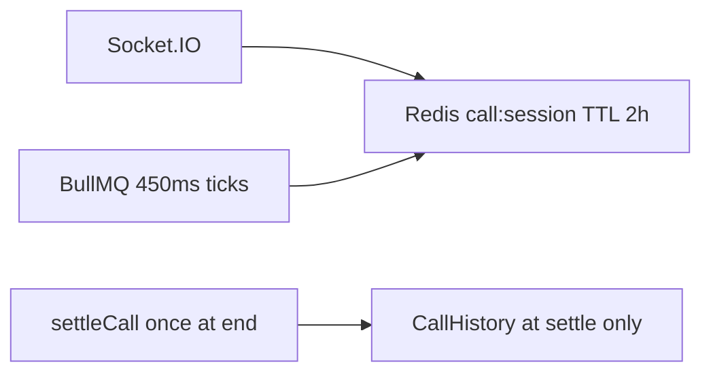
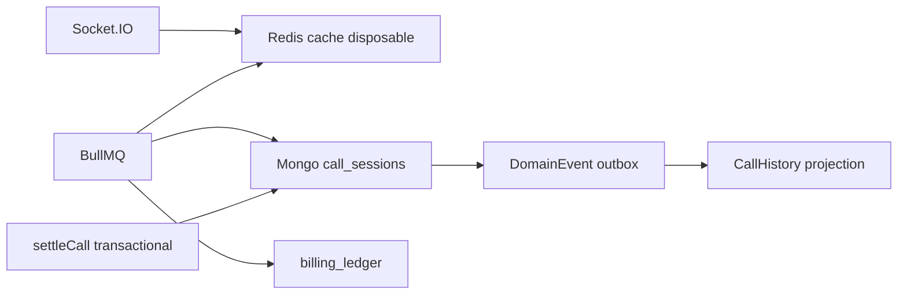

# Durable Call Session & Billing Resilience — Implementation Changelog

**Document version:** 1.1  
**Date:** 2026-06-12  
**Status:** **Implementation complete** (all phases A→D coded; flags off by default)  
**Scope:** Phased migration (A→B→C→D) from Redis/in-memory call authority to Mongo-authoritative `call_sessions`  
**Related plan:** Durable Call Session & Billing Resilience Plan (Cursor plan, not edited by this doc)

> All new behavior is **feature-flagged and off by default**. Existing production behavior is unchanged until flags are enabled per phase.

---

## Table of contents

1. [Executive summary](#1-executive-summary)
2. [Architecture before vs after](#2-architecture-before-vs-after)
3. [New files](#3-new-files)
4. [Phase A — Stop money loss](#4-phase-a--stop-money-loss)
5. [Phase B — Ownership safety](#5-phase-b--ownership-safety)
6. [Phase C — Financial durability](#6-phase-c--financial-durability)
7. [Phase D — Outbox projections](#7-phase-d--outbox-projections)
8. [Frontend changes](#8-frontend-changes)
9. [Ops, metrics, and rollout](#9-ops-metrics-and-rollout)
10. [File index](#10-file-index)
11. [Completion pass — gaps closed (v1.1)](#11-completion-pass--gaps-closed-v11)

---

## 1. Executive summary

| Problem (before) | Fix (after) |
|------------------|-------------|
| Active call state lived in Redis (2h TTL) + in-memory socket state | Mongo `call_sessions` collection is durable authority when `DURABLE_CALL_SESSION_ENABLED=true` |
| Duplicate settlement possible under concurrent finalize | Mongo optimistic claim on `CallSession` + existing Redis locks |
| `Call.isSettled = true` before wallet txn completed | `isSettled` set only after `finalizeCallSession` returns `settled` or `duplicate` |
| Recents missing until settlement succeeded | Pending `CallHistory` rows on `→ ending` with `settlementStatus: 'pending'` |
| ECS SIGTERM killed process with no drain | `/ready` → 503, admission freeze, Redis→Mongo flush |
| Reconnect could apply stale `call:ended` | `reconnectGeneration` + gateway suppression (Phase B) |
| Whole-call billing lost on container death | Append-only `billing_ledger` + 5s persist (Phase C) |
| Side effects inline in settlement txn | Outbox + `call-history-projector` (Phase D) |

**Completion (v1.1):** All planned gaps closed — critical-transition flush on every lifecycle edge, ledger-authoritative settlement, Redis recovery gate, async outbox worker, failed-settlement projection, metrics dashboard block, and contract tests verified. Roll out **A → 24h → B → 24h → C → 7d alert-only watchdog → D** per [`CANARY_MONITORING_RUNBOOK.md`](../../docs/CANARY_MONITORING_RUNBOOK.md).

---

## 2. Architecture before vs after

### Before



- **In-call authority:** Redis JSON `call:session:{callId}`
- **Financial writes:** Single Mongo transaction at `settleCall`
- **Recents:** `CallHistory` written only inside settlement transaction
- **Recovery:** Redis → optional `CallBillingCheckpoint` → missing

### After (flags enabled progressively)



- **In-call authority:** Mongo `call_sessions` (Redis is performance cache only)
- **Periodic persist:** Non-transactional ledger append + session mirror (Phase C)
- **Finalize:** Transactional wallet write once at end
- **Recents:** Pending on `ending`; settled on `settled` (Phase A direct or Phase D outbox)

---

## 3. New files

| File | Phase | Purpose |
|------|-------|---------|
| [`call-session.model.ts`](../src/modules/billing/call-session.model.ts) | A | Mongo schema `call_sessions` |
| [`call-session.service.ts`](../src/modules/billing/call-session.service.ts) | A/B | Create, mirror, claim, lease, reconnect |
| [`billing-shutdown.service.ts`](../src/modules/billing/billing-shutdown.service.ts) | A | SIGTERM admission freeze + flush |
| [`call-history-pending.service.ts`](../src/modules/billing/call-history-pending.service.ts) | A | Interim pending recents upsert |
| [`billing-phase-flags.ts`](../src/modules/billing/billing-phase-flags.ts) | All | Env flag helpers |
| [`billing-phase-metrics.ts`](../src/modules/billing/billing-phase-metrics.ts) | All | Canary metric recorders |
| [`billing-ledger.model.ts`](../src/modules/billing/billing-ledger.model.ts) | C | Append-only ledger |
| [`billing-persist.service.ts`](../src/modules/billing/billing-persist.service.ts) | C | 5s persist + critical flush |
| [`billing-call-session-reconciliation.ts`](../src/modules/billing/billing-call-session-reconciliation.ts) | C | Drift reconciliation |
| [`call-history-projector.service.ts`](../src/modules/billing/call-history-projector.service.ts) | D | Outbox → CallHistory |
| [`billing-recovery-gate.service.ts`](../src/modules/billing/billing-recovery-gate.service.ts) | B | Redis-backed recovery debounce/in-flight gate |
| [`billing-domain-event-handlers.ts`](../src/modules/events/billing-domain-event-handlers.ts) | D | Async `call.billing.*` domain event handlers |

---

## 4. Phase A — Stop money loss

**Flag:** `DURABLE_CALL_SESSION_ENABLED=true`

### A1 — Durable CallSession model

**Before:** No Mongo model for in-flight billing. Only:

- Redis `call:session:{callId}` (interface in `billing.service.ts`)
- Optional `CallBillingCheckpoint` (recovery snapshot, not authority)
- `Call` model for Stream lifecycle (`ringing`, `ended`, etc.)

**After:** New collection `call_sessions`:

```typescript
// call-session.model.ts (new)
{
  _id: callId,                    // Stream call ID
  state: 'active' | 'reconnecting' | 'ending' | 'settling' | 'settled' | 'failed_settlement',
  callerId, creatorId,
  totalUserDebitedMicros, totalCreatorCreditedMicros,
  settlementVersion, finalized,
  finalizationOwnerId, finalizationStartedAt, finalizationReason,
  serverStartedAt, lastServerAccrualAt, lastBillingAt,
  // Phase B fields present in schema but inactive until BILLING_OWNERSHIP_V2_ENABLED
  leaseOwnerId, leaseExpiresAt, fencingToken, reconnectGeneration,
}
```

Billing lifecycle is **separate** from `Call.status` (signaling). A call can be `Call.status = ended` while `CallSession.state = settling`.

---

### A2 — Dual-write at call start + periodic mirror

**Before** (`billing.service.ts` — start only wrote Redis):

```typescript
await redis.multi()
  .setex(callSessionKey(callId), CALL_SESSION_TTL, JSON.stringify(earlySession))
  .setex(callUserIntroMicrosKey(callId), CALL_SESSION_TTL, '0')
  // ...
  .exec();
// No Mongo write
```

**After** (after session promoted to ACTIVE):

```typescript
if (isDurableCallSessionEnabled()) {
  const creatorUser = await User.findOne({ firebaseUid: creatorFirebaseUid }).select('_id').lean();
  await createDurableCallSessionAtStart({
    callId,
    callerId: session.userMongoId,
    creatorId: creatorUser?._id?.toString() || session.creatorMongoId,
    callerFirebaseUid: userFirebaseUid,
    creatorFirebaseUid,
    pricePerMinute: session.pricePerMinute,
    pricePerSecondMicros: session.pricePerSecondMicros,
    creatorShareAtCallTime: session.creatorShareAtCallTime,
  });
  await flushMirrorRedisSessionToDurable(callId, session);
}
```

**Periodic mirror** (every `CALL_SESSION_MIRROR_INTERVAL_MS`, default 5s) on billing tick:

```typescript
// billing.service.ts — after Redis tick persist
void maybeMirrorRedisSessionToDurable(callId, session).catch(() => {});
```

**Recovery order** updated in `billing-runtime-resolver.service.ts`:

1. Redis (if present)
2. **Mongo `call_sessions`** → rebuild Redis (new)
3. Legacy `CallBillingCheckpoint` (fallback)

---

### A3 — Idempotent finalize gate (Mongo)

**Before** (`billing-session-finalization.service.ts`):

```typescript
async function markCallSettling(...): Promise<number> {
  const version = 1;  // hardcoded
  await Call.findOneAndUpdate(
    { callId, 'settlement.status': { $ne: 'settled' } },
    { $set: { 'settlement.status': 'settling', 'settlement.version': version, ... } }
  );
  return version;
}

// In finalizeCallSession:
settlementVersion = await markCallSettling(callId, source, reason, ownerToken, ownerInstanceId);
```

**After:**

```typescript
// call-session.service.ts
export async function claimDurableCallSessionForSettlement(params): Promise<ClaimSettlementResult> {
  const result = await DurableCallSession.findOneAndUpdate(
    {
      _id: params.callId,
      finalized: false,
      state: { $in: ['active', 'reconnecting', 'ending'] },
    },
    {
      $set: {
        state: 'settling',
        finalizationReason: mapSettlementReasonToFinalization(params.reason, params.source),
        finalizationOwnerId: getBillingInstanceId(),
        finalizationStartedAt: new Date(),
      },
      $inc: { settlementVersion: 1 },
    },
    { new: true }
  );
  if (!result) return { ok: false, reason: 'already_finalized' /* or claim_lost */ };
  return { ok: true, settlementVersion: result.settlementVersion };
}

// billing-session-finalization.service.ts
if (isDurableCallSessionEnabled()) {
  const claim = await claimDurableCallSessionForSettlement({ callId, reason, source });
  if (!claim.ok) {
    if (claim.reason === 'already_finalized') {
      recordFinalizeDuplicatePrevented(callId, source);
      return { status: 'duplicate', callId };
    }
    return { status: 'pending_retry', callId };
  }
  settlementVersion = claim.settlementVersion;
} else {
  settlementVersion = await markCallSettling(...);  // legacy path
}
```

Redis locks (`settlement:claim:`, `settle:lock:`, `finalize:inflight:`) remain as fast-path contention reducers; **Mongo gate is source of truth** when flag is on.

---

### A4 — `isAlreadySettled` respects pending recents

**Before:**

```typescript
async function isAlreadySettled(callId: string): Promise<boolean> {
  if (await redis.get(settledCallKey(callId))) return true;
  const history = await CallHistory.findOne({ callId, ownerRole: 'user' }).lean();
  if (history) return true;  // BUG: pending row blocked settlement
  const call = await Call.findOne({ callId }).select('settlement.status').lean();
  return call?.settlement?.status === 'settled';
}
```

**After:**

```typescript
async function isAlreadySettled(callId: string): Promise<boolean> {
  if (await redis.get(settledCallKey(callId))) return true;
  if (await isDurableCallSessionFinalized(callId)) return true;
  const history = await CallHistory.findOne({ callId, ownerRole: 'user' })
    .select('settlementStatus settledAt coinsDeducted').lean();
  if (history) {
    if (history.settlementStatus === 'settled' || history.settledAt) return true;
    if (history.settlementStatus !== 'pending' && (history.coinsDeducted ?? 0) > 0) return true;
  }
  const call = await Call.findOne({ callId }).select('settlement.status').lean();
  return call?.settlement?.status === 'settled';
}
```

Same pattern applied in `billing-settlement.service.ts` for `existingUserHistory` short-circuit.

---

### A5 — `Call.isSettled` ordering fix

**Before** (`call-finalization.service.ts`):

```typescript
if (!call.isSettled) {
  call.isSettled = true;  // BEFORE settlement
}
await finalizeCallSession(io, { callId, reason: 'explicit_end', source: settlementSource });
await call.save();
```

**After:**

```typescript
await flushBillingPersistForCallId(callId, 'call_end').catch(() => {});
await markDurableCallSessionEnding(callId);
// ... pending CallHistory upsert (see A6) ...

const finalizeResult = await finalizeCallSession(io, { callId, reason: 'explicit_end', source: settlementSource });
if (finalizeResult && typeof finalizeResult === 'object' && 'status' in finalizeResult) {
  const status = (finalizeResult as { status: string }).status;
  if (status === 'settled' || status === 'duplicate') {
    call.isSettled = true;  // AFTER settlement succeeds
  }
}
await call.save();
```

---

### A6 — Pending recents before settlement

**Before:** `CallHistory` written only inside `settleCall` Mongo transaction at end of call. If settlement failed or was delayed, recents tab was empty.

**After:** On transition to `ending`, upsert pending rows:

```typescript
// call-history-pending.service.ts (new)
await CallHistory.findOneAndUpdate(
  { callId, ownerUserId: userMongoId },
  {
    callId,
    ownerUserId: userMongoId,
    // ... party metadata ...
    durationSeconds,
    settlementStatus: 'pending',
    coinsDeducted: 0,
    coinsEarned: 0,
  },
  { upsert: true, new: true }
);
```

`CallHistory` model gained field:

```typescript
// call-history.model.ts
settlementStatus?: 'pending' | 'settled' | 'failed';
```

Settlement update sets `settlementStatus: 'settled'`:

```typescript
// billing-settlement.service.ts
await CallHistory.findOneAndUpdate(
  { callId, ownerUserId: session.userMongoId },
  {
    // ...
    settlementStatus: 'settled',
    coinsDeducted: totalDeducted,
    settledAt,
  },
  { upsert: true, session: dbSession }
);
```

---

### A7 — SIGTERM drain + admission freeze

**Before** (`bootstrap-shutdown.ts`):

```typescript
async function runRoleShutdown(): Promise<void> {
  if (shuttingDown) return;
  shuttingDown = true;
  // immediately close HTTP / Socket.IO — no drain signal
  if (runsHttpApi()) {
    await closeHttpServer(SHUTDOWN_HTTP_MS);
    await closeSocketIo();
  }
  // ...
}
```

**After:**

```typescript
// billing-shutdown.service.ts (new)
export function isShuttingDown(): boolean { return shuttingDown; }
export function assertNotShuttingDown(operation: string): void {
  if (shuttingDown) throw new ShutdownAdmissionRejectedError(operation);
}

// bootstrap-shutdown.ts
async function runRoleShutdown(): Promise<void> {
  markShuttingDown();
  shuttingDown = true;
  await flushOwnedSessionsToMongoOnShutdown().catch(() => {});  // mirror or ledger flush (Phase C)
  if (runsHttpApi()) {
    await closeHttpServer(SHUTDOWN_HTTP_MS);
    await closeSocketIo();  // now with SOCKETIO_CLOSE_MS timeout
  }
}
```

When `INCREMENTAL_BILLING_PERSIST_ENABLED=true`, shutdown calls `flushBillingPersistForCallId(callId, 'deployment_shutdown')` per owned session instead of mirror-only.

**Health check** (`health-routes.ts`):

```typescript
// Before: /ready only checked Mongo + Redis
// After:
if (isShuttingDown()) {
  checks.shutdown = { ok: false, error: 'draining' };
}
// → 503 while draining
```

**Admission guards** on:

- `call:started` (socket)
- `billing:recover-state` (socket)
- `call:ended` (socket)
- `handleCallStarted` (HTTP)
- `ensureRuntimeOwnership` (billing worker)

```typescript
// billing-socket.gateway.ts
assertNotShuttingDown('call:started');
// On reject → billing:error SERVER_DRAINING
```

---

## 5. Phase B — Ownership safety

**Flag:** `BILLING_OWNERSHIP_V2_ENABLED=true` (requires Phase A)

### B1 — Reconnect generation

**Before:** `runtimeEpoch` in Redis session only; no socket-scoped generation; process-local `recoveryGateByUid` Map.

**After:**

```typescript
// call-session.service.ts
export async function bumpReconnectGeneration(callId: string): Promise<number | null> {
  const inc = { reconnectGeneration: 1 };
  if (isBillingOwnershipV2Enabled()) inc.fencingToken = 1;
  const doc = await DurableCallSession.findOneAndUpdate(
    { _id: callId, finalized: false },
    { $inc: inc, $set: { state: 'reconnecting' } },
    { new: true }
  );
  return doc?.reconnectGeneration ?? null;
}

// billing-socket.gateway.ts — on successful billing:recover-state
const newGeneration = callId ? await bumpReconnectGeneration(callId) : null;
await flushBillingPersist(callId, session, 'reconnect');
```

**Stale `call:ended` suppression:**

```typescript
// billing-socket.gateway.ts
if (durable && data.reconnectGeneration != null &&
    data.reconnectGeneration < (durable.reconnectGeneration ?? 0)) {
  recordReconnectGenerationMismatch(data.callId);
  return;  // ignore stale event
}
```

### B2 — Persist guard (fencing + lease)

**Before:** Any worker could write Redis/Mongo session totals.

**After:**

```typescript
// call-session.service.ts — mirrorRedisSessionToDurableCallSession
const filter = {
  _id: callId,
  finalized: false,
  reconnectGeneration: guard.reconnectGeneration,
  fencingToken: guard.fencingToken,
  leaseOwnerId: guard.instanceId,
};
const result = await DurableCallSession.updateOne(filter, { $set: update });
if (result.matchedCount === 0) {
  recordStaleFencingReject(callId, 'mirror_guard_mismatch');
  return false;
}
```

Takeover only when lease expired:

```typescript
await DurableCallSession.findOneAndUpdate(
  { _id: callId, finalized: false, leaseExpiresAt: { $lt: new Date() } },
  {
    $set: { leaseOwnerId: newOwnerId, leaseExpiresAt: ... },
    $inc: { fencingToken: 1 },
  }
);
```

### B3 — Redis recovery gate (cross-instance debounce)

**Before** (`billing-socket.gateway.ts` — process-local, lost on multi-instance):

```typescript
type RecoveryGate = { inFlight: boolean; lastRecoveryAtMs: number };
const recoveryGateByUid = new Map<string, RecoveryGate>();

function getRecoveryGate(firebaseUid: string): RecoveryGate { /* ... */ }

// billing:recover-state handler
if (recoveryGate.inFlight) return;
if (now - recoveryGate.lastRecoveryAtMs < RECOVERY_DEBOUNCE_MS) return;
recoveryGate.inFlight = true;
recoveryGate.lastRecoveryAtMs = now;
try { /* recover */ } finally { recoveryGate.inFlight = false; }
```

**After** — Redis keys `billing:recovery:gate:{uid}` + `billing:recovery:gate:{uid}:inflight` via [`billing-recovery-gate.service.ts`](../src/modules/billing/billing-recovery-gate.service.ts):

```typescript
// redis.ts
export const billingRecoveryGateKey = (firebaseUid: string): string =>
  `${BILLING_RECOVERY_GATE_PREFIX}${firebaseUid}`;
export const billingRecoveryGateInflightKey = (firebaseUid: string): string =>
  `${BILLING_RECOVERY_GATE_PREFIX}${firebaseUid}:inflight`;

// billing-socket.gateway.ts
const gateStatus = await tryAcquireRecoveryGate(firebaseUid, RECOVERY_DEBOUNCE_MS);
if (gateStatus === 'in_flight' || gateStatus === 'debounce') { /* suppress + emit snapshot */ return; }
try { /* recover */ } finally { await releaseRecoveryGate(firebaseUid); }
```

See [§11.3](#113-phase-b--redis-recovery-gate).

## 6. Phase C — Financial durability

**Flag:** `INCREMENTAL_BILLING_PERSIST_ENABLED=true`

### C1 — Accrual cadence 450ms → 1s

**Before** (`billing.constants.ts`):

```typescript
const DEFAULT_BILLING_PROCESS_INTERVAL_MS = 450;
```

**After:**

```typescript
/** Phase C default: 1s */
const DEFAULT_BILLING_PROCESS_INTERVAL_MS = 1000;
```

Override via `BILLING_PROCESS_INTERVAL_MS` env.

### C2 — Append-only BillingLedger (non-transactional persist)

**Before:** All coin debits/credits at `settleCall` only. No per-tick Mongo financial rows.

**After:** Every 5s (or critical flush), append ledger row **without** updating `User.coins`:

```typescript
// billing-persist.service.ts
await BillingLedger.create({
  callId,
  tickNumber,
  accrualStartAt,
  accrualEndAt,
  billedDurationMs,
  userDebitMicros,      // delta since last tick
  creatorCreditMicros,
  sourceInstanceId,
  reconnectGeneration,
  fencingToken,
  flushReason: 'periodic' | 'call_end' | 'reconnect' | ...,
  idempotencyKey: `call_${callId}_tick_${tickNumber}`,
});

// Separate non-transactional CallSession update
await DurableCallSession.updateOne(
  { _id: callId, finalized: false },
  { $set: { totalUserDebitedMicros, lastBillingAt, lastPersistedTickNumber: tickNumber, ... } }
);
```

**Gap tolerance:** consecutive windows may drift ≤ `BILLING_LEDGER_GAP_TOLERANCE_MS` (default 2000ms). Overlaps always alert.

**Critical-transition flush** (same code path via `flushBillingPersistForCallId`, skips interval gate):

| Trigger | `flushReason` | Wired in |
|---------|---------------|----------|
| `finalizeCallEnd` | `call_end` | `call-finalization.service.ts` |
| Socket disconnect (user) | `disconnect` | `billing-socket.gateway.ts` |
| Socket disconnect (creator) | `creator_disconnect` | `billing-socket.gateway.ts` |
| `billing:recover-state` | `reconnect` | `billing-socket.gateway.ts` |
| SIGTERM drain | `deployment_shutdown` | `billing-shutdown.service.ts` (Phase C ledger path) |
| Insufficient balance tick | `insufficient_balance` | `billing.service.ts` → before `forceTerminateCall` |

See [§11.1](#111-critical-transition-flush) for before/after code.

Wallet writes remain **transactional only at finalize** in `settleCall`.

### C5 — Ledger-authoritative settlement (Phase C finalize)

When `INCREMENTAL_BILLING_PERSIST_ENABLED=true`, `settleCall` flushes a final `call_end` tick and uses `sumLedgerForCall()` as authoritative totals (with Redis fallback on error). See [§11.2](#112-phase-c--ledger-aware-settlement).

### C3 — Watchdog alert-only by default

**Before:** Watchdog could call `finalizeCallSession` on stalled SETTLING/RECOVERING sessions immediately.

**After:**

```typescript
// billing-watchdog.service.ts
recordWatchdogAlert(callId, 'stalled_settling');
if (!isWatchdogAutoFinalizeEnabled()) {
  continue;  // alert only — manual inspect
}
await finalizeCallSession(io, { callId, reason: 'timeout', source: 'reconciliation_worker' });
```

Also scans Mongo for stale `call_sessions` when `DURABLE_CALL_SESSION_ENABLED=true`.

**Enable auto-finalize only after 7d stable alerts:**

```env
BILLING_WATCHDOG_AUTO_FINALIZE_ENABLED=true
```

### C4 — Reconciliation drift job

**New:** `billing-call-session-reconciliation.ts` hooked into existing reconciliation job:

```typescript
// billing-reconciliation.ts
const { runCallSessionReconciliationPass } = await import('./billing-call-session-reconciliation');
await runCallSessionReconciliationPass();
```

Compares Redis totals vs Mongo `call_sessions` vs ledger sum.

---

## 7. Phase D — Outbox projections

**Flags:** `BILLING_OUTBOX_PROJECTION_ENABLED=true` + `DOMAIN_EVENTS_ENABLED=true`

### Before

Pending and settled `CallHistory` rows written inline from `call-finalization.service.ts` and `billing-settlement.service.ts`.

### After

**Ending** — outbox event (Phase D path in `call-finalization.service.ts`):

```typescript
if (isBillingOutboxProjectionEnabled() && runtimeForPending.session) {
  await enqueueCallBillingProjectionEvent({
    type: 'call.billing.ending',
    callId,
    payload: { userMongoId, creatorMongoId, durationSeconds, ... },
  });
} else {
  await upsertPendingCallHistoryOnEnding({ callId, redisSession });  // Phase A interim
}
```

**Settled** — after wallet txn in finalizer:

```typescript
if (isBillingOutboxProjectionEnabled()) {
  await enqueueCallBillingProjectionEvent({
    type: 'call.billing.settled',
    callId,
    payload: { coinsDeducted, coinsEarned, durationSeconds, ... },
  });
}
```

**Projector** (`call-history-projector.service.ts`):

```typescript
// call.billing.ending → CallHistory upsert settlementStatus: 'pending'
// call.billing.settled → CallHistory update settlementStatus: 'settled', coins, settledAt
```

Phase A direct writes in `call-history-pending.service.ts` **no-op** when outbox flag is on:

```typescript
if (isBillingOutboxProjectionEnabled()) return;
```

**Async worker (v1.1):** When both `BILLING_OUTBOX_PROJECTION_ENABLED` and `DOMAIN_EVENTS_ENABLED` are true, projection is **async-only** — no inline double-write. Handlers registered in [`billing-domain-event-handlers.ts`](../src/modules/events/billing-domain-event-handlers.ts), loaded from [`bootstrap-billing-workers.ts`](../src/bootstrap/bootstrap-billing-workers.ts). See [§11.4](#114-phase-d--async-outbox-projection).

**Failed settlement (v1.1):** Dead-letter path emits `call.billing.failed_settlement` and marks durable session `failed_settlement`. See [§11.5](#115-other-gaps-closed).

## 8. Frontend changes

**File:** [`frontend/lib/app/widgets/main_layout.dart`](../../frontend/lib/app/widgets/main_layout.dart)

**Before:** Recents refreshed only when billing settled:

```dart
ref.listen<CallBillingState>(callBillingProvider, (prev, next) {
  if (prev?.isBillingSettled != true && next.isBillingSettled) {
    ref.invalidate(recentCallsProvider);
  }
});
```

**After:** Also refresh when call enters ending (pending recent should exist server-side):

```dart
ref.listen<CallBillingState>(callBillingProvider, (prev, next) {
  if (prev?.isBillingEnding != true && next.isBillingEnding) {
    ref.invalidate(recentCallsProvider);
  }
  if (prev?.isBillingSettled != true && next.isBillingSettled) {
    ref.read(authProvider.notifier).refreshUser();
    ref.invalidate(recentCallsProvider);
    // ...
  }
});
```

Recents API unchanged: still `GET /user/call-history` → `CallHistory` collection only.

---

## 9. Ops, metrics, and rollout

### Feature flags (enable in order)

```env
# Phase A — staging → 5% canary → 24h zero drift
DURABLE_CALL_SESSION_ENABLED=true

# Phase B — after Phase A canary passes
BILLING_OWNERSHIP_V2_ENABLED=true

# Phase C — after Phase B stable
INCREMENTAL_BILLING_PERSIST_ENABLED=true

# Phase D — after Phase C stable
BILLING_OUTBOX_PROJECTION_ENABLED=true
DOMAIN_EVENTS_ENABLED=true

# Watchdog auto-finalize — only after 7d alert-only
BILLING_WATCHDOG_AUTO_FINALIZE_ENABLED=true
```

### New metrics (`billing-phase-metrics.ts`)

| Metric | Phase |
|--------|-------|
| `billing_finalize_duplicate_prevented` | A |
| `billing_settlement_retry_count` | A |
| `billing_persist_lag_seconds` | A/C |
| `call_history_pending_recents_age_seconds` | A |
| `call_session_dual_write_drift` | A |
| `billing_stale_fencing_reject_count` | B |
| `billing_lease_takeover_count` | B |
| `billing_reconnect_generation_mismatch` | B |
| `billing_ledger_overlap_detected` | C |
| `billing_reconciliation_drift_count` | C |
| `billing_orphaned_sessions_recovered` | C |
| `billing_watchdog_alert_count` | C |
| `settlement_ledger_authoritative` | C |

Recorded via `recordBillingMetric()` → in-memory summary and Redis-backed rolling samples.

**`/metrics` dashboard block (v1.1):** `billing.durableCallSession` aggregates all phase metrics above (counts + persist/pending-recents lag percentiles). Canary alert keys documented in [`CANARY_MONITORING_RUNBOOK.md`](../../docs/CANARY_MONITORING_RUNBOOK.md):

| Alert key | Condition |
|-----------|-----------|
| `billing_persist_lag_p95_high` | `persistLagSeconds.p95` > 10s |
| `billing_ledger_overlap_detected` | Any ledger overlap sample |
| `billing_stale_fencing_reject_elevated` | Stale fencing rejects ≥ 5 |
| `billing_reconciliation_drift_elevated` | Reconciliation drift ≥ 3 |

See [§11.6](#116-metrics-and-canary-runbook).

### ECS / ALB

Updated in [`AWS_BACKEND_DEPLOYMENT_GUIDE.md`](./AWS_BACKEND_DEPLOYMENT_GUIDE.md):

- `stopTimeout`: **30 → 90** seconds
- `/ready` returns **503** during drain
- Recommended: `SHUTDOWN_HTTP_MS=30000`, `SHUTDOWN_BULLMQ_MS=60000`, `SOCKETIO_CLOSE_MS=15000`
- ALB deregistration delay: **60–120s**

### Rollback

Disable the highest enabled flag to revert to previous phase behavior. All flags default **off**.

---

## 10. File index

### Created

```
backend/src/modules/billing/call-session.model.ts
backend/src/modules/billing/call-session.service.ts
backend/src/modules/billing/billing-shutdown.service.ts
backend/src/modules/billing/call-history-pending.service.ts
backend/src/modules/billing/billing-phase-flags.ts
backend/src/modules/billing/billing-phase-metrics.ts
backend/src/modules/billing/billing-ledger.model.ts
backend/src/modules/billing/billing-persist.service.ts
backend/src/modules/billing/billing-call-session-reconciliation.ts
backend/src/modules/billing/call-history-projector.service.ts
backend/src/modules/billing/billing-recovery-gate.service.ts
backend/src/modules/events/billing-domain-event-handlers.ts
```

### Modified

```
backend/src/modules/billing/billing.service.ts
backend/src/modules/billing/billing-session-finalization.service.ts
backend/src/modules/billing/billing-settlement.service.ts
backend/src/modules/billing/billing-socket.gateway.ts
backend/src/modules/billing/billing.gateway.ts
backend/src/modules/billing/billing-runtime-resolver.service.ts
backend/src/modules/billing/billing-watchdog.service.ts
backend/src/modules/billing/billing-reconciliation.ts
backend/src/modules/billing/billing.constants.ts
backend/src/modules/billing/call-history.model.ts
backend/src/modules/video/call-finalization.service.ts
backend/src/bootstrap/bootstrap-shutdown.ts
backend/src/bootstrap/bootstrap-billing-workers.ts
backend/src/bootstrap/health-routes.ts
backend/src/bootstrap/metrics-handler.ts
backend/src/config/redis.ts
backend/src/config/feature-flags.ts
backend/docs/AWS_BACKEND_DEPLOYMENT_GUIDE.md
docs/CANARY_MONITORING_RUNBOOK.md
frontend/lib/app/widgets/main_layout.dart
```

---

## 11. Completion pass — gaps closed (v1.1)

Second implementation pass closed all remaining plan gaps. Everything below is **already merged**; flags remain **off by default**.

### 11.1 Critical-transition flush

**Before:** `flushBillingPersist()` existed but was only called on `billing:recover-state` reconnect. SIGTERM drain mirrored Redis only. Call end, disconnect, and insufficient-balance paths had no ledger flush.

**After:** Shared helper `flushBillingPersistForCallId()` loads the Redis session (or accepts an override) and delegates to `flushBillingPersist()`:

```typescript
// billing-persist.service.ts (new export)
export async function flushBillingPersistForCallId(
  callId: string,
  flushReason: BillingLedgerFlushReason,
  sessionOverride?: RedisCallSession
): Promise<void> {
  let session = sessionOverride;
  if (!session) {
    const raw = await getRedis().get(callSessionKey(callId));
    if (!raw) return;
    session = JSON.parse(raw) as RedisCallSession;
  }
  const lifecycle = String(session.lifecycleState || '');
  if (lifecycle === 'SETTLED' || lifecycle === 'FAILED') return;
  await flushBillingPersist(callId, session, flushReason);
}
```

**Call end** — flush before durable session moves to `ending`:

```typescript
// call-finalization.service.ts — Before
await markDurableCallSessionEnding(callId);

// call-finalization.service.ts — After
await flushBillingPersistForCallId(callId, 'call_end').catch(() => {});
await markDurableCallSessionEnding(callId);
```

**Socket disconnect** — persist only, no settlement:

```typescript
// billing-socket.gateway.ts — Before
socket.on('disconnect', async (reason) => {
  logInfo('Socket disconnected', { firebaseUid, reason });
  // Settlement is handled by explicit call:ended and Stream webhooks.
});

// billing-socket.gateway.ts — After
socket.on('disconnect', async (reason) => {
  logInfo('Socket disconnected', { firebaseUid, reason });
  const activeRuntime = await resolveActiveRuntimeStateForUser(firebaseUid);
  const callId = activeRuntime.callId;
  const session = activeRuntime.runtime.session;
  if (!callId || !session) return;
  const flushReason =
    session.creatorFirebaseUid === firebaseUid ? 'creator_disconnect' : 'disconnect';
  await flushBillingPersistForCallId(callId, flushReason, session);
});
```

**SIGTERM drain** — ledger flush when Phase C enabled:

```typescript
// billing-shutdown.service.ts — Before
const raw = await redis.get(callSessionKey(callId));
if (!raw) continue;
await mirrorRedisSessionToDurableCallSession(callId, JSON.parse(raw));

// billing-shutdown.service.ts — After
if (isIncrementalBillingPersistEnabled()) {
  await flushBillingPersistForCallId(callId, 'deployment_shutdown');
  continue;
}
// else mirror-only path (Phase A)
```

**Insufficient balance** — flush before force-terminate:

```typescript
// billing.service.ts — Before
session.lifecycleState = 'ENDING';
void forceTerminateCall(io, { callId, ... });

// billing.service.ts — After
session.lifecycleState = 'ENDING';
void flushBillingPersistForCallId(callId, 'insufficient_balance', session).catch(() => {});
void forceTerminateCall(io, { callId, ... });
```

---

### 11.2 Phase C — Ledger-aware settlement

**Before:** `settleCall` read Redis session totals only; ledger rows were appended during persist but not used at finalize.

**After** (`billing-settlement.service.ts`, when `INCREMENTAL_BILLING_PERSIST_ENABLED=true`):

```typescript
if (isIncrementalBillingPersistEnabled()) {
  await flushBillingPersist(callId, session, 'call_end');
  const ledgerSum = await sumLedgerForCall(callId);
  if (ledgerSum.tickCount > 0) {
    const introDeductedMicros = Math.max(0, Number(session.totalIntroDeductedMicros) || 0);
    session.totalDeductedMicros = ledgerSum.userDebitMicros;
    session.totalEarnedMicros = ledgerSum.creatorCreditMicros;
    session.totalWalletDeductedMicros = Math.max(
      0,
      ledgerSum.userDebitMicros - introDeductedMicros
    );
    recordBillingMetric('settlement_ledger_authoritative', 1, { callId });
  }
}
// ... existing wallet txn uses reconciled session totals
```

On ledger flush/reconcile error, settlement falls back to Redis session totals (logged warning).

---

### 11.3 Phase B — Redis recovery gate

**Before:** In-process `Map<string, RecoveryGate>` in `billing-socket.gateway.ts` — debounce/in-flight state not shared across ECS tasks.

**After:** [`billing-recovery-gate.service.ts`](../src/modules/billing/billing-recovery-gate.service.ts) with Redis keys:

- `billing:recovery:gate:{firebaseUid}` — JSON `{ inFlight, lastRecoveryAtMs }`, TTL 120s
- `billing:recovery:gate:{firebaseUid}:inflight` — distributed lock, TTL 30s, `SET NX`

```typescript
export async function tryAcquireRecoveryGate(
  firebaseUid: string,
  debounceMs: number
): Promise<'ok' | 'in_flight' | 'debounce'> {
  const gate = await readGate(firebaseUid);
  if (gate.inFlight) return 'in_flight';
  if (Date.now() - gate.lastRecoveryAtMs < debounceMs) return 'debounce';
  const inflightAcquired = await redis.set(
    billingRecoveryGateInflightKey(firebaseUid), String(Date.now()), 'EX', 30, 'NX'
  );
  if (inflightAcquired !== 'OK') return 'in_flight';
  await redis.setex(billingRecoveryGateKey(firebaseUid), 120, JSON.stringify({
    inFlight: true, lastRecoveryAtMs: Date.now(),
  }));
  return 'ok';
}
```

---

### 11.4 Phase D — Async outbox projection

**Before:** `enqueueCallBillingProjectionEvent` wrote outbox **and** projected inline (double-write risk). No domain-event handler for `call.billing.*`; worker was a no-op for these event types.

```typescript
// call-history-projector.service.ts — Before
await persistDomainEvent({ eventType: event.type, idempotencyKey: `${event.type}_${event.callId}_${Date.now()}`, ... });
await projectCallHistoryFromBillingEvent(event);  // inline
```

**After:** Async-only when both flags on; stable idempotency keys; worker handles projection:

```typescript
// call-history-projector.service.ts — After
const useAsyncOutbox =
  isBillingOutboxProjectionEnabled() && process.env.DOMAIN_EVENTS_ENABLED === 'true';
if (useAsyncOutbox) {
  await persistDomainEvent({
    eventType: event.type,
    aggregateId: event.callId,
    idempotencyKey: `${event.type}_${event.callId}`,  // stable, not Date.now()
    payload: { ...event.payload, callId: event.callId, projectionKind: event.type },
  });
  return;  // no inline projection
}
await projectCallHistoryFromBillingEvent(event);  // Phase A / sync fallback
```

```typescript
// billing-domain-event-handlers.ts (new) — loaded by bootstrap-billing-workers.ts
subscribeDomainEvent('call.billing.ending', billingProjectionHandler('call.billing.ending'));
subscribeDomainEvent('call.billing.settled', billingProjectionHandler('call.billing.settled'));
subscribeDomainEvent('call.billing.failed_settlement', billingProjectionHandler('call.billing.failed_settlement'));
```

`processPendingDomainEvents()` in the existing domain-event worker dispatches to these handlers.

---

### 11.5 Other gaps closed

#### Failed settlement projection

**Before:** `moveCallToRecoveryDeadLetter` updated Redis lifecycle + `Call.settlement` only.

**After:**

```typescript
// billing-session-finalization.service.ts
if (isDurableCallSessionEnabled()) {
  await markDurableCallSessionFailedSettlement(callId);
}
if (isBillingOutboxProjectionEnabled()) {
  await enqueueCallBillingProjectionEvent({
    type: 'call.billing.failed_settlement',
    callId,
    payload: { userMongoId, creatorMongoId, userFirebaseUid, creatorFirebaseUid },
  });
}
```

#### Settlement retry metric

**Before:** `recordSettlementRetry()` existed in `billing-phase-metrics.ts` but was never called.

**After:**

```typescript
// billing-session-finalization.service.ts — enqueueSettlementRetry
await redis.zadd(BILLING_SETTLEMENT_RETRY_KEY, score, params.callId);
recordSettlementRetry(params.callId, params.source);
recordBillingMetric('billing_finalize_retry_total', 1, { ... });
```

#### CallSession create timing

**Before:** Durable session created **after** ACTIVE Redis persist.

```typescript
await persistCallSession(redis, callId, session);
await createDurableCallSessionAtStart({ callId, ... });
await flushMirrorRedisSessionToDurable(callId, session);
```

**After:** Mongo row exists **before** ACTIVE Redis write (participant IDs available post-promote):

```typescript
if (isDurableCallSessionEnabled()) {
  await createDurableCallSessionAtStart({ callId, callerId: session.userMongoId, ... });
}
await persistCallSession(redis, callId, session);
if (isDurableCallSessionEnabled()) {
  await flushMirrorRedisSessionToDurable(callId, session);
}
```

---

### 11.6 Metrics and canary runbook

**Before:** Phase metrics recorded via `billing-phase-metrics.ts` but not grouped in `/metrics` JSON; no canary gates for durable billing alerts.

**After** (`metrics-handler.ts`):

```typescript
durableCallSession: {
  finalizeDuplicatePrevented,
  persistLagSeconds: { samples, avg, p95, max },
  pendingRecentsAgeSeconds: { samples, avg, p95, max },
  settlementRetryCount,
  staleFencingRejectCount,
  leaseTakeoverCount,
  reconnectGenerationMismatch,
  ledgerOverlapDetected,
  reconciliationDriftCount,
  orphanedSessionsRecovered,
  watchdogAlertCount,
  settlementLedgerAuthoritative,
}
```

New automated alerts + phase gate table added to [`docs/CANARY_MONITORING_RUNBOOK.md`](../../docs/CANARY_MONITORING_RUNBOOK.md).

---

## Verification

```bash
cd backend
npm run build          # TypeScript compile — passes
```

**Contract tests (2026-06-12):**

| Suite | File | Result |
|-------|------|--------|
| Recovery | `billing-recovery.contract.test.ts` | 29 passed |
| Finalization | `billing-session-finalization.contract.test.ts` | 14 passed |
| Idempotency | `billing.idempotency.contract.test.ts` | 2 passed |

```bash
npx tsx --test src/modules/billing/billing-recovery.contract.test.ts
npx tsx --test src/modules/billing/billing-session-finalization.contract.test.ts
npx tsx --test src/modules/billing/billing.idempotency.contract.test.ts
```

**Staging checklist** (enable one phase flag at a time):

1. Active call survives Redis flush (Mongo row exists)
2. Call ends → pending recent appears before wallet settles
3. SIGTERM → `/ready` 503, no new `call:started` accepted, owned sessions flushed
4. Concurrent finalize → single wallet movement
5. `/metrics` → `billing.durableCallSession` populated during canary traffic
6. Phase C: `settlement_ledger_authoritative` increments on settled calls
7. Phase D: `CallHistory` updates via domain-event worker (no inline double-write)

**Rollout order:** A → 24h canary → B → 24h → C → 7d alert-only watchdog → D. See §9 feature flags.
