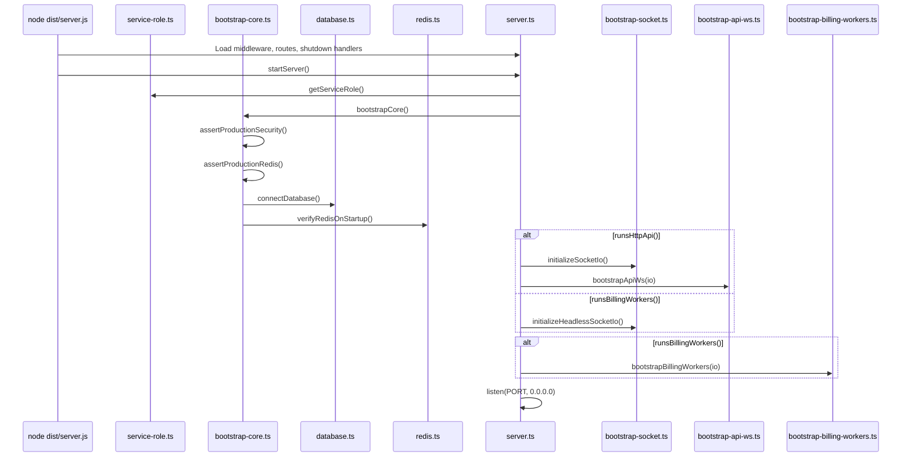

# FULL BACKEND REALITY AUDIT — NO ASSUMPTIONS

**Audit date:** 2026-06-08  
**Codebase:** `d:\zztherapy\backend`  
**Method:** Every conclusion below is traced to actual imports, runtime wiring, startup flow, and handler registration. Markdown deployment guides were cross-checked against code; where docs diverge from code, code wins.

---

## Executive Summary

The backend is a **single TypeScript/Express binary** (`dist/server.js`) with **role-based process splitting** via `ECS_SERVICE_ROLE`. Production billing is **BullMQ-only** (`billing-driver.ts` hardcodes `isBullmqBillingEnabled() === true`). Redis is **mandatory in production** (`bootstrap-core.ts:assertProductionRedis`). Mongo is **mandatory at startup** (`database.ts:connectDatabase` throws without `MONGO_URI`).

The codebase is **ECS-split ready at the application layer** (`service-role.ts`, `start-with-role.cjs`, worker health servers, SIGTERM shutdown). **No ECS task definitions, Terraform, or CI deploy pipelines exist in this repository** — only docs templates in `docs/AWS_BACKEND_DEPLOYMENT_GUIDE.md`.

---

# PHASE 1 — ENTRYPOINT + BOOTSTRAP REALITY

## 1.1 Real Backend Entrypoints

| Entry | Location | Runtime command |
|-------|----------|-----------------|
| **Production main** | `package.json` → `"main": "dist/server.js"` | `npm start` → `node dist/server.js` |
| **Build** | `package.json` | `tsc && node scripts/copy-data-to-dist.cjs` |
| **Dev** | `scripts/dev.ps1` | `npm run dev` |
| **Role-based start** | `scripts/start-with-role.cjs` | Sets `ECS_SERVICE_ROLE`, then `require('../dist/server.js')` |

**ECS role npm scripts** (`package.json:10-13`):

| Script | Role injected |
|--------|---------------|
| `start:api-ws` | `api-ws` |
| `start:billing-worker` | `billing-worker` |
| `start:moments-worker` | `moments-worker` |
| `start:image-worker` | `image-worker` |

**Docker** (`Dockerfile:23`): `CMD ["node", "dist/server.js"]` — no role set; defaults to `monolith` unless `ECS_SERVICE_ROLE` env is injected at runtime. `HEALTHCHECK` hits `http://localhost:3000/ready`.

## 1.2 Service Role Resolution

**File:** `src/config/service-role.ts`

| Role | HTTP API | Billing workers | Moments workers | Image workers | Hygiene intervals |
|------|----------|-----------------|-----------------|---------------|-------------------|
| `monolith` (default) | ✓ | ✓ | ✓ | ✓ | ✓ |
| `api-ws` | ✓ | ✗ | ✗ | ✗ | ✓ |
| `billing-worker` | health only | ✓ | ✗ | ✗ | ✗ |
| `moments-worker` | health only | ✗ | ✓ | ✗ | ✗ |
| `image-worker` | health only | ✗ | ✗ | ✓ | ✗ |

**ECS production guard** (`service-role.ts:33-41`): If `NODE_ENV=production` AND `ECS_CONTAINER_METADATA_URI(_V4)` is set AND role is `monolith` → **startup throws**.

**Legacy flag:** `RUN_BACKGROUND_WORKERS` — read only for conflict detection; does not control workers (`service-role.ts:44-58`).

## 1.3 Full Startup Flow

### Module load order (synchronous, before `startServer()`)

1. `dotenv.config()` — `server.ts:5`
2. Express `app` created — `server.ts:42`
3. Global middleware registered (helmet, CORS, rate limits, body parsers, logging, request queue) — `server.ts:57-241`
4. `registerMetricsRoute(app)` — `server.ts:243`
5. `registerHealthRoutes(app)` — `server.ts:244`
6. `app.use('/api/v1', routes)` — `server.ts:247`
7. 404 + error handlers — `server.ts:249-289`
8. Conditional `setInterval` hygiene jobs if `runsApiHygieneIntervals()` — `server.ts:390-398`
9. `registerShutdownHandlers()` — `server.ts:400`
10. `startServer()` invoked — `server.ts:402`

### Async bootstrap (`startServer()` → `bootstrapCore()`)

**File:** `src/bootstrap/bootstrap-core.ts:bootstrapCore`

| Step | Function | Blocks startup? | Failure mode |
|------|----------|-----------------|--------------|
| 1 | `initializeFirebase()` | No (sync) | Throws if Firebase config invalid |
| 2 | `assertProductionSecurity()` | Yes in prod | Throws if `JWT_SECRET` default or admin creds missing |
| 3 | `warnIfMissingPublicUrls()` | No | Log warning only |
| 4 | `assertProductionRedis()` | Yes in prod | Throws if Redis env absent |
| 5 | `enforceProductionBillingDriverSafety()` | Yes on Railway prod without BullMQ override | Throws on Railway without BullMQ (BullMQ is always on — see §4) |
| 6 | `validatePricingConfig()` | Yes | Throws on invalid pricing |
| 7 | Event loop probe `setInterval` 1s | No | — |
| 8 | `logRateLimitConfig()` | No | — |
| 9 | `connectDatabase()` | **Yes** | Throws if `MONGO_URI` missing or connect fails |
| 10 | `cleanupStaleCreatorLocks()` | No | Logged error, does not throw |
| 11 | `runCreatorTaskProgressIndexMigration()` | No | Logged, non-fatal |
| 12 | `configureStreamPush()` | No | — |
| 13 | `verifyRedisOnStartup()` | **Yes in prod** | Throws if Redis ping/read-write fails |
| 14 | `logRazorpayStatus()` | No | Warning if unconfigured |

### Post-bootstrap role branching (`server.ts:292-364`)

```
getServiceRole()
  → bootstrapCore()                    [ALL roles]

if runsHttpApi():
  createServer(app)
  initializeSocketIo(httpServer)     → setIO(io), Redis adapter
  bootstrapApiWs(io)                 → availability, moments, billing, admin gateways

else if runsBillingWorkers():
  createWorkerHealthServer({ includeMetrics, headlessSocket })
  → headless Socket.IO for cross-node emits

else:
  createWorkerHealthServer()         → health/ready only

if runsBillingWorkers() && io:
  bootstrapBillingWorkers(io)

if runsMomentsWorkers():
  bootstrapMomentsWorkers()

if runsImageWorkers():
  await bootstrapImageWorkers()

registerRuntimeServers(httpServer, io)
httpServer.listen(PORT, '0.0.0.0')
```

## 1.4 Initialization Locations (verified)

| Component | File | Function |
|-----------|------|----------|
| Express app | `src/server.ts:42` | `express()` |
| HTTP server | `src/server.ts:301` or `bootstrap-worker-health.ts:29` | `createServer()` |
| Socket.IO (API) | `src/bootstrap/bootstrap-socket.ts:59` | `initializeSocketIo()` |
| Socket.IO (headless worker) | `src/bootstrap/bootstrap-socket.ts:104` | `initializeHeadlessSocketIo()` |
| Redis singleton | `src/config/redis.ts` | `getRedis()` (lazy, on first use) |
| Mongo | `src/config/database.ts:18` | `connectDatabase()` |
| BullMQ billing | `src/modules/billing/billing.queue.ts` | `startBillingBullWorker()` via `bootstrap-billing-workers.ts` |

## 1.5 Startup Sequence Diagram



---

# PHASE 2 — API SURFACE AUDIT

## 2.1 Mount Topology

| Layer | Prefix | Source |
|-------|--------|--------|
| API router | `/api/v1` | `server.ts:247` |
| Health | `/health`, `/live`, `/ready` | `bootstrap/health-routes.ts` |
| Ops metrics | `/metrics` | `bootstrap/metrics-handler.ts` |

**Router aggregation:** `src/routes.ts` — 20 module routers, **all mounted, zero orphans**.

## 2.2 Global Middleware (all `/api/*`)

Applied in `server.ts` before route handlers:

| Middleware | Scope | File |
|------------|-------|------|
| `attachStaffRateLimitIdentity` | `/api/` | `middlewares/staff-rate-limit.middleware.ts` |
| `attachFirebaseRateLimitIdentity` | `/api/` | `middlewares/firebase-rate-limit.middleware.ts` |
| `generalLimiter` | `/api/` | `middlewares/rate-limit.middleware.ts` |
| `statusLimiter` | `/api/` (status paths) | `server.ts:154-163` |
| `requestQueueMiddleware` | `/api/` | `middlewares/request-queue.middleware.ts` |
| API latency + 5xx metrics | `/api/` | `server.ts:231-240` |

**Signed webhook raw body** (`server.ts:181-214`): POST to `/api/v1/video/webhook`, `/chat/webhook`, `/payment/webhook`, `/stream/webhook` use `express.raw({ limit: '2mb' })`. **`/api/v1/vip/webhook` is NOT in this list** — uses standard JSON parser chain after raw middleware skip.

**JSON body limit:** `50mb` for non-webhook routes (`server.ts:192`).

## 2.3 Route Inventory Summary

**Total HTTP routes: ~202** (~198 under `/api/v1` + 4 bootstrap).

### Classification

| Category | Count | Auth pattern |
|----------|-------|--------------|
| Public (no auth) | ~15 | No `verifyFirebaseToken` at route |
| Authenticated (Firebase or staff JWT) | ~175 | Per-route or router-level `verifyFirebaseToken` |
| Staff portals (router-level auth) | ~92 | `/admin`, `/bd`, `/agency`, `/support`, `/app-updates` |
| Webhooks | 5 | Signature middleware at route or controller |

### Module mount map (`routes.ts`)

| Mount | File | Endpoints (approx) |
|-------|------|-------------------|
| `/auth` | `modules/auth/auth.routes.ts` | 6 |
| `/referral` | `modules/referral/referral.routes.ts` | 1 |
| `/user` | `modules/user/user.routes.ts` | 18 |
| `/creator` | `modules/creator/creator.routes.ts` | 22 |
| `/chat` | `modules/chat/chat.routes.ts` | 7 |
| `/video` | `modules/video/video.routes.ts` | 3 |
| `/admin` | `modules/admin/admin.routes.ts` | 72 |
| `/bd` | `modules/bd/bd.routes.ts` | 14 |
| `/agency` | `modules/agency/agency.routes.ts` | 16 |
| `/billing` | `modules/billing/billing.routes.ts` | 2 |
| `/support` | `modules/support/support.routes.ts` | 4 |
| `/payment` | `modules/payment/payment.routes.ts` | 7 |
| `/app-updates` | `modules/app-update/app-update.routes.ts` | 2 |
| `/availability` | `modules/availability/availability.routes.ts` | 2 |
| `/images` | `modules/images/images.routes.ts` | 3 |
| `/metrics` | `modules/metrics/metrics.routes.ts` | 2 |
| `/stories` | `modules/stories/routes/stories.routes.ts` | 9 |
| `/moments` | `modules/moments/routes/moments.routes.ts` | 15 |
| `/stream` | `modules/stream/stream.routes.ts` | 4 |
| `/vip` | `modules/vip/vip.routes.ts` | 12 |

### Webhook routes (verified)

| Route | Signature verification | Rate limit |
|-------|------------------------|------------|
| `POST /api/v1/chat/webhook` | `verifyStreamChatWebhookSignature` | `webhookLimiter` |
| `POST /api/v1/video/webhook` | `verifyStreamWebhookSignature` | `webhookLimiter` |
| `POST /api/v1/payment/webhook` | `verifyRazorpayWebhookSignature` | `webhookLimiter` |
| `POST /api/v1/stream/webhook` | `verifyStreamWebhook()` in controller | **none at route** |
| `POST /api/v1/vip/webhook` | `verifyRazorpayWebhookSignature` | `webhookLimiter` |

### Public endpoints (no route-level auth)

| Route | Risk notes |
|-------|------------|
| `GET /api/v1/referral/preview` | Redis-backed rate limit only |
| `POST /api/v1/auth/*-login` | `loginLimiter`; issues staff JWT on admin/agency/bd login |
| `POST /api/v1/auth/fast-login` | Deprecated, `fastLoginLimiter` |
| `GET /api/v1/images/health` | Pipeline status |
| `GET /api/v1/stream/health` | Stream status |
| `GET /api/v1/vip/plan` | Plan config |
| `POST /api/v1/payment/web/*` | Checkout JWT-gated in controller |
| `POST /api/v1/vip/checkout/*` | Checkout JWT-gated in controller |
| `GET /health`, `/live`, `/ready` | Infra probes |
| `GET /metrics` | Optional `METRICS_TOKEN` header gate |

### Dangerous / notable patterns

1. **Role checks in controllers, not routes** — Many routes accept any valid Firebase/staff token; admin/creator enforcement is per-handler (e.g. `user/search`, `availability/*`).
2. **`POST /api/v1/user/coins`** — Authenticated; coin adjustment logic in controller (must verify admin gate in controller).
3. **`Creator.find({})` unbounded** — Availability-sorted creator feed loads entire collection (`creator.controller.ts` — see Phase 6).
4. **VIP webhook raw-body gap** — Not in `isSignedWebhookPost()` (`server.ts:181-189`); Razorpay HMAC may receive parsed JSON body instead of raw bytes.
5. **Stream webhook** — No `webhookLimiter`; signature verified in controller only.

### Unmounted / dead routers

**None found.** All 20 `*.routes.ts` files under `src/modules` are imported in `routes.ts`.

---

# PHASE 3 — SOCKET.IO + REALTIME AUDIT

## 3.1 Initialization & Namespaces

| Namespace | Auth | Registration |
|-----------|------|--------------|
| `/` (default) | Firebase ID token via `socket.handshake.auth.token` | `availability.gateway.ts` → `io.use()` |
| `/admin` | Staff JWT | `admin.gateway.ts` |

**Bootstrap:** `bootstrap-api-ws.ts` calls `setupAvailabilityGateway` → `setupMomentsGateway` → `setupBillingGateway` → `setupAdminGateway`. **Only runs when `runsHttpApi()`** (`server.ts:303-304`).

## 3.2 Redis Adapter

**File:** `bootstrap/bootstrap-socket.ts:attachSocketIoRedisAdapter`

- Enabled when `isRedisConfigured()` AND `SOCKET_IO_REDIS_ADAPTER !== 'false'`
- Creates separate ioredis pub/sub clients (not the billing singleton)
- On failure: logs warning, falls back to in-memory adapter
- **Cross-node broadcast:** yes (when adapter active)
- **Cross-node connection state:** no — local Maps are not replicated

## 3.3 Rooms

**File:** `modules/staff/staff-socket.constants.ts`

| Room | Purpose |
|------|---------|
| `creators` | Creator presence broadcasts |
| `consumers` | Consumer presence broadcasts |
| `user:{firebaseUid}` | Per-user billing events |
| `staff:admin` | Admin dashboard invalidation |
| `agency:{agencyUserId}` | Agency-scoped admin events |
| `bd:{bdUserId}` | BD-scoped admin events |

## 3.4 Client → Server Events

| Event | Handler file | AuthZ |
|-------|--------------|-------|
| `availability:get` | `availability.gateway.ts` | Any authenticated |
| `creator:online` / `creator:offline` | `availability.gateway.ts` | `socket.data.isCreator` |
| `user:online` / `user:offline` | `availability.gateway.ts` | `socket.data.isUser` |
| `user:availability:get` | `availability.gateway.ts` | Any authenticated (**no creator-only gate**) |
| `call:started` | `billing-socket.gateway.ts` | Firebase only — **missing `assertBillingRestCallStartedAccess`** |
| `call:ended` | `billing-socket.gateway.ts` | Participant check via Redis session |
| `billing:recover-state` | `billing-socket.gateway.ts` | Own UID only |
| `billing:sync-warning` | `billing-socket.gateway.ts` | Any authenticated — **no participant check** |

## 3.5 Server → Client Events

| Event | Emitter | Target |
|-------|---------|--------|
| `billing:started/update/settled/error` | `billing-emitter.service.ts` | `user:{firebaseUid}` |
| `creator:status` | `presence.service.ts` | `creators` + `consumers` |
| `user:status` | `availability.gateway.ts` | `creators` |
| `moment:uploaded`, `story:uploaded`, etc. | `moments.gateway.ts` | **Global `io.emit()`** — all clients |
| `media:ready` | `moments.gateway.ts` | `io.to(userId)` — Mongo `_id`, not `user:{firebaseUid}` |
| `dashboard:invalidate` | `staff-dashboard-invalidation.service.ts` | `/admin` namespace rooms |
| `vip:scheduled_call:due` | `vip-scheduling.reconciliation.ts` | Socket emit to participants |

## 3.6 State: Local vs Redis

### Redis-authoritative (survives restart, shared across nodes)

| Key pattern | Purpose | File |
|-------------|---------|------|
| `creator:availability:{uid}` | Base online/offline | `presence.service.ts` |
| `creator:presence:{uid}` | Effective presence JSON | `presence.service.ts` |
| `creator:presence:meta:{uid}` | Versioned metadata | `presence.service.ts` |
| `user:availability:{uid}` | User online (120s TTL) | `user-availability.service.ts` |
| `active:call:user:{uid}` | Active call slot | `redis.ts`, `presence.service.ts` |
| `call:session:{callId}` | Billing session | `billing.service.ts` |

### In-process only (breaks under multi-node without sticky sessions)

**File:** `availability.gateway.ts`

- `creatorSocketCounts`, `userSocketCounts`
- `activeSocketsByCreator`, `activeSocketsByUser`
- `creatorHeartbeatIntervals`, `userHeartbeatIntervals`
- `creatorDisconnectTimers` (3s grace: `CREATOR_DISCONNECT_GRACE_MS`)
- `lastCreatorHeartbeatAtMs`, `lastUserHeartbeatAtMs`

**File:** `billing-socket.gateway.ts`

- `recoveryGateByUid` — per-process debounce

**File:** `staff-dashboard-invalidation.service.ts`

- `presenceCoalesceTimers` — per-process coalescing

## 3.7 Horizontal Scaling Assessment

| Concern | Multi-instance behavior | Severity |
|---------|-------------------------|----------|
| Socket.IO emits (billing, presence) | Works with Redis adapter | OK when adapter enabled |
| Presence heartbeats / disconnect grace | Node-local only | **HIGH** — stale/busy states possible |
| Billing tick processing | BullMQ distributes; per-call locks | OK |
| Billing recovery debounce | Per-process | **MEDIUM** — duplicate recovery storms |
| VIP due-call emits | No cluster lock | **MEDIUM** — duplicate emits |
| Moments global broadcast | All nodes emit to all clients | **LOW** — wasteful, not incorrect |
| `media:ready` room mismatch | Wrong room ID | **HIGH** — functional bug |

**Verdict:** Billing is horizontally scalable via BullMQ + Redis locks. **Presence correctness requires sticky sessions OR moving socket tracking to Redis** — not implemented.

---

# PHASE 4 — BILLING SYSTEM REALITY AUDIT

## 4.1 Billing Driver

**File:** `src/modules/billing/billing-driver.ts`

```typescript
export function isBullmqBillingEnabled(): boolean {
  return true;
}
```

**Runtime active:** BullMQ only. ZSET batch processor is a noop (`billing-batch.processor.ts:16-20` records `batch_processor_noop`). `processTerminationRedisRetries()` in `billing-termination-redis-retry.ts` returns early when BullMQ is on — **dead code path**.

## 4.2 Billing Lifecycle (verified flow)

```
call:started (socket or HTTP)
  → billing.service.startBillingSession()
    → billing:start_lock:{callId} (30s NX)
    → callpair:{uid1}:{uid2} lock
    → call:session:{callId} created in Redis
    → active:call:user:{uid} slots
    → scheduleBillingJob() → BullMQ billing-cycle queue

BullMQ worker tick (every ~450ms per call chain)
  → processBillingTick()
    → billing:cycle_lock:{callId} (NX PX)
    → ensureRuntimeOwnership() → billing:runtime:owner:{callId}
    → deduct coins / credit creator (delta capped MAX_BILLING_DELTA_MS)
    → emit billing:update via Socket.IO

call:ended / webhook / watchdog / reconciliation
  → finalizeCallSession()
    → settle:lock:{callId}
    → Mongo transaction (User coins, CoinTransaction, CallHistory)
    → billing:settled emit
    → terminal tombstone call:session:{callId}:terminal
```

## 4.3 BullMQ Queues

| Queue | File | Concurrency | Job pattern |
|-------|------|-------------|-------------|
| `billing-cycle` | `billing.queue.ts` | `BILLING_BULLMQ_CONCURRENCY` default **130**, clamp 1-200; **0 disables worker** | Per-call delayed `cycle` jobs, ~450ms chain |
| `billing-termination-retry` | `billing-termination.queue.ts` | **5** hardcoded | `retry-mark-ended` with stable job ID |
| `image-blurhash` | `blurhash.queue.ts` | default **2** | On image commit |
| `image-orphan-cleanup` | `orphan-cleanup.queue.ts` | **1** | Repeatable sweep every 30min |

## 4.4 Idempotency & Race Protections (implemented)

| Mechanism | Key / pattern | File |
|-----------|---------------|------|
| Per-call cycle lock | `billing:cycle_lock:{callId}` | `billing.service.ts` |
| Runtime owner epoch | `billing:runtime:owner:{callId}` | `billing.service.ts:192-271` |
| Schedule gate | `billing:cycle:scheduled:{callId}` | `billing.queue.ts:352-364` |
| Start lock | `billing:start_lock:{callId}` | `billing.service.ts` |
| Settlement lock | `settle:lock:{callId}` | `billing-session-finalization.service.ts` |
| Settlement claim | `settlement:claim:{callId}` | `redis.ts` |
| Terminal tombstone | `call:session:{callId}:terminal` | `redis.ts` |
| Settled marker | `settled:call:{callId}` | `redis.ts` |
| Tick idempotency | `idempotency:billing:{callId}:{ts}:{second}` | `redis.ts` |
| Delta cap | `MAX_BILLING_DELTA_MS` default 5000ms | `billing.service.ts` |
| Monotonic micros | throws on regression | `billing.service.ts:2808-2814` |
| Dead letter | `billing:recovery:deadletter:{callId}` | `billing-session-finalization.service.ts` |
| DLQ for failed ticks | `dlq:billing:failed:*` | `billing-reconciliation.ts` |

## 4.5 Background Billing Jobs

| Job | Interval | Lock | Multi-instance |
|-----|----------|------|----------------|
| BullMQ billing cycle | ~450ms/call | Per-call locks | Safe (BullMQ + locks) |
| Billing reconciliation | 5 min | `lock:reconciliation:billing` | Safe (single runner) |
| Billing watchdog | 5s default | Per-call cooldown only | **Unsafe** — all replicas run |
| Startup recovery | One-shot | Schedule gate NX | Safe |
| Termination retry | On-demand | `billing:mark_ended_lease:{callId}` | Safe (BullMQ job dedup) |
| Call reconciliation | 5 min | `lock:reconciliation:call` | Safe |
| Payment webhook retry | 15s | `lock:payment:webhook_retry` | Safe |
| VIP reconciliation | 60s | **None** | **Unsafe** — duplicate emits |
| Staff wallet recon | 24h (opt-in) | **None** | **Unsafe** if enabled |
| Domain events | 5s (opt-in) | **None** | **Unsafe** — no claim lock |

## 4.6 Failure Scenarios

| Scenario | Behavior | Source |
|----------|----------|--------|
| Process crash mid-tick | Cycle lock expires; BullMQ reschedules; reconciliation DLQ + watchdog heal | `billing-recovery.ts`, `billing-watchdog.service.ts` |
| ECS task restart | `verifyStartupRecovery()` scans `call:session:*`, reschedules cycles | `billing-recovery.ts:77-139` |
| Redis outage | `getRedis()` throws; billing ticks fail; prod startup blocked | `redis.ts`, `bootstrap-core.ts:160-162` |
| Mongo outage | `/ready` returns 503; settlement transactions fail → retry queues | `health-routes.ts`, `billing-settlement.service.ts` |

## 4.7 Double-charge / Missed-charge Paths

### Protections against double-charge (implemented)

- Per-call cycle lock prevents concurrent ticks
- Delta cap prevents wall-clock catch-up storms
- Settlement claim + settle lock prevent duplicate finalization
- Mongo transactions on settlement
- `billingSequence` monotonic increment

### Residual double-charge risk

- **Watchdog multi-replica** — concurrent `finalizeCallSession()` attempts mitigated by settle lock, but lifecycle state transitions can race before cooldown (`billing-watchdog.service.ts` — no cluster lock)
- **Domain event worker** — duplicate dispatch if `DOMAIN_EVENTS_ENABLED=true` with multiple billing workers

### Missed-charge risk

- Redis outage during active call → ticks stop; recovery on reconnect via reconciliation + watchdog
- `BILLING_BULLMQ_CONCURRENCY=0` → worker disabled, no ticks (env misconfiguration)
- Dead-letter path suppresses further finalize attempts (`billing-session-finalization.service.ts:938-949`)

## 4.8 Billing Safety Level

**Implemented:** Strong per-call locking, BullMQ scheduling, reconciliation with cluster lock, settlement transactions, dead-letter escalation.

**Gaps:** Watchdog and VIP reconciliation lack cluster locks. Socket `call:started` lacks HTTP-equivalent authorization.

---

# PHASE 5 — REDIS REALITY AUDIT

## 5.1 Connection Topology

| Client | File | `maxRetriesPerRequest` |
|--------|------|------------------------|
| Billing singleton | `config/redis.ts` | 3 |
| Socket.IO adapter pub/sub | `bootstrap-socket.ts` | 20 |
| BullMQ (billing, termination, image) | respective `*.queue.ts` | null (required by BullMQ) |

**`@upstash/redis`:** in `package.json` only — **zero imports in `src/`** (dead dependency).

## 5.2 Criticality Tiers

### CRITICAL (outage = billing/revenue failure)

All `call:session:*`, `billing:*` locks, `active:call:user:*`, `settle:lock:*`, `settlement:claim:*`, DLQ keys, `billing-cycle` BullMQ queue data.

### HIGH (degraded calls/presence)

`creator:presence:*`, `creator:availability:*`, `call:finalize:lock:*`, `idempotency:webhook:*`, reconciliation locks, VIP `call:queue:*`.

### MEDIUM (cache/queues)

Creator feed caches, chat caches, moments fanout queues (`moments:fanout:queue`), upload sessions, admin cache `admin:{section}:v1`.

### LOW (observability/rate limits)

`metrics:*`, `rl:*`, `health:redis:test:*`, quota counters.

## 5.3 Key Explosion / Memory Risks

| Risk | Pattern | Mitigation in code |
|------|---------|-------------------|
| Active call sessions | `call:session:*` TTL 7200s | TTL set on write |
| Creator feed cache registry | `creator:feed:index` SET | No TTL on index — **growth risk** |
| Presence dashboard sets | `presence:online_creators`, `presence:online_by_*` | No TTL — **requires reconciliation** |
| DLQ entries | `dlq:billing:failed:*` TTL 86400s | TTL present |
| Metrics ZSETs | `metrics:{name}` retain 1000 | `monitoring.ts` |
| Chat cache SCAN | `chat:channel:other:*` full scan on profile update | `chat-cache-invalidation.ts` — **spike risk** |

## 5.4 Features That Fail Without Redis

| Feature | Failure mode |
|---------|--------------|
| Billing | Throws / no ticks — **catastrophic** |
| Production startup | Blocked (`assertProductionRedis`) |
| Socket.IO multi-node | Falls back to in-memory — **broken cross-node** |
| Rate limits (when `RATE_LIMIT_REDIS` enabled) | Falls back to in-memory per instance |
| Moments fanout/analytics drains | Skipped if unconfigured (`moments.bootstrap.ts:52`) |
| Presence | Writes fail; reads may fallback |

---

# PHASE 6 — MONGO REALITY AUDIT

## 6.1 Connection

**File:** `config/database.ts`

| Setting | Env | Default |
|---------|-----|---------|
| `maxPoolSize` | `MONGO_POOL_SIZE` | 50 |
| `minPoolSize` | `MONGO_MIN_POOL_SIZE` | 5 |
| `maxIdleTimeMS` | `MONGO_MAX_IDLE_TIME_MS` | 30000 |
| `serverSelectionTimeoutMS` | `MONGO_SERVER_SELECTION_TIMEOUT_MS` | 5000 |
| `socketTimeoutMS` | — | 45000 |

**Scaling formula:** `total_connections = MONGO_POOL_SIZE × ECS_task_count` per process role.

## 6.2 Collections (47 models)

See `src/modules/**/**.model.ts` — 47 files. Notable explicit collection names:

- `call_billing_checkpoints` (`call-billing-checkpoint.model.ts`)
- `billing_lifecycle_transitions` (`billing-lifecycle-transition.model.ts`)

All others use Mongoose default pluralization (e.g. `users`, `creators`, `calls`).

## 6.3 Transactions (verified `startSession` usage)

| File | Use case |
|------|----------|
| `billing-settlement.service.ts` | Call settlement |
| `payment-finalization.service.ts` | IAP coin credit |
| `vip-purchase-finalization.service.ts` | VIP purchase |
| `chat.controller.ts` | Quota debit |
| `moments/services/purchase.service.ts` | Moment purchase |
| `creator.controller.ts` | Withdrawals, task claims |
| `user.controller.ts` | Account deletion |
| `staff-wallet-reconciliation.service.ts` | Staff wallet reconcile |

## 6.4 Heavy Aggregations

| Location | Pattern | Cached? |
|----------|---------|---------|
| `admin.controller.ts` | 30+ aggregations on User, CoinTransaction, CallHistory | Partial — `admin:{section}:v1` 60s Redis cache |
| `admin-dashboard.service.ts` | Dashboard aggregations | Redis cache |
| `creator.controller.ts` | Dashboard/tasks aggregations | Redis cache (`creator:dashboard:{userId}` 60s) |
| `agency-portal.controller.ts` | CallHistory, StaffWalletLedger pipelines | No |
| `billing-reconciliation.ts` | CoinTransaction balance checks | No |

## 6.5 Dangerous Queries

| Query | File | Risk |
|-------|------|------|
| `Creator.find({})` — full catalog | `creator.controller.ts` (availability sort) | **HIGH** — unbounded memory; warns if >5000 |
| `Creator.find({})` | `admin.controller.ts` `computeCreatorsPerformance()` | **HIGH** |
| `CreatorMoment.find({ creatorId })` no limit | `moments.controller.ts` analytics | **MEDIUM** |
| `getAllOnlineUsers()` Redis SCAN | `user-availability.service.ts` | **MEDIUM** at scale |

## 6.6 Startup DB Dependencies

- `connectDatabase()` — **required**, throws without `MONGO_URI`
- `runCreatorTaskProgressIndexMigration()` — optional index drop
- Creator presence audit on startup — `auditCreatorPresenceOnStartup()` (api-ws only)

---

# PHASE 7 — WORKER + BACKGROUND JOB AUDIT

## 7.1 Complete Job Registry

| Job | File | Interval | Startup condition | Cluster lock | Idempotency |
|-----|------|----------|-------------------|--------------|-------------|
| Event loop probe | `bootstrap-core.ts:185` | 1s | Always | None | N/A |
| Creator task progress cleanup | `server.ts:391` | 6h | `runsApiHygieneIntervals()` | None | `deleteMany` by cutoff |
| Stale creator lock cleanup | `server.ts:393` | 5m | `runsApiHygieneIntervals()` | None | Safe |
| BullMQ billing cycle | `billing.queue.ts` | ~450ms/call | `runsBillingWorkers()` + concurrency>0 | Per-call | Locks + delta cap |
| Termination retry worker | `billing-termination.queue.ts` | on-demand | `runsBillingWorkers()` | BullMQ job ID | Ended marker + lease |
| Billing reconciliation | `billing-reconciliation.ts` | 5m | `runsBillingWorkers()` | `lock:reconciliation:billing` | Per-call locks |
| Billing watchdog | `billing-watchdog.service.ts` | 5s | `runsBillingWorkers()` + flag | Per-call cooldown | Recovery caps |
| Staff wallet recon | `staff-wallet-reconciliation.scheduler.ts` | 24h | `STAFF_WALLET_RECONCILE_ENABLED=true` | **None** | Ledger-based |
| Domain event worker | `domain-event.worker.ts` | 5s | `DOMAIN_EVENTS_ENABLED=true` | **None** | `idempotencyKey` on insert |
| Startup billing recovery | `billing-recovery.ts` | one-shot | `runsBillingWorkers()` | Schedule gate | NX |
| Call reconciliation | `call-reconciliation.ts` | 5m | `runsBillingWorkers()` | `lock:reconciliation:call` | Stream 404 grace |
| VIP reconciliation | `vip-scheduling.reconciliation.ts` | 60s | `runsBillingWorkers()` + flag | **None** | `reminderSentAt` |
| Payment webhook retry | `payment-webhook-retry.service.ts` | 15s | `runsBillingWorkers()` | `lock:payment:webhook_retry` | Payment finalization |
| Moments stream sweeper | `moments.bootstrap.ts` | 15m | `runsMomentsWorkers()` + `USE_MOMENTS` | None | Idempotent updates |
| Analytics drain | `moments.bootstrap.ts` | 30s | moments + Redis | LPOP atomic | Safe |
| Fanout drain | `moments.bootstrap.ts` | 5s | moments + Redis | LPOP atomic | Safe |
| Feed warm drain | `moments.bootstrap.ts` | 10s | moments + Redis | LPOP atomic | Safe |
| Story expiry | `moments.bootstrap.ts` | 30m | moments | None | Duplicate OK |
| Thumbnail validation | `moments.bootstrap.ts` | 10m | moments | None | Duplicate OK |
| Blurhash worker | `blurhash.queue.ts` | on enqueue | `runsImageWorkers()` + Cloudflare | BullMQ | Stable jobId |
| Orphan cleanup | `orphan-cleanup.queue.ts` | 30m repeat | `runsImageWorkers()` + Cloudflare | BullMQ repeat dedup | 404 = noop |
| Presence heartbeat sweep | `availability.gateway.ts` | 30s | api-ws only | None | Local state |
| Socket tracking cleanup | `availability.gateway.ts` | 10m | api-ws only | None | Local state |
| Monitoring persist | `monitoring.ts` | interval | Always | None | ZSET trim |
| Rate limit cleanup | `rate-limit.service.ts` | 30s | Always | None | In-memory |
| Redis circuit breaker cleanup | `redis-circuit-breaker.ts` | 5m | Always | None | In-memory |

## 7.2 Multi-Instance Danger Summary

| Safe (distributed) | Dangerous (duplicates across replicas) |
|--------------------|----------------------------------------|
| BullMQ billing, termination retry | Billing watchdog (all billing-worker tasks) |
| Billing reconciliation (lock) | VIP reconciliation |
| Call reconciliation (lock) | Domain event worker (if enabled) |
| Payment webhook retry (lock) | Staff wallet recon (if enabled) |
| Moments Redis LIST drains (LPOP) | Story expiry, thumbnail validation, stream sweeper |
| Image BullMQ workers | Orphan sweeper (N workers × concurrency 1) |

---

# PHASE 8 — AWS / ECS READINESS REALITY

## 8.1 Docker Readiness — IMPLEMENTED

| Check | Status | Evidence |
|-------|--------|----------|
| Multi-stage build | ✓ | `Dockerfile` builder + runner |
| Non-root user | ✓ | `USER nodejs` |
| Production deps only | ✓ | `npm ci --omit=dev` in runner |
| Health check | ✓ | `curl -f http://localhost:3000/ready` |
| Exposed port | ✓ | 3000 |
| Compiled output | ✓ | `dist/server.js` |

**Gap:** Default CMD runs monolith without `ECS_SERVICE_ROLE` — valid locally; **invalid on ECS Fargate production** (metadata check forces explicit role).

## 8.2 ECS Application Readiness — IMPLEMENTED (code), NOT DEPLOYED (infra)

| Check | Status | Evidence |
|-------|--------|----------|
| Role-based process split | ✓ | `service-role.ts`, `start-with-role.cjs` |
| Worker health server | ✓ | `bootstrap-worker-health.ts` — `/health`, `/ready`, optional `/metrics` |
| Headless Socket.IO for worker emits | ✓ | `initializeHeadlessSocketIo()` on billing-worker |
| ECS metadata detection | ✓ | `ECS_CONTAINER_METADATA_URI(_V4)` |
| Task definitions in repo | ✗ | Only doc templates in `docs/AWS_BACKEND_DEPLOYMENT_GUIDE.md` |
| Terraform/CloudFormation | ✗ | Not in repository |

## 8.3 ALB / Load Balancer

| Check | Status | Notes |
|-------|--------|-------|
| HTTP API on 0.0.0.0 | ✓ | `server.ts:355` |
| WebSocket upgrade | ✓ | Socket.IO on same HTTP server |
| Sticky sessions | ✗ | Not implemented — presence local state needs it |
| `/ready` for ALB target health | ✓ | Mongo + Redis probe, returns 503 on failure |
| `/live` for liveness | ✓ | Process-only, always 200 |

## 8.4 Graceful Shutdown — IMPLEMENTED

**File:** `bootstrap/bootstrap-shutdown.ts`

| Signal | Handler |
|--------|---------|
| SIGTERM | `runRoleShutdown()` → exit 0 |
| SIGINT | same |
| uncaughtException | shutdown → exit 1 |

**Shutdown sequence (role-aware):**

1. HTTP `server.close()` — timeout `SHUTDOWN_HTTP_MS` default 30s
2. Socket.IO `io.close()`
3. Stop reconciliation, watchdog, staff wallet, domain events, call recon, VIP recon, payment retry
4. `cleanupBillingIntervals()` — timeout `SHUTDOWN_BULLMQ_MS` default 60s
5. Stop moments/image workers
6. `mongoose.disconnect()`
7. `clearEventLoopProbe()`

**Gaps:**

- No explicit Redis `quit()` on shutdown
- BullMQ workers may be force-closed after timeout (logged, not awaited indefinitely)
- WebSocket draining relies on `server.close()` — no custom connection tracking

## 8.5 Deploy / Scale Failure Modes

| Event | What breaks | Evidence |
|-------|-------------|----------|
| Rolling deploy (api-ws) | In-flight WebSocket connections dropped | `server.close()` on SIGTERM |
| Scale-out (api-ws) | Presence local state diverges | `availability.gateway.ts` local Maps |
| Scale-out (billing-worker) | Watchdog runs N× | No cluster lock |
| Scale-in (billing-worker) | BullMQ jobs redistributed | BullMQ handles |
| Redis adapter disabled | Cross-node emits fail | `SOCKET_IO_REDIS_ADAPTER=false` |
| Monolith on ECS prod | **Startup crash** | `service-role.ts:39-41` |

---

# PHASE 9 — SECURITY AUDIT

## 9.1 Production Guards — IMPLEMENTED

**File:** `bootstrap-core.ts:assertProductionSecurity`

- `JWT_SECRET` must be set and not `admin-secret-change-me`
- `ADMIN_EMAIL` + `ADMIN_PASSWORD` required
- Redis required (`assertProductionRedis`)
- Railway prod requires BullMQ (always satisfied by `billing-driver.ts`)

## 9.2 Auth Middleware

**File:** `middlewares/auth.middleware.ts`

- `verifyFirebaseToken` — accepts Firebase ID token OR staff JWT
- JWT fallback secret: `admin-secret-change-me` when env unset — **blocked in production** by bootstrap guard
- Role enforcement: **per-controller**, not universal at route layer

## 9.3 Critical Security Gaps (verified in code)

| Issue | Severity | Location |
|-------|----------|----------|
| Socket `call:started` missing `assertBillingRestCallStartedAccess` | **CRITICAL** | `billing-socket.gateway.ts` vs `billing-rest-access.ts` (HTTP has it) |
| `user:availability:get` unrestricted batch lookup | **MEDIUM** | `availability.gateway.ts` — HTTP restricts to creator/admin |
| `billing:sync-warning` no participant check | **MEDIUM** | `billing-socket.gateway.ts` |
| CORS defaults to `*` | **MEDIUM** | `server.ts:84-101`, `bootstrap-socket.ts:74-80` |
| VIP webhook not in raw-body list | **MEDIUM** | `server.ts:181-189` |
| `METRICS_TOKEN` optional — `/metrics` open if unset | **LOW** | `metrics-handler.ts:11-17` |
| Checkout secret fallback chain | **LOW** (prod blocked) | `payment.controller.ts` |
| `ALLOW_INSECURE_WEBHOOKS=true` bypass | **DEV ONLY** | `webhook-signature.middleware.ts` |

## 9.4 Webhook Verification — IMPLEMENTED

| Provider | Verification | Raw body |
|----------|-------------|----------|
| Stream Video | HMAC middleware | ✓ |
| Stream Chat | HMAC middleware | ✓ |
| Razorpay payment | HMAC middleware | ✓ |
| Razorpay VIP | HMAC middleware | ✗ (not in raw list) |
| Cloudflare Stream | Controller `verifyStreamWebhook()` | ✓ (in raw list) |

## 9.5 Trust Proxy — IMPLEMENTED

`server.ts:48-55` — `TRUST_PROXY_HOPS` env, default 1 hop.

## 9.6 File Upload — HTTP only (no socket uploads)

| Path | Controls |
|------|----------|
| `POST /api/v1/images/direct-upload` | Auth, purpose whitelist, size limits, quota (`images.controller.ts`, `upload-quota.service.ts`) |
| `POST /api/v1/stream/direct-upload` | `verifyFirebaseToken` |
| Commit flows | Single-shot session consume, MIME sniff (`commit-image-asset.ts`) |

## 9.7 Hardcoded Secrets

| Secret | Default | Production blocked? |
|--------|---------|---------------------|
| `JWT_SECRET` | `admin-secret-change-me` | Yes |
| `CHECKOUT_SESSION_SECRET` | falls back to JWT / `checkout-session-secret-change-me` | JWT blocked in prod |

## 9.8 Rate Limiting — IMPLEMENTED

- Global: `createStaffGeneralLimiter` on `/api/`
- Per-endpoint limiters: login, webhook, billing, withdrawal, chat, image upload, metrics
- Redis-backed when `RATE_LIMIT_REDIS !== '0'` and Redis configured
- Dev bypass: `DISABLE_RATE_LIMIT=true`, loopback skip

---

# PHASE 10 — DEAD CODE + FEATURE FLAG AUDIT

## 10.1 Dead / Retired Code (verified unreachable or noop)

| Item | Status | Evidence |
|------|--------|----------|
| ZSET billing batch processor | **DEAD** | `billing-batch.processor.ts` noop; `billing-driver.ts` always BullMQ |
| `processTerminationRedisRetries()` ZSET path | **DEAD** | Returns early when BullMQ on |
| `billing:active_calls` ZSET driver | **LEGACY KEY** | Still defined in `redis.ts`; not driven when BullMQ on |
| `lock:billing:batch_processor` | **LEGACY** | 2s global lock — unused with BullMQ |
| `@upstash/redis` package | **UNUSED DEP** | Zero imports in `src/` |
| `availability.socket.ts` legacy path | **BLOCKED** | Throws if `ENABLE_LEGACY_AVAILABILITY_SOCKET=true` |
| `auth/fast-login` | **DEPRECATED** | `fastLoginDeprecated` handler |
| `GET /api/v1/creator/` catalog | **GONE** | `getCreatorCatalogGone` returns deprecated response |
| Railway billing ZSET override | **DEAD PATH** | BullMQ always on; Railway check in `bootstrap-core.ts:67-91` never triggers throw |

## 10.2 Feature Flags (runtime active / opt-in)

**File:** `config/feature-flags.ts`

| Flag | Default | Effect |
|------|---------|--------|
| `billingWatchdogEnabled` | on | Watchdog runs |
| `billingAdaptiveLagPolicyEnabled` | on | Lag-aware scheduling |
| `billingDeltaCursorV3Enabled` | **off** | V3 cursor checkpoints |
| `billingBalanceMismatchAutoRepairEnabled` | on | Auto-repair in reconciliation |
| `creatorPresenceUserModelEnabled` | **off** | New presence key model |
| `creatorPresenceUserModelShadowCompareEnabled` | on | Shadow compare telemetry |
| `vipEnabled` | on | VIP features |
| `vipSchedulingEnabled` | on | VIP scheduling jobs |
| `vipPriorityQueueEnabled` | on | VIP call queue |
| `mockPaymentProvider` | off | Mock Razorpay |
| `DOMAIN_EVENTS_ENABLED` | **off** | Domain event worker |
| `STAFF_WALLET_RECONCILE_ENABLED` | **off** | Staff wallet scheduler |
| `USE_MOMENTS` | env | Moments workers |
| `USE_CLOUDFLARE_IMAGES` | env | Image workers |

## 10.3 Docs-Only (mentioned in docs, not in repo as runnable infra)

| Item | Status |
|------|--------|
| ECS task definition JSON files | Docs templates only |
| AWS VPC/ALB/ECS cluster | Not in codebase |
| Blue/green deploy | Not implemented |
| `BILLING_INSTANCE_ID` from ECS metadata | Documented in `AWS_MIGRATION_READINESS.md`, not auto-wired in code |

## 10.4 Stale Railway Logic (retained, low impact)

- `bootstrap-core.ts:69` — `isRailway` check for billing driver safety (never throws with current `billing-driver.ts`)
- `redis.ts:39` — Railway internal hostname detection for endpoint mode logging

---

# PHASE 11 — FINAL REALITY REPORT

## 11.1 Real Implemented Architecture

```
┌─────────────────────────────────────────────────────────────────┐
│  Single Docker image: node:20-alpine → dist/server.js           │
│  Role: ECS_SERVICE_ROLE (monolith | api-ws | billing-worker |   │
│        moments-worker | image-worker)                           │
├─────────────────────────────────────────────────────────────────┤
│  api-ws:     Express + Socket.IO + Redis adapter + gateways   │
│  billing-worker: BullMQ billing + reconciliation + watchdog +   │
│                  headless Socket.IO for emits                   │
│  moments-worker: Redis LIST drains + Mongo sweeps               │
│  image-worker: BullMQ blurhash + orphan cleanup                 │
├─────────────────────────────────────────────────────────────────┤
│  Data: MongoDB (authoritative ledger) + Redis (billing state,   │
│        presence, caches, queues, locks, metrics)                │
│  External: Firebase Auth, Stream Video/Chat, Razorpay,          │
│            Cloudflare Images/Stream                             │
└─────────────────────────────────────────────────────────────────┘
```

## 11.2 Real Runtime Topology (production ECS target)

| Service | Role | Count (doc recommendation) | Shared deps |
|---------|------|---------------------------|-------------|
| ALB → api-ws | `api-ws` | 2+ | Mongo, Redis, Firebase |
| billing-worker | `billing-worker` | 1-2 | Mongo, Redis, headless Socket.IO |
| moments-worker | `moments-worker` | 1 | Mongo, Redis |
| image-worker | `image-worker` | 1 | Mongo, Redis, Cloudflare |

## 11.3 Real Active Subsystems

| Subsystem | Status | Runs on |
|-----------|--------|---------|
| HTTP API (~202 routes) | **RUNTIME ACTIVE** | api-ws, monolith |
| Socket.IO presence | **RUNTIME ACTIVE** | api-ws, monolith |
| Socket.IO billing events | **RUNTIME ACTIVE** | api-ws (handlers), billing-worker (emits) |
| BullMQ billing ticks | **RUNTIME ACTIVE** | billing-worker, monolith |
| Billing reconciliation | **RUNTIME ACTIVE** | billing-worker, monolith |
| Billing watchdog | **RUNTIME ACTIVE** | billing-worker, monolith |
| Call reconciliation | **RUNTIME ACTIVE** | billing-worker, monolith |
| Payment webhook retry | **RUNTIME ACTIVE** | billing-worker, monolith |
| VIP scheduling/queue | **RUNTIME ACTIVE** (flags on) | billing-worker, monolith |
| Moments fanout/analytics | **RUNTIME ACTIVE** (if `USE_MOMENTS`) | moments-worker, monolith |
| Image pipeline | **RUNTIME ACTIVE** (if Cloudflare env) | image-worker, monolith |
| Domain events | **OPT-IN OFF** | billing-worker if enabled |
| Staff wallet recon | **OPT-IN OFF** | billing-worker if enabled |
| ZSET billing | **DEAD** | — |

## 11.4 Real Scaling Limitations

1. Presence socket tracking is **node-local** — multi api-ws tasks without sticky sessions produce stale presence
2. Billing watchdog runs on **every** billing-worker replica without cluster lock
3. VIP reconciliation can **duplicate** scheduled-call emits
4. `Creator.find({})` on availability-sorted feed — **Mongo memory bottleneck**
5. Mongo pool: 50 × (api-ws tasks + billing-worker tasks + ...) must fit Atlas limits
6. Redis connection multiplication: billing + Socket.IO adapter + BullMQ pools per process

## 11.5 Real AWS Blockers

| Blocker | Type | Resolution required |
|---------|------|---------------------|
| No ECS task definitions / services in repo | Infra | Create and deploy per `AWS_BACKEND_DEPLOYMENT_GUIDE.md` |
| `ECS_SERVICE_ROLE` required on Fargate prod | Code | Set role per service in task definition |
| Sticky sessions not configured | Architecture | ALB stickiness OR Redis-backed socket state |
| Watchdog/VIP recon duplicate work | Code | Add cluster locks or singleton task |
| Socket billing auth gap | Security | Apply `assertBillingRestCallStartedAccess` to socket path |
| VIP webhook raw-body gap | Security | Add to `isSignedWebhookPost()` |

## 11.6 Real Redis Criticality

**Tier: CRITICAL infrastructure.** Production startup fails without Redis. Billing state, locks, active call slots, BullMQ backing store, and Socket.IO cross-node adapter all depend on Redis. Outage during active calls stops coin deduction; reconciliation and watchdog provide recovery on restore.

## 11.7 Real Billing Safety Level

**Production-grade with documented gaps.**

- Strong: per-call locks, BullMQ scheduling, settlement Mongo transactions, reconciliation DLQ, dead-letter escalation, idempotent termination retry
- Weak: multi-replica watchdog races, socket `call:started` auth gap, VIP recon duplicate emits

## 11.8 Real Horizontal Scaling Readiness

| Component | Ready? |
|-----------|--------|
| HTTP API (stateless) | Yes |
| BullMQ billing | Yes |
| Socket.IO with Redis adapter | Yes (emits) |
| Presence correctness | **No** (local state) |
| Background job dedup | **Partial** (3 jobs lack cluster locks) |

## 11.9 Real Deployment Safety

| Aspect | Status |
|--------|--------|
| SIGTERM graceful shutdown | Implemented |
| `/ready` health probe | Implemented (Mongo + Redis) |
| Docker healthcheck | Implemented |
| BullMQ drain on shutdown | Partial (60s timeout) |
| WebSocket drain | Partial (`server.close()` only) |
| Zero-downtime deploy | Requires ALB connection draining + sticky sessions for WS |

## 11.10 Real Production Risks (ranked)

1. **Socket `call:started` authorization bypass** — `billing-socket.gateway.ts`
2. **Presence incorrect under multi api-ws** — `availability.gateway.ts` local Maps
3. **Unbounded `Creator.find({})`** — `creator.controller.ts`
4. **Watchdog duplicate recovery attempts** — `billing-watchdog.service.ts`
5. **VIP duplicate scheduled-call notifications** — `vip-scheduling.reconciliation.ts`
6. **`media:ready` wrong Socket.IO room** — `moments.gateway.ts`
7. **Global moments broadcast** — unnecessary load, privacy consideration — `moments.gateway.ts`
8. **Chat cache full SCAN on profile update** — `chat-cache-invalidation.ts`

---

# IMPLEMENTED

Verified in real code and runtime flow:

- Single entrypoint `dist/server.js` with role-based branching (`server.ts`, `service-role.ts`)
- Express app with global middleware, `/api/v1` router, health/ready/metrics endpoints
- Mongo connection with configurable pool (`database.ts`)
- Redis required in production with startup ping (`bootstrap-core.ts`, `redis.ts`)
- BullMQ billing as sole active billing driver (`billing-driver.ts`, `billing.queue.ts`)
- Per-call billing locks, settlement transactions, reconciliation with cluster lock
- Socket.IO with optional Redis adapter (`bootstrap-socket.ts`)
- Presence gateway with Redis-backed state writes (`presence.service.ts`)
- SIGTERM/SIGINT graceful shutdown with role-aware cleanup (`bootstrap-shutdown.ts`)
- ECS service role split with 4 worker roles + monolith (`service-role.ts`, `start-with-role.cjs`)
- Worker health HTTP server for non-API roles (`bootstrap-worker-health.ts`)
- Webhook signature verification for Stream Video/Chat and Razorpay payment
- Rate limiting with Redis backing option (`rate-limit.middleware.ts`)
- 47 Mongo models with indexes on hot paths
- Docker multi-stage build with non-root user and `/ready` healthcheck

---

# PARTIAL

Partially implemented:

- **Horizontal scaling** — billing scales; presence does not (local socket state)
- **Graceful shutdown** — HTTP/Socket.IO/BullMQ timeouts exist; no Redis quit, no explicit WS connection drain
- **Env validation** — production checks for JWT/admin/Redis; no centralized Zod schema (`env.ts` only exports `requireEnv()`)
- **Domain event outbox** — implemented but disabled by default; lacks worker claim lock
- **Staff wallet reconciliation** — implemented but disabled by default; lacks cluster lock
- **Creator presence user model** — shadow compare on, actual model off by default (`feature-flags.ts`)
- **ECS deploy** — application code ready; infrastructure not in repo
- **Observability** — `/metrics` endpoint rich; no OpenTelemetry/export to external APM wired in code
- **VIP webhook** — signature middleware present; raw-body handling inconsistent with payment webhook

---

# DOCS-ONLY

Mentioned in markdown docs but not present as runnable code/infra in repository:

- ECS task definition JSON files (templates in `docs/AWS_BACKEND_DEPLOYMENT_GUIDE.md` only)
- VPC, ALB, ECS cluster, ElastiCache, DocumentDB/Atlas wiring
- Blue/green deployment automation
- Auto-injection of `BILLING_INSTANCE_ID` from ECS task metadata
- CI/CD pipeline to ECR/ECS
- Phase 1 "monolith on ECS Fargate production" — **code rejects this** via `service-role.ts:39-41`

---

# DEAD CODE

Unused or unreachable:

- ZSET billing batch processor (`billing-batch.processor.ts` — noop)
- `processTerminationRedisRetries()` when BullMQ on (`billing-termination-redis-retry.ts`)
- `@upstash/redis` dependency (zero imports)
- `lock:billing:batch_processor` global lock (legacy)
- `ENABLE_LEGACY_AVAILABILITY_SOCKET` path (`availability.socket.ts` — throws)
- `GET /api/v1/creator/` catalog endpoint (`getCreatorCatalogGone`)
- `auth/fast-login` deprecated endpoint
- Railway ZSET billing enforcement throw path (BullMQ always on)

---

# HIGH RISK

Production-dangerous areas (code-verified):

| Risk | File(s) |
|------|---------|
| Socket billing start without REST authZ parity | `billing-socket.gateway.ts` |
| Presence stale under multi-node | `availability.gateway.ts` |
| Unbounded creator catalog query | `creator.controller.ts` |
| Watchdog without cluster lock | `billing-watchdog.service.ts` |
| VIP recon without cluster lock | `vip-scheduling.reconciliation.ts` |
| `media:ready` wrong room | `moments.gateway.ts` |
| CORS `*` default in production | `server.ts`, `bootstrap-socket.ts` |
| VIP webhook raw-body inconsistency | `server.ts:181-189` |

---

# AWS BLOCKERS

Preventing safe ECS production scaling:

1. **Infrastructure not in repo** — task definitions, services, ALB, Redis, Mongo must be provisioned externally
2. **`ECS_SERVICE_ROLE` mandatory on Fargate** — monolith CMD in Dockerfile insufficient for prod ECS
3. **No ALB sticky sessions** — WebSocket + presence local state breaks with round-robin
4. **Multi billing-worker watchdog** — duplicate recovery without cluster lock
5. **Socket billing auth gap** — security blocker for multi-tenant production
6. **Connection pool math** — `MONGO_POOL_SIZE × task_count` per role must be planned
7. **Redis single-point** — no code-level Redis Cluster/Sentinel support; one `REDIS_URL`

---

# IMMEDIATE FIXES

Highest priority before production AWS deploy:

| Priority | Fix | File |
|----------|-----|------|
| P0 | Add `assertBillingRestCallStartedAccess` to socket `call:started` | `billing-socket.gateway.ts` |
| P0 | Deploy with explicit `ECS_SERVICE_ROLE` per service (not monolith on Fargate) | task definitions |
| P0 | Enable ALB sticky sessions for api-ws OR move socket tracking to Redis | infra / `availability.gateway.ts` |
| P1 | Add cluster lock to billing watchdog (or run watchdog on exactly 1 task) | `billing-watchdog.service.ts` |
| P1 | Add `/api/v1/vip/webhook` to `isSignedWebhookPost()` | `server.ts` |
| P1 | Fix `emitMediaReady` to use `user:{firebaseUid}` room | `moments.gateway.ts` |
| P1 | Add cluster lock to VIP reconciliation | `vip-scheduling.reconciliation.ts` |
| P2 | Bound availability-sorted creator query (paginate or pre-index) | `creator.controller.ts` |
| P2 | Restrict `user:availability:get` to creators | `availability.gateway.ts` |
| P2 | Set explicit `CORS_ORIGIN` in production | env |
| P2 | Set `METRICS_TOKEN` in production | env |

---

# ESTIMATED TRUE PRODUCTION READINESS

Scores reflect **what is verified in code today**, not planned work.

| Dimension | Score | Rationale |
|-----------|-------|-----------|
| **Architecture readiness** | **78%** | Role split, BullMQ billing, reconciliation, shutdown hooks implemented; presence scaling and infra gaps remain |
| **Operational readiness** | **65%** | `/ready`, `/metrics`, watchdog, reconciliation exist; no in-repo deploy pipeline, no APM integration, partial graceful drain |
| **AWS readiness** | **55%** | App-layer ECS support implemented; no task defs/services in repo; sticky sessions and connection planning required |
| **Horizontal scaling readiness** | **60%** | Billing BullMQ scales; api-ws presence broken multi-node; 3 background jobs lack cluster locks |
| **Billing reliability confidence** | **82%** | Strong lock/idempotency/settlement stack; watchdog multi-replica and socket auth gap reduce confidence |

---

## Appendix A — Key Source Files Index

| Area | Primary files |
|------|---------------|
| Entry / server | `src/server.ts` |
| Bootstrap | `src/bootstrap/bootstrap-core.ts`, `bootstrap-api-ws.ts`, `bootstrap-billing-workers.ts`, `bootstrap-shutdown.ts` |
| Service roles | `src/config/service-role.ts`, `scripts/start-with-role.cjs` |
| Routes | `src/routes.ts`, `src/modules/**/**.routes.ts` |
| Billing | `src/modules/billing/billing.service.ts`, `billing.queue.ts`, `billing-reconciliation.ts`, `billing-session-finalization.service.ts` |
| Socket | `src/bootstrap/bootstrap-socket.ts`, `src/modules/availability/availability.gateway.ts`, `src/modules/billing/billing-socket.gateway.ts` |
| Redis | `src/config/redis.ts` |
| Mongo | `src/config/database.ts`, `src/modules/**/**.model.ts` |
| Workers | `src/modules/moments/moments.bootstrap.ts`, `src/modules/images/images.bootstrap.ts` |
| Security | `src/middlewares/auth.middleware.ts`, `src/middlewares/webhook-signature.middleware.ts` |
| Feature flags | `src/config/feature-flags.ts` |
| Docker | `Dockerfile` |

---

## Appendix B — Audit Methodology

1. Read `package.json`, `Dockerfile`, `src/server.ts` for entrypoints
2. Traced `bootstrapCore()` and role branching through all `bootstrap-*.ts` files
3. Enumerated all 20 `*.routes.ts` files and verified mount in `routes.ts`
4. Grep for `setInterval`, BullMQ queue names, Redis key prefixes, `process.env` usage
5. Read gateway files, billing driver, shutdown handlers, health routes
6. Cross-checked deployment docs against `service-role.ts` ECS guard — docs partially stale on monolith-on-ECS
7. Subagent-assisted full route and worker inventories validated against primary sources

**Every claim in this document maps to a file path in `d:\zztherapy\backend\src\` or root build/deploy files unless explicitly marked DOCS-ONLY.**
