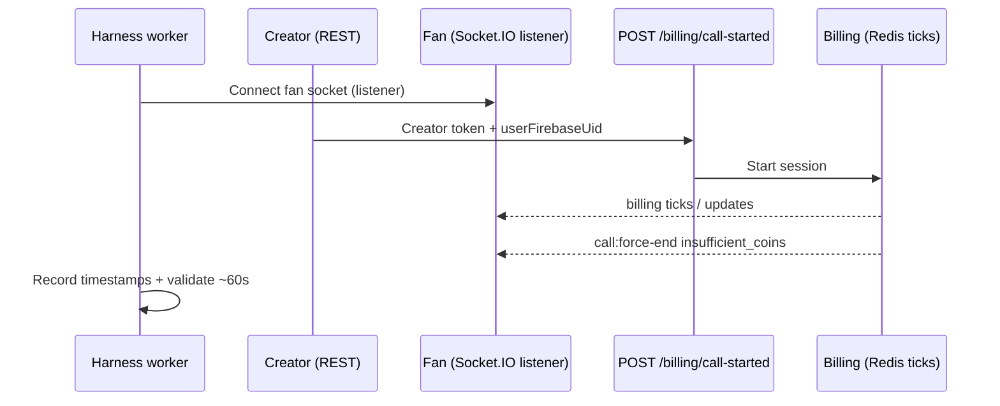

# Load test: Creator calls user (50 concurrent, 60 coins @ 60 CPM)

**Report generated:** 2026-05-18T19:06:50.232Z
**Run timestamp (harness):** 2026-05-18T19:02:36.241Z
**Harness:** `scripts/load-test/socket-force-end-test.mjs`
**Initiator:** `creator`
**Results artifact:** `scripts/load-test/force-end-multi-results-2026-05-18T19-02-36-241Z.json`

## Scope

This run simulates **50 concurrent creators initiating billable 1:1 video calls** to paired load-test fans.

- **Auth on `POST /billing/call-started`:** creator Firebase ID token
- **Request body includes:** `userFirebaseUid` (fan who pays)
- **Socket.IO client:** fan connects and listens for `call:force-end` (`insufficient_coins`)
- **`callId` format:** `{creatorFirebaseUid}_{creatorMongoId}_{epochMs}`

**Out of scope:** real WebRTC / Stream video media. The harness exercises **Redis billing ticks, Socket.IO lifecycle, wallet drain, force-end timing, and Mongo `CallHistory` / `CoinTransaction` settlement** under load.

## Expected billing math

| Input | Value |
|-------|--------|
| Fan wallet (seed) | 60 coins |
| Creator price | 60 coins/min (CPM) |
| Theoretical max duration | (coins × 60) / CPM ≈ **60 s** wall time |
| End signal | `call:force-end` with `reason: insufficient_coins` on **fan** socket |
| Fan balance after call | **0** coins |
| Typical Mongo settlement | `coinsDeducted: 60`, `durationSeconds: 59`, creator `coinsEarned: ~17` (platform share) |

## Test flow



## Environment prerequisites

| Requirement | Notes |
|-------------|--------|
| Single backend on `:3000` | No duplicate billing workers |
| `REDIS_URL` reachable | Public/dev Redis for billing queue |
| `BILLING_ADAPTIVE_LAG_POLICY_ENABLED=false` | Set in **server** shell before `npm run dev` for stable 50-way concurrency |
| `npm run seed:load-test` | 50 fan/creator pairs → `scripts/load-test/pairs.generated.json` |
| `with-dev-env.ps1` | TLS + DNS for Mongo SRV (`LOAD_TEST_DNS_SERVERS`) |
| `FORCE_END_TEST_MAX_WAIT_MS` | **180000** recommended under load |

## Configuration (this run)

| Parameter | Value |
|-----------|--------|
| Direction | Creator → User |
| Concurrent sessions | 50 |
| Fan coins (seed) | 60 |
| Creator price (coins/min) | 60 |
| Expected billed duration | ~60 s |
| Natural exhaustion only | yes |
| BASE_URL | http://127.0.0.1:3000 |
| callId pattern | `{creatorUid}_{creatorMongoId}_{ts}` |

## Executive summary

- **Passed:** 50 / 50
- **Failed:** 0
- **Harness duration (billing REST start → force-end):** min 58.183 s, max 58.802 s, mean 58.366 s, median 58.357 s, σ 0.100 s
- **Skew vs 60 s target:** ~−1.2 to −1.8 s (billing starts after socket + REST latency; consistent across sessions)
- **Mongo CallHistory (50 sessions):** coinsDeducted all 60, durationSeconds 59–59 (mean 59.0), coinsEarned 17–17 (mean 17.0)
- **Fan remaining coins after force-end:** all 0

## Duration statistics (harness)

| Metric | Seconds |
|--------|---------|
| Sample count (passed) | 50 |
| Min | 58.183 |
| Max | 58.802 |
| Mean | 58.366 |
| Median | 58.357 |
| Std dev | 0.100 |

## Mongo settlement validation

| Check | Result |
|-------|--------|
| Sessions with CallHistory attached | 50 / 50 |
| All fans at 0 coins after force-end | ✓ |
| All `coinsDeducted === 60` | ✓ |
| `durationSeconds` range | 59 – 59 (mean 59.00) |
| `coinsEarned` (creator) range | 17 – 17 (mean 17.00) |

## Per-session summary

| User | Fan | Creator | call-started (ISO) | force-end (ISO) | Duration (s) | Skew | Remaining | CH deducted | CH earned | CH duration |
|------|-----|---------|----------------------|-----------------|--------------|------|-----------|-------------|-----------|-------------|
| 1 | loadtest_fan_1 | loadtest_creator_1 | 2026-05-18T19:01:36.850Z | 2026-05-18T19:02:35.349Z | 58.499 | -1.501 | 0 | 60 | 17 | 59 |
| 2 | loadtest_fan_2 | loadtest_creator_2 | 2026-05-18T19:01:37.018Z | 2026-05-18T19:02:35.346Z | 58.328 | -1.672 | 0 | 60 | 17 | 59 |
| 3 | loadtest_fan_3 | loadtest_creator_3 | 2026-05-18T19:01:36.156Z | 2026-05-18T19:02:34.440Z | 58.284 | -1.716 | 0 | 60 | 17 | 59 |
| 4 | loadtest_fan_4 | loadtest_creator_4 | 2026-05-18T19:01:37.018Z | 2026-05-18T19:02:35.341Z | 58.323 | -1.677 | 0 | 60 | 17 | 59 |
| 5 | loadtest_fan_5 | loadtest_creator_5 | 2026-05-18T19:01:37.023Z | 2026-05-18T19:02:35.789Z | 58.766 | -1.234 | 0 | 60 | 17 | 59 |
| 6 | loadtest_fan_6 | loadtest_creator_6 | 2026-05-18T19:01:37.956Z | 2026-05-18T19:02:36.230Z | 58.274 | -1.726 | 0 | 60 | 17 | 59 |
| 7 | loadtest_fan_7 | loadtest_creator_7 | 2026-05-18T19:01:37.018Z | 2026-05-18T19:02:35.347Z | 58.329 | -1.671 | 0 | 60 | 17 | 59 |
| 8 | loadtest_fan_8 | loadtest_creator_8 | 2026-05-18T19:01:36.986Z | 2026-05-18T19:02:35.348Z | 58.362 | -1.638 | 0 | 60 | 17 | 59 |
| 9 | loadtest_fan_9 | loadtest_creator_9 | 2026-05-18T19:01:37.020Z | 2026-05-18T19:02:35.382Z | 58.362 | -1.638 | 0 | 60 | 17 | 59 |
| 10 | loadtest_fan_10 | loadtest_creator_10 | 2026-05-18T19:01:37.982Z | 2026-05-18T19:02:36.235Z | 58.253 | -1.747 | 0 | 60 | 17 | 59 |
| 11 | loadtest_fan_11 | loadtest_creator_11 | 2026-05-18T19:01:37.019Z | 2026-05-18T19:02:35.347Z | 58.328 | -1.672 | 0 | 60 | 17 | 59 |
| 12 | loadtest_fan_12 | loadtest_creator_12 | 2026-05-18T19:01:36.990Z | 2026-05-18T19:02:35.348Z | 58.358 | -1.642 | 0 | 60 | 17 | 59 |
| 13 | loadtest_fan_13 | loadtest_creator_13 | 2026-05-18T19:01:36.190Z | 2026-05-18T19:02:34.449Z | 58.259 | -1.741 | 0 | 60 | 17 | 59 |
| 14 | loadtest_fan_14 | loadtest_creator_14 | 2026-05-18T19:01:37.868Z | 2026-05-18T19:02:36.237Z | 58.369 | -1.631 | 0 | 60 | 17 | 59 |
| 15 | loadtest_fan_15 | loadtest_creator_15 | 2026-05-18T19:01:36.911Z | 2026-05-18T19:02:35.342Z | 58.431 | -1.569 | 0 | 60 | 17 | 59 |
| 16 | loadtest_fan_16 | loadtest_creator_16 | 2026-05-18T19:01:36.985Z | 2026-05-18T19:02:35.341Z | 58.356 | -1.644 | 0 | 60 | 17 | 59 |
| 17 | loadtest_fan_17 | loadtest_creator_17 | 2026-05-18T19:01:37.041Z | 2026-05-18T19:02:35.344Z | 58.303 | -1.697 | 0 | 60 | 17 | 59 |
| 18 | loadtest_fan_18 | loadtest_creator_18 | 2026-05-18T19:01:37.030Z | 2026-05-18T19:02:35.338Z | 58.308 | -1.692 | 0 | 60 | 17 | 59 |
| 19 | loadtest_fan_19 | loadtest_creator_19 | 2026-05-18T19:01:37.034Z | 2026-05-18T19:02:35.382Z | 58.348 | -1.652 | 0 | 60 | 17 | 59 |
| 20 | loadtest_fan_20 | loadtest_creator_20 | 2026-05-18T19:01:36.989Z | 2026-05-18T19:02:35.343Z | 58.354 | -1.646 | 0 | 60 | 17 | 59 |
| 21 | loadtest_fan_21 | loadtest_creator_21 | 2026-05-18T19:01:37.869Z | 2026-05-18T19:02:36.235Z | 58.366 | -1.634 | 0 | 60 | 17 | 59 |
| 22 | loadtest_fan_22 | loadtest_creator_22 | 2026-05-18T19:01:37.920Z | 2026-05-18T19:02:36.238Z | 58.318 | -1.682 | 0 | 60 | 17 | 59 |
| 23 | loadtest_fan_23 | loadtest_creator_23 | 2026-05-18T19:01:36.988Z | 2026-05-18T19:02:35.790Z | 58.802 | -1.198 | 0 | 60 | 17 | 59 |
| 24 | loadtest_fan_24 | loadtest_creator_24 | 2026-05-18T19:01:37.869Z | 2026-05-18T19:02:36.238Z | 58.369 | -1.631 | 0 | 60 | 17 | 59 |
| 25 | loadtest_fan_25 | loadtest_creator_25 | 2026-05-18T19:01:36.267Z | 2026-05-18T19:02:34.450Z | 58.183 | -1.817 | 0 | 60 | 17 | 59 |
| 26 | loadtest_fan_26 | loadtest_creator_26 | 2026-05-18T19:01:37.855Z | 2026-05-18T19:02:36.238Z | 58.383 | -1.617 | 0 | 60 | 17 | 59 |
| 27 | loadtest_fan_27 | loadtest_creator_27 | 2026-05-18T19:01:37.035Z | 2026-05-18T19:02:35.381Z | 58.346 | -1.654 | 0 | 60 | 17 | 59 |
| 28 | loadtest_fan_28 | loadtest_creator_28 | 2026-05-18T19:01:36.147Z | 2026-05-18T19:02:34.450Z | 58.303 | -1.697 | 0 | 60 | 17 | 59 |
| 29 | loadtest_fan_29 | loadtest_creator_29 | 2026-05-18T19:01:36.987Z | 2026-05-18T19:02:35.339Z | 58.352 | -1.648 | 0 | 60 | 17 | 59 |
| 30 | loadtest_fan_30 | loadtest_creator_30 | 2026-05-18T19:01:36.930Z | 2026-05-18T19:02:35.348Z | 58.418 | -1.582 | 0 | 60 | 17 | 59 |
| 31 | loadtest_fan_31 | loadtest_creator_31 | 2026-05-18T19:01:36.144Z | 2026-05-18T19:02:34.439Z | 58.295 | -1.705 | 0 | 60 | 17 | 59 |
| 32 | loadtest_fan_32 | loadtest_creator_32 | 2026-05-18T19:01:36.141Z | 2026-05-18T19:02:34.446Z | 58.305 | -1.695 | 0 | 60 | 17 | 59 |
| 33 | loadtest_fan_33 | loadtest_creator_33 | 2026-05-18T19:01:36.147Z | 2026-05-18T19:02:34.452Z | 58.305 | -1.695 | 0 | 60 | 17 | 59 |
| 34 | loadtest_fan_34 | loadtest_creator_34 | 2026-05-18T19:01:37.855Z | 2026-05-18T19:02:36.229Z | 58.374 | -1.626 | 0 | 60 | 17 | 59 |
| 35 | loadtest_fan_35 | loadtest_creator_35 | 2026-05-18T19:01:36.963Z | 2026-05-18T19:02:35.339Z | 58.376 | -1.624 | 0 | 60 | 17 | 59 |
| 36 | loadtest_fan_36 | loadtest_creator_36 | 2026-05-18T19:01:36.988Z | 2026-05-18T19:02:35.381Z | 58.393 | -1.607 | 0 | 60 | 17 | 59 |
| 37 | loadtest_fan_37 | loadtest_creator_37 | 2026-05-18T19:01:36.963Z | 2026-05-18T19:02:35.346Z | 58.383 | -1.617 | 0 | 60 | 17 | 59 |
| 38 | loadtest_fan_38 | loadtest_creator_38 | 2026-05-18T19:01:36.986Z | 2026-05-18T19:02:35.342Z | 58.356 | -1.644 | 0 | 60 | 17 | 59 |
| 39 | loadtest_fan_39 | loadtest_creator_39 | 2026-05-18T19:01:36.885Z | 2026-05-18T19:02:35.339Z | 58.454 | -1.546 | 0 | 60 | 17 | 59 |
| 40 | loadtest_fan_40 | loadtest_creator_40 | 2026-05-18T19:01:37.023Z | 2026-05-18T19:02:35.343Z | 58.320 | -1.680 | 0 | 60 | 17 | 59 |
| 41 | loadtest_fan_41 | loadtest_creator_41 | 2026-05-18T19:01:36.988Z | 2026-05-18T19:02:35.381Z | 58.393 | -1.607 | 0 | 60 | 17 | 59 |
| 42 | loadtest_fan_42 | loadtest_creator_42 | 2026-05-18T19:01:36.144Z | 2026-05-18T19:02:34.450Z | 58.306 | -1.694 | 0 | 60 | 17 | 59 |
| 43 | loadtest_fan_43 | loadtest_creator_43 | 2026-05-18T19:01:36.986Z | 2026-05-18T19:02:35.349Z | 58.363 | -1.637 | 0 | 60 | 17 | 59 |
| 44 | loadtest_fan_44 | loadtest_creator_44 | 2026-05-18T19:01:36.964Z | 2026-05-18T19:02:35.339Z | 58.375 | -1.625 | 0 | 60 | 17 | 59 |
| 45 | loadtest_fan_45 | loadtest_creator_45 | 2026-05-18T19:01:36.985Z | 2026-05-18T19:02:35.382Z | 58.397 | -1.603 | 0 | 60 | 17 | 59 |
| 46 | loadtest_fan_46 | loadtest_creator_46 | 2026-05-18T19:01:37.855Z | 2026-05-18T19:02:36.237Z | 58.382 | -1.618 | 0 | 60 | 17 | 59 |
| 47 | loadtest_fan_47 | loadtest_creator_47 | 2026-05-18T19:01:37.019Z | 2026-05-18T19:02:35.347Z | 58.328 | -1.672 | 0 | 60 | 17 | 59 |
| 48 | loadtest_fan_48 | loadtest_creator_48 | 2026-05-18T19:01:36.929Z | 2026-05-18T19:02:35.347Z | 58.418 | -1.582 | 0 | 60 | 17 | 59 |
| 49 | loadtest_fan_49 | loadtest_creator_49 | 2026-05-18T19:01:36.964Z | 2026-05-18T19:02:35.349Z | 58.385 | -1.615 | 0 | 60 | 17 | 59 |
| 50 | loadtest_fan_50 | loadtest_creator_50 | 2026-05-18T19:01:36.987Z | 2026-05-18T19:02:35.348Z | 58.361 | -1.639 | 0 | 60 | 17 | 59 |

## Per-user timestamp logs

### User 1 — loadtest_fan_1@loadtest.local

- **Direction:** Creator calls user
- **Fan:** loadtest_fan_1@loadtest.local
- **Creator:** loadtest_creator_1@loadtest.local
- **callId:** `dfmWVLam5Dg1AgtLvKm2bTIIc2G2_6a0b5fd87abdc75c532cf754_1779130895313`
- **call-started HTTP:** 200

**Timeline (ISO 8601):**

| Event | Timestamp |
|-------|-----------|
| workerStartedAt | 2026-05-18T19:01:34.067Z |
| socketConnectedAt (fan) | 2026-05-18T19:01:35.313Z |
| billingRestStartedAt | 2026-05-18T19:01:36.850Z |
| billingStartedEventAt | 2026-05-18T19:01:36.597Z |
| lastBillingUpdateAt | 2026-05-18T19:02:35.346Z |
| forceEndAt | 2026-05-18T19:02:35.349Z |

**Outcomes:**

- **Harness duration:** 58.499 s (skew -1.501 s vs expected 60 s)
- **forceEndReason:** `insufficient_coins`
- **remainingCoins (fan):** 0

**CallHistory (Mongo):**

- durationSeconds: 59
- coinsDeducted: 60
- coinsEarned: 17
- recordCount: 2

### User 2 — loadtest_fan_2@loadtest.local

- **Direction:** Creator calls user
- **Fan:** loadtest_fan_2@loadtest.local
- **Creator:** loadtest_creator_2@loadtest.local
- **callId:** `PNKpXIvZzOc1Mg2ZfXvfe3NfpKM2_6a0b5fdb7abdc75c532cf75d_1779130895445`
- **call-started HTTP:** 200

**Timeline (ISO 8601):**

| Event | Timestamp |
|-------|-----------|
| workerStartedAt | 2026-05-18T19:01:34.070Z |
| socketConnectedAt (fan) | 2026-05-18T19:01:35.445Z |
| billingRestStartedAt | 2026-05-18T19:01:37.018Z |
| billingStartedEventAt | 2026-05-18T19:01:36.762Z |
| lastBillingUpdateAt | 2026-05-18T19:02:35.344Z |
| forceEndAt | 2026-05-18T19:02:35.346Z |

**Outcomes:**

- **Harness duration:** 58.328 s (skew -1.672 s vs expected 60 s)
- **forceEndReason:** `insufficient_coins`
- **remainingCoins (fan):** 0

**CallHistory (Mongo):**

- durationSeconds: 59
- coinsDeducted: 60
- coinsEarned: 17
- recordCount: 2

### User 3 — loadtest_fan_3@loadtest.local

- **Direction:** Creator calls user
- **Fan:** loadtest_fan_3@loadtest.local
- **Creator:** loadtest_creator_3@loadtest.local
- **callId:** `Arl1SlpzzeVQZmPCfWyf0JbCAs93_6a0b5fdd7abdc75c532cf766_1779130895296`
- **call-started HTTP:** 200

**Timeline (ISO 8601):**

| Event | Timestamp |
|-------|-----------|
| workerStartedAt | 2026-05-18T19:01:34.070Z |
| socketConnectedAt (fan) | 2026-05-18T19:01:35.296Z |
| billingRestStartedAt | 2026-05-18T19:01:36.156Z |
| billingStartedEventAt | 2026-05-18T19:01:35.922Z |
| lastBillingUpdateAt | 2026-05-18T19:02:34.440Z |
| forceEndAt | 2026-05-18T19:02:34.440Z |

**Outcomes:**

- **Harness duration:** 58.284 s (skew -1.716 s vs expected 60 s)
- **forceEndReason:** `insufficient_coins`
- **remainingCoins (fan):** 0

**CallHistory (Mongo):**

- durationSeconds: 59
- coinsDeducted: 60
- coinsEarned: 17
- recordCount: 2

### User 4 — loadtest_fan_4@loadtest.local

- **Direction:** Creator calls user
- **Fan:** loadtest_fan_4@loadtest.local
- **Creator:** loadtest_creator_4@loadtest.local
- **callId:** `GVXU8IsLQSZjcIGnMwVZsYRn1k03_6a0b5fe07abdc75c532cf76f_1779130895447`
- **call-started HTTP:** 200

**Timeline (ISO 8601):**

| Event | Timestamp |
|-------|-----------|
| workerStartedAt | 2026-05-18T19:01:34.070Z |
| socketConnectedAt (fan) | 2026-05-18T19:01:35.447Z |
| billingRestStartedAt | 2026-05-18T19:01:37.018Z |
| billingStartedEventAt | 2026-05-18T19:01:36.764Z |
| lastBillingUpdateAt | 2026-05-18T19:02:35.340Z |
| forceEndAt | 2026-05-18T19:02:35.341Z |

**Outcomes:**

- **Harness duration:** 58.323 s (skew -1.677 s vs expected 60 s)
- **forceEndReason:** `insufficient_coins`
- **remainingCoins (fan):** 0

**CallHistory (Mongo):**

- durationSeconds: 59
- coinsDeducted: 60
- coinsEarned: 17
- recordCount: 2

### User 5 — loadtest_fan_5@loadtest.local

- **Direction:** Creator calls user
- **Fan:** loadtest_fan_5@loadtest.local
- **Creator:** loadtest_creator_5@loadtest.local
- **callId:** `wSaIiKwbYbY2dUfTeSEXIxhaqEq1_6a0b5fe27abdc75c532cf778_1779130895431`
- **call-started HTTP:** 200

**Timeline (ISO 8601):**

| Event | Timestamp |
|-------|-----------|
| workerStartedAt | 2026-05-18T19:01:34.070Z |
| socketConnectedAt (fan) | 2026-05-18T19:01:35.431Z |
| billingRestStartedAt | 2026-05-18T19:01:37.023Z |
| billingStartedEventAt | 2026-05-18T19:01:36.798Z |
| lastBillingUpdateAt | 2026-05-18T19:02:35.789Z |
| forceEndAt | 2026-05-18T19:02:35.789Z |

**Outcomes:**

- **Harness duration:** 58.766 s (skew -1.234 s vs expected 60 s)
- **forceEndReason:** `insufficient_coins`
- **remainingCoins (fan):** 0

**CallHistory (Mongo):**

- durationSeconds: 59
- coinsDeducted: 60
- coinsEarned: 17
- recordCount: 2

### User 6 — loadtest_fan_6@loadtest.local

- **Direction:** Creator calls user
- **Fan:** loadtest_fan_6@loadtest.local
- **Creator:** loadtest_creator_6@loadtest.local
- **callId:** `EPjKfZxhPiel735f1bEXhJyiIoN2_6a0b5fe57abdc75c532cf781_1779130895518`
- **call-started HTTP:** 200

**Timeline (ISO 8601):**

| Event | Timestamp |
|-------|-----------|
| workerStartedAt | 2026-05-18T19:01:34.070Z |
| socketConnectedAt (fan) | 2026-05-18T19:01:35.518Z |
| billingRestStartedAt | 2026-05-18T19:01:37.956Z |
| billingStartedEventAt | 2026-05-18T19:01:37.691Z |
| lastBillingUpdateAt | 2026-05-18T19:02:36.230Z |
| forceEndAt | 2026-05-18T19:02:36.230Z |

**Outcomes:**

- **Harness duration:** 58.274 s (skew -1.726 s vs expected 60 s)
- **forceEndReason:** `insufficient_coins`
- **remainingCoins (fan):** 0

**CallHistory (Mongo):**

- durationSeconds: 59
- coinsDeducted: 60
- coinsEarned: 17
- recordCount: 2

### User 7 — loadtest_fan_7@loadtest.local

- **Direction:** Creator calls user
- **Fan:** loadtest_fan_7@loadtest.local
- **Creator:** loadtest_creator_7@loadtest.local
- **callId:** `VSVrxdLD5ygtg0u5kdbfAAdBIpU2_6a0b5fe77abdc75c532cf78a_1779130895427`
- **call-started HTTP:** 200

**Timeline (ISO 8601):**

| Event | Timestamp |
|-------|-----------|
| workerStartedAt | 2026-05-18T19:01:34.070Z |
| socketConnectedAt (fan) | 2026-05-18T19:01:35.427Z |
| billingRestStartedAt | 2026-05-18T19:01:37.018Z |
| billingStartedEventAt | 2026-05-18T19:01:36.761Z |
| lastBillingUpdateAt | 2026-05-18T19:02:35.345Z |
| forceEndAt | 2026-05-18T19:02:35.347Z |

**Outcomes:**

- **Harness duration:** 58.329 s (skew -1.671 s vs expected 60 s)
- **forceEndReason:** `insufficient_coins`
- **remainingCoins (fan):** 0

**CallHistory (Mongo):**

- durationSeconds: 59
- coinsDeducted: 60
- coinsEarned: 17
- recordCount: 2

### User 8 — loadtest_fan_8@loadtest.local

- **Direction:** Creator calls user
- **Fan:** loadtest_fan_8@loadtest.local
- **Creator:** loadtest_creator_8@loadtest.local
- **callId:** `bTBl1P6uWqVsxvz1ld7P17mlSkM2_6a0b5fea7abdc75c532cf793_1779130895403`
- **call-started HTTP:** 200

**Timeline (ISO 8601):**

| Event | Timestamp |
|-------|-----------|
| workerStartedAt | 2026-05-18T19:01:34.070Z |
| socketConnectedAt (fan) | 2026-05-18T19:01:35.403Z |
| billingRestStartedAt | 2026-05-18T19:01:36.986Z |
| billingStartedEventAt | 2026-05-18T19:01:36.718Z |
| lastBillingUpdateAt | 2026-05-18T19:02:35.345Z |
| forceEndAt | 2026-05-18T19:02:35.348Z |

**Outcomes:**

- **Harness duration:** 58.362 s (skew -1.638 s vs expected 60 s)
- **forceEndReason:** `insufficient_coins`
- **remainingCoins (fan):** 0

**CallHistory (Mongo):**

- durationSeconds: 59
- coinsDeducted: 60
- coinsEarned: 17
- recordCount: 2

### User 9 — loadtest_fan_9@loadtest.local

- **Direction:** Creator calls user
- **Fan:** loadtest_fan_9@loadtest.local
- **Creator:** loadtest_creator_9@loadtest.local
- **callId:** `fpZUW3HzyTNZzlS20M6fbe9STPo2_6a0b5fec7abdc75c532cf79c_1779130895433`
- **call-started HTTP:** 200

**Timeline (ISO 8601):**

| Event | Timestamp |
|-------|-----------|
| workerStartedAt | 2026-05-18T19:01:34.070Z |
| socketConnectedAt (fan) | 2026-05-18T19:01:35.433Z |
| billingRestStartedAt | 2026-05-18T19:01:37.020Z |
| billingStartedEventAt | 2026-05-18T19:01:36.772Z |
| lastBillingUpdateAt | 2026-05-18T19:02:35.380Z |
| forceEndAt | 2026-05-18T19:02:35.382Z |

**Outcomes:**

- **Harness duration:** 58.362 s (skew -1.638 s vs expected 60 s)
- **forceEndReason:** `insufficient_coins`
- **remainingCoins (fan):** 0

**CallHistory (Mongo):**

- durationSeconds: 59
- coinsDeducted: 60
- coinsEarned: 17
- recordCount: 2

### User 10 — loadtest_fan_10@loadtest.local

- **Direction:** Creator calls user
- **Fan:** loadtest_fan_10@loadtest.local
- **Creator:** loadtest_creator_10@loadtest.local
- **callId:** `Jaf6N8qgPPMji8yfQSANqkgXvnu2_6a0b5fee7abdc75c532cf7a5_1779130895530`
- **call-started HTTP:** 200

**Timeline (ISO 8601):**

| Event | Timestamp |
|-------|-----------|
| workerStartedAt | 2026-05-18T19:01:34.070Z |
| socketConnectedAt (fan) | 2026-05-18T19:01:35.530Z |
| billingRestStartedAt | 2026-05-18T19:01:37.982Z |
| billingStartedEventAt | 2026-05-18T19:01:37.722Z |
| lastBillingUpdateAt | 2026-05-18T19:02:36.235Z |
| forceEndAt | 2026-05-18T19:02:36.235Z |

**Outcomes:**

- **Harness duration:** 58.253 s (skew -1.747 s vs expected 60 s)
- **forceEndReason:** `insufficient_coins`
- **remainingCoins (fan):** 0

**CallHistory (Mongo):**

- durationSeconds: 59
- coinsDeducted: 60
- coinsEarned: 17
- recordCount: 2

### User 11 — loadtest_fan_11@loadtest.local

- **Direction:** Creator calls user
- **Fan:** loadtest_fan_11@loadtest.local
- **Creator:** loadtest_creator_11@loadtest.local
- **callId:** `QyxknrfbCjWRv7JVDCbWFcdpksf1_6a0b5ff17abdc75c532cf7ae_1779130895443`
- **call-started HTTP:** 200

**Timeline (ISO 8601):**

| Event | Timestamp |
|-------|-----------|
| workerStartedAt | 2026-05-18T19:01:34.070Z |
| socketConnectedAt (fan) | 2026-05-18T19:01:35.443Z |
| billingRestStartedAt | 2026-05-18T19:01:37.019Z |
| billingStartedEventAt | 2026-05-18T19:01:36.765Z |
| lastBillingUpdateAt | 2026-05-18T19:02:35.344Z |
| forceEndAt | 2026-05-18T19:02:35.347Z |

**Outcomes:**

- **Harness duration:** 58.328 s (skew -1.672 s vs expected 60 s)
- **forceEndReason:** `insufficient_coins`
- **remainingCoins (fan):** 0

**CallHistory (Mongo):**

- durationSeconds: 59
- coinsDeducted: 60
- coinsEarned: 17
- recordCount: 2

### User 12 — loadtest_fan_12@loadtest.local

- **Direction:** Creator calls user
- **Fan:** loadtest_fan_12@loadtest.local
- **Creator:** loadtest_creator_12@loadtest.local
- **callId:** `WmqqNDVUpyaDxqs3F4B8FvslKYe2_6a0b5ff37abdc75c532cf7b7_1779130895424`
- **call-started HTTP:** 200

**Timeline (ISO 8601):**

| Event | Timestamp |
|-------|-----------|
| workerStartedAt | 2026-05-18T19:01:34.070Z |
| socketConnectedAt (fan) | 2026-05-18T19:01:35.424Z |
| billingRestStartedAt | 2026-05-18T19:01:36.990Z |
| billingStartedEventAt | 2026-05-18T19:01:36.760Z |
| lastBillingUpdateAt | 2026-05-18T19:02:35.345Z |
| forceEndAt | 2026-05-18T19:02:35.348Z |

**Outcomes:**

- **Harness duration:** 58.358 s (skew -1.642 s vs expected 60 s)
- **forceEndReason:** `insufficient_coins`
- **remainingCoins (fan):** 0

**CallHistory (Mongo):**

- durationSeconds: 59
- coinsDeducted: 60
- coinsEarned: 17
- recordCount: 2

### User 13 — loadtest_fan_13@loadtest.local

- **Direction:** Creator calls user
- **Fan:** loadtest_fan_13@loadtest.local
- **Creator:** loadtest_creator_13@loadtest.local
- **callId:** `UvGQOpXNsMSthj9LGEfUBcnVeLy2_6a0b5ff67abdc75c532cf7c0_1779130895280`
- **call-started HTTP:** 200

**Timeline (ISO 8601):**

| Event | Timestamp |
|-------|-----------|
| workerStartedAt | 2026-05-18T19:01:34.070Z |
| socketConnectedAt (fan) | 2026-05-18T19:01:35.280Z |
| billingRestStartedAt | 2026-05-18T19:01:36.190Z |
| billingStartedEventAt | 2026-05-18T19:01:35.933Z |
| lastBillingUpdateAt | 2026-05-18T19:02:34.447Z |
| forceEndAt | 2026-05-18T19:02:34.449Z |

**Outcomes:**

- **Harness duration:** 58.259 s (skew -1.741 s vs expected 60 s)
- **forceEndReason:** `insufficient_coins`
- **remainingCoins (fan):** 0

**CallHistory (Mongo):**

- durationSeconds: 59
- coinsDeducted: 60
- coinsEarned: 17
- recordCount: 2

### User 14 — loadtest_fan_14@loadtest.local

- **Direction:** Creator calls user
- **Fan:** loadtest_fan_14@loadtest.local
- **Creator:** loadtest_creator_14@loadtest.local
- **callId:** `MU7l7ipZ29MJm9aOrQMYIsv6uLj1_6a0b5ff87abdc75c532cf7c9_1779130895529`
- **call-started HTTP:** 200

**Timeline (ISO 8601):**

| Event | Timestamp |
|-------|-----------|
| workerStartedAt | 2026-05-18T19:01:34.070Z |
| socketConnectedAt (fan) | 2026-05-18T19:01:35.529Z |
| billingRestStartedAt | 2026-05-18T19:01:37.868Z |
| billingStartedEventAt | 2026-05-18T19:01:37.598Z |
| lastBillingUpdateAt | 2026-05-18T19:02:36.236Z |
| forceEndAt | 2026-05-18T19:02:36.237Z |

**Outcomes:**

- **Harness duration:** 58.369 s (skew -1.631 s vs expected 60 s)
- **forceEndReason:** `insufficient_coins`
- **remainingCoins (fan):** 0

**CallHistory (Mongo):**

- durationSeconds: 59
- coinsDeducted: 60
- coinsEarned: 17
- recordCount: 2

### User 15 — loadtest_fan_15@loadtest.local

- **Direction:** Creator calls user
- **Fan:** loadtest_fan_15@loadtest.local
- **Creator:** loadtest_creator_15@loadtest.local
- **callId:** `IMj9xYkgbfdW58sOMDvGG5fCGcY2_6a0b5ffb7abdc75c532cf7d2_1779130895329`
- **call-started HTTP:** 200

**Timeline (ISO 8601):**

| Event | Timestamp |
|-------|-----------|
| workerStartedAt | 2026-05-18T19:01:34.070Z |
| socketConnectedAt (fan) | 2026-05-18T19:01:35.329Z |
| billingRestStartedAt | 2026-05-18T19:01:36.911Z |
| billingStartedEventAt | 2026-05-18T19:01:36.657Z |
| lastBillingUpdateAt | 2026-05-18T19:02:35.341Z |
| forceEndAt | 2026-05-18T19:02:35.342Z |

**Outcomes:**

- **Harness duration:** 58.431 s (skew -1.569 s vs expected 60 s)
- **forceEndReason:** `insufficient_coins`
- **remainingCoins (fan):** 0

**CallHistory (Mongo):**

- durationSeconds: 59
- coinsDeducted: 60
- coinsEarned: 17
- recordCount: 2

### User 16 — loadtest_fan_16@loadtest.local

- **Direction:** Creator calls user
- **Fan:** loadtest_fan_16@loadtest.local
- **Creator:** loadtest_creator_16@loadtest.local
- **callId:** `HukA8OPX7GZSLHu3Ylh0jkf30Ez2_6a0b5ffd7abdc75c532cf7db_1779130895352`
- **call-started HTTP:** 200

**Timeline (ISO 8601):**

| Event | Timestamp |
|-------|-----------|
| workerStartedAt | 2026-05-18T19:01:34.070Z |
| socketConnectedAt (fan) | 2026-05-18T19:01:35.352Z |
| billingRestStartedAt | 2026-05-18T19:01:36.985Z |
| billingStartedEventAt | 2026-05-18T19:01:36.715Z |
| lastBillingUpdateAt | 2026-05-18T19:02:35.341Z |
| forceEndAt | 2026-05-18T19:02:35.341Z |

**Outcomes:**

- **Harness duration:** 58.356 s (skew -1.644 s vs expected 60 s)
- **forceEndReason:** `insufficient_coins`
- **remainingCoins (fan):** 0

**CallHistory (Mongo):**

- durationSeconds: 59
- coinsDeducted: 60
- coinsEarned: 17
- recordCount: 2

### User 17 — loadtest_fan_17@loadtest.local

- **Direction:** Creator calls user
- **Fan:** loadtest_fan_17@loadtest.local
- **Creator:** loadtest_creator_17@loadtest.local
- **callId:** `Ot9MNHfln8Rhkmm1YjcrgtPDbrI2_6a0b60007abdc75c532cf7e4_1779130895516`
- **call-started HTTP:** 200

**Timeline (ISO 8601):**

| Event | Timestamp |
|-------|-----------|
| workerStartedAt | 2026-05-18T19:01:34.070Z |
| socketConnectedAt (fan) | 2026-05-18T19:01:35.516Z |
| billingRestStartedAt | 2026-05-18T19:01:37.041Z |
| billingStartedEventAt | 2026-05-18T19:01:36.802Z |
| lastBillingUpdateAt | 2026-05-18T19:02:35.343Z |
| forceEndAt | 2026-05-18T19:02:35.344Z |

**Outcomes:**

- **Harness duration:** 58.303 s (skew -1.697 s vs expected 60 s)
- **forceEndReason:** `insufficient_coins`
- **remainingCoins (fan):** 0

**CallHistory (Mongo):**

- durationSeconds: 59
- coinsDeducted: 60
- coinsEarned: 17
- recordCount: 2

### User 18 — loadtest_fan_18@loadtest.local

- **Direction:** Creator calls user
- **Fan:** loadtest_fan_18@loadtest.local
- **Creator:** loadtest_creator_18@loadtest.local
- **callId:** `3napYbPsonX6G0lNYgOmPhde3qw2_6a0b60027abdc75c532cf7ed_1779130895449`
- **call-started HTTP:** 200

**Timeline (ISO 8601):**

| Event | Timestamp |
|-------|-----------|
| workerStartedAt | 2026-05-18T19:01:34.070Z |
| socketConnectedAt (fan) | 2026-05-18T19:01:35.449Z |
| billingRestStartedAt | 2026-05-18T19:01:37.030Z |
| billingStartedEventAt | 2026-05-18T19:01:36.799Z |
| lastBillingUpdateAt | 2026-05-18T19:02:35.338Z |
| forceEndAt | 2026-05-18T19:02:35.338Z |

**Outcomes:**

- **Harness duration:** 58.308 s (skew -1.692 s vs expected 60 s)
- **forceEndReason:** `insufficient_coins`
- **remainingCoins (fan):** 0

**CallHistory (Mongo):**

- durationSeconds: 59
- coinsDeducted: 60
- coinsEarned: 17
- recordCount: 2

### User 19 — loadtest_fan_19@loadtest.local

- **Direction:** Creator calls user
- **Fan:** loadtest_fan_19@loadtest.local
- **Creator:** loadtest_creator_19@loadtest.local
- **callId:** `vb0V8IzAlzUfs7hHi331dcjuaxg2_6a0b60057abdc75c532cf7f6_1779130895452`
- **call-started HTTP:** 200

**Timeline (ISO 8601):**

| Event | Timestamp |
|-------|-----------|
| workerStartedAt | 2026-05-18T19:01:34.070Z |
| socketConnectedAt (fan) | 2026-05-18T19:01:35.452Z |
| billingRestStartedAt | 2026-05-18T19:01:37.034Z |
| billingStartedEventAt | 2026-05-18T19:01:36.800Z |
| lastBillingUpdateAt | 2026-05-18T19:02:35.381Z |
| forceEndAt | 2026-05-18T19:02:35.382Z |

**Outcomes:**

- **Harness duration:** 58.348 s (skew -1.652 s vs expected 60 s)
- **forceEndReason:** `insufficient_coins`
- **remainingCoins (fan):** 0

**CallHistory (Mongo):**

- durationSeconds: 59
- coinsDeducted: 60
- coinsEarned: 17
- recordCount: 2

### User 20 — loadtest_fan_20@loadtest.local

- **Direction:** Creator calls user
- **Fan:** loadtest_fan_20@loadtest.local
- **Creator:** loadtest_creator_20@loadtest.local
- **callId:** `L8aVu4RL6odZYzr0ZKBLZbvtwfB3_6a0b60077abdc75c532cf7ff_1779130895422`
- **call-started HTTP:** 200

**Timeline (ISO 8601):**

| Event | Timestamp |
|-------|-----------|
| workerStartedAt | 2026-05-18T19:01:34.070Z |
| socketConnectedAt (fan) | 2026-05-18T19:01:35.422Z |
| billingRestStartedAt | 2026-05-18T19:01:36.989Z |
| billingStartedEventAt | 2026-05-18T19:01:36.759Z |
| lastBillingUpdateAt | 2026-05-18T19:02:35.342Z |
| forceEndAt | 2026-05-18T19:02:35.343Z |

**Outcomes:**

- **Harness duration:** 58.354 s (skew -1.646 s vs expected 60 s)
- **forceEndReason:** `insufficient_coins`
- **remainingCoins (fan):** 0

**CallHistory (Mongo):**

- durationSeconds: 59
- coinsDeducted: 60
- coinsEarned: 17
- recordCount: 2

### User 21 — loadtest_fan_21@loadtest.local

- **Direction:** Creator calls user
- **Fan:** loadtest_fan_21@loadtest.local
- **Creator:** loadtest_creator_21@loadtest.local
- **callId:** `HNMIS4nQaiXjxn3ggrSB0bteRp62_6a0b60097abdc75c532cf808_1779130895519`
- **call-started HTTP:** 200

**Timeline (ISO 8601):**

| Event | Timestamp |
|-------|-----------|
| workerStartedAt | 2026-05-18T19:01:34.070Z |
| socketConnectedAt (fan) | 2026-05-18T19:01:35.519Z |
| billingRestStartedAt | 2026-05-18T19:01:37.869Z |
| billingStartedEventAt | 2026-05-18T19:01:37.599Z |
| lastBillingUpdateAt | 2026-05-18T19:02:36.234Z |
| forceEndAt | 2026-05-18T19:02:36.235Z |

**Outcomes:**

- **Harness duration:** 58.366 s (skew -1.634 s vs expected 60 s)
- **forceEndReason:** `insufficient_coins`
- **remainingCoins (fan):** 0

**CallHistory (Mongo):**

- durationSeconds: 59
- coinsDeducted: 60
- coinsEarned: 17
- recordCount: 2

### User 22 — loadtest_fan_22@loadtest.local

- **Direction:** Creator calls user
- **Fan:** loadtest_fan_22@loadtest.local
- **Creator:** loadtest_creator_22@loadtest.local
- **callId:** `O1uUcrw5XZdi9l7Myk91PBTOicq1_6a0b600c7abdc75c532cf811_1779130895633`
- **call-started HTTP:** 200

**Timeline (ISO 8601):**

| Event | Timestamp |
|-------|-----------|
| workerStartedAt | 2026-05-18T19:01:34.070Z |
| socketConnectedAt (fan) | 2026-05-18T19:01:35.633Z |
| billingRestStartedAt | 2026-05-18T19:01:37.920Z |
| billingStartedEventAt | 2026-05-18T19:01:37.655Z |
| lastBillingUpdateAt | 2026-05-18T19:02:36.236Z |
| forceEndAt | 2026-05-18T19:02:36.238Z |

**Outcomes:**

- **Harness duration:** 58.318 s (skew -1.682 s vs expected 60 s)
- **forceEndReason:** `insufficient_coins`
- **remainingCoins (fan):** 0

**CallHistory (Mongo):**

- durationSeconds: 59
- coinsDeducted: 60
- coinsEarned: 17
- recordCount: 2

### User 23 — loadtest_fan_23@loadtest.local

- **Direction:** Creator calls user
- **Fan:** loadtest_fan_23@loadtest.local
- **Creator:** loadtest_creator_23@loadtest.local
- **callId:** `xehaJx1F3JgWMo5nRGNKH9RFscM2_6a0b600e7abdc75c532cf81a_1779130895417`
- **call-started HTTP:** 200

**Timeline (ISO 8601):**

| Event | Timestamp |
|-------|-----------|
| workerStartedAt | 2026-05-18T19:01:34.070Z |
| socketConnectedAt (fan) | 2026-05-18T19:01:35.417Z |
| billingRestStartedAt | 2026-05-18T19:01:36.988Z |
| billingStartedEventAt | 2026-05-18T19:01:36.748Z |
| lastBillingUpdateAt | 2026-05-18T19:02:35.789Z |
| forceEndAt | 2026-05-18T19:02:35.790Z |

**Outcomes:**

- **Harness duration:** 58.802 s (skew -1.198 s vs expected 60 s)
- **forceEndReason:** `insufficient_coins`
- **remainingCoins (fan):** 0

**CallHistory (Mongo):**

- durationSeconds: 59
- coinsDeducted: 60
- coinsEarned: 17
- recordCount: 2

### User 24 — loadtest_fan_24@loadtest.local

- **Direction:** Creator calls user
- **Fan:** loadtest_fan_24@loadtest.local
- **Creator:** loadtest_creator_24@loadtest.local
- **callId:** `OoF6YDKLLFgbyteCR5sBK349ye53_6a0b60107abdc75c532cf823_1779130895535`
- **call-started HTTP:** 200

**Timeline (ISO 8601):**

| Event | Timestamp |
|-------|-----------|
| workerStartedAt | 2026-05-18T19:01:34.070Z |
| socketConnectedAt (fan) | 2026-05-18T19:01:35.535Z |
| billingRestStartedAt | 2026-05-18T19:01:37.869Z |
| billingStartedEventAt | 2026-05-18T19:01:37.604Z |
| lastBillingUpdateAt | 2026-05-18T19:02:36.236Z |
| forceEndAt | 2026-05-18T19:02:36.238Z |

**Outcomes:**

- **Harness duration:** 58.369 s (skew -1.631 s vs expected 60 s)
- **forceEndReason:** `insufficient_coins`
- **remainingCoins (fan):** 0

**CallHistory (Mongo):**

- durationSeconds: 59
- coinsDeducted: 60
- coinsEarned: 17
- recordCount: 2

### User 25 — loadtest_fan_25@loadtest.local

- **Direction:** Creator calls user
- **Fan:** loadtest_fan_25@loadtest.local
- **Creator:** loadtest_creator_25@loadtest.local
- **callId:** `mnAtwgP3MXNZzLsYyh4qAuhz9aq2_6a0b60137abdc75c532cf82c_1779130895316`
- **call-started HTTP:** 200

**Timeline (ISO 8601):**

| Event | Timestamp |
|-------|-----------|
| workerStartedAt | 2026-05-18T19:01:34.070Z |
| socketConnectedAt (fan) | 2026-05-18T19:01:35.316Z |
| billingRestStartedAt | 2026-05-18T19:01:36.267Z |
| billingStartedEventAt | 2026-05-18T19:01:36.019Z |
| lastBillingUpdateAt | 2026-05-18T19:02:34.449Z |
| forceEndAt | 2026-05-18T19:02:34.450Z |

**Outcomes:**

- **Harness duration:** 58.183 s (skew -1.817 s vs expected 60 s)
- **forceEndReason:** `insufficient_coins`
- **remainingCoins (fan):** 0

**CallHistory (Mongo):**

- durationSeconds: 59
- coinsDeducted: 60
- coinsEarned: 17
- recordCount: 2

### User 26 — loadtest_fan_26@loadtest.local

- **Direction:** Creator calls user
- **Fan:** loadtest_fan_26@loadtest.local
- **Creator:** loadtest_creator_26@loadtest.local
- **callId:** `QIE4umaV1mhum4dzsaCS5BhAwc92_6a0b60157abdc75c532cf835_1779130895455`
- **call-started HTTP:** 200

**Timeline (ISO 8601):**

| Event | Timestamp |
|-------|-----------|
| workerStartedAt | 2026-05-18T19:01:34.070Z |
| socketConnectedAt (fan) | 2026-05-18T19:01:35.455Z |
| billingRestStartedAt | 2026-05-18T19:01:37.855Z |
| billingStartedEventAt | 2026-05-18T19:01:37.593Z |
| lastBillingUpdateAt | 2026-05-18T19:02:36.237Z |
| forceEndAt | 2026-05-18T19:02:36.238Z |

**Outcomes:**

- **Harness duration:** 58.383 s (skew -1.617 s vs expected 60 s)
- **forceEndReason:** `insufficient_coins`
- **remainingCoins (fan):** 0

**CallHistory (Mongo):**

- durationSeconds: 59
- coinsDeducted: 60
- coinsEarned: 17
- recordCount: 2

### User 27 — loadtest_fan_27@loadtest.local

- **Direction:** Creator calls user
- **Fan:** loadtest_fan_27@loadtest.local
- **Creator:** loadtest_creator_27@loadtest.local
- **callId:** `tKMPA4qtLZQv1k3fT1CR5a93Yzr2_6a0b60187abdc75c532cf83e_1779130895454`
- **call-started HTTP:** 200

**Timeline (ISO 8601):**

| Event | Timestamp |
|-------|-----------|
| workerStartedAt | 2026-05-18T19:01:34.070Z |
| socketConnectedAt (fan) | 2026-05-18T19:01:35.453Z |
| billingRestStartedAt | 2026-05-18T19:01:37.035Z |
| billingStartedEventAt | 2026-05-18T19:01:36.801Z |
| lastBillingUpdateAt | 2026-05-18T19:02:35.380Z |
| forceEndAt | 2026-05-18T19:02:35.381Z |

**Outcomes:**

- **Harness duration:** 58.346 s (skew -1.654 s vs expected 60 s)
- **forceEndReason:** `insufficient_coins`
- **remainingCoins (fan):** 0

**CallHistory (Mongo):**

- durationSeconds: 59
- coinsDeducted: 60
- coinsEarned: 17
- recordCount: 2

### User 28 — loadtest_fan_28@loadtest.local

- **Direction:** Creator calls user
- **Fan:** loadtest_fan_28@loadtest.local
- **Creator:** loadtest_creator_28@loadtest.local
- **callId:** `f5Orj4NbF2cQgJssUwZLmIaRQfw2_6a0b601a7abdc75c532cf847_1779130895288`
- **call-started HTTP:** 200

**Timeline (ISO 8601):**

| Event | Timestamp |
|-------|-----------|
| workerStartedAt | 2026-05-18T19:01:34.070Z |
| socketConnectedAt (fan) | 2026-05-18T19:01:35.288Z |
| billingRestStartedAt | 2026-05-18T19:01:36.147Z |
| billingStartedEventAt | 2026-05-18T19:01:35.921Z |
| lastBillingUpdateAt | 2026-05-18T19:02:34.448Z |
| forceEndAt | 2026-05-18T19:02:34.450Z |

**Outcomes:**

- **Harness duration:** 58.303 s (skew -1.697 s vs expected 60 s)
- **forceEndReason:** `insufficient_coins`
- **remainingCoins (fan):** 0

**CallHistory (Mongo):**

- durationSeconds: 59
- coinsDeducted: 60
- coinsEarned: 17
- recordCount: 2

### User 29 — loadtest_fan_29@loadtest.local

- **Direction:** Creator calls user
- **Fan:** loadtest_fan_29@loadtest.local
- **Creator:** loadtest_creator_29@loadtest.local
- **callId:** `A7WXba22mAfpFR6hUcU2CckA6d52_6a0b601c7abdc75c532cf850_1779130895410`
- **call-started HTTP:** 200

**Timeline (ISO 8601):**

| Event | Timestamp |
|-------|-----------|
| workerStartedAt | 2026-05-18T19:01:34.070Z |
| socketConnectedAt (fan) | 2026-05-18T19:01:35.410Z |
| billingRestStartedAt | 2026-05-18T19:01:36.987Z |
| billingStartedEventAt | 2026-05-18T19:01:36.748Z |
| lastBillingUpdateAt | 2026-05-18T19:02:35.338Z |
| forceEndAt | 2026-05-18T19:02:35.339Z |

**Outcomes:**

- **Harness duration:** 58.352 s (skew -1.648 s vs expected 60 s)
- **forceEndReason:** `insufficient_coins`
- **remainingCoins (fan):** 0

**CallHistory (Mongo):**

- durationSeconds: 59
- coinsDeducted: 60
- coinsEarned: 17
- recordCount: 2

### User 30 — loadtest_fan_30@loadtest.local

- **Direction:** Creator calls user
- **Fan:** loadtest_fan_30@loadtest.local
- **Creator:** loadtest_creator_30@loadtest.local
- **callId:** `bhMljd6QUQeTbHnmbJaLJdNqcsh1_6a0b601f7abdc75c532cf859_1779130895336`
- **call-started HTTP:** 200

**Timeline (ISO 8601):**

| Event | Timestamp |
|-------|-----------|
| workerStartedAt | 2026-05-18T19:01:34.070Z |
| socketConnectedAt (fan) | 2026-05-18T19:01:35.336Z |
| billingRestStartedAt | 2026-05-18T19:01:36.930Z |
| billingStartedEventAt | 2026-05-18T19:01:36.690Z |
| lastBillingUpdateAt | 2026-05-18T19:02:35.345Z |
| forceEndAt | 2026-05-18T19:02:35.348Z |

**Outcomes:**

- **Harness duration:** 58.418 s (skew -1.582 s vs expected 60 s)
- **forceEndReason:** `insufficient_coins`
- **remainingCoins (fan):** 0

**CallHistory (Mongo):**

- durationSeconds: 59
- coinsDeducted: 60
- coinsEarned: 17
- recordCount: 2

### User 31 — loadtest_fan_31@loadtest.local

- **Direction:** Creator calls user
- **Fan:** loadtest_fan_31@loadtest.local
- **Creator:** loadtest_creator_31@loadtest.local
- **callId:** `2oTlcQzX33TQ3adVlR0gH9FxdG42_6a0b60217abdc75c532cf862_1779130895285`
- **call-started HTTP:** 200

**Timeline (ISO 8601):**

| Event | Timestamp |
|-------|-----------|
| workerStartedAt | 2026-05-18T19:01:34.070Z |
| socketConnectedAt (fan) | 2026-05-18T19:01:35.285Z |
| billingRestStartedAt | 2026-05-18T19:01:36.144Z |
| billingStartedEventAt | 2026-05-18T19:01:35.918Z |
| lastBillingUpdateAt | 2026-05-18T19:02:34.438Z |
| forceEndAt | 2026-05-18T19:02:34.439Z |

**Outcomes:**

- **Harness duration:** 58.295 s (skew -1.705 s vs expected 60 s)
- **forceEndReason:** `insufficient_coins`
- **remainingCoins (fan):** 0

**CallHistory (Mongo):**

- durationSeconds: 59
- coinsDeducted: 60
- coinsEarned: 17
- recordCount: 2

### User 32 — loadtest_fan_32@loadtest.local

- **Direction:** Creator calls user
- **Fan:** loadtest_fan_32@loadtest.local
- **Creator:** loadtest_creator_32@loadtest.local
- **callId:** `NtfXYyu3h8Wrh94ZROsp7UyBbDJ3_6a0b60247abdc75c532cf86b_1779130895290`
- **call-started HTTP:** 200

**Timeline (ISO 8601):**

| Event | Timestamp |
|-------|-----------|
| workerStartedAt | 2026-05-18T19:01:34.070Z |
| socketConnectedAt (fan) | 2026-05-18T19:01:35.290Z |
| billingRestStartedAt | 2026-05-18T19:01:36.141Z |
| billingStartedEventAt | 2026-05-18T19:01:35.910Z |
| lastBillingUpdateAt | 2026-05-18T19:02:34.445Z |
| forceEndAt | 2026-05-18T19:02:34.446Z |

**Outcomes:**

- **Harness duration:** 58.305 s (skew -1.695 s vs expected 60 s)
- **forceEndReason:** `insufficient_coins`
- **remainingCoins (fan):** 0

**CallHistory (Mongo):**

- durationSeconds: 59
- coinsDeducted: 60
- coinsEarned: 17
- recordCount: 2

### User 33 — loadtest_fan_33@loadtest.local

- **Direction:** Creator calls user
- **Fan:** loadtest_fan_33@loadtest.local
- **Creator:** loadtest_creator_33@loadtest.local
- **callId:** `uItjgRCC1OQqvHeS5ALZB4bHFtJ2_6a0b60267abdc75c532cf874_1779130895304`
- **call-started HTTP:** 200

**Timeline (ISO 8601):**

| Event | Timestamp |
|-------|-----------|
| workerStartedAt | 2026-05-18T19:01:34.070Z |
| socketConnectedAt (fan) | 2026-05-18T19:01:35.304Z |
| billingRestStartedAt | 2026-05-18T19:01:36.147Z |
| billingStartedEventAt | 2026-05-18T19:01:35.920Z |
| lastBillingUpdateAt | 2026-05-18T19:02:34.451Z |
| forceEndAt | 2026-05-18T19:02:34.452Z |

**Outcomes:**

- **Harness duration:** 58.305 s (skew -1.695 s vs expected 60 s)
- **forceEndReason:** `insufficient_coins`
- **remainingCoins (fan):** 0

**CallHistory (Mongo):**

- durationSeconds: 59
- coinsDeducted: 60
- coinsEarned: 17
- recordCount: 2

### User 34 — loadtest_fan_34@loadtest.local

- **Direction:** Creator calls user
- **Fan:** loadtest_fan_34@loadtest.local
- **Creator:** loadtest_creator_34@loadtest.local
- **callId:** `E6sqURn6y1MDY3XvuCfgByiIIq82_6a0b60297abdc75c532cf87d_1779130895326`
- **call-started HTTP:** 200

**Timeline (ISO 8601):**

| Event | Timestamp |
|-------|-----------|
| workerStartedAt | 2026-05-18T19:01:34.070Z |
| socketConnectedAt (fan) | 2026-05-18T19:01:35.326Z |
| billingRestStartedAt | 2026-05-18T19:01:37.855Z |
| billingStartedEventAt | 2026-05-18T19:01:37.597Z |
| lastBillingUpdateAt | 2026-05-18T19:02:36.229Z |
| forceEndAt | 2026-05-18T19:02:36.229Z |

**Outcomes:**

- **Harness duration:** 58.374 s (skew -1.626 s vs expected 60 s)
- **forceEndReason:** `insufficient_coins`
- **remainingCoins (fan):** 0

**CallHistory (Mongo):**

- durationSeconds: 59
- coinsDeducted: 60
- coinsEarned: 17
- recordCount: 2

### User 35 — loadtest_fan_35@loadtest.local

- **Direction:** Creator calls user
- **Fan:** loadtest_fan_35@loadtest.local
- **Creator:** loadtest_creator_35@loadtest.local
- **callId:** `A8d3Kkyj52PuMtwX6MU27tMixSl2_6a0b602b7abdc75c532cf886_1779130895339`
- **call-started HTTP:** 200

**Timeline (ISO 8601):**

| Event | Timestamp |
|-------|-----------|
| workerStartedAt | 2026-05-18T19:01:34.070Z |
| socketConnectedAt (fan) | 2026-05-18T19:01:35.339Z |
| billingRestStartedAt | 2026-05-18T19:01:36.963Z |
| billingStartedEventAt | 2026-05-18T19:01:36.691Z |
| lastBillingUpdateAt | 2026-05-18T19:02:35.338Z |
| forceEndAt | 2026-05-18T19:02:35.339Z |

**Outcomes:**

- **Harness duration:** 58.376 s (skew -1.624 s vs expected 60 s)
- **forceEndReason:** `insufficient_coins`
- **remainingCoins (fan):** 0

**CallHistory (Mongo):**

- durationSeconds: 59
- coinsDeducted: 60
- coinsEarned: 17
- recordCount: 2

### User 36 — loadtest_fan_36@loadtest.local

- **Direction:** Creator calls user
- **Fan:** loadtest_fan_36@loadtest.local
- **Creator:** loadtest_creator_36@loadtest.local
- **callId:** `fJkyC7oUa9aGFxoUzw4VgUFSfpu2_6a0b602e7abdc75c532cf88f_1779130895419`
- **call-started HTTP:** 200

**Timeline (ISO 8601):**

| Event | Timestamp |
|-------|-----------|
| workerStartedAt | 2026-05-18T19:01:34.070Z |
| socketConnectedAt (fan) | 2026-05-18T19:01:35.419Z |
| billingRestStartedAt | 2026-05-18T19:01:36.988Z |
| billingStartedEventAt | 2026-05-18T19:01:36.749Z |
| lastBillingUpdateAt | 2026-05-18T19:02:35.380Z |
| forceEndAt | 2026-05-18T19:02:35.381Z |

**Outcomes:**

- **Harness duration:** 58.393 s (skew -1.607 s vs expected 60 s)
- **forceEndReason:** `insufficient_coins`
- **remainingCoins (fan):** 0

**CallHistory (Mongo):**

- durationSeconds: 59
- coinsDeducted: 60
- coinsEarned: 17
- recordCount: 2

### User 37 — loadtest_fan_37@loadtest.local

- **Direction:** Creator calls user
- **Fan:** loadtest_fan_37@loadtest.local
- **Creator:** loadtest_creator_37@loadtest.local
- **callId:** `OyYYeuGDEGbdMKGGKSYFpfF9Gl23_6a0b60307abdc75c532cf898_1779130895341`
- **call-started HTTP:** 200

**Timeline (ISO 8601):**

| Event | Timestamp |
|-------|-----------|
| workerStartedAt | 2026-05-18T19:01:34.070Z |
| socketConnectedAt (fan) | 2026-05-18T19:01:35.341Z |
| billingRestStartedAt | 2026-05-18T19:01:36.963Z |
| billingStartedEventAt | 2026-05-18T19:01:36.707Z |
| lastBillingUpdateAt | 2026-05-18T19:02:35.344Z |
| forceEndAt | 2026-05-18T19:02:35.346Z |

**Outcomes:**

- **Harness duration:** 58.383 s (skew -1.617 s vs expected 60 s)
- **forceEndReason:** `insufficient_coins`
- **remainingCoins (fan):** 0

**CallHistory (Mongo):**

- durationSeconds: 59
- coinsDeducted: 60
- coinsEarned: 17
- recordCount: 2

### User 38 — loadtest_fan_38@loadtest.local

- **Direction:** Creator calls user
- **Fan:** loadtest_fan_38@loadtest.local
- **Creator:** loadtest_creator_38@loadtest.local
- **callId:** `JObXEKxkGyUtT6X8BbyTTzqpfhC3_6a0b60337abdc75c532cf8a1_1779130895356`
- **call-started HTTP:** 200

**Timeline (ISO 8601):**

| Event | Timestamp |
|-------|-----------|
| workerStartedAt | 2026-05-18T19:01:34.070Z |
| socketConnectedAt (fan) | 2026-05-18T19:01:35.356Z |
| billingRestStartedAt | 2026-05-18T19:01:36.986Z |
| billingStartedEventAt | 2026-05-18T19:01:36.745Z |
| lastBillingUpdateAt | 2026-05-18T19:02:35.341Z |
| forceEndAt | 2026-05-18T19:02:35.342Z |

**Outcomes:**

- **Harness duration:** 58.356 s (skew -1.644 s vs expected 60 s)
- **forceEndReason:** `insufficient_coins`
- **remainingCoins (fan):** 0

**CallHistory (Mongo):**

- durationSeconds: 59
- coinsDeducted: 60
- coinsEarned: 17
- recordCount: 2

### User 39 — loadtest_fan_39@loadtest.local

- **Direction:** Creator calls user
- **Fan:** loadtest_fan_39@loadtest.local
- **Creator:** loadtest_creator_39@loadtest.local
- **callId:** `9Y2oDIWutSO1iBILjNdRKMoJuz82_6a0b60357abdc75c532cf8aa_1779130895320`
- **call-started HTTP:** 200

**Timeline (ISO 8601):**

| Event | Timestamp |
|-------|-----------|
| workerStartedAt | 2026-05-18T19:01:34.070Z |
| socketConnectedAt (fan) | 2026-05-18T19:01:35.320Z |
| billingRestStartedAt | 2026-05-18T19:01:36.885Z |
| billingStartedEventAt | 2026-05-18T19:01:36.641Z |
| lastBillingUpdateAt | 2026-05-18T19:02:35.338Z |
| forceEndAt | 2026-05-18T19:02:35.339Z |

**Outcomes:**

- **Harness duration:** 58.454 s (skew -1.546 s vs expected 60 s)
- **forceEndReason:** `insufficient_coins`
- **remainingCoins (fan):** 0

**CallHistory (Mongo):**

- durationSeconds: 59
- coinsDeducted: 60
- coinsEarned: 17
- recordCount: 2

### User 40 — loadtest_fan_40@loadtest.local

- **Direction:** Creator calls user
- **Fan:** loadtest_fan_40@loadtest.local
- **Creator:** loadtest_creator_40@loadtest.local
- **callId:** `Lida3vLlBzY2HWLmEHDtFNEKS0q1_6a0b60387abdc75c532cf8b3_1779130895436`
- **call-started HTTP:** 200

**Timeline (ISO 8601):**

| Event | Timestamp |
|-------|-----------|
| workerStartedAt | 2026-05-18T19:01:34.070Z |
| socketConnectedAt (fan) | 2026-05-18T19:01:35.436Z |
| billingRestStartedAt | 2026-05-18T19:01:37.023Z |
| billingStartedEventAt | 2026-05-18T19:01:36.797Z |
| lastBillingUpdateAt | 2026-05-18T19:02:35.342Z |
| forceEndAt | 2026-05-18T19:02:35.343Z |

**Outcomes:**

- **Harness duration:** 58.320 s (skew -1.680 s vs expected 60 s)
- **forceEndReason:** `insufficient_coins`
- **remainingCoins (fan):** 0

**CallHistory (Mongo):**

- durationSeconds: 59
- coinsDeducted: 60
- coinsEarned: 17
- recordCount: 2

### User 41 — loadtest_fan_41@loadtest.local

- **Direction:** Creator calls user
- **Fan:** loadtest_fan_41@loadtest.local
- **Creator:** loadtest_creator_41@loadtest.local
- **callId:** `n8Jfk8cAQxU0eGNNpcj19P1Py8p1_6a0b603a7abdc75c532cf8bc_1779130895420`
- **call-started HTTP:** 200

**Timeline (ISO 8601):**

| Event | Timestamp |
|-------|-----------|
| workerStartedAt | 2026-05-18T19:01:34.070Z |
| socketConnectedAt (fan) | 2026-05-18T19:01:35.420Z |
| billingRestStartedAt | 2026-05-18T19:01:36.988Z |
| billingStartedEventAt | 2026-05-18T19:01:36.758Z |
| lastBillingUpdateAt | 2026-05-18T19:02:35.380Z |
| forceEndAt | 2026-05-18T19:02:35.381Z |

**Outcomes:**

- **Harness duration:** 58.393 s (skew -1.607 s vs expected 60 s)
- **forceEndReason:** `insufficient_coins`
- **remainingCoins (fan):** 0

**CallHistory (Mongo):**

- durationSeconds: 59
- coinsDeducted: 60
- coinsEarned: 17
- recordCount: 2

### User 42 — loadtest_fan_42@loadtest.local

- **Direction:** Creator calls user
- **Fan:** loadtest_fan_42@loadtest.local
- **Creator:** loadtest_creator_42@loadtest.local
- **callId:** `kVNBMrORBdYwCzzvBibwEFhQTlu2_6a0b603c7abdc75c532cf8c5_1779130895311`
- **call-started HTTP:** 200

**Timeline (ISO 8601):**

| Event | Timestamp |
|-------|-----------|
| workerStartedAt | 2026-05-18T19:01:34.070Z |
| socketConnectedAt (fan) | 2026-05-18T19:01:35.310Z |
| billingRestStartedAt | 2026-05-18T19:01:36.144Z |
| billingStartedEventAt | 2026-05-18T19:01:35.919Z |
| lastBillingUpdateAt | 2026-05-18T19:02:34.449Z |
| forceEndAt | 2026-05-18T19:02:34.450Z |

**Outcomes:**

- **Harness duration:** 58.306 s (skew -1.694 s vs expected 60 s)
- **forceEndReason:** `insufficient_coins`
- **remainingCoins (fan):** 0

**CallHistory (Mongo):**

- durationSeconds: 59
- coinsDeducted: 60
- coinsEarned: 17
- recordCount: 2

### User 43 — loadtest_fan_43@loadtest.local

- **Direction:** Creator calls user
- **Fan:** loadtest_fan_43@loadtest.local
- **Creator:** loadtest_creator_43@loadtest.local
- **callId:** `e6GXqjoQU9dr1wo67uauZhKyFTJ3_6a0b603f7abdc75c532cf8ce_1779130895358`
- **call-started HTTP:** 200

**Timeline (ISO 8601):**

| Event | Timestamp |
|-------|-----------|
| workerStartedAt | 2026-05-18T19:01:34.070Z |
| socketConnectedAt (fan) | 2026-05-18T19:01:35.358Z |
| billingRestStartedAt | 2026-05-18T19:01:36.986Z |
| billingStartedEventAt | 2026-05-18T19:01:36.743Z |
| lastBillingUpdateAt | 2026-05-18T19:02:35.346Z |
| forceEndAt | 2026-05-18T19:02:35.349Z |

**Outcomes:**

- **Harness duration:** 58.363 s (skew -1.637 s vs expected 60 s)
- **forceEndReason:** `insufficient_coins`
- **remainingCoins (fan):** 0

**CallHistory (Mongo):**

- durationSeconds: 59
- coinsDeducted: 60
- coinsEarned: 17
- recordCount: 2

### User 44 — loadtest_fan_44@loadtest.local

- **Direction:** Creator calls user
- **Fan:** loadtest_fan_44@loadtest.local
- **Creator:** loadtest_creator_44@loadtest.local
- **callId:** `CAU69lWaxkdcMo0ZxInBmFZjKV83_6a0b60417abdc75c532cf8d7_1779130895349`
- **call-started HTTP:** 200

**Timeline (ISO 8601):**

| Event | Timestamp |
|-------|-----------|
| workerStartedAt | 2026-05-18T19:01:34.070Z |
| socketConnectedAt (fan) | 2026-05-18T19:01:35.349Z |
| billingRestStartedAt | 2026-05-18T19:01:36.964Z |
| billingStartedEventAt | 2026-05-18T19:01:36.709Z |
| lastBillingUpdateAt | 2026-05-18T19:02:35.339Z |
| forceEndAt | 2026-05-18T19:02:35.339Z |

**Outcomes:**

- **Harness duration:** 58.375 s (skew -1.625 s vs expected 60 s)
- **forceEndReason:** `insufficient_coins`
- **remainingCoins (fan):** 0

**CallHistory (Mongo):**

- durationSeconds: 59
- coinsDeducted: 60
- coinsEarned: 17
- recordCount: 2

### User 45 — loadtest_fan_45@loadtest.local

- **Direction:** Creator calls user
- **Fan:** loadtest_fan_45@loadtest.local
- **Creator:** loadtest_creator_45@loadtest.local
- **callId:** `vj9pXnEpWQdo2KeolRwTaCgVcRj2_6a0b60447abdc75c532cf8e0_1779130895350`
- **call-started HTTP:** 200

**Timeline (ISO 8601):**

| Event | Timestamp |
|-------|-----------|
| workerStartedAt | 2026-05-18T19:01:34.070Z |
| socketConnectedAt (fan) | 2026-05-18T19:01:35.350Z |
| billingRestStartedAt | 2026-05-18T19:01:36.985Z |
| billingStartedEventAt | 2026-05-18T19:01:36.717Z |
| lastBillingUpdateAt | 2026-05-18T19:02:35.381Z |
| forceEndAt | 2026-05-18T19:02:35.382Z |

**Outcomes:**

- **Harness duration:** 58.397 s (skew -1.603 s vs expected 60 s)
- **forceEndReason:** `insufficient_coins`
- **remainingCoins (fan):** 0

**CallHistory (Mongo):**

- durationSeconds: 59
- coinsDeducted: 60
- coinsEarned: 17
- recordCount: 2

### User 46 — loadtest_fan_46@loadtest.local

- **Direction:** Creator calls user
- **Fan:** loadtest_fan_46@loadtest.local
- **Creator:** loadtest_creator_46@loadtest.local
- **callId:** `MLUqSx3hpbXaNICcDKgdsgfD5nT2_6a0b60467abdc75c532cf8e9_1779130895323`
- **call-started HTTP:** 200

**Timeline (ISO 8601):**

| Event | Timestamp |
|-------|-----------|
| workerStartedAt | 2026-05-18T19:01:34.070Z |
| socketConnectedAt (fan) | 2026-05-18T19:01:35.323Z |
| billingRestStartedAt | 2026-05-18T19:01:37.855Z |
| billingStartedEventAt | 2026-05-18T19:01:37.596Z |
| lastBillingUpdateAt | 2026-05-18T19:02:36.236Z |
| forceEndAt | 2026-05-18T19:02:36.237Z |

**Outcomes:**

- **Harness duration:** 58.382 s (skew -1.618 s vs expected 60 s)
- **forceEndReason:** `insufficient_coins`
- **remainingCoins (fan):** 0

**CallHistory (Mongo):**

- durationSeconds: 59
- coinsDeducted: 60
- coinsEarned: 17
- recordCount: 2

### User 47 — loadtest_fan_47@loadtest.local

- **Direction:** Creator calls user
- **Fan:** loadtest_fan_47@loadtest.local
- **Creator:** loadtest_creator_47@loadtest.local
- **callId:** `Ud4hooF9LbSW1cLFrjy0RhKTzk33_6a0b60487abdc75c532cf8f2_1779130895438`
- **call-started HTTP:** 200

**Timeline (ISO 8601):**

| Event | Timestamp |
|-------|-----------|
| workerStartedAt | 2026-05-18T19:01:34.070Z |
| socketConnectedAt (fan) | 2026-05-18T19:01:35.438Z |
| billingRestStartedAt | 2026-05-18T19:01:37.019Z |
| billingStartedEventAt | 2026-05-18T19:01:36.766Z |
| lastBillingUpdateAt | 2026-05-18T19:02:35.344Z |
| forceEndAt | 2026-05-18T19:02:35.347Z |

**Outcomes:**

- **Harness duration:** 58.328 s (skew -1.672 s vs expected 60 s)
- **forceEndReason:** `insufficient_coins`
- **remainingCoins (fan):** 0

**CallHistory (Mongo):**

- durationSeconds: 59
- coinsDeducted: 60
- coinsEarned: 17
- recordCount: 2

### User 48 — loadtest_fan_48@loadtest.local

- **Direction:** Creator calls user
- **Fan:** loadtest_fan_48@loadtest.local
- **Creator:** loadtest_creator_48@loadtest.local
- **callId:** `RtAL0X2MPnbqzebRxekaH2k46Ds1_6a0b604b7abdc75c532cf8fb_1779130895335`
- **call-started HTTP:** 200

**Timeline (ISO 8601):**

| Event | Timestamp |
|-------|-----------|
| workerStartedAt | 2026-05-18T19:01:34.070Z |
| socketConnectedAt (fan) | 2026-05-18T19:01:35.335Z |
| billingRestStartedAt | 2026-05-18T19:01:36.929Z |
| billingStartedEventAt | 2026-05-18T19:01:36.666Z |
| lastBillingUpdateAt | 2026-05-18T19:02:35.344Z |
| forceEndAt | 2026-05-18T19:02:35.347Z |

**Outcomes:**

- **Harness duration:** 58.418 s (skew -1.582 s vs expected 60 s)
- **forceEndReason:** `insufficient_coins`
- **remainingCoins (fan):** 0

**CallHistory (Mongo):**

- durationSeconds: 59
- coinsDeducted: 60
- coinsEarned: 17
- recordCount: 2

### User 49 — loadtest_fan_49@loadtest.local

- **Direction:** Creator calls user
- **Fan:** loadtest_fan_49@loadtest.local
- **Creator:** loadtest_creator_49@loadtest.local
- **callId:** `c1PqYUEkaNaoiWTDoTAfObf07hH2_6a0b604d7abdc75c532cf904_1779130895345`
- **call-started HTTP:** 200

**Timeline (ISO 8601):**

| Event | Timestamp |
|-------|-----------|
| workerStartedAt | 2026-05-18T19:01:34.070Z |
| socketConnectedAt (fan) | 2026-05-18T19:01:35.345Z |
| billingRestStartedAt | 2026-05-18T19:01:36.964Z |
| billingStartedEventAt | 2026-05-18T19:01:36.708Z |
| lastBillingUpdateAt | 2026-05-18T19:02:35.345Z |
| forceEndAt | 2026-05-18T19:02:35.349Z |

**Outcomes:**

- **Harness duration:** 58.385 s (skew -1.615 s vs expected 60 s)
- **forceEndReason:** `insufficient_coins`
- **remainingCoins (fan):** 0

**CallHistory (Mongo):**

- durationSeconds: 59
- coinsDeducted: 60
- coinsEarned: 17
- recordCount: 2

### User 50 — loadtest_fan_50@loadtest.local

- **Direction:** Creator calls user
- **Fan:** loadtest_fan_50@loadtest.local
- **Creator:** loadtest_creator_50@loadtest.local
- **callId:** `Y186t2fainQAkQ95RkiJEI0RBZ72_6a0b60507abdc75c532cf90d_1779130895406`
- **call-started HTTP:** 200

**Timeline (ISO 8601):**

| Event | Timestamp |
|-------|-----------|
| workerStartedAt | 2026-05-18T19:01:34.070Z |
| socketConnectedAt (fan) | 2026-05-18T19:01:35.406Z |
| billingRestStartedAt | 2026-05-18T19:01:36.987Z |
| billingStartedEventAt | 2026-05-18T19:01:36.746Z |
| lastBillingUpdateAt | 2026-05-18T19:02:35.345Z |
| forceEndAt | 2026-05-18T19:02:35.348Z |

**Outcomes:**

- **Harness duration:** 58.361 s (skew -1.639 s vs expected 60 s)
- **forceEndReason:** `insufficient_coins`
- **remainingCoins (fan):** 0

**CallHistory (Mongo):**

- durationSeconds: 59
- coinsDeducted: 60
- coinsEarned: 17
- recordCount: 2

## How to reproduce

```powershell
cd backend

# 1. Start backend with adaptive lag disabled
$env:BILLING_ADAPTIVE_LAG_POLICY_ENABLED="false"
npm run dev

# 2. Seed 50 pairs (60 coins, 60 CPM)
$env:LOAD_TEST_DNS_SERVERS="8.8.8.8,1.1.1.1"
$env:SEED_COUNT="50"; $env:SEED_FAN_COINS="60"; $env:SEED_CREATOR_PRICE="60"
npm run seed:load-test

# 3. Creator → User
$env:FORCE_END_TEST_INITIATOR="creator"
$env:FORCE_END_TEST_MULTI_N="50"
$env:FORCE_END_TEST_MAX_WAIT_MS="180000"
npm run loadtest:socket-force-end

# 4. Attach CallHistory + generate this report
node scripts/load-test/query-callhistory-durations.mjs scripts/load-test/<results>.json
node scripts/load-test/generate-direction-test-report.mjs scripts/load-test/<results>.json creator

# 5. Clean up test data
npm run revert:load-test
```

## Cleanup

After capturing results, run `npm run revert:load-test` to remove load-test users, creators, Firebase accounts, `CallHistory`, and `CoinTransaction` rows referenced in `scripts/load-test/*.json`.
