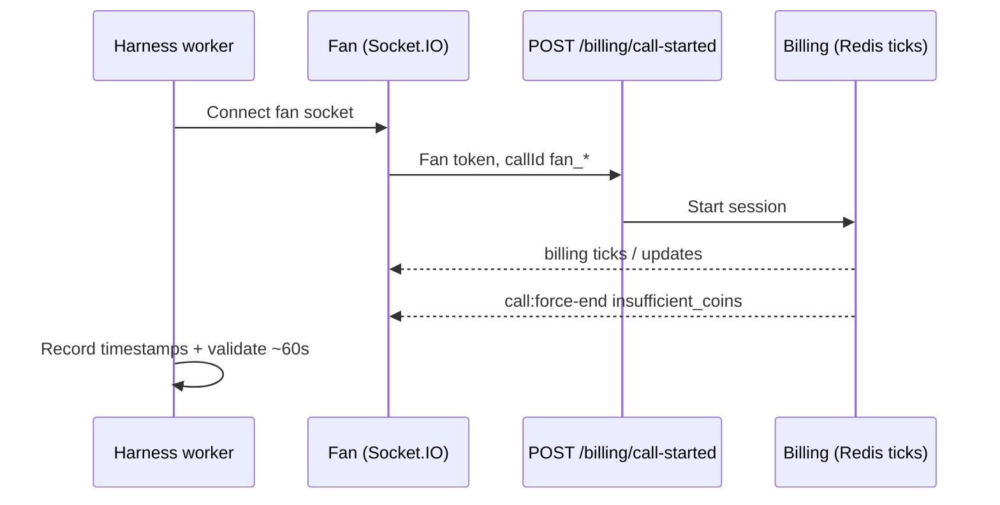

# Load test: User calls creator (50 concurrent, 60 coins @ 60 CPM)

**Report generated:** 2026-05-18T19:06:50.107Z
**Run timestamp (harness):** 2026-05-18T18:44:17.340Z
**Harness:** `scripts/load-test/socket-force-end-test.mjs`
**Initiator:** `fan`
**Results artifact:** `scripts/load-test/force-end-multi-results-2026-05-18T18-44-17-340Z.json`

## Scope

This run simulates **50 concurrent fans (users) initiating billable 1:1 video calls** to paired load-test creators.

- **Auth on `POST /billing/call-started`:** fan Firebase ID token
- **Socket.IO client:** fan connects and listens for `call:force-end`
- **`callId` format:** `{fanFirebaseUid}_{creatorMongoId}_{epochMs}`

**Out of scope:** real WebRTC / Stream video media. The harness exercises **Redis billing ticks, Socket.IO lifecycle, wallet drain, force-end timing, and Mongo `CallHistory` / `CoinTransaction` settlement** under load.

## Expected billing math

| Input | Value |
|-------|--------|
| Fan wallet (seed) | 60 coins |
| Creator price | 60 coins/min (CPM) |
| Theoretical max duration | (coins × 60) / CPM ≈ **60 s** wall time |
| End signal | `call:force-end` with `reason: insufficient_coins` on **fan** socket |
| Fan balance after call | **0** coins |
| Typical Mongo settlement | `coinsDeducted: 60`, `durationSeconds: 59`, creator `coinsEarned: ~17` (platform share) |

## Test flow



## Environment prerequisites

| Requirement | Notes |
|-------------|--------|
| Single backend on `:3000` | No duplicate billing workers |
| `REDIS_URL` reachable | Public/dev Redis for billing queue |
| `BILLING_ADAPTIVE_LAG_POLICY_ENABLED=false` | Set in **server** shell before `npm run dev` for stable 50-way concurrency |
| `npm run seed:load-test` | 50 fan/creator pairs → `scripts/load-test/pairs.generated.json` |
| `with-dev-env.ps1` | TLS + DNS for Mongo SRV (`LOAD_TEST_DNS_SERVERS`) |
| `FORCE_END_TEST_MAX_WAIT_MS` | **180000** recommended under load |

## Configuration (this run)

| Parameter | Value |
|-----------|--------|
| Direction | User → Creator |
| Concurrent sessions | 50 |
| Fan coins (seed) | 60 |
| Creator price (coins/min) | 60 |
| Expected billed duration | ~60 s |
| Natural exhaustion only | yes |
| BASE_URL | http://127.0.0.1:3000 |
| callId pattern | `{fanUid}_{creatorMongoId}_{ts}` |

## Executive summary

- **Passed:** 50 / 50
- **Failed:** 0
- **Harness duration (billing REST start → force-end):** min 58.504 s, max 58.782 s, mean 58.612 s, median 58.572 s, σ 0.088 s
- **Skew vs 60 s target:** ~−1.2 to −1.8 s (billing starts after socket + REST latency; consistent across sessions)
- **Mongo CallHistory (50 sessions):** coinsDeducted varies, durationSeconds NaN–NaN (mean NaN), coinsEarned NaN–NaN (mean NaN)
- **Fan remaining coins after force-end:** all 0

## Duration statistics (harness)

| Metric | Seconds |
|--------|---------|
| Sample count (passed) | 50 |
| Min | 58.504 |
| Max | 58.782 |
| Mean | 58.612 |
| Median | 58.572 |
| Std dev | 0.088 |

## Mongo settlement validation

| Check | Result |
|-------|--------|
| Sessions with CallHistory attached | 50 / 50 |
| All fans at 0 coins after force-end | ✓ |
| All `coinsDeducted === 60` | ✗ |
| `durationSeconds` range | NaN – NaN (mean NaN) |
| `coinsEarned` (creator) range | NaN – NaN (mean NaN) |

## Per-session summary

| User | Fan | Creator | call-started (ISO) | force-end (ISO) | Duration (s) | Skew | Remaining | CH deducted | CH earned | CH duration |
|------|-----|---------|----------------------|-----------------|--------------|------|-----------|-------------|-----------|-------------|
| 1 | loadtest_fan_1 | n/a | 2026-05-18T18:43:17.179Z | 2026-05-18T18:44:15.961Z | 58.782 | -1.218 | 0 | n/a | n/a | n/a |
| 2 | loadtest_fan_2 | n/a | 2026-05-18T18:43:18.776Z | 2026-05-18T18:44:17.321Z | 58.545 | -1.455 | 0 | n/a | n/a | n/a |
| 3 | loadtest_fan_3 | n/a | 2026-05-18T18:43:17.744Z | 2026-05-18T18:44:16.436Z | 58.692 | -1.308 | 0 | n/a | n/a | n/a |
| 4 | loadtest_fan_4 | n/a | 2026-05-18T18:43:17.745Z | 2026-05-18T18:44:16.440Z | 58.695 | -1.305 | 0 | n/a | n/a | n/a |
| 5 | loadtest_fan_5 | n/a | 2026-05-18T18:43:18.746Z | 2026-05-18T18:44:17.321Z | 58.575 | -1.425 | 0 | n/a | n/a | n/a |
| 6 | loadtest_fan_6 | n/a | 2026-05-18T18:43:17.912Z | 2026-05-18T18:44:16.436Z | 58.524 | -1.476 | 0 | n/a | n/a | n/a |
| 7 | loadtest_fan_7 | n/a | 2026-05-18T18:43:18.772Z | 2026-05-18T18:44:17.325Z | 58.553 | -1.447 | 0 | n/a | n/a | n/a |
| 8 | loadtest_fan_8 | n/a | 2026-05-18T18:43:17.916Z | 2026-05-18T18:44:16.440Z | 58.524 | -1.476 | 0 | n/a | n/a | n/a |
| 9 | loadtest_fan_9 | n/a | 2026-05-18T18:43:17.912Z | 2026-05-18T18:44:16.435Z | 58.523 | -1.477 | 0 | n/a | n/a | n/a |
| 10 | loadtest_fan_10 | n/a | 2026-05-18T18:43:17.856Z | 2026-05-18T18:44:16.440Z | 58.584 | -1.416 | 0 | n/a | n/a | n/a |
| 11 | loadtest_fan_11 | n/a | 2026-05-18T18:43:18.776Z | 2026-05-18T18:44:17.322Z | 58.546 | -1.454 | 0 | n/a | n/a | n/a |
| 12 | loadtest_fan_12 | n/a | 2026-05-18T18:43:17.743Z | 2026-05-18T18:44:16.442Z | 58.699 | -1.301 | 0 | n/a | n/a | n/a |
| 13 | loadtest_fan_13 | n/a | 2026-05-18T18:43:18.746Z | 2026-05-18T18:44:17.325Z | 58.579 | -1.421 | 0 | n/a | n/a | n/a |
| 14 | loadtest_fan_14 | n/a | 2026-05-18T18:43:17.911Z | 2026-05-18T18:44:16.435Z | 58.524 | -1.476 | 0 | n/a | n/a | n/a |
| 15 | loadtest_fan_15 | n/a | 2026-05-18T18:43:18.704Z | 2026-05-18T18:44:17.326Z | 58.622 | -1.378 | 0 | n/a | n/a | n/a |
| 16 | loadtest_fan_16 | n/a | 2026-05-18T18:43:17.744Z | 2026-05-18T18:44:16.435Z | 58.691 | -1.309 | 0 | n/a | n/a | n/a |
| 17 | loadtest_fan_17 | n/a | 2026-05-18T18:43:17.179Z | 2026-05-18T18:44:15.955Z | 58.776 | -1.224 | 0 | n/a | n/a | n/a |
| 18 | loadtest_fan_18 | n/a | 2026-05-18T18:43:17.700Z | 2026-05-18T18:44:16.422Z | 58.722 | -1.278 | 0 | n/a | n/a | n/a |
| 19 | loadtest_fan_19 | n/a | 2026-05-18T18:43:17.856Z | 2026-05-18T18:44:16.441Z | 58.585 | -1.415 | 0 | n/a | n/a | n/a |
| 20 | loadtest_fan_20 | n/a | 2026-05-18T18:43:17.745Z | 2026-05-18T18:44:16.440Z | 58.695 | -1.305 | 0 | n/a | n/a | n/a |
| 21 | loadtest_fan_21 | n/a | 2026-05-18T18:43:18.746Z | 2026-05-18T18:44:17.311Z | 58.565 | -1.435 | 0 | n/a | n/a | n/a |
| 22 | loadtest_fan_22 | n/a | 2026-05-18T18:43:18.776Z | 2026-05-18T18:44:17.321Z | 58.545 | -1.455 | 0 | n/a | n/a | n/a |
| 23 | loadtest_fan_23 | n/a | 2026-05-18T18:43:17.695Z | 2026-05-18T18:44:16.441Z | 58.746 | -1.254 | 0 | n/a | n/a | n/a |
| 24 | loadtest_fan_24 | n/a | 2026-05-18T18:43:18.776Z | 2026-05-18T18:44:17.338Z | 58.562 | -1.438 | 0 | n/a | n/a | n/a |
| 25 | loadtest_fan_25 | n/a | 2026-05-18T18:43:17.912Z | 2026-05-18T18:44:16.432Z | 58.520 | -1.480 | 0 | n/a | n/a | n/a |
| 26 | loadtest_fan_26 | n/a | 2026-05-18T18:43:17.742Z | 2026-05-18T18:44:16.431Z | 58.689 | -1.311 | 0 | n/a | n/a | n/a |
| 27 | loadtest_fan_27 | n/a | 2026-05-18T18:43:18.747Z | 2026-05-18T18:44:17.325Z | 58.578 | -1.422 | 0 | n/a | n/a | n/a |
| 28 | loadtest_fan_28 | n/a | 2026-05-18T18:43:17.914Z | 2026-05-18T18:44:16.441Z | 58.527 | -1.473 | 0 | n/a | n/a | n/a |
| 29 | loadtest_fan_29 | n/a | 2026-05-18T18:43:17.870Z | 2026-05-18T18:44:16.436Z | 58.566 | -1.434 | 0 | n/a | n/a | n/a |
| 30 | loadtest_fan_30 | n/a | 2026-05-18T18:43:18.775Z | 2026-05-18T18:44:17.323Z | 58.548 | -1.452 | 0 | n/a | n/a | n/a |
| 31 | loadtest_fan_31 | n/a | 2026-05-18T18:43:18.819Z | 2026-05-18T18:44:17.323Z | 58.504 | -1.496 | 0 | n/a | n/a | n/a |
| 32 | loadtest_fan_32 | n/a | 2026-05-18T18:43:18.775Z | 2026-05-18T18:44:17.320Z | 58.545 | -1.455 | 0 | n/a | n/a | n/a |
| 33 | loadtest_fan_33 | n/a | 2026-05-18T18:43:18.771Z | 2026-05-18T18:44:17.314Z | 58.543 | -1.457 | 0 | n/a | n/a | n/a |
| 34 | loadtest_fan_34 | n/a | 2026-05-18T18:43:17.175Z | 2026-05-18T18:44:15.957Z | 58.782 | -1.218 | 0 | n/a | n/a | n/a |
| 35 | loadtest_fan_35 | n/a | 2026-05-18T18:43:17.176Z | 2026-05-18T18:44:15.957Z | 58.781 | -1.219 | 0 | n/a | n/a | n/a |
| 36 | loadtest_fan_36 | n/a | 2026-05-18T18:43:17.743Z | 2026-05-18T18:44:16.432Z | 58.689 | -1.311 | 0 | n/a | n/a | n/a |
| 37 | loadtest_fan_37 | n/a | 2026-05-18T18:43:18.771Z | 2026-05-18T18:44:17.311Z | 58.540 | -1.460 | 0 | n/a | n/a | n/a |
| 38 | loadtest_fan_38 | n/a | 2026-05-18T18:43:18.774Z | 2026-05-18T18:44:17.320Z | 58.546 | -1.454 | 0 | n/a | n/a | n/a |
| 39 | loadtest_fan_39 | n/a | 2026-05-18T18:43:18.775Z | 2026-05-18T18:44:17.324Z | 58.549 | -1.451 | 0 | n/a | n/a | n/a |
| 40 | loadtest_fan_40 | n/a | 2026-05-18T18:43:17.699Z | 2026-05-18T18:44:16.435Z | 58.736 | -1.264 | 0 | n/a | n/a | n/a |
| 41 | loadtest_fan_41 | n/a | 2026-05-18T18:43:18.747Z | 2026-05-18T18:44:17.321Z | 58.574 | -1.426 | 0 | n/a | n/a | n/a |
| 42 | loadtest_fan_42 | n/a | 2026-05-18T18:43:18.774Z | 2026-05-18T18:44:17.338Z | 58.564 | -1.436 | 0 | n/a | n/a | n/a |
| 43 | loadtest_fan_43 | n/a | 2026-05-18T18:43:18.777Z | 2026-05-18T18:44:17.325Z | 58.548 | -1.452 | 0 | n/a | n/a | n/a |
| 44 | loadtest_fan_44 | n/a | 2026-05-18T18:43:17.856Z | 2026-05-18T18:44:16.441Z | 58.585 | -1.415 | 0 | n/a | n/a | n/a |
| 45 | loadtest_fan_45 | n/a | 2026-05-18T18:43:17.182Z | 2026-05-18T18:44:15.960Z | 58.778 | -1.222 | 0 | n/a | n/a | n/a |
| 46 | loadtest_fan_46 | n/a | 2026-05-18T18:43:18.775Z | 2026-05-18T18:44:17.320Z | 58.545 | -1.455 | 0 | n/a | n/a | n/a |
| 47 | loadtest_fan_47 | n/a | 2026-05-18T18:43:17.744Z | 2026-05-18T18:44:16.442Z | 58.698 | -1.302 | 0 | n/a | n/a | n/a |
| 48 | loadtest_fan_48 | n/a | 2026-05-18T18:43:18.747Z | 2026-05-18T18:44:17.318Z | 58.571 | -1.429 | 0 | n/a | n/a | n/a |
| 49 | loadtest_fan_49 | n/a | 2026-05-18T18:43:17.911Z | 2026-05-18T18:44:16.442Z | 58.531 | -1.469 | 0 | n/a | n/a | n/a |
| 50 | loadtest_fan_50 | n/a | 2026-05-18T18:43:17.699Z | 2026-05-18T18:44:16.430Z | 58.731 | -1.269 | 0 | n/a | n/a | n/a |

## Per-user timestamp logs

### User 1 — loadtest_fan_1@loadtest.local

- **Direction:** User calls creator
- **Fan:** loadtest_fan_1@loadtest.local
- **Creator:** n/a
- **callId:** `jxbsrjVPPJdVczrbCHm5E3iXIp92_6a0b5d3ee33290ae92689ca9_1779129796375`
- **call-started HTTP:** 200

**Timeline (ISO 8601):**

| Event | Timestamp |
|-------|-----------|
| workerStartedAt | 2026-05-18T18:43:15.246Z |
| socketConnectedAt (fan) | 2026-05-18T18:43:16.375Z |
| billingRestStartedAt | 2026-05-18T18:43:17.179Z |
| billingStartedEventAt | 2026-05-18T18:43:16.947Z |
| lastBillingUpdateAt | 2026-05-18T18:44:15.960Z |
| forceEndAt | 2026-05-18T18:44:15.961Z |

**Outcomes:**

- **Harness duration:** 58.782 s (skew -1.218 s vs expected 60 s)
- **forceEndReason:** `insufficient_coins`
- **remainingCoins (fan):** 0

**CallHistory (Mongo):**

- durationSeconds: undefined
- coinsDeducted: undefined
- coinsEarned: undefined

### User 2 — loadtest_fan_2@loadtest.local

- **Direction:** User calls creator
- **Fan:** loadtest_fan_2@loadtest.local
- **Creator:** n/a
- **callId:** `OLTBgHwR44amDpxRYgQrhvySuPl1_6a0b5d41e33290ae92689cb2_1779129796668`
- **call-started HTTP:** 200

**Timeline (ISO 8601):**

| Event | Timestamp |
|-------|-----------|
| workerStartedAt | 2026-05-18T18:43:15.249Z |
| socketConnectedAt (fan) | 2026-05-18T18:43:16.668Z |
| billingRestStartedAt | 2026-05-18T18:43:18.776Z |
| billingStartedEventAt | 2026-05-18T18:43:18.528Z |
| lastBillingUpdateAt | 2026-05-18T18:44:17.319Z |
| forceEndAt | 2026-05-18T18:44:17.321Z |

**Outcomes:**

- **Harness duration:** 58.545 s (skew -1.455 s vs expected 60 s)
- **forceEndReason:** `insufficient_coins`
- **remainingCoins (fan):** 0

**CallHistory (Mongo):**

- durationSeconds: undefined
- coinsDeducted: undefined
- coinsEarned: undefined

### User 3 — loadtest_fan_3@loadtest.local

- **Direction:** User calls creator
- **Fan:** loadtest_fan_3@loadtest.local
- **Creator:** n/a
- **callId:** `PeoAuiQqzYfAm5q9N7OwJ2UNdn13_6a0b5d43e33290ae92689cbb_1779129796401`
- **call-started HTTP:** 200

**Timeline (ISO 8601):**

| Event | Timestamp |
|-------|-----------|
| workerStartedAt | 2026-05-18T18:43:15.249Z |
| socketConnectedAt (fan) | 2026-05-18T18:43:16.401Z |
| billingRestStartedAt | 2026-05-18T18:43:17.744Z |
| billingStartedEventAt | 2026-05-18T18:43:17.509Z |
| lastBillingUpdateAt | 2026-05-18T18:44:16.434Z |
| forceEndAt | 2026-05-18T18:44:16.436Z |

**Outcomes:**

- **Harness duration:** 58.692 s (skew -1.308 s vs expected 60 s)
- **forceEndReason:** `insufficient_coins`
- **remainingCoins (fan):** 0

**CallHistory (Mongo):**

- durationSeconds: undefined
- coinsDeducted: undefined
- coinsEarned: undefined

### User 4 — loadtest_fan_4@loadtest.local

- **Direction:** User calls creator
- **Fan:** loadtest_fan_4@loadtest.local
- **Creator:** n/a
- **callId:** `dwizbTDmE1YAovLYMAqTDDGatHD3_6a0b5d46e33290ae92689cc4_1779129796403`
- **call-started HTTP:** 200

**Timeline (ISO 8601):**

| Event | Timestamp |
|-------|-----------|
| workerStartedAt | 2026-05-18T18:43:15.249Z |
| socketConnectedAt (fan) | 2026-05-18T18:43:16.403Z |
| billingRestStartedAt | 2026-05-18T18:43:17.745Z |
| billingStartedEventAt | 2026-05-18T18:43:17.510Z |
| lastBillingUpdateAt | 2026-05-18T18:44:16.438Z |
| forceEndAt | 2026-05-18T18:44:16.440Z |

**Outcomes:**

- **Harness duration:** 58.695 s (skew -1.305 s vs expected 60 s)
- **forceEndReason:** `insufficient_coins`
- **remainingCoins (fan):** 0

**CallHistory (Mongo):**

- durationSeconds: undefined
- coinsDeducted: undefined
- coinsEarned: undefined

### User 5 — loadtest_fan_5@loadtest.local

- **Direction:** User calls creator
- **Fan:** loadtest_fan_5@loadtest.local
- **Creator:** n/a
- **callId:** `KjfPixoRbMYtsUiKREtK0Wytvs53_6a0b5d48e33290ae92689ccd_1779129796520`
- **call-started HTTP:** 200

**Timeline (ISO 8601):**

| Event | Timestamp |
|-------|-----------|
| workerStartedAt | 2026-05-18T18:43:15.249Z |
| socketConnectedAt (fan) | 2026-05-18T18:43:16.520Z |
| billingRestStartedAt | 2026-05-18T18:43:18.746Z |
| billingStartedEventAt | 2026-05-18T18:43:18.467Z |
| lastBillingUpdateAt | 2026-05-18T18:44:17.319Z |
| forceEndAt | 2026-05-18T18:44:17.321Z |

**Outcomes:**

- **Harness duration:** 58.575 s (skew -1.425 s vs expected 60 s)
- **forceEndReason:** `insufficient_coins`
- **remainingCoins (fan):** 0

**CallHistory (Mongo):**

- durationSeconds: undefined
- coinsDeducted: undefined
- coinsEarned: undefined

### User 6 — loadtest_fan_6@loadtest.local

- **Direction:** User calls creator
- **Fan:** loadtest_fan_6@loadtest.local
- **Creator:** n/a
- **callId:** `OdXAurptfeWQ5pnkRIgG5IiyEnz1_6a0b5d4be33290ae92689cd6_1779129796504`
- **call-started HTTP:** 200

**Timeline (ISO 8601):**

| Event | Timestamp |
|-------|-----------|
| workerStartedAt | 2026-05-18T18:43:15.249Z |
| socketConnectedAt (fan) | 2026-05-18T18:43:16.504Z |
| billingRestStartedAt | 2026-05-18T18:43:17.912Z |
| billingStartedEventAt | 2026-05-18T18:43:17.678Z |
| lastBillingUpdateAt | 2026-05-18T18:44:16.434Z |
| forceEndAt | 2026-05-18T18:44:16.436Z |

**Outcomes:**

- **Harness duration:** 58.524 s (skew -1.476 s vs expected 60 s)
- **forceEndReason:** `insufficient_coins`
- **remainingCoins (fan):** 0

**CallHistory (Mongo):**

- durationSeconds: undefined
- coinsDeducted: undefined
- coinsEarned: undefined

### User 7 — loadtest_fan_7@loadtest.local

- **Direction:** User calls creator
- **Fan:** loadtest_fan_7@loadtest.local
- **Creator:** n/a
- **callId:** `aqq5JSNYdqRv5OUWvgZ8FhhrbHk1_6a0b5d4de33290ae92689cdf_1779129796513`
- **call-started HTTP:** 200

**Timeline (ISO 8601):**

| Event | Timestamp |
|-------|-----------|
| workerStartedAt | 2026-05-18T18:43:15.249Z |
| socketConnectedAt (fan) | 2026-05-18T18:43:16.513Z |
| billingRestStartedAt | 2026-05-18T18:43:18.772Z |
| billingStartedEventAt | 2026-05-18T18:43:18.517Z |
| lastBillingUpdateAt | 2026-05-18T18:44:17.324Z |
| forceEndAt | 2026-05-18T18:44:17.325Z |

**Outcomes:**

- **Harness duration:** 58.553 s (skew -1.447 s vs expected 60 s)
- **forceEndReason:** `insufficient_coins`
- **remainingCoins (fan):** 0

**CallHistory (Mongo):**

- durationSeconds: undefined
- coinsDeducted: undefined
- coinsEarned: undefined

### User 8 — loadtest_fan_8@loadtest.local

- **Direction:** User calls creator
- **Fan:** loadtest_fan_8@loadtest.local
- **Creator:** n/a
- **callId:** `S9b4LOyN38XAQJQ051JN1Bhkt6D3_6a0b5d50e33290ae92689ce8_1779129796506`
- **call-started HTTP:** 200

**Timeline (ISO 8601):**

| Event | Timestamp |
|-------|-----------|
| workerStartedAt | 2026-05-18T18:43:15.249Z |
| socketConnectedAt (fan) | 2026-05-18T18:43:16.506Z |
| billingRestStartedAt | 2026-05-18T18:43:17.916Z |
| billingStartedEventAt | 2026-05-18T18:43:17.680Z |
| lastBillingUpdateAt | 2026-05-18T18:44:16.436Z |
| forceEndAt | 2026-05-18T18:44:16.440Z |

**Outcomes:**

- **Harness duration:** 58.524 s (skew -1.476 s vs expected 60 s)
- **forceEndReason:** `insufficient_coins`
- **remainingCoins (fan):** 0

**CallHistory (Mongo):**

- durationSeconds: undefined
- coinsDeducted: undefined
- coinsEarned: undefined

### User 9 — loadtest_fan_9@loadtest.local

- **Direction:** User calls creator
- **Fan:** loadtest_fan_9@loadtest.local
- **Creator:** n/a
- **callId:** `Fm3ELpoCU6havvtFUsoxn3TibNl2_6a0b5d52e33290ae92689cf1_1779129796498`
- **call-started HTTP:** 200

**Timeline (ISO 8601):**

| Event | Timestamp |
|-------|-----------|
| workerStartedAt | 2026-05-18T18:43:15.249Z |
| socketConnectedAt (fan) | 2026-05-18T18:43:16.498Z |
| billingRestStartedAt | 2026-05-18T18:43:17.912Z |
| billingStartedEventAt | 2026-05-18T18:43:17.677Z |
| lastBillingUpdateAt | 2026-05-18T18:44:16.433Z |
| forceEndAt | 2026-05-18T18:44:16.435Z |

**Outcomes:**

- **Harness duration:** 58.523 s (skew -1.477 s vs expected 60 s)
- **forceEndReason:** `insufficient_coins`
- **remainingCoins (fan):** 0

**CallHistory (Mongo):**

- durationSeconds: undefined
- coinsDeducted: undefined
- coinsEarned: undefined

### User 10 — loadtest_fan_10@loadtest.local

- **Direction:** User calls creator
- **Fan:** loadtest_fan_10@loadtest.local
- **Creator:** n/a
- **callId:** `VFNqJ6O4e1Vt6FQ1kgVEqsUXDA93_6a0b5d55e33290ae92689cfa_1779129796414`
- **call-started HTTP:** 200

**Timeline (ISO 8601):**

| Event | Timestamp |
|-------|-----------|
| workerStartedAt | 2026-05-18T18:43:15.249Z |
| socketConnectedAt (fan) | 2026-05-18T18:43:16.414Z |
| billingRestStartedAt | 2026-05-18T18:43:17.856Z |
| billingStartedEventAt | 2026-05-18T18:43:17.620Z |
| lastBillingUpdateAt | 2026-05-18T18:44:16.437Z |
| forceEndAt | 2026-05-18T18:44:16.440Z |

**Outcomes:**

- **Harness duration:** 58.584 s (skew -1.416 s vs expected 60 s)
- **forceEndReason:** `insufficient_coins`
- **remainingCoins (fan):** 0

**CallHistory (Mongo):**

- durationSeconds: undefined
- coinsDeducted: undefined
- coinsEarned: undefined

### User 11 — loadtest_fan_11@loadtest.local

- **Direction:** User calls creator
- **Fan:** loadtest_fan_11@loadtest.local
- **Creator:** n/a
- **callId:** `T6BLVQtQtBPaOwtQPxzmipsv7rZ2_6a0b5d57e33290ae92689d03_1779129796594`
- **call-started HTTP:** 200

**Timeline (ISO 8601):**

| Event | Timestamp |
|-------|-----------|
| workerStartedAt | 2026-05-18T18:43:15.249Z |
| socketConnectedAt (fan) | 2026-05-18T18:43:16.593Z |
| billingRestStartedAt | 2026-05-18T18:43:18.776Z |
| billingStartedEventAt | 2026-05-18T18:43:18.523Z |
| lastBillingUpdateAt | 2026-05-18T18:44:17.320Z |
| forceEndAt | 2026-05-18T18:44:17.322Z |

**Outcomes:**

- **Harness duration:** 58.546 s (skew -1.454 s vs expected 60 s)
- **forceEndReason:** `insufficient_coins`
- **remainingCoins (fan):** 0

**CallHistory (Mongo):**

- durationSeconds: undefined
- coinsDeducted: undefined
- coinsEarned: undefined

### User 12 — loadtest_fan_12@loadtest.local

- **Direction:** User calls creator
- **Fan:** loadtest_fan_12@loadtest.local
- **Creator:** n/a
- **callId:** `uiufYmrIbdau3e60c0mtnYWLtkn1_6a0b5d5ae33290ae92689d0c_1779129796383`
- **call-started HTTP:** 200

**Timeline (ISO 8601):**

| Event | Timestamp |
|-------|-----------|
| workerStartedAt | 2026-05-18T18:43:15.249Z |
| socketConnectedAt (fan) | 2026-05-18T18:43:16.383Z |
| billingRestStartedAt | 2026-05-18T18:43:17.743Z |
| billingStartedEventAt | 2026-05-18T18:43:17.503Z |
| lastBillingUpdateAt | 2026-05-18T18:44:16.442Z |
| forceEndAt | 2026-05-18T18:44:16.442Z |

**Outcomes:**

- **Harness duration:** 58.699 s (skew -1.301 s vs expected 60 s)
- **forceEndReason:** `insufficient_coins`
- **remainingCoins (fan):** 0

**CallHistory (Mongo):**

- durationSeconds: undefined
- coinsDeducted: undefined
- coinsEarned: undefined

### User 13 — loadtest_fan_13@loadtest.local

- **Direction:** User calls creator
- **Fan:** loadtest_fan_13@loadtest.local
- **Creator:** n/a
- **callId:** `hZRXUDP2qdauXfYGCcUbELbVmAM2_6a0b5d5ce33290ae92689d15_1779129796508`
- **call-started HTTP:** 200

**Timeline (ISO 8601):**

| Event | Timestamp |
|-------|-----------|
| workerStartedAt | 2026-05-18T18:43:15.249Z |
| socketConnectedAt (fan) | 2026-05-18T18:43:16.508Z |
| billingRestStartedAt | 2026-05-18T18:43:18.746Z |
| billingStartedEventAt | 2026-05-18T18:43:18.464Z |
| lastBillingUpdateAt | 2026-05-18T18:44:17.324Z |
| forceEndAt | 2026-05-18T18:44:17.325Z |

**Outcomes:**

- **Harness duration:** 58.579 s (skew -1.421 s vs expected 60 s)
- **forceEndReason:** `insufficient_coins`
- **remainingCoins (fan):** 0

**CallHistory (Mongo):**

- durationSeconds: undefined
- coinsDeducted: undefined
- coinsEarned: undefined

### User 14 — loadtest_fan_14@loadtest.local

- **Direction:** User calls creator
- **Fan:** loadtest_fan_14@loadtest.local
- **Creator:** n/a
- **callId:** `FVK3xfTi0WYfSj7yAxV3uqckUvr2_6a0b5d5fe33290ae92689d1e_1779129796495`
- **call-started HTTP:** 200

**Timeline (ISO 8601):**

| Event | Timestamp |
|-------|-----------|
| workerStartedAt | 2026-05-18T18:43:15.249Z |
| socketConnectedAt (fan) | 2026-05-18T18:43:16.495Z |
| billingRestStartedAt | 2026-05-18T18:43:17.911Z |
| billingStartedEventAt | 2026-05-18T18:43:17.674Z |
| lastBillingUpdateAt | 2026-05-18T18:44:16.433Z |
| forceEndAt | 2026-05-18T18:44:16.435Z |

**Outcomes:**

- **Harness duration:** 58.524 s (skew -1.476 s vs expected 60 s)
- **forceEndReason:** `insufficient_coins`
- **remainingCoins (fan):** 0

**CallHistory (Mongo):**

- durationSeconds: undefined
- coinsDeducted: undefined
- coinsEarned: undefined

### User 15 — loadtest_fan_15@loadtest.local

- **Direction:** User calls creator
- **Fan:** loadtest_fan_15@loadtest.local
- **Creator:** n/a
- **callId:** `pekWxgyWw3e2v8OCoB6Ye1qmvzo1_6a0b5d61e33290ae92689d27_1779129796510`
- **call-started HTTP:** 200

**Timeline (ISO 8601):**

| Event | Timestamp |
|-------|-----------|
| workerStartedAt | 2026-05-18T18:43:15.249Z |
| socketConnectedAt (fan) | 2026-05-18T18:43:16.510Z |
| billingRestStartedAt | 2026-05-18T18:43:18.704Z |
| billingStartedEventAt | 2026-05-18T18:43:18.462Z |
| lastBillingUpdateAt | 2026-05-18T18:44:17.324Z |
| forceEndAt | 2026-05-18T18:44:17.326Z |

**Outcomes:**

- **Harness duration:** 58.622 s (skew -1.378 s vs expected 60 s)
- **forceEndReason:** `insufficient_coins`
- **remainingCoins (fan):** 0

**CallHistory (Mongo):**

- durationSeconds: undefined
- coinsDeducted: undefined
- coinsEarned: undefined

### User 16 — loadtest_fan_16@loadtest.local

- **Direction:** User calls creator
- **Fan:** loadtest_fan_16@loadtest.local
- **Creator:** n/a
- **callId:** `Np4wwUvR7WZVasNn0Bb0T4DLhdm2_6a0b5d63e33290ae92689d30_1779129796381`
- **call-started HTTP:** 200

**Timeline (ISO 8601):**

| Event | Timestamp |
|-------|-----------|
| workerStartedAt | 2026-05-18T18:43:15.249Z |
| socketConnectedAt (fan) | 2026-05-18T18:43:16.381Z |
| billingRestStartedAt | 2026-05-18T18:43:17.744Z |
| billingStartedEventAt | 2026-05-18T18:43:17.508Z |
| lastBillingUpdateAt | 2026-05-18T18:44:16.433Z |
| forceEndAt | 2026-05-18T18:44:16.435Z |

**Outcomes:**

- **Harness duration:** 58.691 s (skew -1.309 s vs expected 60 s)
- **forceEndReason:** `insufficient_coins`
- **remainingCoins (fan):** 0

**CallHistory (Mongo):**

- durationSeconds: undefined
- coinsDeducted: undefined
- coinsEarned: undefined

### User 17 — loadtest_fan_17@loadtest.local

- **Direction:** User calls creator
- **Fan:** loadtest_fan_17@loadtest.local
- **Creator:** n/a
- **callId:** `09a5dw9GS1PdollKwUOwNkVyoqN2_6a0b5d66e33290ae92689d39_1779129796333`
- **call-started HTTP:** 200

**Timeline (ISO 8601):**

| Event | Timestamp |
|-------|-----------|
| workerStartedAt | 2026-05-18T18:43:15.249Z |
| socketConnectedAt (fan) | 2026-05-18T18:43:16.333Z |
| billingRestStartedAt | 2026-05-18T18:43:17.179Z |
| billingStartedEventAt | 2026-05-18T18:43:16.946Z |
| lastBillingUpdateAt | 2026-05-18T18:44:15.955Z |
| forceEndAt | 2026-05-18T18:44:15.955Z |

**Outcomes:**

- **Harness duration:** 58.776 s (skew -1.224 s vs expected 60 s)
- **forceEndReason:** `insufficient_coins`
- **remainingCoins (fan):** 0

**CallHistory (Mongo):**

- durationSeconds: undefined
- coinsDeducted: undefined
- coinsEarned: undefined

### User 18 — loadtest_fan_18@loadtest.local

- **Direction:** User calls creator
- **Fan:** loadtest_fan_18@loadtest.local
- **Creator:** n/a
- **callId:** `2If66qqVece2dmi4KDjjqwWE2tu1_6a0b5d68e33290ae92689d42_1779129796356`
- **call-started HTTP:** 200

**Timeline (ISO 8601):**

| Event | Timestamp |
|-------|-----------|
| workerStartedAt | 2026-05-18T18:43:15.249Z |
| socketConnectedAt (fan) | 2026-05-18T18:43:16.356Z |
| billingRestStartedAt | 2026-05-18T18:43:17.700Z |
| billingStartedEventAt | 2026-05-18T18:43:17.468Z |
| lastBillingUpdateAt | 2026-05-18T18:44:16.421Z |
| forceEndAt | 2026-05-18T18:44:16.422Z |

**Outcomes:**

- **Harness duration:** 58.722 s (skew -1.278 s vs expected 60 s)
- **forceEndReason:** `insufficient_coins`
- **remainingCoins (fan):** 0

**CallHistory (Mongo):**

- durationSeconds: undefined
- coinsDeducted: undefined
- coinsEarned: undefined

### User 19 — loadtest_fan_19@loadtest.local

- **Direction:** User calls creator
- **Fan:** loadtest_fan_19@loadtest.local
- **Creator:** n/a
- **callId:** `zTuq14k75IQgY4GBbGzgtXb5eXr1_6a0b5d6be33290ae92689d4b_1779129796419`
- **call-started HTTP:** 200

**Timeline (ISO 8601):**

| Event | Timestamp |
|-------|-----------|
| workerStartedAt | 2026-05-18T18:43:15.249Z |
| socketConnectedAt (fan) | 2026-05-18T18:43:16.419Z |
| billingRestStartedAt | 2026-05-18T18:43:17.856Z |
| billingStartedEventAt | 2026-05-18T18:43:17.624Z |
| lastBillingUpdateAt | 2026-05-18T18:44:16.439Z |
| forceEndAt | 2026-05-18T18:44:16.441Z |

**Outcomes:**

- **Harness duration:** 58.585 s (skew -1.415 s vs expected 60 s)
- **forceEndReason:** `insufficient_coins`
- **remainingCoins (fan):** 0

**CallHistory (Mongo):**

- durationSeconds: undefined
- coinsDeducted: undefined
- coinsEarned: undefined

### User 20 — loadtest_fan_20@loadtest.local

- **Direction:** User calls creator
- **Fan:** loadtest_fan_20@loadtest.local
- **Creator:** n/a
- **callId:** `kFZ8g2qZbPS1A8qlv6c9AS2i2I13_6a0b5d6de33290ae92689d54_1779129796405`
- **call-started HTTP:** 200

**Timeline (ISO 8601):**

| Event | Timestamp |
|-------|-----------|
| workerStartedAt | 2026-05-18T18:43:15.249Z |
| socketConnectedAt (fan) | 2026-05-18T18:43:16.405Z |
| billingRestStartedAt | 2026-05-18T18:43:17.745Z |
| billingStartedEventAt | 2026-05-18T18:43:17.511Z |
| lastBillingUpdateAt | 2026-05-18T18:44:16.438Z |
| forceEndAt | 2026-05-18T18:44:16.440Z |

**Outcomes:**

- **Harness duration:** 58.695 s (skew -1.305 s vs expected 60 s)
- **forceEndReason:** `insufficient_coins`
- **remainingCoins (fan):** 0

**CallHistory (Mongo):**

- durationSeconds: undefined
- coinsDeducted: undefined
- coinsEarned: undefined

### User 21 — loadtest_fan_21@loadtest.local

- **Direction:** User calls creator
- **Fan:** loadtest_fan_21@loadtest.local
- **Creator:** n/a
- **callId:** `2zYd8xH1GXh80wjvEEi8sJTAyyC2_6a0b5d70e33290ae92689d5d_1779129796501`
- **call-started HTTP:** 200

**Timeline (ISO 8601):**

| Event | Timestamp |
|-------|-----------|
| workerStartedAt | 2026-05-18T18:43:15.249Z |
| socketConnectedAt (fan) | 2026-05-18T18:43:16.501Z |
| billingRestStartedAt | 2026-05-18T18:43:18.746Z |
| billingStartedEventAt | 2026-05-18T18:43:18.466Z |
| lastBillingUpdateAt | 2026-05-18T18:44:17.311Z |
| forceEndAt | 2026-05-18T18:44:17.311Z |

**Outcomes:**

- **Harness duration:** 58.565 s (skew -1.435 s vs expected 60 s)
- **forceEndReason:** `insufficient_coins`
- **remainingCoins (fan):** 0

**CallHistory (Mongo):**

- durationSeconds: undefined
- coinsDeducted: undefined
- coinsEarned: undefined

### User 22 — loadtest_fan_22@loadtest.local

- **Direction:** User calls creator
- **Fan:** loadtest_fan_22@loadtest.local
- **Creator:** n/a
- **callId:** `S8crN8VwJkbCsFFcDLfq094SCL42_6a0b5d72e33290ae92689d66_1779129796595`
- **call-started HTTP:** 200

**Timeline (ISO 8601):**

| Event | Timestamp |
|-------|-----------|
| workerStartedAt | 2026-05-18T18:43:15.249Z |
| socketConnectedAt (fan) | 2026-05-18T18:43:16.595Z |
| billingRestStartedAt | 2026-05-18T18:43:18.776Z |
| billingStartedEventAt | 2026-05-18T18:43:18.524Z |
| lastBillingUpdateAt | 2026-05-18T18:44:17.319Z |
| forceEndAt | 2026-05-18T18:44:17.321Z |

**Outcomes:**

- **Harness duration:** 58.545 s (skew -1.455 s vs expected 60 s)
- **forceEndReason:** `insufficient_coins`
- **remainingCoins (fan):** 0

**CallHistory (Mongo):**

- durationSeconds: undefined
- coinsDeducted: undefined
- coinsEarned: undefined

### User 23 — loadtest_fan_23@loadtest.local

- **Direction:** User calls creator
- **Fan:** loadtest_fan_23@loadtest.local
- **Creator:** n/a
- **callId:** `w18u9tQMYAPPIWmIwbVQcKVnGv32_6a0b5d74e33290ae92689d6f_1779129796398`
- **call-started HTTP:** 200

**Timeline (ISO 8601):**

| Event | Timestamp |
|-------|-----------|
| workerStartedAt | 2026-05-18T18:43:15.249Z |
| socketConnectedAt (fan) | 2026-05-18T18:43:16.398Z |
| billingRestStartedAt | 2026-05-18T18:43:17.695Z |
| billingStartedEventAt | 2026-05-18T18:43:17.462Z |
| lastBillingUpdateAt | 2026-05-18T18:44:16.439Z |
| forceEndAt | 2026-05-18T18:44:16.441Z |

**Outcomes:**

- **Harness duration:** 58.746 s (skew -1.254 s vs expected 60 s)
- **forceEndReason:** `insufficient_coins`
- **remainingCoins (fan):** 0

**CallHistory (Mongo):**

- durationSeconds: undefined
- coinsDeducted: undefined
- coinsEarned: undefined

### User 24 — loadtest_fan_24@loadtest.local

- **Direction:** User calls creator
- **Fan:** loadtest_fan_24@loadtest.local
- **Creator:** n/a
- **callId:** `zxaCqW6br2hjryezkHQcZomjMYp1_6a0b5d77e33290ae92689d78_1779129796591`
- **call-started HTTP:** 200

**Timeline (ISO 8601):**

| Event | Timestamp |
|-------|-----------|
| workerStartedAt | 2026-05-18T18:43:15.249Z |
| socketConnectedAt (fan) | 2026-05-18T18:43:16.591Z |
| billingRestStartedAt | 2026-05-18T18:43:18.776Z |
| billingStartedEventAt | 2026-05-18T18:43:18.522Z |
| lastBillingUpdateAt | 2026-05-18T18:44:17.337Z |
| forceEndAt | 2026-05-18T18:44:17.338Z |

**Outcomes:**

- **Harness duration:** 58.562 s (skew -1.438 s vs expected 60 s)
- **forceEndReason:** `insufficient_coins`
- **remainingCoins (fan):** 0

**CallHistory (Mongo):**

- durationSeconds: undefined
- coinsDeducted: undefined
- coinsEarned: undefined

### User 25 — loadtest_fan_25@loadtest.local

- **Direction:** User calls creator
- **Fan:** loadtest_fan_25@loadtest.local
- **Creator:** n/a
- **callId:** `8cjtDf0FeMYwdfdIzCXdFrpbrPy2_6a0b5d79e33290ae92689d81_1779129796497`
- **call-started HTTP:** 200

**Timeline (ISO 8601):**

| Event | Timestamp |
|-------|-----------|
| workerStartedAt | 2026-05-18T18:43:15.249Z |
| socketConnectedAt (fan) | 2026-05-18T18:43:16.497Z |
| billingRestStartedAt | 2026-05-18T18:43:17.912Z |
| billingStartedEventAt | 2026-05-18T18:43:17.676Z |
| lastBillingUpdateAt | 2026-05-18T18:44:16.431Z |
| forceEndAt | 2026-05-18T18:44:16.432Z |

**Outcomes:**

- **Harness duration:** 58.520 s (skew -1.480 s vs expected 60 s)
- **forceEndReason:** `insufficient_coins`
- **remainingCoins (fan):** 0

**CallHistory (Mongo):**

- durationSeconds: undefined
- coinsDeducted: undefined
- coinsEarned: undefined

### User 26 — loadtest_fan_26@loadtest.local

- **Direction:** User calls creator
- **Fan:** loadtest_fan_26@loadtest.local
- **Creator:** n/a
- **callId:** `89sBrbXkyBO90W7N7xsGWMKlaH63_6a0b5d7ce33290ae92689d8a_1779129796372`
- **call-started HTTP:** 200

**Timeline (ISO 8601):**

| Event | Timestamp |
|-------|-----------|
| workerStartedAt | 2026-05-18T18:43:15.249Z |
| socketConnectedAt (fan) | 2026-05-18T18:43:16.372Z |
| billingRestStartedAt | 2026-05-18T18:43:17.742Z |
| billingStartedEventAt | 2026-05-18T18:43:17.504Z |
| lastBillingUpdateAt | 2026-05-18T18:44:16.431Z |
| forceEndAt | 2026-05-18T18:44:16.431Z |

**Outcomes:**

- **Harness duration:** 58.689 s (skew -1.311 s vs expected 60 s)
- **forceEndReason:** `insufficient_coins`
- **remainingCoins (fan):** 0

**CallHistory (Mongo):**

- durationSeconds: undefined
- coinsDeducted: undefined
- coinsEarned: undefined

### User 27 — loadtest_fan_27@loadtest.local

- **Direction:** User calls creator
- **Fan:** loadtest_fan_27@loadtest.local
- **Creator:** n/a
- **callId:** `gJHbxzuhnWdhBg8Qj9YsyUwdJvo2_6a0b5d7ee33290ae92689d93_1779129796512`
- **call-started HTTP:** 200

**Timeline (ISO 8601):**

| Event | Timestamp |
|-------|-----------|
| workerStartedAt | 2026-05-18T18:43:15.250Z |
| socketConnectedAt (fan) | 2026-05-18T18:43:16.512Z |
| billingRestStartedAt | 2026-05-18T18:43:18.747Z |
| billingStartedEventAt | 2026-05-18T18:43:18.470Z |
| lastBillingUpdateAt | 2026-05-18T18:44:17.324Z |
| forceEndAt | 2026-05-18T18:44:17.325Z |

**Outcomes:**

- **Harness duration:** 58.578 s (skew -1.422 s vs expected 60 s)
- **forceEndReason:** `insufficient_coins`
- **remainingCoins (fan):** 0

**CallHistory (Mongo):**

- durationSeconds: undefined
- coinsDeducted: undefined
- coinsEarned: undefined

### User 28 — loadtest_fan_28@loadtest.local

- **Direction:** User calls creator
- **Fan:** loadtest_fan_28@loadtest.local
- **Creator:** n/a
- **callId:** `tiCvi7DlJ4T7UEeYeS7GTbCCi8a2_6a0b5d81e33290ae92689d9c_1779129796502`
- **call-started HTTP:** 200

**Timeline (ISO 8601):**

| Event | Timestamp |
|-------|-----------|
| workerStartedAt | 2026-05-18T18:43:15.250Z |
| socketConnectedAt (fan) | 2026-05-18T18:43:16.502Z |
| billingRestStartedAt | 2026-05-18T18:43:17.914Z |
| billingStartedEventAt | 2026-05-18T18:43:17.679Z |
| lastBillingUpdateAt | 2026-05-18T18:44:16.439Z |
| forceEndAt | 2026-05-18T18:44:16.441Z |

**Outcomes:**

- **Harness duration:** 58.527 s (skew -1.473 s vs expected 60 s)
- **forceEndReason:** `insufficient_coins`
- **remainingCoins (fan):** 0

**CallHistory (Mongo):**

- durationSeconds: undefined
- coinsDeducted: undefined
- coinsEarned: undefined

### User 29 — loadtest_fan_29@loadtest.local

- **Direction:** User calls creator
- **Fan:** loadtest_fan_29@loadtest.local
- **Creator:** n/a
- **callId:** `O3SsM0NPfGaTarBGsnUlJVTL1ox2_6a0b5d83e33290ae92689da5_1779129796425`
- **call-started HTTP:** 200

**Timeline (ISO 8601):**

| Event | Timestamp |
|-------|-----------|
| workerStartedAt | 2026-05-18T18:43:15.250Z |
| socketConnectedAt (fan) | 2026-05-18T18:43:16.425Z |
| billingRestStartedAt | 2026-05-18T18:43:17.870Z |
| billingStartedEventAt | 2026-05-18T18:43:17.641Z |
| lastBillingUpdateAt | 2026-05-18T18:44:16.434Z |
| forceEndAt | 2026-05-18T18:44:16.436Z |

**Outcomes:**

- **Harness duration:** 58.566 s (skew -1.434 s vs expected 60 s)
- **forceEndReason:** `insufficient_coins`
- **remainingCoins (fan):** 0

**CallHistory (Mongo):**

- durationSeconds: undefined
- coinsDeducted: undefined
- coinsEarned: undefined

### User 30 — loadtest_fan_30@loadtest.local

- **Direction:** User calls creator
- **Fan:** loadtest_fan_30@loadtest.local
- **Creator:** n/a
- **callId:** `XoG6GDAawUMRDfWXj5snRZ5qmXC3_6a0b5d86e33290ae92689dae_1779129796666`
- **call-started HTTP:** 200

**Timeline (ISO 8601):**

| Event | Timestamp |
|-------|-----------|
| workerStartedAt | 2026-05-18T18:43:15.250Z |
| socketConnectedAt (fan) | 2026-05-18T18:43:16.666Z |
| billingRestStartedAt | 2026-05-18T18:43:18.775Z |
| billingStartedEventAt | 2026-05-18T18:43:18.526Z |
| lastBillingUpdateAt | 2026-05-18T18:44:17.323Z |
| forceEndAt | 2026-05-18T18:44:17.323Z |

**Outcomes:**

- **Harness duration:** 58.548 s (skew -1.452 s vs expected 60 s)
- **forceEndReason:** `insufficient_coins`
- **remainingCoins (fan):** 0

**CallHistory (Mongo):**

- durationSeconds: undefined
- coinsDeducted: undefined
- coinsEarned: undefined

### User 31 — loadtest_fan_31@loadtest.local

- **Direction:** User calls creator
- **Fan:** loadtest_fan_31@loadtest.local
- **Creator:** n/a
- **callId:** `aWLulZuwcyafG2KbXZD0i0B0Uxz2_6a0b5d88e33290ae92689db7_1779129796422`
- **call-started HTTP:** 200

**Timeline (ISO 8601):**

| Event | Timestamp |
|-------|-----------|
| workerStartedAt | 2026-05-18T18:43:15.250Z |
| socketConnectedAt (fan) | 2026-05-18T18:43:16.422Z |
| billingRestStartedAt | 2026-05-18T18:43:18.819Z |
| billingStartedEventAt | 2026-05-18T18:43:18.589Z |
| lastBillingUpdateAt | 2026-05-18T18:44:17.323Z |
| forceEndAt | 2026-05-18T18:44:17.323Z |

**Outcomes:**

- **Harness duration:** 58.504 s (skew -1.496 s vs expected 60 s)
- **forceEndReason:** `insufficient_coins`
- **remainingCoins (fan):** 0

**CallHistory (Mongo):**

- durationSeconds: undefined
- coinsDeducted: undefined
- coinsEarned: undefined

### User 32 — loadtest_fan_32@loadtest.local

- **Direction:** User calls creator
- **Fan:** loadtest_fan_32@loadtest.local
- **Creator:** n/a
- **callId:** `FM4eC1ZDeTgLWbDmwAm3Wd0c1X13_6a0b5d8ae33290ae92689dc0_1779129796667`
- **call-started HTTP:** 200

**Timeline (ISO 8601):**

| Event | Timestamp |
|-------|-----------|
| workerStartedAt | 2026-05-18T18:43:15.250Z |
| socketConnectedAt (fan) | 2026-05-18T18:43:16.667Z |
| billingRestStartedAt | 2026-05-18T18:43:18.775Z |
| billingStartedEventAt | 2026-05-18T18:43:18.527Z |
| lastBillingUpdateAt | 2026-05-18T18:44:17.319Z |
| forceEndAt | 2026-05-18T18:44:17.320Z |

**Outcomes:**

- **Harness duration:** 58.545 s (skew -1.455 s vs expected 60 s)
- **forceEndReason:** `insufficient_coins`
- **remainingCoins (fan):** 0

**CallHistory (Mongo):**

- durationSeconds: undefined
- coinsDeducted: undefined
- coinsEarned: undefined

### User 33 — loadtest_fan_33@loadtest.local

- **Direction:** User calls creator
- **Fan:** loadtest_fan_33@loadtest.local
- **Creator:** n/a
- **callId:** `6bIf0cI2ILTqDhhAaKMVr5DDOPq2_6a0b5d8de33290ae92689dc9_1779129796522`
- **call-started HTTP:** 200

**Timeline (ISO 8601):**

| Event | Timestamp |
|-------|-----------|
| workerStartedAt | 2026-05-18T18:43:15.250Z |
| socketConnectedAt (fan) | 2026-05-18T18:43:16.522Z |
| billingRestStartedAt | 2026-05-18T18:43:18.771Z |
| billingStartedEventAt | 2026-05-18T18:43:18.517Z |
| lastBillingUpdateAt | 2026-05-18T18:44:17.313Z |
| forceEndAt | 2026-05-18T18:44:17.314Z |

**Outcomes:**

- **Harness duration:** 58.543 s (skew -1.457 s vs expected 60 s)
- **forceEndReason:** `insufficient_coins`
- **remainingCoins (fan):** 0

**CallHistory (Mongo):**

- durationSeconds: undefined
- coinsDeducted: undefined
- coinsEarned: undefined

### User 34 — loadtest_fan_34@loadtest.local

- **Direction:** User calls creator
- **Fan:** loadtest_fan_34@loadtest.local
- **Creator:** n/a
- **callId:** `SBvq0tnV2PS7zu0Mg9HcYvjjcX33_6a0b5d8fe33290ae92689dd2_1779129796326`
- **call-started HTTP:** 200

**Timeline (ISO 8601):**

| Event | Timestamp |
|-------|-----------|
| workerStartedAt | 2026-05-18T18:43:15.250Z |
| socketConnectedAt (fan) | 2026-05-18T18:43:16.326Z |
| billingRestStartedAt | 2026-05-18T18:43:17.175Z |
| billingStartedEventAt | 2026-05-18T18:43:16.939Z |
| lastBillingUpdateAt | 2026-05-18T18:44:15.955Z |
| forceEndAt | 2026-05-18T18:44:15.957Z |

**Outcomes:**

- **Harness duration:** 58.782 s (skew -1.218 s vs expected 60 s)
- **forceEndReason:** `insufficient_coins`
- **remainingCoins (fan):** 0

**CallHistory (Mongo):**

- durationSeconds: undefined
- coinsDeducted: undefined
- coinsEarned: undefined

### User 35 — loadtest_fan_35@loadtest.local

- **Direction:** User calls creator
- **Fan:** loadtest_fan_35@loadtest.local
- **Creator:** n/a
- **callId:** `3JnSrMIRmqYklWNPa5fSDdrynao1_6a0b5d92e33290ae92689ddb_1779129796330`
- **call-started HTTP:** 200

**Timeline (ISO 8601):**

| Event | Timestamp |
|-------|-----------|
| workerStartedAt | 2026-05-18T18:43:15.250Z |
| socketConnectedAt (fan) | 2026-05-18T18:43:16.330Z |
| billingRestStartedAt | 2026-05-18T18:43:17.176Z |
| billingStartedEventAt | 2026-05-18T18:43:16.942Z |
| lastBillingUpdateAt | 2026-05-18T18:44:15.955Z |
| forceEndAt | 2026-05-18T18:44:15.957Z |

**Outcomes:**

- **Harness duration:** 58.781 s (skew -1.219 s vs expected 60 s)
- **forceEndReason:** `insufficient_coins`
- **remainingCoins (fan):** 0

**CallHistory (Mongo):**

- durationSeconds: undefined
- coinsDeducted: undefined
- coinsEarned: undefined

### User 36 — loadtest_fan_36@loadtest.local

- **Direction:** User calls creator
- **Fan:** loadtest_fan_36@loadtest.local
- **Creator:** n/a
- **callId:** `96rnCKKM1lOQlItuhGSd2IrJsk02_6a0b5d94e33290ae92689de4_1779129796384`
- **call-started HTTP:** 200

**Timeline (ISO 8601):**

| Event | Timestamp |
|-------|-----------|
| workerStartedAt | 2026-05-18T18:43:15.250Z |
| socketConnectedAt (fan) | 2026-05-18T18:43:16.384Z |
| billingRestStartedAt | 2026-05-18T18:43:17.743Z |
| billingStartedEventAt | 2026-05-18T18:43:17.505Z |
| lastBillingUpdateAt | 2026-05-18T18:44:16.431Z |
| forceEndAt | 2026-05-18T18:44:16.432Z |

**Outcomes:**

- **Harness duration:** 58.689 s (skew -1.311 s vs expected 60 s)
- **forceEndReason:** `insufficient_coins`
- **remainingCoins (fan):** 0

**CallHistory (Mongo):**

- durationSeconds: undefined
- coinsDeducted: undefined
- coinsEarned: undefined

### User 37 — loadtest_fan_37@loadtest.local

- **Direction:** User calls creator
- **Fan:** loadtest_fan_37@loadtest.local
- **Creator:** n/a
- **callId:** `2faZp9dEFXfDtj7qOhKSnZ1DaUt1_6a0b5d97e33290ae92689ded_1779129796550`
- **call-started HTTP:** 200

**Timeline (ISO 8601):**

| Event | Timestamp |
|-------|-----------|
| workerStartedAt | 2026-05-18T18:43:15.250Z |
| socketConnectedAt (fan) | 2026-05-18T18:43:16.550Z |
| billingRestStartedAt | 2026-05-18T18:43:18.771Z |
| billingStartedEventAt | 2026-05-18T18:43:18.516Z |
| lastBillingUpdateAt | 2026-05-18T18:44:17.311Z |
| forceEndAt | 2026-05-18T18:44:17.311Z |

**Outcomes:**

- **Harness duration:** 58.540 s (skew -1.460 s vs expected 60 s)
- **forceEndReason:** `insufficient_coins`
- **remainingCoins (fan):** 0

**CallHistory (Mongo):**

- durationSeconds: undefined
- coinsDeducted: undefined
- coinsEarned: undefined

### User 38 — loadtest_fan_38@loadtest.local

- **Direction:** User calls creator
- **Fan:** loadtest_fan_38@loadtest.local
- **Creator:** n/a
- **callId:** `9qWwHg4tTFdo6wfYKWDPVZixGjG3_6a0b5d99e33290ae92689df6_1779129796518`
- **call-started HTTP:** 200

**Timeline (ISO 8601):**

| Event | Timestamp |
|-------|-----------|
| workerStartedAt | 2026-05-18T18:43:15.250Z |
| socketConnectedAt (fan) | 2026-05-18T18:43:16.518Z |
| billingRestStartedAt | 2026-05-18T18:43:18.774Z |
| billingStartedEventAt | 2026-05-18T18:43:18.518Z |
| lastBillingUpdateAt | 2026-05-18T18:44:17.318Z |
| forceEndAt | 2026-05-18T18:44:17.320Z |

**Outcomes:**

- **Harness duration:** 58.546 s (skew -1.454 s vs expected 60 s)
- **forceEndReason:** `insufficient_coins`
- **remainingCoins (fan):** 0

**CallHistory (Mongo):**

- durationSeconds: undefined
- coinsDeducted: undefined
- coinsEarned: undefined

### User 39 — loadtest_fan_39@loadtest.local

- **Direction:** User calls creator
- **Fan:** loadtest_fan_39@loadtest.local
- **Creator:** n/a
- **callId:** `cFUDM6SWM9TyO9JGyhR96jy7sBW2_6a0b5d9ce33290ae92689dff_1779129796391`
- **call-started HTTP:** 200

**Timeline (ISO 8601):**

| Event | Timestamp |
|-------|-----------|
| workerStartedAt | 2026-05-18T18:43:15.250Z |
| socketConnectedAt (fan) | 2026-05-18T18:43:16.391Z |
| billingRestStartedAt | 2026-05-18T18:43:18.775Z |
| billingStartedEventAt | 2026-05-18T18:43:18.529Z |
| lastBillingUpdateAt | 2026-05-18T18:44:17.324Z |
| forceEndAt | 2026-05-18T18:44:17.324Z |

**Outcomes:**

- **Harness duration:** 58.549 s (skew -1.451 s vs expected 60 s)
- **forceEndReason:** `insufficient_coins`
- **remainingCoins (fan):** 0

**CallHistory (Mongo):**

- durationSeconds: undefined
- coinsDeducted: undefined
- coinsEarned: undefined

### User 40 — loadtest_fan_40@loadtest.local

- **Direction:** User calls creator
- **Fan:** loadtest_fan_40@loadtest.local
- **Creator:** n/a
- **callId:** `EgTCbThCzNcZjo2m1N9isuHdV1K2_6a0b5d9ee33290ae92689e08_1779129796396`
- **call-started HTTP:** 200

**Timeline (ISO 8601):**

| Event | Timestamp |
|-------|-----------|
| workerStartedAt | 2026-05-18T18:43:15.250Z |
| socketConnectedAt (fan) | 2026-05-18T18:43:16.396Z |
| billingRestStartedAt | 2026-05-18T18:43:17.699Z |
| billingStartedEventAt | 2026-05-18T18:43:17.466Z |
| lastBillingUpdateAt | 2026-05-18T18:44:16.433Z |
| forceEndAt | 2026-05-18T18:44:16.435Z |

**Outcomes:**

- **Harness duration:** 58.736 s (skew -1.264 s vs expected 60 s)
- **forceEndReason:** `insufficient_coins`
- **remainingCoins (fan):** 0

**CallHistory (Mongo):**

- durationSeconds: undefined
- coinsDeducted: undefined
- coinsEarned: undefined

### User 41 — loadtest_fan_41@loadtest.local

- **Direction:** User calls creator
- **Fan:** loadtest_fan_41@loadtest.local
- **Creator:** n/a
- **callId:** `Iz93mGYFD4POdThlcMMlxVkFoKX2_6a0b5da0e33290ae92689e11_1779129796515`
- **call-started HTTP:** 200

**Timeline (ISO 8601):**

| Event | Timestamp |
|-------|-----------|
| workerStartedAt | 2026-05-18T18:43:15.250Z |
| socketConnectedAt (fan) | 2026-05-18T18:43:16.515Z |
| billingRestStartedAt | 2026-05-18T18:43:18.747Z |
| billingStartedEventAt | 2026-05-18T18:43:18.468Z |
| lastBillingUpdateAt | 2026-05-18T18:44:17.319Z |
| forceEndAt | 2026-05-18T18:44:17.321Z |

**Outcomes:**

- **Harness duration:** 58.574 s (skew -1.426 s vs expected 60 s)
- **forceEndReason:** `insufficient_coins`
- **remainingCoins (fan):** 0

**CallHistory (Mongo):**

- durationSeconds: undefined
- coinsDeducted: undefined
- coinsEarned: undefined

### User 42 — loadtest_fan_42@loadtest.local

- **Direction:** User calls creator
- **Fan:** loadtest_fan_42@loadtest.local
- **Creator:** n/a
- **callId:** `zzbooeNHXibtXfe5w3WRG7LFAI33_6a0b5da3e33290ae92689e1a_1779129796655`
- **call-started HTTP:** 200

**Timeline (ISO 8601):**

| Event | Timestamp |
|-------|-----------|
| workerStartedAt | 2026-05-18T18:43:15.250Z |
| socketConnectedAt (fan) | 2026-05-18T18:43:16.655Z |
| billingRestStartedAt | 2026-05-18T18:43:18.774Z |
| billingStartedEventAt | 2026-05-18T18:43:18.525Z |
| lastBillingUpdateAt | 2026-05-18T18:44:17.337Z |
| forceEndAt | 2026-05-18T18:44:17.338Z |

**Outcomes:**

- **Harness duration:** 58.564 s (skew -1.436 s vs expected 60 s)
- **forceEndReason:** `insufficient_coins`
- **remainingCoins (fan):** 0

**CallHistory (Mongo):**

- durationSeconds: undefined
- coinsDeducted: undefined
- coinsEarned: undefined

### User 43 — loadtest_fan_43@loadtest.local

- **Direction:** User calls creator
- **Fan:** loadtest_fan_43@loadtest.local
- **Creator:** n/a
- **callId:** `mXftzhb2ddNexd11MKZItLBvmRq1_6a0b5da5e33290ae92689e23_1779129796388`
- **call-started HTTP:** 200

**Timeline (ISO 8601):**

| Event | Timestamp |
|-------|-----------|
| workerStartedAt | 2026-05-18T18:43:15.250Z |
| socketConnectedAt (fan) | 2026-05-18T18:43:16.388Z |
| billingRestStartedAt | 2026-05-18T18:43:18.777Z |
| billingStartedEventAt | 2026-05-18T18:43:18.519Z |
| lastBillingUpdateAt | 2026-05-18T18:44:17.324Z |
| forceEndAt | 2026-05-18T18:44:17.325Z |

**Outcomes:**

- **Harness duration:** 58.548 s (skew -1.452 s vs expected 60 s)
- **forceEndReason:** `insufficient_coins`
- **remainingCoins (fan):** 0

**CallHistory (Mongo):**

- durationSeconds: undefined
- coinsDeducted: undefined
- coinsEarned: undefined

### User 44 — loadtest_fan_44@loadtest.local

- **Direction:** User calls creator
- **Fan:** loadtest_fan_44@loadtest.local
- **Creator:** n/a
- **callId:** `t9v6ulxBrjQuvaCxDtWYepsNGwJ3_6a0b5da8e33290ae92689e2c_1779129796418`
- **call-started HTTP:** 200

**Timeline (ISO 8601):**

| Event | Timestamp |
|-------|-----------|
| workerStartedAt | 2026-05-18T18:43:15.250Z |
| socketConnectedAt (fan) | 2026-05-18T18:43:16.418Z |
| billingRestStartedAt | 2026-05-18T18:43:17.856Z |
| billingStartedEventAt | 2026-05-18T18:43:17.621Z |
| lastBillingUpdateAt | 2026-05-18T18:44:16.439Z |
| forceEndAt | 2026-05-18T18:44:16.441Z |

**Outcomes:**

- **Harness duration:** 58.585 s (skew -1.415 s vs expected 60 s)
- **forceEndReason:** `insufficient_coins`
- **remainingCoins (fan):** 0

**CallHistory (Mongo):**

- durationSeconds: undefined
- coinsDeducted: undefined
- coinsEarned: undefined

### User 45 — loadtest_fan_45@loadtest.local

- **Direction:** User calls creator
- **Fan:** loadtest_fan_45@loadtest.local
- **Creator:** n/a
- **callId:** `ZhtksudzzFPmfYtZJISWnHQTVI02_6a0b5daae33290ae92689e35_1779129796378`
- **call-started HTTP:** 200

**Timeline (ISO 8601):**

| Event | Timestamp |
|-------|-----------|
| workerStartedAt | 2026-05-18T18:43:15.250Z |
| socketConnectedAt (fan) | 2026-05-18T18:43:16.378Z |
| billingRestStartedAt | 2026-05-18T18:43:17.182Z |
| billingStartedEventAt | 2026-05-18T18:43:16.949Z |
| lastBillingUpdateAt | 2026-05-18T18:44:15.957Z |
| forceEndAt | 2026-05-18T18:44:15.960Z |

**Outcomes:**

- **Harness duration:** 58.778 s (skew -1.222 s vs expected 60 s)
- **forceEndReason:** `insufficient_coins`
- **remainingCoins (fan):** 0

**CallHistory (Mongo):**

- durationSeconds: undefined
- coinsDeducted: undefined
- coinsEarned: undefined

### User 46 — loadtest_fan_46@loadtest.local

- **Direction:** User calls creator
- **Fan:** loadtest_fan_46@loadtest.local
- **Creator:** n/a
- **callId:** `EQ7LDb86hWdbEXVTHCEYTcuFAqG2_6a0b5dade33290ae92689e3e_1779129796584`
- **call-started HTTP:** 200

**Timeline (ISO 8601):**

| Event | Timestamp |
|-------|-----------|
| workerStartedAt | 2026-05-18T18:43:15.250Z |
| socketConnectedAt (fan) | 2026-05-18T18:43:16.584Z |
| billingRestStartedAt | 2026-05-18T18:43:18.775Z |
| billingStartedEventAt | 2026-05-18T18:43:18.520Z |
| lastBillingUpdateAt | 2026-05-18T18:44:17.319Z |
| forceEndAt | 2026-05-18T18:44:17.320Z |

**Outcomes:**

- **Harness duration:** 58.545 s (skew -1.455 s vs expected 60 s)
- **forceEndReason:** `insufficient_coins`
- **remainingCoins (fan):** 0

**CallHistory (Mongo):**

- durationSeconds: undefined
- coinsDeducted: undefined
- coinsEarned: undefined

### User 47 — loadtest_fan_47@loadtest.local

- **Direction:** User calls creator
- **Fan:** loadtest_fan_47@loadtest.local
- **Creator:** n/a
- **callId:** `zFOV5oe1IvTdaYtHaDlY9SVlxOB3_6a0b5dafe33290ae92689e47_1779129796394`
- **call-started HTTP:** 200

**Timeline (ISO 8601):**

| Event | Timestamp |
|-------|-----------|
| workerStartedAt | 2026-05-18T18:43:15.250Z |
| socketConnectedAt (fan) | 2026-05-18T18:43:16.394Z |
| billingRestStartedAt | 2026-05-18T18:43:17.744Z |
| billingStartedEventAt | 2026-05-18T18:43:17.506Z |
| lastBillingUpdateAt | 2026-05-18T18:44:16.439Z |
| forceEndAt | 2026-05-18T18:44:16.442Z |

**Outcomes:**

- **Harness duration:** 58.698 s (skew -1.302 s vs expected 60 s)
- **forceEndReason:** `insufficient_coins`
- **remainingCoins (fan):** 0

**CallHistory (Mongo):**

- durationSeconds: undefined
- coinsDeducted: undefined
- coinsEarned: undefined

### User 48 — loadtest_fan_48@loadtest.local

- **Direction:** User calls creator
- **Fan:** loadtest_fan_48@loadtest.local
- **Creator:** n/a
- **callId:** `7RwqRdgq5icHKuXzTIAzImOE0ld2_6a0b5db1e33290ae92689e50_1779129796548`
- **call-started HTTP:** 200

**Timeline (ISO 8601):**

| Event | Timestamp |
|-------|-----------|
| workerStartedAt | 2026-05-18T18:43:15.250Z |
| socketConnectedAt (fan) | 2026-05-18T18:43:16.548Z |
| billingRestStartedAt | 2026-05-18T18:43:18.747Z |
| billingStartedEventAt | 2026-05-18T18:43:18.471Z |
| lastBillingUpdateAt | 2026-05-18T18:44:17.314Z |
| forceEndAt | 2026-05-18T18:44:17.318Z |

**Outcomes:**

- **Harness duration:** 58.571 s (skew -1.429 s vs expected 60 s)
- **forceEndReason:** `insufficient_coins`
- **remainingCoins (fan):** 0

**CallHistory (Mongo):**

- durationSeconds: undefined
- coinsDeducted: undefined
- coinsEarned: undefined

### User 49 — loadtest_fan_49@loadtest.local

- **Direction:** User calls creator
- **Fan:** loadtest_fan_49@loadtest.local
- **Creator:** n/a
- **callId:** `Xzsl1tEDfeUOOm0ni0E4bJdMze82_6a0b5db4e33290ae92689e59_1779129796489`
- **call-started HTTP:** 200

**Timeline (ISO 8601):**

| Event | Timestamp |
|-------|-----------|
| workerStartedAt | 2026-05-18T18:43:15.250Z |
| socketConnectedAt (fan) | 2026-05-18T18:43:16.489Z |
| billingRestStartedAt | 2026-05-18T18:43:17.911Z |
| billingStartedEventAt | 2026-05-18T18:43:17.675Z |
| lastBillingUpdateAt | 2026-05-18T18:44:16.437Z |
| forceEndAt | 2026-05-18T18:44:16.442Z |

**Outcomes:**

- **Harness duration:** 58.531 s (skew -1.469 s vs expected 60 s)
- **forceEndReason:** `insufficient_coins`
- **remainingCoins (fan):** 0

**CallHistory (Mongo):**

- durationSeconds: undefined
- coinsDeducted: undefined
- coinsEarned: undefined

### User 50 — loadtest_fan_50@loadtest.local

- **Direction:** User calls creator
- **Fan:** loadtest_fan_50@loadtest.local
- **Creator:** n/a
- **callId:** `2jeRUCyOJyblaKYY02OWhy1cueB2_6a0b5db6e33290ae92689e62_1779129796370`
- **call-started HTTP:** 200

**Timeline (ISO 8601):**

| Event | Timestamp |
|-------|-----------|
| workerStartedAt | 2026-05-18T18:43:15.250Z |
| socketConnectedAt (fan) | 2026-05-18T18:43:16.370Z |
| billingRestStartedAt | 2026-05-18T18:43:17.699Z |
| billingStartedEventAt | 2026-05-18T18:43:17.467Z |
| lastBillingUpdateAt | 2026-05-18T18:44:16.430Z |
| forceEndAt | 2026-05-18T18:44:16.430Z |

**Outcomes:**

- **Harness duration:** 58.731 s (skew -1.269 s vs expected 60 s)
- **forceEndReason:** `insufficient_coins`
- **remainingCoins (fan):** 0

**CallHistory (Mongo):**

- durationSeconds: undefined
- coinsDeducted: undefined
- coinsEarned: undefined

## How to reproduce

```powershell
cd backend

# 1. Start backend with adaptive lag disabled
$env:BILLING_ADAPTIVE_LAG_POLICY_ENABLED="false"
npm run dev

# 2. Seed 50 pairs (60 coins, 60 CPM)
$env:LOAD_TEST_DNS_SERVERS="8.8.8.8,1.1.1.1"
$env:SEED_COUNT="50"; $env:SEED_FAN_COINS="60"; $env:SEED_CREATOR_PRICE="60"
npm run seed:load-test

# 3. User → Creator
$env:FORCE_END_TEST_INITIATOR="fan"
$env:FORCE_END_TEST_MULTI_N="50"
$env:FORCE_END_TEST_MAX_WAIT_MS="180000"
npm run loadtest:socket-force-end

# 4. Attach CallHistory + generate this report
node scripts/load-test/query-callhistory-durations.mjs scripts/load-test/<results>.json
node scripts/load-test/generate-direction-test-report.mjs scripts/load-test/<results>.json fan

# 5. Clean up test data
npm run revert:load-test
```

## Cleanup

After capturing results, run `npm run revert:load-test` to remove load-test users, creators, Firebase accounts, `CallHistory`, and `CoinTransaction` rows referenced in `scripts/load-test/*.json`.
