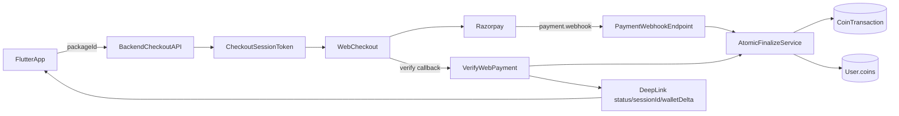

# P0 Payment Hardening and Backend-Only Gateway Report

## Scope

This implementation completes the P0 items from `FULL_APP_AUDIT_AND_SCALE_READINESS.md` and enforces a strict boundary:

- Razorpay integration is backend/web-checkout only.
- Flutter app uses provider-neutral checkout contracts and deep-link status fields.
- Coin crediting is atomic + idempotent.
- Webhooks are signature-verified, rate-limited, and replay-safe.

## Requirements Mapping

### 1) Authenticated chat webhook + limiter
- Added chat webhook signature verification middleware.
- Added webhook route-level rate limiting.
- Enabled raw-body handling for chat webhook signature correctness.

### 2) Atomic payment crediting
- Added shared transactional finalization service.
- Enforced conditional status transition (`status != completed`).
- Updated verify flows to use the atomic finalizer.

### 3) Razorpay webhook reconciliation + replay safety
- Added `/payment/webhook` endpoint.
- Added webhook signature verification and limiter.
- Added payment webhook event persistence model with unique `eventId`.
- Added idempotent async processing path.

### 4) `/payment/verify` parity with secure web verify
- Added server-side provider fetch/capture verification.
- Added order/user/package/currency integrity checks before finalization.
- Unified finalization behavior with web verify and webhook paths.

### 5) No Flutter-Razorpay coupling
- Removed app runtime dependency on gateway IDs (`orderId`) in deep-link dedupe.
- Switched mobile checkout initiation to provider-neutral `packageId`.
- Standardized deep-link/result handling on neutral fields (`status`, `sessionId`, `walletDelta`).

## Architecture (Before -> After)

## File-by-File Change Log

## Backend

- `backend/src/middlewares/webhook-signature.middleware.ts`
  - Added reusable raw-body helper + timing-safe compare helper.
  - Added `verifyStreamChatWebhookSignature`.
  - Added `verifyRazorpayWebhookSignature`.
  - Preserved existing Stream Video signature middleware behavior.

- `backend/src/server.ts`
  - Replaced single-route raw-body gate with signed-webhook gate for:
    - `/api/v1/video/webhook`
    - `/api/v1/chat/webhook`
    - `/api/v1/payment/webhook`
  - Ensures signature validation uses exact raw bytes.

- `backend/src/modules/chat/chat.routes.ts`
  - Added `webhookLimiter` and `verifyStreamChatWebhookSignature` to `/chat/webhook`.

- `backend/src/modules/chat/chat.webhook.ts`
  - Added safe payload parser supporting raw `Buffer` bodies.

- `backend/src/modules/user/coin-transaction.model.ts`
  - Added gateway tracking fields:
    - `paymentGatewayOrderId`
    - `paymentGatewayProvider`
  - Added indexes for provider reconciliation lookups.

- `backend/src/modules/payment/payment-finalization.service.ts` (new)
  - Added shared transaction/session-based finalize flow.
  - Handles idempotent repeated calls and user mismatch checks.
  - Performs coin increment and transaction completion atomically.

- `backend/src/modules/payment/payment-webhook-event.model.ts` (new)
  - Added replay-safe webhook event store with unique `eventId`.
  - Tracks processing status (`received`, `processed`, `failed`).

- `backend/src/modules/payment/payment.controller.ts`
  - Added provider-neutral package/session helpers:
    - `packageId` normalization and resolution.
    - deep-link builder with `status`, `sessionId`, `walletDelta`.
  - `initiateWebCheckout` now accepts `packageId` (fallback to `coins` for compatibility) and returns `sessionId` + `packageId`.
  - `createWebOrder` now validates package by `packageId` and current pricing config.
  - `verifyWebPayment` now:
    - validates signature,
    - verifies provider capture server-side,
    - enforces ownership checks,
    - finalizes atomically,
    - returns neutral deep-link contract.
  - `verifyPayment` now:
    - verifies signature + provider capture server-side,
    - performs integrity checks,
    - finalizes atomically.
  - Added new `handleRazorpayWebhook` endpoint handler with replay-safe persistence and async idempotent processing.

- `backend/src/modules/payment/payment.routes.ts`
  - Added `/payment/webhook` route with limiter + Razorpay signature middleware.
  - Wired new webhook handler export.

## Frontend (Flutter)

- `frontend/lib/features/wallet/models/wallet_pricing_model.dart`
  - Added `packageId` to wallet pack model.

- `frontend/lib/features/wallet/services/payment_service.dart`
  - Updated checkout initiation contract to accept `packageId` instead of `coins`.
  - Kept response model provider-neutral (`sessionId`, `packageId`, etc).

- `frontend/lib/features/wallet/screens/wallet_screen.dart`
  - Updated coin pack action wiring to pass `packageId` through checkout initiation flow.

- `frontend/lib/shared/widgets/coin_purchase_popup.dart`
  - Updated popup checkout flow to pass `packageId`.

- `frontend/lib/app/widgets/app_lifecycle_wrapper.dart`
  - Deep-link parser now prioritizes neutral `status`.
  - Reads `walletDelta` (fallback `coinsAdded` for compatibility).
  - Dedupe switched from `orderId` to `sessionId`.

- `frontend/ENVIRONMENT_VARIABLES.md`
  - Updated payment section to explicit gateway-agnostic mobile contract.

- `frontend/razorpay_flutter_documentation.md`
  - Replaced legacy SDK integration notes with backend-only gateway policy.

## Security Controls Added

- Signature verification:
  - Chat webhook (`X-SIGNATURE` + optional API key check).
  - Payment webhook (`X-Razorpay-Signature`).
- Route-level webhook rate limiting for chat and payment webhooks.
- Raw payload enforcement for signed webhook verification.
- Replay defense:
  - Persistent webhook event record with unique `eventId`.
  - Duplicate webhook events acknowledged without reprocessing.
- Atomic financial mutation:
  - DB transaction wraps transaction completion + user coin increment.
  - Duplicate retries cannot double-credit.

## API Contract Changes

## Mobile checkout initiate (app -> backend)

### Before
- Request: `{ "coins": <number> }`
- Response contained checkout URL and amount metadata.

### After
- Preferred request: `{ "packageId": "pack_<coins>" }`
- Compatibility fallback: `coins` still accepted.
- Response includes:
  - `checkoutUrl`
  - `sessionId`
  - `packageId`
  - `coins`, `priceInr`, `amount`, `expiresInSeconds`

## Payment result deep-link (backend/web -> app)

### Before
- `payment=success|failed`
- `coinsAdded`
- `orderId`

### After
- `status=success|failed` (primary)
- `sessionId`
- `walletDelta`
- `message` (optional)
- Compatibility keys currently retained: `payment`, `coinsAdded`.

## Verification Evidence

## Backend checks
- `npm run type-check` passed.
- `npm run lint` failed due pre-existing repository-wide issues (legacy unrelated warnings + one existing error in `admin.legacy.controller.ts`), not introduced by this change set.

## Frontend checks
- `flutter analyze` returns pre-existing informational issues across the project; no new blocking analyzer errors specific to this payment hardening flow were reported in changed files.

## Runtime behavior validation points
- Flutter runtime has no direct Razorpay SDK dependency.
- Payment verification is server-side only for app/web/webhook flows.
- Webhook replay attempts should be idempotent due to unique event persistence + atomic finalizer.

## Rollout and Migration Notes

1. Deploy backend first (new webhook endpoint + atomic finalizer + neutral deep-link support).
2. Ensure Razorpay webhook is configured to call `/api/v1/payment/webhook` with secret set.
3. Deploy Flutter app update consuming `packageId` and neutral deep-link params.
4. After one compatibility window, remove legacy fallback keys (`coins`, `payment`, `coinsAdded`) if no longer needed.

## Operational Runbook

- Monitor:
  - payment webhook signature failures,
  - duplicate webhook count,
  - webhook event statuses (`failed` spikes),
  - payment finalization errors (`TRANSACTION_NOT_FOUND`, `TRANSACTION_USER_MISMATCH`),
  - pending-to-completed conversion time.
- Replay procedure:
  - inspect `PaymentWebhookEvent` documents with `status='failed'`,
  - verify gateway payment/order IDs,
  - trigger safe reprocessing by re-sending webhook or invoking verify endpoint with valid IDs/signature.

## Residual Risks / Follow-ups

- `create-order` app endpoint still exists for backward compatibility; consider deprecation/removal once all clients use web checkout session flow.
- Tighten `any` typing in payment controller/webhook payloads to reduce lint noise and improve maintainability.
- Add dedicated integration tests for:
  - concurrent webhook + verify calls,
  - duplicate webhook retries,
  - rollback safety on simulated mid-transaction failures.
