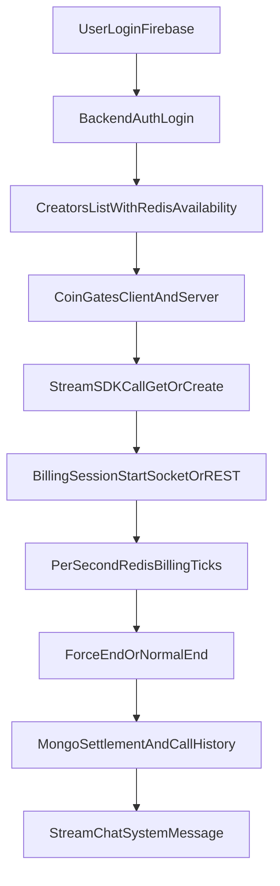

# Video Calling System Code Audit

## Purpose
This document explains how video calling works in the current codebase, strictly from repository code paths and configuration.  
It also evaluates whether the implementation appears reliable and scalable for:
- 1000 users/day
- 200 creators
- 50 concurrent video calls

No behavior is claimed unless it is directly supported by code in this repository.

---

## Scope Analyzed
- Backend API and real-time services: `backend/src`
- Flutter app client flows: `frontend/lib`
- Payment and wallet purchase paths connected to coin balance: `backend/src/modules/payment`, `backend/src/modules/user`
- Existing billing/call infrastructure docs in `backend/docs` (used only as secondary cross-reference, not as authority over code)

Primary scenario analyzed:
1. User logs in via mobile number or Google
2. User opens homepage and sees creators
3. User has enough coins
4. User starts video call with creator
5. Billing runs and call settles

---

## Deployment Context Provided
- Railway Pro Plan (backend hosting)
- Upstash Redis (pay-as-you-go)
- MongoDB Atlas Flex
- Stream Video (pay-as-you-go)
- Stream Chat (Build/Start plan)
- Firebase Blaze
- Razorpay

This audit maps code requirements to these services. It does not verify account-level quotas or vendor limits because those are outside repository code.

---

## Evidence Rules Used
- Every major claim maps to specific handlers/services/routes in code.
- Client-side checks and server-side checks are separated.
- Unknowns are explicitly labeled as **Not provable from code alone**.
- "Works perfectly" is evaluated as:
  - proven paths
  - guarded but not guaranteed paths
  - not provable without runtime testing

---

## High-Level Architecture (As Implemented)

---

## System Boundary and Modules Involved

### Authentication and identity
- API route and controller: `backend/src/modules/auth/auth.routes.ts`, `backend/src/modules/auth/auth.controller.ts`
- Token verification middleware: `backend/src/middlewares/auth.middleware.ts`
- Client auth sync to backend: `frontend/lib/features/auth/providers/auth_provider.dart`
- API auth header injection: `frontend/lib/core/api/api_client.dart`

### Creator listing and availability
- Creator listing endpoint: `backend/src/modules/creator/creator.routes.ts` and `getAllCreators` in `creator.controller.ts`
- Redis-backed availability gateway: `backend/src/modules/availability/availability.gateway.ts`
- Availability storage/batch reads: `backend/src/modules/availability/availability.service.ts`
- Home feed request: `frontend/lib/features/home/providers/home_provider.dart`

### Video call and Stream token
- Stream video token endpoint: `backend/src/modules/video/video.routes.ts`, `video.controller.ts`
- Stream token generation: `backend/src/config/stream-video.ts`
- Client Stream initialization and token loader: `frontend/lib/features/video/providers/stream_video_provider.dart`, `video_service.dart`
- SDK call creation/join: `frontend/lib/features/video/services/call_service.dart`

### Billing and settlement
- Socket and REST billing entry points: `backend/src/modules/billing/billing-socket.gateway.ts`, `billing.routes.ts`
- Core billing cycle: `backend/src/modules/billing/billing.service.ts`
- Settlement transaction logic: `backend/src/modules/billing/billing-settlement.service.ts`
- Call force termination: `backend/src/modules/billing/billing-termination.service.ts`

### Webhook and lifecycle reconciliation
- Webhook signature verification: `backend/src/middlewares/webhook-signature.middleware.ts`
- Webhook handler: `backend/src/modules/video/video.webhook.ts`
- Lifecycle router and status actions: `backend/src/modules/video/call-lifecycle.service.ts`
- Recovery/reconciliation: `backend/src/modules/billing/billing-recovery.ts`, `billing-reconciliation.ts`, `backend/src/modules/video/call-reconciliation.ts`

### Wallet and purchase path (coins funding)
- Wallet/package and payment verification APIs: `backend/src/modules/payment/payment.routes.ts`, `payment.controller.ts`
- Razorpay config: `backend/src/config/razorpay.ts`
- User coin add/bonus endpoints: `backend/src/modules/user/user.routes.ts`, `user.controller.ts`

---

## End-to-End Flow (Exact Path in Code)

### 1) User login (mobile or Gmail)
1. Firebase user is obtained in app.
2. App syncs backend identity through `POST /auth/login` in `AuthNotifier._syncUserToBackend()`.
3. Backend verifies Bearer token in `verifyFirebaseToken()` middleware.
4. Backend login controller creates/updates user record and returns role/profile data.

Code references:
- `frontend/lib/features/auth/providers/auth_provider.dart`
- `backend/src/modules/auth/auth.routes.ts`
- `backend/src/middlewares/auth.middleware.ts`
- `backend/src/modules/auth/auth.controller.ts`

### 2) User opens homepage and fetches creators
1. App calls `GET /creator`.
2. Backend `getAllCreators()` loads creators from Mongo.
3. Backend enriches each creator with linked Firebase UID.
4. Backend reads availability in batch from Redis using `getBatchAvailability()`.
5. App seeds in-memory availability provider and listens for realtime `creator:status`.

Code references:
- `frontend/lib/features/home/providers/home_provider.dart`
- `backend/src/modules/creator/creator.controller.ts`
- `backend/src/modules/availability/availability.service.ts`
- `backend/src/modules/availability/availability.gateway.ts`

### 3) User attempts to call creator
1. UI allows tap only if creator appears online.
2. Client applies pre-check `coins < 10` in homepage/chat call triggers.
3. Controller applies additional pre-check (`coins <= 0`) before call orchestration.

Code references:
- `frontend/lib/features/home/widgets/home_user_grid_card.dart`
- `frontend/lib/features/chat/screens/chat_screen.dart`
- `frontend/lib/features/video/controllers/call_connection_controller.dart`

### 4) Client creates Stream call
1. App gets Stream Video JWT from `POST /video/token`.
2. Token role is mapped server-side (`user` or `call_member`) from authenticated user role.
3. App creates call via Stream SDK `makeCall(...).getOrCreate(...)` with `ringing: true`.
4. `call.join()` is triggered client-side (with retry logic in `CallService`).

Code references:
- `backend/src/modules/video/video.controller.ts`
- `backend/src/config/stream-video.ts`
- `frontend/lib/features/video/providers/stream_video_provider.dart`
- `frontend/lib/features/video/services/call_service.dart`

Important implemented behavior:
- There is no dedicated REST API that creates Stream calls; creation is SDK-first in Flutter.

### 5) Billing start event
1. After Stream status becomes connected, client emits `call:started`.
2. If socket is down, client falls back to `POST /billing/call-started`.
3. Backend validates REST access with callId parsing and participant checks.
4. Backend starts billing session in Redis (`startBillingSession()`), including min-coins checks.

Code references:
- `frontend/lib/features/video/controllers/call_connection_controller.dart`
- `frontend/lib/core/services/socket_service.dart`
- `backend/src/modules/billing/billing-socket.gateway.ts`
- `backend/src/modules/billing/billing.routes.ts`
- `backend/src/modules/billing/billing-rest-access.ts`
- `backend/src/modules/billing/billing-call-id.util.ts`
- `backend/src/modules/billing/billing.service.ts`

### 6) Billing loop during call
1. Session data stored in Redis keys (`call:session:*`, `call:user_coins:*`, `call:creator_earnings:*`).
2. Tick processing computes time delta and deducts micros from user / credits creator.
3. Server emits `billing:update` events to both participants.
4. Low balance or duration cap triggers `call:force-end` + Stream mark-ended attempt.

Code references:
- `backend/src/modules/billing/billing.service.ts`
- `backend/src/config/redis.ts`
- `backend/src/modules/billing/billing-termination.service.ts`
- `backend/src/config/pricing.config.ts`

### 7) Call end and settlement
1. Client emits `call:ended`; if socket down, fallback `POST /billing/call-ended`.
2. Stream webhooks (`call.session_ended`, `call.ended`) also trigger settlement routes.
3. Settlement flushes residual billing deltas, runs Mongo transaction, writes:
   - final user coins
   - user debit coin transaction
   - creator credit coin transaction
   - call history for user and creator
4. Settlement cleans Redis session keys and emits `coins_updated` / `billing:settled`.
5. Settlement posts Stream Chat system message summarizing call completion.

Code references:
- `frontend/lib/core/services/socket_service.dart`
- `backend/src/modules/billing/billing.routes.ts`
- `backend/src/modules/video/call-lifecycle.service.ts`
- `backend/src/modules/billing/billing-settlement.service.ts`
- `backend/src/modules/video/video.webhook.ts`

---

## Authentication and Authorization Controls

### API auth
- Protected APIs require Bearer token in `verifyFirebaseToken`.
- Middleware supports both Firebase ID tokens and internal JWT for admin/agent paths.

### Socket auth
- Socket handshake token is Firebase-verified in `setupAvailabilityGateway()` middleware.

### Billing REST fallback protections
- `call-started` checks:
  - callId format
  - authenticated caller UID matches callId caller segment
  - creatorMongoId matches callId segment
- `call-ended` checks:
  - user is a participant from Redis session when available, otherwise fallback check on parsed caller UID

Code references:
- `backend/src/middlewares/auth.middleware.ts`
- `backend/src/modules/availability/availability.gateway.ts`
- `backend/src/modules/billing/billing-rest-access.ts`
- `backend/src/modules/billing/billing-call-id.util.ts`

---

## Coins, Pricing, and Admission Rules

### Client-side gating
- Home and chat call triggers block at `coins < 10`.
- Controller blocks hard at `coins <= 0`.

### Server-side gating (authoritative)
- `MIN_COINS_TO_CALL` from env (default 10).
- Billing session start rejects if balance is below max of:
  - one second price
  - min coins threshold
- If rejected, server emits force-end and attempts Stream mark-ended.

### Runtime call gating
- Per-second billing can force-end mid-call if user can no longer afford next charge.
- Call can also force-end at effective duration limit.

Code references:
- `frontend/lib/features/home/widgets/home_user_grid_card.dart`
- `frontend/lib/features/chat/screens/chat_screen.dart`
- `backend/src/config/pricing.config.ts`
- `backend/src/modules/billing/billing.service.ts`
- `backend/src/modules/billing/billing-termination.service.ts`

---

## Data and Storage Interaction

### Redis (ephemeral/session-critical)
- Availability keys and TTL heartbeats
- Call billing session keys
- Active call mappings per user
- Pending end markers
- Settled-call idempotency markers
- Reconciliation and lock keys

Code reference:
- `backend/src/config/redis.ts`

### MongoDB (durable records)
- `User`, `Creator`
- `CoinTransaction`
- `CallHistory`
- `Call`
- `WebhookEvent` (webhook idempotency/audit)

Code references:
- `backend/src/modules/user/user.model.ts`
- `backend/src/modules/creator/creator.model.ts`
- `backend/src/modules/user/coin-transaction.model.ts`
- `backend/src/modules/billing/call-history.model.ts`
- `backend/src/modules/video/call.model.ts`
- `backend/src/modules/video/webhook-event.model.ts`

---

## Deterministic Outcomes Matrix (From Code)

### A) User has insufficient coins before billing start
- Outcome:
  - billing session not created
  - force-end event emitted
  - Stream mark-ended attempted
- Determinism: **Implemented deterministically in `startBillingSession()`**

### B) User runs out of coins during active call
- Outcome:
  - force-end emitted
  - tick returns settlement-needed state
  - settlement flow executed through normal end path
- Determinism: **Implemented deterministically in billing tick logic**

### C) Call exceeds duration limit
- Outcome:
  - warning event near threshold
  - forced termination at/after limit
- Determinism: **Implemented deterministically in billing tick logic**

### D) Socket unavailable when emitting call start/end
- Outcome:
  - client attempts REST fallback (`/billing/call-started`, `/billing/call-ended`)
  - pending end markers used if session not yet ready
- Determinism: **Implemented with explicit fallback logic**

### E) Duplicate webhook events
- Outcome:
  - dedup attempted via Mongo unique record + Redis idempotency key
  - duplicate events skipped
- Determinism: **Implemented; duplicate prevention exists**

### F) Settlement retried/duplicate invocation
- Outcome:
  - settle lock and settled marker prevent repeated financial writes
  - checks existing call history as idempotency guard
- Determinism: **Implemented with multiple idempotency guards**

### G) Stream mark-ended fails on force termination
- Outcome:
  - retries queued (BullMQ mode or Redis retry mode)
  - billing settlement path still continues
- Determinism: **Implemented with retry + non-fatal fallback**

---

## Not Provable From Code Alone

These are explicit unknowns at repository-only level:
- Whether all webhook delivery failures are retried by Stream exactly as needed in every outage pattern.
- End-to-end "exactly once" financial semantics across all crash timing windows (code has strong guards, but no formal proof artifact).
- Runtime capacity of Railway/Upstash/Atlas/Stream plans under your exact traffic and burst profile.
- Actual mobile network behavior and reconnect churn under production conditions.
- Vendor-side rate limits and throttling thresholds for Stream APIs, Upstash Redis throughput, Atlas transaction throughput.

---

## Scalability Assessment for Target Load

Target requested:
- 1000 users/day
- 200 creators
- 50 concurrent calls

### Code-level workload signals (what code implies)

#### Per active call tick (rough lower bound from code path)
In `billing.service.ts`, each successful tick includes multiple Redis operations and two socket emits:
- Redis writes:
  - `setex(call:user_coins:...)`
  - `setex(call:creator_earnings:...)`
  - `setex(call:session:...)`
  - active slot TTL refresh for user + creator (`expire` x2)
- Socket emits:
  - `billing:update` to payer room
  - `billing:update` to creator room

So for 50 active concurrent calls at ~1 second tick cadence, the system will execute at least several hundred Redis operations/sec plus continuous websocket event flow. This is directly implied by code shape.

#### Creator list endpoint load
- `getAllCreators()` does:
  - creator collection fetch
  - per-creator linked user lookup (N+1 pattern)
  - optional update of gallery URLs in read path
  - Redis availability batch read
- For 200 creators, this is functionally correct but likely a hotspot under high request frequency.

#### Presence broadcast behavior
- Creator status emits use `io.emit('creator:status', ...)`, which broadcasts to all connected clients.
- User status emits are narrowed to creators room in some paths.
- Broad creator broadcasts can become fanout-heavy as socket population grows.

#### End-of-call burst behavior
- Settlement uses Mongo transactions and multiple upserts/writes per call.
- If many calls end in a short window, Mongo write/transaction pressure spikes.

#### Recovery/reconciliation overhead
- Startup and periodic jobs scan active sessions/DLQ/stale schedules.
- Useful for correctness, but adds periodic load proportional to active/stale key counts.

### Code-based verdict for requested scale

#### 1000 users/day and 200 creators
- **Likely feasible by design** if traffic is spread and not extremely bursty.
- Reason: architecture already includes Redis session state, queue/reconciliation paths, idempotency guards, and websocket-based updates.

#### 50 concurrent active calls
- **Plausible but not guaranteed from code alone**.
- Reason: per-second billing operations and websocket updates are significant; capacity depends on actual Redis throughput, Node event loop health, and Mongo transaction latency in your live environment.

### Main bottleneck risks visible in code
- N+1 creator-user lookup in creator listing
- High-frequency Redis write amplification per active call
- Global creator status broadcast fanout
- Settlement transaction bursts on simultaneous call endings
- Operational complexity from mixed scheduling/retry/reconciliation layers

---

## Deployment Stack Fit (Code Requirements vs Your Services)

### Railway (backend)
- Code expects long-running socket server + HTTP API + scheduled processors/reconciliation jobs.
- Multi-instance support exists via optional Socket.IO Redis adapter.

### Upstash Redis
- Redis is critical path for:
  - availability
  - billing state
  - idempotency
  - reconciliation queues/locks
- If Redis is unavailable, billing correctness is degraded/blocked by design (logged as critical).

### MongoDB Atlas
- Settlement requires Mongo transactions and consistent reads/writes of user/creator/transaction/history records.
- Transaction performance under burst endings is a practical scaling factor.

### Stream Video
- Client-side call creation is SDK-driven.
- Backend relies heavily on Stream webhooks and mark-ended API behaviors.

### Stream Chat
- Used for chat and post-call activity system messages.
- Not the authority for billing math, but included in lifecycle side effects.

### Firebase
- Required for auth token verification (API and socket handshakes).

### Razorpay
- Funds wallet/coins purchase path only; does not execute call billing logic directly.

---

## "Does Everything Work Perfectly?" — Evidence-Based Verdict

### Proven implemented paths (from code)
- Firebase auth to backend user sync
- Creator listing with Redis availability overlay
- Stream token generation and SDK call creation path
- Billing start via socket with REST fallback
- Per-second billing tick with force-end conditions
- Settlement with Mongo transaction and idempotency guards
- Webhook signature verification and lifecycle routing
- Recovery/reconciliation infrastructure

### Guarded but not guaranteed paths
- Async webhook processing after immediate 200 response
- Force-end dependence on external Stream mark-ended success (with retries)
- Multi-layer retries under prolonged external dependency issues

### Not provable without runtime testing
- Sustained correctness/performance at 50 concurrent calls on current deployed plans
- End-to-end vendor behavior under real packet loss/retry storms
- True production latency/throughput headroom for Redis and Mongo at burst edges

Conclusion:
- The system is engineered with many correctness and resilience controls.
- A strict claim of "everything works perfectly" is **not provable from code alone**.
- For your target concurrency, implementation is strong, but capacity certainty requires runtime load validation.

---

## Recommended Validation Checklist (to convert code confidence into production confidence)

### Static checks (code/config)
- Ensure `MIN_COINS_TO_CALL` aligns with frontend call gate behavior (`coins < 10` checks).
- Confirm all required env vars for Redis/Stream/Firebase/Razorpay are present in production.
- Verify billing driver mode (`zset` vs `bullmq`) is intentionally chosen.

### Runtime checks (must execute in environment)
- Simulate concurrent calls and observe:
  - Redis command latency and errors
  - billing tick lag
  - settlement latency
  - websocket event delivery lag
- Test failure scenarios:
  - socket disconnect during call start/end
  - webhook duplicates/out-of-order
  - temporary Redis unavailability
  - Stream API failure on mark-ended
- Verify financial correctness:
  - user debit and creator credit consistency
  - idempotent settlement under repeated end events

---

## Final Answer to Requested Scenario

For your exact scenario (mobile/Google login -> homepage creator list -> enough coins -> video call):
- The complete path is implemented end-to-end in code, including fallback and settlement mechanisms.
- There are explicit safeguards for low balance, duration cap, duplicate events, and reconnect/recovery.
- Scalability for 1000 users/day, 200 creators, and 50 concurrent calls appears architecturally reasonable, but cannot be declared guaranteed without environment-level load testing on your actual Railway/Upstash/Atlas/Stream plans.

