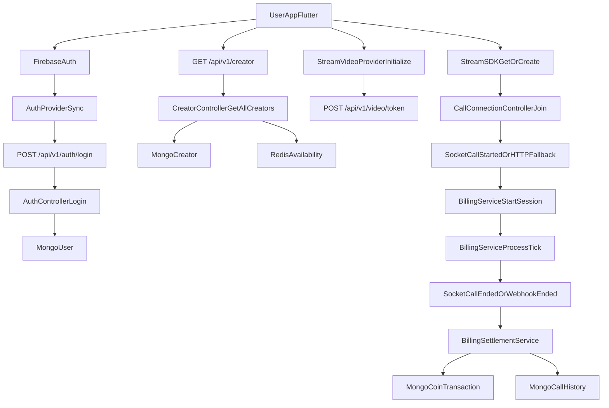
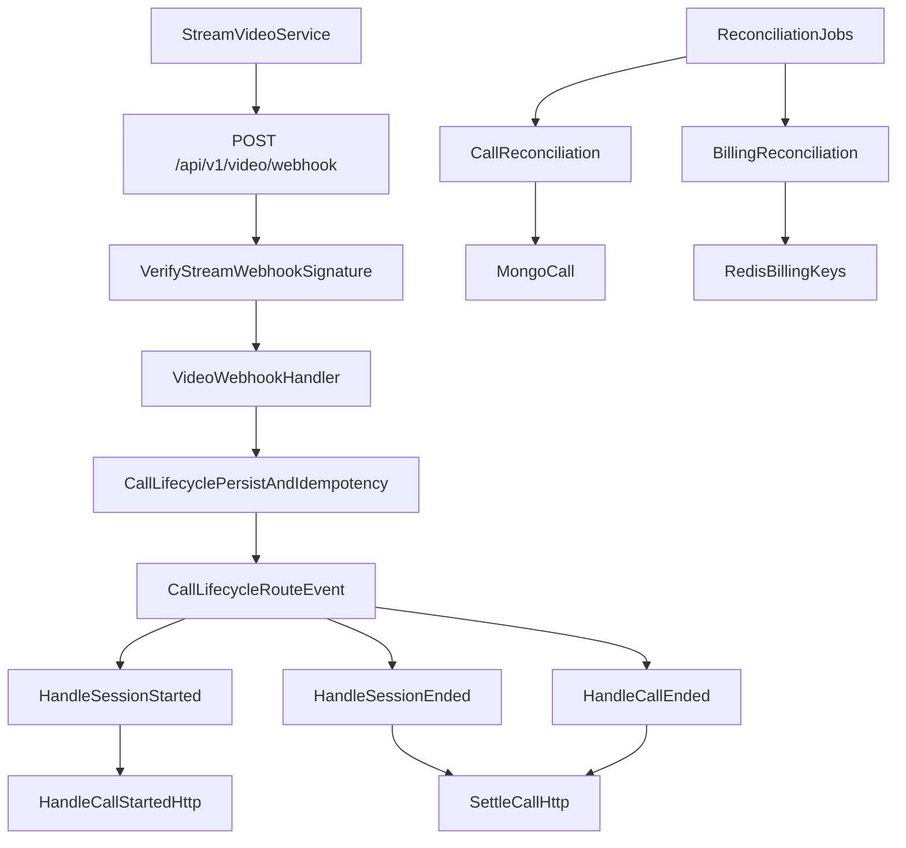
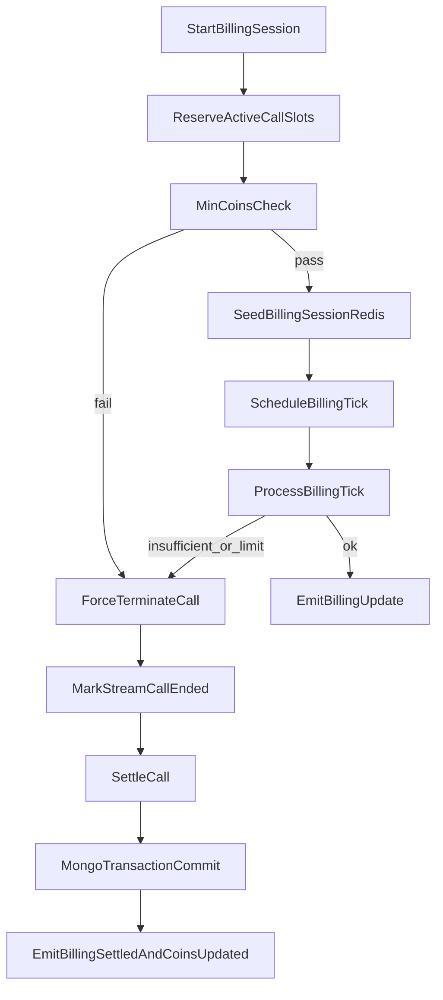

# VIDEO_CALL_SYSTEM_E2E_AUDIT

## Methodology and No-Assumption Rules

This audit is written with strict evidence-only rules:

1. Only behavior explicitly implemented in repository code is stated as fact.
2. If behavior depends on runtime environment values, it is labeled as env-dependent.
3. If behavior depends on external provider quotas/plans (Railway, Upstash, Atlas, Stream, Firebase, Razorpay), it is labeled as unknown-from-code unless enforced in repo.
4. If historical docs claim behavior that is not enforced in code, that claim is not treated as implemented.
5. Each critical claim maps to concrete file/function evidence.

### Evidence Grading Used

- `Implemented (code-proven)`: Executable logic exists in code paths.
- `Configured by default (env-overridable)`: Default exists in code but can change via env.
- `Documented only (not runtime-enforced)`: Present in markdown/docs only.
- `Unknown from codebase`: Cannot be proven from repository code.

## System Components Involved

### Backend API and Gateways

- Route mounts: [d:/zztherapy/backend/src/routes.ts](d:/zztherapy/backend/src/routes.ts)
  - Relevant modules: `/auth`, `/creator`, `/video`, `/billing`, `/payment`, `/user`.
- Server composition: [d:/zztherapy/backend/src/server.ts](d:/zztherapy/backend/src/server.ts)
  - Express + Socket.IO + optional Socket.IO Redis adapter + Mongo + Redis + monitoring endpoints.
- Auth middleware: [d:/zztherapy/backend/src/middlewares/auth.middleware.ts](d:/zztherapy/backend/src/middlewares/auth.middleware.ts)
  - Verifies Firebase ID token for mobile user routes; supports admin/agent JWT paths.

### Mobile App (Flutter) Runtime Components

- Authentication orchestration: [d:/zztherapy/frontend/lib/features/auth/providers/auth_provider.dart](d:/zztherapy/frontend/lib/features/auth/providers/auth_provider.dart)
- Home creator feed and availability hydration: [d:/zztherapy/frontend/lib/features/home/providers/home_provider.dart](d:/zztherapy/frontend/lib/features/home/providers/home_provider.dart)
- Stream Video client bootstrap:
  - [d:/zztherapy/frontend/lib/features/video/providers/stream_video_provider.dart](d:/zztherapy/frontend/lib/features/video/providers/stream_video_provider.dart)
  - [d:/zztherapy/frontend/lib/features/video/services/video_service.dart](d:/zztherapy/frontend/lib/features/video/services/video_service.dart)
- Call lifecycle orchestration:
  - [d:/zztherapy/frontend/lib/features/video/services/call_service.dart](d:/zztherapy/frontend/lib/features/video/services/call_service.dart)
  - [d:/zztherapy/frontend/lib/features/video/controllers/call_connection_controller.dart](d:/zztherapy/frontend/lib/features/video/controllers/call_connection_controller.dart)
- Socket events + REST fallback:
  - [d:/zztherapy/frontend/lib/core/services/socket_service.dart](d:/zztherapy/frontend/lib/core/services/socket_service.dart)
- App-level stream/socket initialization:
  - [d:/zztherapy/frontend/lib/app/widgets/stream_chat_wrapper.dart](d:/zztherapy/frontend/lib/app/widgets/stream_chat_wrapper.dart)

### Data and State Layers

- MongoDB models:
  - Call lifecycle: [d:/zztherapy/backend/src/modules/video/call.model.ts](d:/zztherapy/backend/src/modules/video/call.model.ts)
  - Webhook idempotency: [d:/zztherapy/backend/src/modules/video/webhook-event.model.ts](d:/zztherapy/backend/src/modules/video/webhook-event.model.ts)
  - User/Creator and coin transactions/call history in their respective modules.
- Redis state:
  - Keys/TTLs/helpers: [d:/zztherapy/backend/src/config/redis.ts](d:/zztherapy/backend/src/config/redis.ts)
  - Billing session, active call slots, idempotency keys, reconciliation locks.

### Third-Party Integrations Actually Used in Call Flow

- Firebase Auth token verification: [d:/zztherapy/backend/src/middlewares/auth.middleware.ts](d:/zztherapy/backend/src/middlewares/auth.middleware.ts)
- Stream Video token generation + webhook verification:
  - [d:/zztherapy/backend/src/config/stream-video.ts](d:/zztherapy/backend/src/config/stream-video.ts)
  - [d:/zztherapy/backend/src/middlewares/webhook-signature.middleware.ts](d:/zztherapy/backend/src/middlewares/webhook-signature.middleware.ts)
- Razorpay purchase and verify flows:
  - [d:/zztherapy/backend/src/modules/payment/payment.controller.ts](d:/zztherapy/backend/src/modules/payment/payment.controller.ts)

## Exact End-to-End Flow: Login -> Creator Discovery -> Video Call

## 1) Login by phone OTP or Google

### Google login path (`Implemented`)

- Mobile triggers Google sign-in via `signInWithGoogle()`:
  - [d:/zztherapy/frontend/lib/features/auth/providers/auth_provider.dart](d:/zztherapy/frontend/lib/features/auth/providers/auth_provider.dart)
- On Firebase auth success, `_syncUserToBackend()` gets Firebase ID token and calls `POST /auth/login`.
- Backend `POST /api/v1/auth/login` route:
  - [d:/zztherapy/backend/src/modules/auth/auth.routes.ts](d:/zztherapy/backend/src/modules/auth/auth.routes.ts)
- Backend controller creates user on first login (no separate mobile signup endpoint):
  - [d:/zztherapy/backend/src/modules/auth/auth.controller.ts](d:/zztherapy/backend/src/modules/auth/auth.controller.ts)
  - If user not found by `firebaseUid`, creates `User` with `role: 'user'`, `coins: 0`, then returns response.

### Phone OTP login path (`Implemented`)

- Mobile starts Firebase `verifyPhoneNumber` flow in `signInWithPhone()` and verifies in `verifyOtp()`:
  - [d:/zztherapy/frontend/lib/features/auth/providers/auth_provider.dart](d:/zztherapy/frontend/lib/features/auth/providers/auth_provider.dart)
- After Firebase sign-in, same `_syncUserToBackend()` path calls `POST /auth/login`.

### Important exact behavior

- `verifyFirebaseToken` middleware sets `req.auth` from Firebase decoded token:
  - [d:/zztherapy/backend/src/middlewares/auth.middleware.ts](d:/zztherapy/backend/src/middlewares/auth.middleware.ts)
- `auth.controller.login` is both login + first-time user creation path.
- `POST /auth/fast-login` returns 410 deprecated response, not an active login path:
  - [d:/zztherapy/backend/src/modules/auth/auth.controller.ts](d:/zztherapy/backend/src/modules/auth/auth.controller.ts)

## 2) User homepage creator list

- Frontend fetches `GET /creator` in `creatorsProvider`:
  - [d:/zztherapy/frontend/lib/features/home/providers/home_provider.dart](d:/zztherapy/frontend/lib/features/home/providers/home_provider.dart)
- Backend route/controller:
  - [d:/zztherapy/backend/src/modules/creator/creator.routes.ts](d:/zztherapy/backend/src/modules/creator/creator.routes.ts)
  - [d:/zztherapy/backend/src/modules/creator/creator.controller.ts](d:/zztherapy/backend/src/modules/creator/creator.controller.ts)
- Controller returns all creators (`Creator.find({})`) with availability derived from Redis (`getBatchAvailability`), favorites mapped for current user, and linked user `firebaseUid`.

## 3) User starts a call if coins are enough

### Client-side checks (`Implemented`)

- Home card blocks call when `user.coins < 10`:
  - [d:/zztherapy/frontend/lib/features/home/widgets/home_user_grid_card.dart](d:/zztherapy/frontend/lib/features/home/widgets/home_user_grid_card.dart)
- Chat screen also blocks on creator offline and `user.coins < 10`:
  - [d:/zztherapy/frontend/lib/features/chat/screens/chat_screen.dart](d:/zztherapy/frontend/lib/features/chat/screens/chat_screen.dart)
- `CallConnectionController.startUserCall` precheck blocks only when `userCoins <= 0`:
  - [d:/zztherapy/frontend/lib/features/video/controllers/call_connection_controller.dart](d:/zztherapy/frontend/lib/features/video/controllers/call_connection_controller.dart)
  - This means two different client thresholds exist (`<10` in some entry points and `<=0` in controller).

### Stream call creation (`Implemented`)

- Call is created via SDK `call.getOrCreate(...)` with `memberIds: [creatorFirebaseUid], ringing: true, video: true`:
  - [d:/zztherapy/frontend/lib/features/video/services/call_service.dart](d:/zztherapy/frontend/lib/features/video/services/call_service.dart)
- Backend does not expose REST endpoint to create Stream calls; backend provides token and webhook/billing lifecycle handling.

### Billing trigger from client (`Implemented`)

- On `CallStatusConnected`, controller emits `call:started` through `SocketService`; if socket disconnected, fallback to `POST /billing/call-started`:
  - [d:/zztherapy/frontend/lib/features/video/controllers/call_connection_controller.dart](d:/zztherapy/frontend/lib/features/video/controllers/call_connection_controller.dart)
  - [d:/zztherapy/frontend/lib/core/services/socket_service.dart](d:/zztherapy/frontend/lib/core/services/socket_service.dart)

## 4) Ongoing billing and call end

- Billing session starts in backend `BillingService.startBillingSession(...)`:
  - [d:/zztherapy/backend/src/modules/billing/billing.service.ts](d:/zztherapy/backend/src/modules/billing/billing.service.ts)
- Per-tick deductions run in `processBillingTick`, using Redis lock and micro-coin arithmetic.
- Call end is signaled by:
  - client `call:ended` (socket or REST fallback),
  - Stream webhooks (`call.session_ended` / `call.ended`),
  - force termination path (`call:force-end`) when insufficient coins/duration limits trigger.
- Final settlement in `settleCall(...)` writes Mongo transaction history and coin updates:
  - [d:/zztherapy/backend/src/modules/billing/billing-settlement.service.ts](d:/zztherapy/backend/src/modules/billing/billing-settlement.service.ts)

## Video and Billing API/Event Contracts

## HTTP APIs (implemented route contracts)

### `POST /api/v1/video/token`

- Route: [d:/zztherapy/backend/src/modules/video/video.routes.ts](d:/zztherapy/backend/src/modules/video/video.routes.ts)
- Handler: [d:/zztherapy/backend/src/modules/video/video.controller.ts](d:/zztherapy/backend/src/modules/video/video.controller.ts)
- Request body: optional `{ role: "user" | "creator" }`
- Success response: `{ success: true, data: { token } }`
- Failure branches include 401 (unauthorized), 403 (creator role mismatch), 404 (user not found), 500.

### `GET /api/v1/video/calls/active`

- Route: [d:/zztherapy/backend/src/modules/video/video.routes.ts](d:/zztherapy/backend/src/modules/video/video.routes.ts)
- Returns `activeCalls` from Redis active-call slot when call is still active by `isCallActive(...)`.

### `POST /api/v1/video/webhook`

- Route: [d:/zztherapy/backend/src/modules/video/video.routes.ts](d:/zztherapy/backend/src/modules/video/video.routes.ts)
- Guard chain: `webhookLimiter` + `verifyStreamWebhookSignature`.
- Signature middleware validates HMAC (`x-signature`) and optional `x-api-key`:
  - [d:/zztherapy/backend/src/middlewares/webhook-signature.middleware.ts](d:/zztherapy/backend/src/middlewares/webhook-signature.middleware.ts)
- Controller immediately returns `{ success: true }` and processes asynchronously:
  - [d:/zztherapy/backend/src/modules/video/video.webhook.ts](d:/zztherapy/backend/src/modules/video/video.webhook.ts)

### `POST /api/v1/billing/call-started`

- Route: [d:/zztherapy/backend/src/modules/billing/billing.routes.ts](d:/zztherapy/backend/src/modules/billing/billing.routes.ts)
- Required body: `{ callId, creatorFirebaseUid, creatorMongoId }`
- Access checks: [d:/zztherapy/backend/src/modules/billing/billing-rest-access.ts](d:/zztherapy/backend/src/modules/billing/billing-rest-access.ts)

### `POST /api/v1/billing/call-ended`

- Route: [d:/zztherapy/backend/src/modules/billing/billing.routes.ts](d:/zztherapy/backend/src/modules/billing/billing.routes.ts)
- Required body: `{ callId }`
- Access check confirms caller is participant/payer.

## Socket events in call-billing lifecycle

### Client emits

- `call:started` payload includes:
  - `callId`, `creatorFirebaseUid`, `creatorMongoId`, optional `userFirebaseUid`
  - Source: [d:/zztherapy/frontend/lib/core/services/socket_service.dart](d:/zztherapy/frontend/lib/core/services/socket_service.dart)
- `call:ended` payload `{ callId }`
- `billing:recover-state` for reconnect recovery.

### Server emits

- `billing:started`, `billing:update`, `billing:settled`, `billing:error`, `call:force-end`, `billing:recover-state:response`:
  - [d:/zztherapy/backend/src/modules/billing/billing-socket.gateway.ts](d:/zztherapy/backend/src/modules/billing/billing-socket.gateway.ts)

## Stream webhook event types actually handled

From `CallLifecycleService.routeEvent(...)`:

- handled: `call.ringing`, `call.created`, `call.accepted`, `call.session_started`, `call.session_ended`, `call.ended`
- unhandled types are logged only:
  - [d:/zztherapy/backend/src/modules/video/call-lifecycle.service.ts](d:/zztherapy/backend/src/modules/video/call-lifecycle.service.ts)

## Coin Gating and Settlement Logic

## Authoritative minimum coin check

- Server-side admission uses `MIN_COINS_TO_CALL` and current price snapshot:
  - [d:/zztherapy/backend/src/config/pricing.config.ts](d:/zztherapy/backend/src/config/pricing.config.ts)
  - [d:/zztherapy/backend/src/modules/billing/billing.service.ts](d:/zztherapy/backend/src/modules/billing/billing.service.ts)
- Exact check:
  - Compute `minEntryMicros = MIN_COINS_TO_CALL in micros`.
  - Reject if `balanceMicros < max(pricePerSecondMicros, minEntryMicros)`.
  - Force-end reason becomes `min_coins_not_met` or `insufficient_coins`.

## Debit/credit during call

- Billing uses integer micro-coins (`COIN_MICROS = 1_000_000`) and per-call Redis locks:
  - [d:/zztherapy/backend/src/modules/billing/billing.constants.ts](d:/zztherapy/backend/src/modules/billing/billing.constants.ts)
  - [d:/zztherapy/backend/src/modules/billing/billing.service.ts](d:/zztherapy/backend/src/modules/billing/billing.service.ts)
- Per tick:
  - reads session + balances,
  - applies capped delta by wall-time,
  - updates user balance micros and creator earnings micros,
  - emits throttled billing update,
  - force-terminates when balance cannot pay next increment.

## Settlement and financial persistence

- Settlement source of truth: [d:/zztherapy/backend/src/modules/billing/billing-settlement.service.ts](d:/zztherapy/backend/src/modules/billing/billing-settlement.service.ts)
- Steps implemented:
  1. Flush pending billing lag before settlement.
  2. Acquire settlement lock and idempotency checks.
  3. Open Mongo transaction.
  4. Write final `User.coins`.
  5. Upsert debit tx `call_debit_<callId>` (if deducted > 0).
  6. Upsert creator credit tx `call_credit_<callId>` (if earned > 0).
  7. Upsert user/creator `CallHistory` rows.
  8. Commit transaction.
  9. Cleanup Redis session keys and active slot keys.
  10. Emit `coins_updated` and `billing:settled`.

## Razorpay payment flow involved with call-precondition

- Coin top-up order creation and verify:
  - [d:/zztherapy/backend/src/modules/payment/payment.controller.ts](d:/zztherapy/backend/src/modules/payment/payment.controller.ts)
- Payment verification credits user coins and emits `coins_updated`.
- These top-ups are separate from call settlement logic and only change available coin balance.

## Reliability, Idempotency, and Race-Condition Controls

## Implemented safeguards

1. **Webhook signature verification**
   - HMAC validation on raw webhook body and optional API key check.
   - [d:/zztherapy/backend/src/middlewares/webhook-signature.middleware.ts](d:/zztherapy/backend/src/middlewares/webhook-signature.middleware.ts)

2. **Webhook idempotency (two layers)**
   - Mongo unique `WebhookEvent.eventId`.
   - Redis NX idempotency key with TTL.
   - [d:/zztherapy/backend/src/modules/video/call-lifecycle.service.ts](d:/zztherapy/backend/src/modules/video/call-lifecycle.service.ts)
   - [d:/zztherapy/backend/src/modules/video/webhook-event.model.ts](d:/zztherapy/backend/src/modules/video/webhook-event.model.ts)

3. **Per-call billing lock**
   - Redis lock `billing:cycle_lock:<callId>` with heartbeat + Lua release.
   - [d:/zztherapy/backend/src/modules/billing/billing.service.ts](d:/zztherapy/backend/src/modules/billing/billing.service.ts)

4. **Active-call slot reservation**
   - One active billed call per user/creator slot via Redis NX keys.
   - [d:/zztherapy/backend/src/modules/billing/billing.service.ts](d:/zztherapy/backend/src/modules/billing/billing.service.ts)

5. **Settlement lock + settled marker**
   - Prevent duplicate settlement writes.
   - [d:/zztherapy/backend/src/modules/billing/billing-settlement.service.ts](d:/zztherapy/backend/src/modules/billing/billing-settlement.service.ts)

6. **Force-end dedupe + retry**
   - mark-ended lease/marker + queue retry path on Stream `mark_ended` failures.
   - [d:/zztherapy/backend/src/modules/billing/billing-termination.service.ts](d:/zztherapy/backend/src/modules/billing/billing-termination.service.ts)

7. **Reconciliation jobs**
   - Billing reconciliation + call reconciliation for drift correction.
   - [d:/zztherapy/backend/src/modules/video/call-reconciliation.ts](d:/zztherapy/backend/src/modules/video/call-reconciliation.ts)
   - Billing reconciliation files in billing module.

8. **Rate limits and request queueing**
   - Express limiters and in-process request queue backpressure.
   - [d:/zztherapy/backend/src/middlewares/rate-limit.middleware.ts](d:/zztherapy/backend/src/middlewares/rate-limit.middleware.ts)
   - [d:/zztherapy/backend/src/middlewares/request-queue.middleware.ts](d:/zztherapy/backend/src/middlewares/request-queue.middleware.ts)

## Observed gaps / incomplete protections (code-proven observations)

1. **Unused creator call lock acquisition function**
   - `acquireCreatorCallLock(...)` exists but active flow in webhook/billing paths relies primarily on availability + active slot reservation.
   - [d:/zztherapy/backend/src/modules/video/creator-call-lock.service.ts](d:/zztherapy/backend/src/modules/video/creator-call-lock.service.ts)

2. **Client threshold mismatch**
   - Some client paths require 10 coins; controller-level precheck only blocks at 0.
   - [d:/zztherapy/frontend/lib/features/home/widgets/home_user_grid_card.dart](d:/zztherapy/frontend/lib/features/home/widgets/home_user_grid_card.dart)
   - [d:/zztherapy/frontend/lib/features/chat/screens/chat_screen.dart](d:/zztherapy/frontend/lib/features/chat/screens/chat_screen.dart)
   - [d:/zztherapy/frontend/lib/features/video/controllers/call_connection_controller.dart](d:/zztherapy/frontend/lib/features/video/controllers/call_connection_controller.dart)

3. **Payment verification update sequence is not wrapped in Mongo transaction**
   - Transaction status save and user coin save are sequential operations.
   - [d:/zztherapy/backend/src/modules/payment/payment.controller.ts](d:/zztherapy/backend/src/modules/payment/payment.controller.ts)

4. **Admin refund operation is not transactional**
   - User refund credit and creator clawback are separate writes.
   - [d:/zztherapy/backend/src/modules/admin/admin.controller.ts](d:/zztherapy/backend/src/modules/admin/admin.controller.ts)

5. **No server-side explicit participant-cap enforcement observed in call creation path**
   - Client uses Stream SDK `getOrCreate`, and participant cap checks appear client-side.
   - [d:/zztherapy/frontend/lib/features/video/services/call_service.dart](d:/zztherapy/frontend/lib/features/video/services/call_service.dart)

## Scalability Readiness Against Target Load

Target requested: `1000 users/day`, `200 creators`, `50 concurrent video calls`.

## What code explicitly supports (`Implemented` / `Configured by default`)

1. **Request-level overload protection**
   - Global API rate limits, route-level rate limits, and request queue with timeout.
   - Defaults include queue max concurrent 500 and wait timeout 30s (env override).
   - [d:/zztherapy/backend/src/server.ts](d:/zztherapy/backend/src/server.ts)
   - [d:/zztherapy/backend/src/middlewares/request-queue.middleware.ts](d:/zztherapy/backend/src/middlewares/request-queue.middleware.ts)

2. **Billing processor tuned for high-frequency per-call updates**
   - Billing tick interval default 300ms.
   - Locking and capped delta reduce runaway over-billing after stalls.
   - [d:/zztherapy/backend/src/modules/billing/billing.constants.ts](d:/zztherapy/backend/src/modules/billing/billing.constants.ts)
   - [d:/zztherapy/backend/src/modules/billing/billing.service.ts](d:/zztherapy/backend/src/modules/billing/billing.service.ts)

3. **Horizontal scaling path exists**
   - Optional BullMQ billing driver and optional Socket.IO Redis adapter.
   - Production warning exists when BullMQ not enabled.
   - [d:/zztherapy/backend/src/modules/billing/billing.queue.ts](d:/zztherapy/backend/src/modules/billing/billing.queue.ts)
   - [d:/zztherapy/backend/src/server.ts](d:/zztherapy/backend/src/server.ts)

4. **Mongo pool controls exist**
   - Default max pool 50 per process; configurable via env.
   - [d:/zztherapy/backend/src/config/database.ts](d:/zztherapy/backend/src/config/database.ts)

5. **Operational visibility exists in code**
   - `/metrics`, `/health`, `/live`, `/ready` endpoints and internal metrics.
   - [d:/zztherapy/backend/src/server.ts](d:/zztherapy/backend/src/server.ts)

## What is default-only and env-dependent (`Configured by default`)

- Redis and Mongo pool sizes/timeouts.
- BullMQ concurrency.
- Backpressure thresholds and emit intervals.
- Duration limits and minimum coins.
- Rate limits.

All of the above are environment-variable dependent, so production behavior is not fully inferable from repository defaults alone.

## What cannot be guaranteed from code alone (`Unknown from codebase`)

1. Railway runtime resources (actual CPU/RAM, replica count, autoscaling policy).
2. Upstash Redis throughput limits, eviction policy, and latency profile under peak load.
3. MongoDB Atlas Flex real connection/throughput limits under concurrent billing writes.
4. Stream Video / Stream Chat plan quotas and concurrency constraints.
5. Firebase Blaze OTP/auth throughput and regional variance.
6. Razorpay gateway behavior under burst traffic.
7. Actual production env values currently deployed.
8. Real load-test evidence (no executable load-test result in repo proves current production can sustain exactly 50 concurrent calls).

## Answer to “works perfectly and scalable?” based on code only

- `Works perfectly`: **Not provable from code alone**.
- `Scalable for exactly 1000/day, 200 creators, 50 concurrent calls`: **Partially supported architecturally in code, but not provable without production configuration and load validation**.

This conclusion is required by the no-assumption rule above.

## Outcome Matrix: What Can Happen in Runtime

| Stage | Trigger | Success Outcome | Failure Outcome(s) | Evidence |
|---|---|---|---|---|
| Login | Google/Phone Firebase auth -> `/auth/login` | User synced, user created if first login, app authenticated | Firebase auth errors, backend sync failures, unauthorized token | [d:/zztherapy/frontend/lib/features/auth/providers/auth_provider.dart](d:/zztherapy/frontend/lib/features/auth/providers/auth_provider.dart), [d:/zztherapy/backend/src/modules/auth/auth.controller.ts](d:/zztherapy/backend/src/modules/auth/auth.controller.ts) |
| Creator feed | `GET /creator` | creators list returned with availability + favorites | 403 role restriction for creator/agent, 500 internal errors | [d:/zztherapy/backend/src/modules/creator/creator.controller.ts](d:/zztherapy/backend/src/modules/creator/creator.controller.ts) |
| Call initiation | `getOrCreate` via Stream SDK | call created/ringing and join attempted | client precheck block, permission denied, stream init/connect errors, join timeout, creator busy | [d:/zztherapy/frontend/lib/features/video/services/call_service.dart](d:/zztherapy/frontend/lib/features/video/services/call_service.dart), [d:/zztherapy/frontend/lib/features/video/controllers/call_connection_controller.dart](d:/zztherapy/frontend/lib/features/video/controllers/call_connection_controller.dart) |
| Billing start | `call:started` socket or REST fallback | Redis billing session starts, `billing:started` emitted | rate limit block, active slot conflict, min coins not met, insufficient coins, redis failures | [d:/zztherapy/backend/src/modules/billing/billing-socket.gateway.ts](d:/zztherapy/backend/src/modules/billing/billing-socket.gateway.ts), [d:/zztherapy/backend/src/modules/billing/billing.service.ts](d:/zztherapy/backend/src/modules/billing/billing.service.ts) |
| In-call billing | billing ticks | periodic deductions and updates | redis read/write failures, force-end due to low balance, force-end on duration cap | [d:/zztherapy/backend/src/modules/billing/billing.service.ts](d:/zztherapy/backend/src/modules/billing/billing.service.ts) |
| Call end | client end, disconnect, webhook ended/session_ended | settlement writes persisted, balances + tx + call history updated | deferred settlement, settlement lock contention/idempotent skip, redis key missing path | [d:/zztherapy/backend/src/modules/billing/billing-settlement.service.ts](d:/zztherapy/backend/src/modules/billing/billing-settlement.service.ts), [d:/zztherapy/backend/src/modules/video/call-lifecycle.service.ts](d:/zztherapy/backend/src/modules/video/call-lifecycle.service.ts) |
| Payment verify | Razorpay verify | tx completed, coins credited, socket `coins_updated` | signature mismatch, order mismatch, payment not captured, transaction/user mismatch, internal failures | [d:/zztherapy/backend/src/modules/payment/payment.controller.ts](d:/zztherapy/backend/src/modules/payment/payment.controller.ts) |

## Architecture Diagrams (Implemented Flow Only)

### Auth -> Creator Feed -> Call/Billing Flow

### Webhook and Recovery Flow

### Billing/Termination Control Flow

## Known Unknowns (Not Provable from Code)

1. Current production env values for all scaling/billing knobs.
2. Whether production uses BullMQ mode or ZSET mode at runtime.
3. Whether Socket.IO Redis adapter is currently enabled in production.
4. Railway deployment topology and autoscaling configuration.
5. Upstash/Atlas/Stream/Firebase/Razorpay external limits applicable to your exact plans.
6. Real p95/p99 latency and queue lag under real traffic.

## Production Verification Checklist

Use this checklist before claiming “works perfectly at target scale”:

1. Confirm deployed env values:
   - `BILLING_DRIVER`, `SOCKET_IO_REDIS_ADAPTER`, `MONGO_POOL_SIZE`, queue concurrency, rate limits, backpressure settings.
2. Confirm runtime mode:
   - BullMQ worker running and healthy if multi-replica.
   - Redis adapter active across backend instances.
3. Validate webhook integrity:
   - `STREAM_VIDEO_API_SECRET` and `STREAM_API_KEY` set correctly.
4. Validate financial consistency:
   - run admin integrity checks and sample-call settlement audits.
5. Validate under load:
   - execute controlled load test matching 50 concurrent calls and observe:
     - billing tick drift,
     - queue lag,
     - redis pipeline failure rate,
     - settlement latency.
6. Validate provider-side constraints:
   - Stream Video/Chat quotas, Upstash throughput, Atlas connection budget, Firebase auth limits, Razorpay processing behavior.
7. Validate user scenario specifically:
   - phone login and Google login,
   - creator feed availability correctness,
   - coin gating and forced-end correctness,
   - successful settlement and both-side balance updates.

## Final Determination From Code

- The repository implements a complete login -> creator discovery -> Stream call -> billing -> settlement pipeline with retries, locks, idempotency, and reconciliation paths.
- The repository does **not** provide enough information to claim with certainty that production will be perfect at the exact target load without runtime verification.
- Therefore, code-backed status is:
  - **Functionality:** substantially implemented.
  - **Scalability certainty at your target numbers:** **not fully provable from code alone**.

