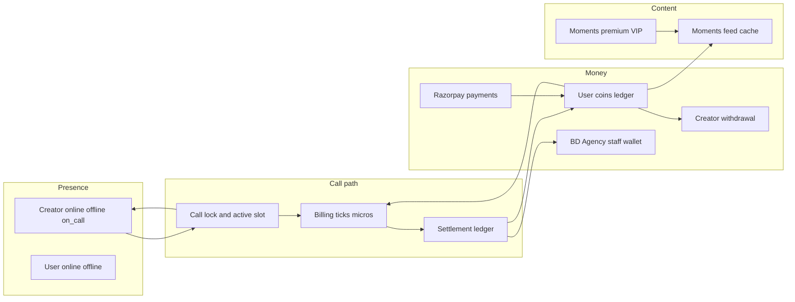
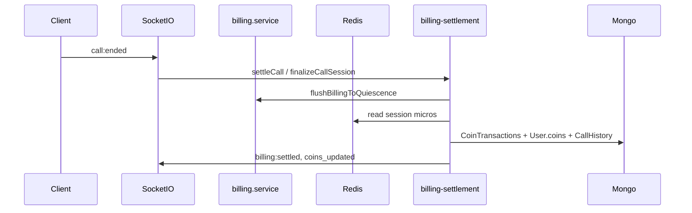

# Backend + Flutter System Map (Complete)

> **Package:** `eazy-talks-backend` · **Flutter:** `frontend/`
> **API prefix:** `/api/v1` · **Entry:** `backend/src/server.ts` → `routes.ts`
> **Purpose:** Complete, interlinked reference of every backend capability and how Flutter uses it.

This is the single-file system map (chapters 00–20). Companion deep dives live under `backend/docs/`.

## Table of contents

- [00 - Index and interlinks](#00-index-and-interlinks)
- [01 - Architecture](#01-architecture)
- [02 - Auth and User](#02-auth-and-user)
- [03 - Presence](#03-presence)
- [04 - Video Calls](#04-video-calls)
- [05 - Billing](#05-billing)
- [06 - Settlement](#06-settlement)
- [07 - Coins and Ledger](#07-coins-and-ledger)
- [08 - Payments](#08-payments)
- [09 - Withdrawal](#09-withdrawal)
- [10 - Moments](#10-moments)
- [11 - Moments Premium and VIP](#11-moments-premium-and-vip)
- [12 - Creator Feed, Dashboard, Tasks and Earnings](#12-creator-feed-dashboard-tasks-and-earnings)
- [13 - Chat and Support](#13-chat-and-support)
- [14 - Media (Cloudflare Images and Stream)](#14-media-cloudflare-images-and-stream)
- [15 - Admin, BD and Agency Portals](#15-admin-bd-and-agency-portals)
- [16 - Workers and Queues](#16-workers-and-queues)
- [17 - Socket.IO Event Catalog](#17-socketio-event-catalog)
- [18 - Flutter State Map](#18-flutter-state-map)
- [19 - Data Models and Redis Keys](#19-data-models-and-redis-keys)
- [20 - Utils, Middleware and Config](#20-utils-middleware-and-config)

---

## 00 - Index and interlinks

> **Package:** `eazy-talks-backend` · **Flutter:** `frontend/`  
> **API prefix:** `/api/v1` · **Entry:** `backend/src/server.ts` → `routes.ts`  
> **Purpose:** Complete, interlinked reference of every backend capability and how Flutter uses it.

### How to use this map

1. Use the [Table of contents](#table-of-contents) or the interlink graph and coverage checklist below.
2. Jump to a feature section for routes, services, schemas, code walkthrough, and Flutter wiring.
3. Use [18 - Flutter State Map](#18-flutter-state-map) when you need provider → API/socket lookup.
4. Deeper historical audits live under `backend/docs/` (linked from each section). Do not treat changelogs as the live contract — **code wins**.

### Companion docs (existing)

| Doc | Role |
|-----|------|
| [BACKEND_COMPREHENSIVE.md](../BACKEND_COMPREHENSIVE.md) | API/Redis/billing tables |
| [BACKEND_COMPLETE_ANALYSIS.md](../BACKEND_COMPLETE_ANALYSIS.md) | Full inventory |
| [FULL_BACKEND_REALITY_AUDIT.md](../FULL_BACKEND_REALITY_AUDIT.md) | Bootstrap / `SERVICE_ROLE` truth |
| [openapi.yaml](../openapi.yaml) | REST OpenAPI surface |
| [BILLING_SETTLEMENT_CODE_WALKTHROUGH.md](../BILLING_SETTLEMENT_CODE_WALKTHROUGH.md) | Settlement deep dive |
| [PAYMENT_WEB_CHECKOUT_RUNBOOK.md](../PAYMENT_WEB_CHECKOUT_RUNBOOK.md) | Web checkout ops |
| [SETTLEMENT_IDEMPOTENCY.md](../SETTLEMENT_IDEMPOTENCY.md) | Settlement idempotency |

---

### Chapter index

| # | Doc | Covers |
|---|-----|--------|
| 01 | [ARCHITECTURE](#01-architecture) | Process roles, bootstrap, middleware, clients |
| 02 | [AUTH-USER](#02-auth-and-user) | Auth, user profile, onboarding, referrals |
| 03 | [PRESENCE](#03-presence) | Creator online/offline/on_call, user presence |
| 04 | [VIDEO-CALLS](#04-video-calls) | Stream Video, call lock, active slots |
| 05 | [BILLING](#05-billing) | Live ticks, lifecycle FSM, sockets |
| 06 | [SETTLEMENT](#06-settlement) | settleCall, ledger, staff cuts, retries |
| 07 | [COINS-LEDGER](#07-coins-and-ledger) | CoinTransaction, repair, sources |
| 08 | [PAYMENTS](#08-payments) | Razorpay app + web + webhook |
| 09 | [WITHDRAWAL](#09-withdrawal) | Creator + staff wallets |
| 10 | [MOMENTS](#10-moments) | Feed, cache, engagement, load speed |
| 11 | [MOMENTS-PREMIUM-VIP](#11-moments-premium-and-vip) | Premium membership + VIP |
| 12 | [CREATOR-FEED-EARNINGS](#12-creator-feed-dashboard-tasks-and-earnings) | Creator feed, dashboard, tasks, earnings |
| 13 | [CHAT-SUPPORT](#13-chat-and-support) | Stream Chat, support tickets |
| 14 | [MEDIA-IMAGES-STREAM](#14-media-cloudflare-images-and-stream) | Cloudflare Images + Stream uploads |
| 15 | [ADMIN-BD-AGENCY](#15-admin-bd-and-agency-portals) | Staff portals |
| 16 | [WORKERS-QUEUES](#16-workers-and-queues) | BullMQ, intervals, roles |
| 17 | [SOCKET-EVENT-CATALOG](#17-socketio-event-catalog) | All socket events in/out |
| 18 | [FLUTTER-STATE-MAP](#18-flutter-state-map) | Riverpod providers ↔ backend |
| 19 | [DATA-MODELS](#19-data-models-and-redis-keys) | Mongoose models + Redis keys |
| 20 | [UTILS-MIDDLEWARE](#20-utils-middleware-and-config) | Middleware, utils, config |

---

### System interlink graph



#### Money path (user → creator)

Payment finalize → `User.coins` + `CoinTransaction` → call billing micros (Redis) → settlement debit/credit (Mongo) → creator earnings balance → withdrawal (debit on **mark-paid**).

#### Presence path (creator)

`PATCH /creator/status` + socket `creator:online` / `creator:offline` → Redis base availability → call lock sets `on_call` → call end restores `online` / `offline` → Flutter `CreatorAvailabilityNotifier` via `creator:status` / `availability:batch:v2`.

---

### Coverage checklist

Every row is covered by a dedicated section or an explicit “covered under X” link.

#### Route modules (`/api/v1`)

- [x] `/auth` — [02-AUTH-USER](#02-auth-and-user)
- [x] `/referral` — [02-AUTH-USER](#02-auth-and-user)
- [x] `/user` — [02-AUTH-USER](#02-auth-and-user)
- [x] `/creator` — [03-PRESENCE](#03-presence), [09-WITHDRAWAL](#09-withdrawal), [12-CREATOR-FEED-EARNINGS](#12-creator-feed-dashboard-tasks-and-earnings)
- [x] `/chat` — [13-CHAT-SUPPORT](#13-chat-and-support)
- [x] `/video` — [04-VIDEO-CALLS](#04-video-calls)
- [x] `/billing` — [05-BILLING](#05-billing), [06-SETTLEMENT](#06-settlement)
- [x] `/payment` — [08-PAYMENTS](#08-payments)
- [x] `/availability` — [03-PRESENCE](#03-presence)
- [x] `/moments` + `/stories` + `/stream` + `/moments-premium` — [10-MOMENTS](#10-moments), [11-MOMENTS-PREMIUM-VIP](#11-moments-premium-and-vip), [14-MEDIA-IMAGES-STREAM](#14-media-cloudflare-images-and-stream)
- [x] `/vip` — [11-MOMENTS-PREMIUM-VIP](#11-moments-premium-and-vip)
- [x] `/images`, `/metrics`, `/app-config`, `/app-updates`, `/support` — [14](#14-media-cloudflare-images-and-stream), [02](#02-auth-and-user), [13](#13-chat-and-support)
- [x] `/admin` — [15-ADMIN-BD-AGENCY](#15-admin-bd-and-agency-portals)
- [x] `/bd`, `/agency` — [15-ADMIN-BD-AGENCY](#15-admin-bd-and-agency-portals)

#### Realtime gateways

- [x] Availability (presence) — [03](#03-presence), [17](#17-socketio-event-catalog)
- [x] Billing (+ recover-state) — [05](#05-billing), [17](#17-socketio-event-catalog)
- [x] Moments — [10](#10-moments), [17](#17-socketio-event-catalog)
- [x] Admin namespace `/admin` — [15](#15-admin-bd-and-agency-portals), [17](#17-socketio-event-catalog)
- [x] Support emitter events — [13](#13-chat-and-support), [17](#17-socketio-event-catalog)

#### Workers / roles (`SERVICE_ROLE`)

- [x] `api-ws`, `billing-worker`, `moments-worker`, `image-worker`, `monolith` — [01](#01-architecture), [16](#16-workers-and-queues)

#### Models + Redis + utils

- [x] Models / Redis keys — [19-DATA-MODELS](#19-data-models-and-redis-keys)
- [x] Utils / middleware — [20-UTILS-MIDDLEWARE](#20-utils-middleware-and-config)

#### Clients beyond Flutter

- [x] `adminWebsite`, web checkout, external webhooks — [01-ARCHITECTURE](#01-architecture)

#### Flutter state

- [x] All Riverpod providers — [18-FLUTTER-STATE-MAP](#18-flutter-state-map)

---

### Feature template (every chapter)

1. Purpose  
2. Authoritative state  
3. HTTP routes  
4. Socket events  
5. Services & key functions  
6. Schemas / models / DTOs  
7. Workers / timers  
8. Code walkthrough  
9. Flutter usage  
10. Interlinks  
11. Failure modes & recovery

---

## 01 - Architecture

### Purpose

Describe how the backend process boots, which roles run which subsystems, how clients connect, and where middleware sits. This is the map of the **modular monolith** that powers the Flutter app and staff portals.

### Authoritative state

| Concern | Source of truth |
|---------|-----------------|
| Process role | `SERVICE_ROLE` (legacy alias `ECS_SERVICE_ROLE`) via `src/config/service-role.ts` |
| HTTP routes | `src/routes.ts` mounted at `/api/v1` |
| Socket.IO | `bootstrap/bootstrap-socket.ts` + gateways in `bootstrap-api-ws.ts` |
| Mongo | Required at startup (`config/database.ts`) |
| Redis | Required in production (`bootstrap-core.ts`) |

### Entry and bootstrap

```
server.ts
  → middleware stack (helmet, CORS, rate limits, body parsers, request queue)
  → registerMetricsRoute / registerHealthRoutes
  → app.use('/api/v1', routes)
  → startServer() → bootstrapCore()
       → Firebase, security asserts, Redis, billing driver safety
       → connectDatabase
       → role-gated: bootstrap-api-ws | billing-workers | moments-workers | image-workers
```

| File | Role |
|------|------|
| `src/server.ts` | Express app, hygiene intervals, shutdown |
| `src/routes.ts` | Mounts all module routers |
| `src/bootstrap/bootstrap-core.ts` | Shared startup asserts |
| `src/bootstrap/bootstrap-api-ws.ts` | HTTP + Socket.IO gateways |
| `src/bootstrap/bootstrap-billing-workers.ts` | Billing/settlement/VIP/payment workers |
| `src/bootstrap/bootstrap-moments-workers.ts` | Moments fanout/analytics/stories |
| `src/bootstrap/bootstrap-image-workers.ts` | Blurhash + orphan cleanup |
| `src/bootstrap/bootstrap-shutdown.ts` | Graceful SIGTERM |

### Process roles (`SERVICE_ROLE`)

| Role | HTTP API | Billing workers | Moments workers | Image workers | Hygiene |
|------|----------|-----------------|-----------------|---------------|---------|
| `monolith` (default, non-ECS) | yes | yes | yes | yes | yes |
| `api-ws` | yes | no | no | no | yes |
| `billing-worker` | health only | yes | no | no | no |
| `moments-worker` | health only | no | yes | no | no |
| `image-worker` | health only | no | no | yes | no |

npm scripts: `start:api-ws`, `start:billing-worker`, `start:moments-worker`, `start:image-worker`.

**Why:** Split hot paths (API/sockets vs billing ticks vs media workers) across ECS tasks without rewriting the codebase. Production ECS forbids `monolith`.

### Route mount table

All under `/api/v1` from `src/routes.ts`:

| Mount | Module |
|-------|--------|
| `/auth` | auth |
| `/referral` | referral |
| `/user` | user |
| `/creator` | creator |
| `/chat` | chat |
| `/video` | video |
| `/admin` | admin |
| `/bd` | bd |
| `/agency` | agency |
| `/billing` | billing |
| `/support` | support |
| `/payment` | payment |
| `/app-updates` | app-update |
| `/app-config` | app-config |
| `/availability` | availability |
| `/images` | images |
| `/metrics` | metrics |
| `/stories` | stories |
| `/moments` | moments |
| `/stream` | stream |
| `/vip` | vip |
| `/moments-premium` | moments-premium |

Outside `/api/v1`: health (`/ready`, `/health`) and metrics scrape routes.

### Clients

| Client | Auth | Primary surface |
|--------|------|-----------------|
| Flutter (`frontend/`) | Firebase ID token | REST + Socket.IO |
| Admin website (`adminWebsite/`) | JWT from `/auth/admin-login` | `/admin/*` + `/admin` socket namespace |
| Agency portal | JWT `/auth/agency-login` | `/agency/*` |
| BD portal | JWT `/auth/bd-login` | `/bd/*` |
| Web checkout | Session tokens on web payment routes | `/payment/web/*`, VIP/premium checkout |
| External webhooks | HMAC signatures | `/video/webhook`, `/chat/webhook`, `/payment/webhook`, `/stream/webhook`, `/vip/webhook`, moments-premium webhook |

### Middleware stack (order matters)

See [20-UTILS-MIDDLEWARE](#20-utils-middleware-and-config). High level:

1. Request context / correlation IDs  
2. Helmet, CORS, trust proxy  
3. Body parsers (raw body preserved for signed webhooks)  
4. Rate limiters (login, billing, webhooks, withdrawals, chat, images, metrics)  
5. Request queue (API backpressure)  
6. Per-route: `verifyFirebaseToken`, staff asserts, webhook signature verification  

### Technology stack

| Layer | Technology |
|-------|------------|
| Runtime | Node.js, TypeScript |
| HTTP | Express 4 |
| DB | MongoDB (Mongoose 8) |
| Cache / hot path | Redis (ioredis) |
| Jobs | BullMQ |
| Realtime | Socket.IO (+ optional Redis adapter) |
| Mobile auth | Firebase Admin |
| Staff auth | bcrypt + JWT |
| Video / chat | Stream Video + Stream Chat |
| Payments | Razorpay |
| Images | Cloudflare Images |
| Moments media | Cloudflare Stream |

### Critical design rules

- Billing math uses **integer micro-coins** (`COIN_MICROS = 1_000_000`); no floats on the hot path.
- Settlement is **idempotent** (settle lock + Redis claim + Mongo `CallHistory`).
- Creator presence: **Redis runtime truth**; Mongo `Creator.isOnline` is **persistent intent**.
- Ledger (`CoinTransaction`) is source of truth for balance repair via `getCanonicalCoinsAndRepairIfNeeded`.

### Flutter usage

- Base URL and auth headers: `frontend/lib/core/api/api_client.dart` (`ApiClient` singleton).
- Realtime: `frontend/lib/core/services/socket_service.dart` (`SocketService`).
- App lifecycle (resume presence, billing recover, payment deep links): `frontend/lib/app/widgets/app_lifecycle_wrapper.dart`.
- State: **Riverpod only** — see [18-FLUTTER-STATE-MAP](#18-flutter-state-map).

### Interlinks

- Presence → [03-PRESENCE](#03-presence)
- Billing/settlement → [05-BILLING](#05-billing), [06-SETTLEMENT](#06-settlement)
- Workers detail → [16-WORKERS-QUEUES](#16-workers-and-queues)
- Reality audit → [FULL_BACKEND_REALITY_AUDIT.md](../FULL_BACKEND_REALITY_AUDIT.md)

### Failure modes & recovery

| Failure | Behavior |
|---------|----------|
| Missing `MONGO_URI` | Startup throws |
| Missing Redis in production | Startup throws |
| ECS + `monolith` | Startup throws |
| Conflicting `SERVICE_ROLE` / `ECS_SERVICE_ROLE` | Startup throws |
| SIGTERM | `bootstrap-shutdown` flushes billing, closes queues, drains sockets |

---

## 02 - Auth and User

### Purpose

Authenticate mobile users (Firebase) and staff (JWT), create/load user profiles, manage onboarding, referrals, favorites, blocks, and account deletion.

### Authoritative state

| Concern | Store |
|---------|-------|
| Mobile identity | Firebase UID on `User.firebaseUid` |
| Staff sessions | JWT signed with `JWT_SECRET` |
| Profile / coins field | Mongo `User` (coins repaired from ledger on read) |
| Referral graph | `ReferralEdge` |
| Deleted identities | `DeletedUserPhone`, `DeletedUserIdentity` |

### HTTP routes

#### `/api/v1/auth` — `modules/auth/auth.routes.ts`

| Method | Path | Auth | Handler | Why |
|--------|------|------|---------|-----|
| POST | `/login` | Firebase | `login` | Upsert user, return profile + tokens for Stream |
| POST | `/logout` | Firebase | `logout` | Clear presence / session side effects |
| POST | `/fast-login` | none | `fastLoginDeprecated` | Deprecated |
| POST | `/admin-login` | none | `adminLogin` | Staff JWT for admin portal |
| POST | `/agency-login` | none | `agencyLogin` | Agency portal JWT |
| POST | `/bd-login` | none | `bdLogin` | BD portal JWT |

#### `/api/v1/user` — `modules/user/user.routes.ts`

| Method | Path | Handler |
|--------|------|---------|
| GET | `/me` | `getMe` |
| GET | `/referrals` | `getReferrals` |
| POST | `/referral/apply` | `applyReferralPost` |
| GET | `/list` | `getAllUsers` |
| GET | `/by-firebase-uid/:firebaseUid` | `getUserByFirebaseUid` |
| GET | `/search` | `searchUsers` (admin) |
| PUT | `/profile` | `updateProfile` |
| POST | `/coins` | `addCoins` |
| POST | `/onboarding/stage` | `advanceOnboardingStage` |
| POST | `/onboarding/permissions` (and related) | permission grants |
| GET | `/transactions` | `getUserTransactions` |
| GET | `/call-history` | `getCallHistory` |
| GET | `/favorites` | `getFavoriteCreators` |
| GET | `/favorites/creators` | `getFavoriteCreatorProfiles` |
| POST | `/favorites/:creatorId` | `toggleFavoriteCreator` |
| POST | `/block-creator` | `toggleBlockCreator` |
| GET | `/blocked-creators/count` | `getBlockedCreatorsCount` |
| POST | `/delete-account` | `deleteAccount` |
| POST | `/:id/promote-to-creator` | `promoteToCreator` (admin) |

#### `/api/v1/referral`

| Method | Path | Handler |
|--------|------|---------|
| GET | `/preview` | `getReferralPreview` (public, rate limited) |

#### App config / updates (app-level, not user profile)

| Method | Path | Module |
|--------|------|--------|
| GET | `/app-config/` | Public feature flags / config for clients |
| GET | `/app-updates/pending` | Pending force/soft update |
| POST | `/app-updates/:id/ack-update-now` | Ack update |

### Services & key functions

| File | Functions | Why |
|------|-----------|-----|
| `auth/auth.controller.ts` | `login`, `logout`, staff logins | Entry for all clients |
| `user/user-login.service.ts` | Login event recording | Analytics / fraud signals |
| `user/onboarding-transition.service.ts` | Stage machine for onboarding | Gate features until profile complete |
| `user/referral.service.ts` | Apply / list referrals | Growth rewards |
| `user/deleted-identity.service.ts` | Block re-signup abuse | Compliance |
| `app-config/app-config.service.ts` | `getPublicAppConfig` | Client feature gates |
| `app-update/app-update.controller.ts` | publish / pending / ack | Force update rollout |

### Schemas

- `user/user.model.ts` — `User` (role, coins, favorites, blocks, onboarding stage, …)
- `user/coin-transaction.model.ts` — ledger (see [07-COINS-LEDGER](#07-coins-and-ledger))
- `user/user-login-event.model.ts`
- `user/referral-edge.model.ts`
- `user/deleted-user-phone.model.ts`, `deleted-user-identity.model.ts`
- `app-update` models: `GlobalAppUpdate`, `GlobalAppUpdateAck`

### Code walkthrough

**Login flow:** Firebase token verified by `verifyFirebaseToken` → `login` loads or creates `User` → may run referral / welcome bonus → returns user DTO including `coins` (often ledger-repaired).

**Why Firebase for mobile:** Identity and phone auth live in Firebase; backend never stores passwords for consumers.

**Why staff JWT separate:** Admin/agency/BD portals are not Firebase users; bcrypt password + JWT keeps staff auth isolated.

### Flutter usage

| Layer | Path | Role |
|-------|------|------|
| API | `ApiClient` | Attaches Firebase ID token |
| Auth state | `features/auth/providers/auth_provider.dart` | `AuthNotifier` — login, `refreshUser()` → `GET /user/me`, optimistic coins |
| User list / search | `features/user/providers/user_provider.dart` | Admin/creator tooling |
| Favorites | `features/home/providers/favorite_creators_provider.dart` | Home favorites |
| App config | Loaded via app bootstrap / features providers | Gates VIP, moments, etc. |
| App updates | Socket `app_update:published` + REST pending | Force update UX |

Login typically: Firebase sign-in → `POST /auth/login` → store user in `authProvider` → connect `SocketService`.

### Interlinks

- Coins on `/user/me` → [07-COINS-LEDGER](#07-coins-and-ledger)
- Presence after login → [03-PRESENCE](#03-presence)
- Promote to creator → [12-CREATOR-FEED-EARNINGS](#12-creator-feed-dashboard-tasks-and-earnings)
- Call history projection → [06-SETTLEMENT](#06-settlement)

### Failure modes & recovery

| Case | Behavior |
|------|----------|
| Invalid Firebase token | 401 from middleware |
| Deleted identity re-signup | Blocked via deleted-identity service |
| Ledger drift on `User.coins` | Repair on read (`getCanonicalCoinsAndRepairIfNeeded`) |
| Staff wrong password | 401 on staff login routes |

---

## 03 - Presence

### Purpose

Tell the app who is **online**, **on a call**, or **offline** in real time so users can call available creators and creators can see online consumers. Presence is the gate for call eligibility and home-screen status badges.

### Authoritative state

| Layer | What it stores | Authority |
|-------|----------------|-----------|
| Redis `creator:availability:{uid}` | Base intent: `online` \| `offline` | Runtime base |
| Redis `creator:presence:{uid}` | Effective: `online` \| `on_call` \| `offline` + version | **Runtime truth for fans** |
| Redis `creator:presence:meta:{uid}` | Base + version meta | Write coordination |
| Redis `activeCallByUserKey(uid)` | Active call id | Drives `on_call` |
| Mongo `Creator.isOnline` | Persistent intent | Survives reconnect; not live truth alone |
| Redis `user:availability:{uid}` | User `online` \| `offline` (TTL 120s) | User presence |

**Single writer for creator effective presence:** `transitionCreatorPresence` in `presence.service.ts`. Legacy emit paths must not write presence directly.

### HTTP routes

| Method | Path | Auth | Handler | Why |
|--------|------|------|---------|-----|
| PATCH | `/api/v1/creator/status` | Firebase | `setCreatorOnlineStatus` | Persist Mongo intent + apply Redis/socket presence |
| GET | `/api/v1/availability/online-users` | Firebase | `getOnlineUsers` | Creator/admin: paginated online consumer UIDs |
| POST | `/api/v1/availability/resolve-users` | Firebase | `resolveUsersByFirebaseUids` | Resolve UIDs → profiles |
| GET | `/api/v1/creator/uids` | Firebase | `getCreatorFirebaseUids` | Seed presence hydration list |
| POST | `/api/v1/admin/creators/:id/reset-presence` | Admin | `resetCreatorPresence` | Force restore/clear stuck presence |
| POST | `/api/v1/admin/creators/:id/deactivate` | Admin | `deactivateCreator` | Force offline |
| POST | `/api/v1/admin/creators/:id/reactivate` | Admin | `reactivateCreator` | Restore |

Presence is primarily **Socket.IO**, not REST polling.

### Socket events

Gateway: `modules/availability/availability.gateway.ts`

| Direction | Event | Payload / notes |
|-----------|-------|-----------------|
| Client → server | `creator:online` | Optional `{ clearStuckCall: true }` |
| Client → server | `creator:offline` | Explicit offline |
| Client → server | `availability:get` | `{ ids: string[] }` batch request |
| Client → server | `user:online` / `user:offline` | Explicit user presence |
| Client → server | `user:availability:get` | Creator/admin batch (rate limited) |
| Server → client | `creator:status` | Single creator effective state + version |
| Server → client | `availability:batch` / `availability:batch:v2` | Batch map of states |
| Server → client | `user:status` | Single user online/offline |
| Server → client | `user:availability:batch` | Batch user states |

Rooms: `creators`, `consumers`, `user:{uid}`.

### Services & key functions

| File | Key functions | Why |
|------|---------------|-----|
| `presence.service.ts` | `transitionCreatorPresence`, `derivePresenceState`, `applyCreatorAvailabilityIntent` | Canonical state machine |
| `availability.service.ts` | Read helpers, base TTL | Shared reads |
| `availability.gateway.ts` | Socket handlers, heartbeat, disconnect grace | Live transport |
| `user-availability.service.ts` | `setUserAvailability` | User online TTL |
| `creator-call-lock.service.ts` | Lock → `CALL_STARTED` / unlock → `CALL_ENDED` | Ties presence to calls |
| `creator-active-call-slot.service.ts` | Active-call Redis slot | Prevents double-call |
| `presence-socket-registry.service.ts` | Multi-node socket registry | Correct last-socket disconnect |
| `presence-dashboard.service.ts` | Online set counts | Admin dashboard |
| `creator-daily-online.service.ts` | Daily online seconds | Tasks / analytics |
| `creator-presence-audit.service.ts` | Startup audit | Detect drift |

### Schemas / models

- Redis records: `CreatorPresenceRecord` `{ state, version, updatedAt, source }`
- Mongo: `Creator.isOnline`, `Creator.currentCallId`
- Mongo: `CreatorDailyOnline` — daily online seconds

### Workers / timers

| Timer | Interval (defaults) | Role |
|-------|---------------------|------|
| Creator heartbeat | ~45s (`CREATOR_HEARTBEAT_INTERVAL_MS`) | Renew TTL / lease |
| Disconnect grace | ~3s (`CREATOR_DISCONNECT_GRACE_MS`) | Avoid flicker on brief disconnect |
| Presence TTL | 180s (clamped 90–600) | Auto-expire stale presence |
| Stale socket cleanup | 10 min | Multi-node hygiene |
| Stale heartbeat sweep | 30s | Force reconcile |

### Code walkthrough

Effective state is **derived**, not stored as a free-form string:

```typescript
// presence.service.ts — derivePresenceState
function derivePresenceState(
  base: CreatorBaseAvailability,
  hasActiveCallState: boolean
): CreatorPresenceState {
  if (hasActiveCallState) return 'on_call';
  return base === 'online' ? 'online' : 'offline';
}
```

**Why two layers (base vs effective):** A creator can intend to be online while a call is active. Fans must see `on_call` (busy), but when the call ends the base intent restores to `online` without requiring another toggle.

**Events (`PresenceTransitionEventType`):**

| Event | Base effect | Typical source |
|-------|-------------|----------------|
| `CONNECTED` / `RECOVERED` | → `online` | Socket connect, explicit online |
| `FORCE_OFFLINE` / `DISCONNECTED` | → `offline` | Explicit offline, last-socket grace |
| `CALL_STARTED` | base unchanged | Call lock; effective → `on_call` |
| `CALL_ENDED` | → `online` (if not forced offline) | Call unlock |
| `HEARTBEAT` | base unchanged | Server heartbeat |
| `RECONCILED` | keep current base | Sweeps |

Broadcast on change: `creator:status` to `consumers` and `creators` rooms. Version increments so Flutter can ignore stale out-of-order events.

**REST `PATCH /creator/status`:** Updates Mongo `Creator.isOnline` **and** calls `applyCreatorAvailabilityIntent` so Redis/socket match intent. Socket alone is not enough after app kill — Mongo intent restores on next connect.

### Flutter usage

| File | Class | Role |
|------|-------|------|
| `core/services/socket_service.dart` | `SocketService` | `emitCreatorOnline` / `emitCreatorOffline`, `requestAvailability`, listeners |
| `home/providers/availability_provider.dart` | `CreatorAvailabilityNotifier` | In-memory map; **version-gated** updates |
| `creator/providers/creator_presence_orchestrator_provider.dart` | `CreatorPresenceOrchestrator` | On resume: ensure socket, emit online if toggle on, request availability |
| `creator/services/creator_availability_service.dart` | `CreatorAvailabilityService` | `PATCH /creator/status` |
| `creator/providers/creator_availability_toggle_provider.dart` | Toggle UI | Local toggle state |
| `home/services/presence_hydration_service.dart` | `PresenceHydrationService` | `GET /creator/uids` to seed batch requests |
| `user/providers/user_availability_provider.dart` | User-side map | Online consumers for creators |
| `user/providers/online_users_provider.dart` | REST online users | Paginated list |
| `app/widgets/app_lifecycle_wrapper.dart` | Lifecycle | Refresh presence on resume |

**Flow:** Hydrate UIDs via REST → socket `availability:get` → `availability:batch:v2` / `creator:status` into Riverpod maps. Creators also `PATCH /creator/status` when toggling.

### Interlinks

- Call lock sets `on_call` → [04-VIDEO-CALLS](#04-video-calls)
- Billing start/end restores presence → [05-BILLING](#05-billing), [06-SETTLEMENT](#06-settlement)
- Socket catalog → [17-SOCKET-EVENT-CATALOG](#17-socketio-event-catalog)
- Admin reset → [15-ADMIN-BD-AGENCY](#15-admin-bd-and-agency-portals)
- Rollout notes → [creator-presence-rollout.md](../creator-presence-rollout.md), [PRESENCE_REGISTRY_MIGRATION.md](../PRESENCE_REGISTRY_MIGRATION.md)

### Failure modes & recovery

| Case | Behavior |
|------|----------|
| Brief network blip | Disconnect grace avoids false offline |
| Stuck `on_call` after crash | `clearStuckCall` on `creator:online`; admin `reset-presence`; active-call slot stale clear |
| Multi-node last socket | Presence socket registry decides when to mark offline |
| TTL expiry | Heartbeat renews; missing heartbeat → offline via sweep |
| Stale Flutter event | Version gate in `CreatorAvailabilityNotifier` drops older versions |

---

## 04 - Video Calls

### Purpose

Issue Stream Video tokens, enforce one-active-call per creator, react to Stream webhooks, and hand off to billing when a call actually starts. Video transport is Stream; **money and presence** are owned by this backend.

### Authoritative state

| Concern | Store |
|---------|-------|
| Active call lock | Redis + `Creator.currentCallId` via `creator-call-lock.service.ts` |
| Active-call slot | Redis `activeCallByUserKey` |
| Call records | Mongo `Call`, webhook idempotency `WebhookEvent` |
| Live billing session | Redis (see [05-BILLING](#05-billing)) |

### HTTP routes — `/api/v1/video`

| Method | Path | Auth | Handler | Why |
|--------|------|------|---------|-----|
| POST | `/token` | Firebase | `getVideoToken` | Stream Video JWT for client SDK |
| GET | `/calls/active` | Firebase | inline | Recover active call for user/creator |
| POST | `/webhook` | Stream HMAC | `handleStreamVideoWebhook` | Call lifecycle from Stream |

### Socket events

Call billing start/end are on the **billing** gateway (not video module):

- Client → `call:started`, `call:ended`
- Server → `billing:*`, `call:force-end`

See [05-BILLING](#05-billing) and [17-SOCKET-EVENT-CATALOG](#17-socketio-event-catalog).

VIP queue events: `vip:call:queued`, `vip:call:dequeued`, `vip:call:ready_to_ring` — [11-MOMENTS-PREMIUM-VIP](#11-moments-premium-and-vip).

### Services & key functions

| File | Functions | Why |
|------|-----------|-----|
| `video/video.controller.ts` | `getVideoToken` | Client joins Stream call |
| `video/call-lifecycle.service.ts` | `CallLifecycleService` | Orchestrate start/end with locks |
| `video/creator-call-lock.service.ts` | `acquireCreatorCallLock`, release | Single writer for busy state |
| `video/call-finalization.service.ts` | End orchestration → settlement | Reliable end path |
| `video/call-reconciliation.ts` | Reconcile stuck calls | Worker hygiene |
| `video/video.webhook` | Stream events | Server-side end if client dies |

### Schemas

- `video/call.model.ts` — `Call`
- `video/webhook-event.model.ts` — idempotent webhook processing

### Code walkthrough

1. User initiates call in Flutter (Stream Video SDK).
2. Backend issues token via `POST /video/token`.
3. On connect, client emits `call:started` (billing gateway) → `billingService.startBillingSession`.
4. `acquireCreatorCallLock` sets active-call keys and `transitionCreatorPresence(..., 'CALL_STARTED')` → effective `on_call`.
5. On hangup, `call:ended` → `finalizeCallEnd` / `settleCall` → `CALL_ENDED` presence restore.
6. Stream webhook is a **safety net** if the client never emits end.

**Why lock + presence:** Prevents two users billing the same creator and keeps home UI showing busy.

### Flutter usage

| File | Role |
|------|------|
| `features/video/providers/stream_video_provider.dart` | Stream Video client lifecycle |
| `features/video/providers/call_billing_provider.dart` | Billing state during call |
| `features/video/providers/call_billing_selectors.dart` | Live coins vs wallet coins |
| `features/video/providers/creator_busy_toast_provider.dart` | Busy toast when creator `on_call` |
| `features/video/providers/call_feedback_prompt_provider.dart` | Post-call feedback → support |
| `core/services/socket_service.dart` | `emitCallStarted` / `emitCallEnded` with REST fallback |
| Call connection controller | Emits start/end; retries billing start |

**REST fallback:** If socket is down or `billing:started` does not arrive quickly, Flutter posts `POST /billing/call-started` or `/billing/call-ended`.

### Interlinks

- Presence `on_call` → [03-PRESENCE](#03-presence)
- Billing ticks → [05-BILLING](#05-billing)
- Settlement → [06-SETTLEMENT](#06-settlement)
- VIP schedule/queue → [11-MOMENTS-PREMIUM-VIP](#11-moments-premium-and-vip)
- Audits → [VIDEO_CALL_SYSTEM_E2E_AUDIT.md](../VIDEO_CALL_SYSTEM_E2E_AUDIT.md)

### Failure modes & recovery

| Case | Behavior |
|------|----------|
| Client crash mid-call | Stream webhook / billing watchdog / termination queue |
| Double call attempt | Call lock rejects second acquire |
| Missed `call:ended` | Reconciliation job + admin settlement retry |
| Active call recovery | `GET /video/calls/active` + `billing:recover-state` |

---

## 05 - Billing

### Purpose

Charge users **per second** (micro-coins) during a live video call, accrue creator earnings in Redis, emit live balance updates to both parties, and force-end when balance is insufficient. Durable settlement to Mongo happens in [06-SETTLEMENT](#06-settlement).

### Authoritative state

| Phase | Store |
|-------|-------|
| Live session (hot path) | Redis session keys + balance/earnings **micros** |
| Lifecycle FSM | In-memory/Redis + audit `BillingLifecycleTransition` |
| Durable session (optional) | Mongo `DurableCallSession` |
| Tick ledger (optional) | Mongo `BillingLedger`, `CallBillingCheckpoint` |
| Final money | Mongo only after settlement |

**Rule:** No floats. `COIN_MICROS = 1_000_000` display coins.

### HTTP routes — `/api/v1/billing`

| Method | Path | Auth | Handler | Why |
|--------|------|------|---------|-----|
| POST | `/call-started` | Firebase + `billingLimiter` | start billing | REST fallback when socket fails |
| POST | `/call-ended` | Firebase + `billingLimiter` | settle path | REST fallback end |

Primary path is **Socket.IO**.

### Socket events

Gateway: `billing-socket.gateway.ts` / `billing.gateway.ts`

| Direction | Event | Role |
|-----------|-------|------|
| Client → | `call:started` | Start session |
| Client → | `call:ended` | End + settle |
| Client → | `billing:recover-state` | Rehydrate after reconnect |
| Client → | `billing:sync-warning` | Client-detected drift signal |
| Server → | `billing:started` | Initial balances, rates, callId |
| Server → | `billing:update` | Throttled live balances |
| Server → | `billing:settled` | Final totals |
| Server → | `billing:error` | Start/tick failures |
| Server → | `billing:recover-state:response` | Recovery payload |
| Server → | `call:force-end` | Insufficient balance / admin terminate |
| Server → | `call:duration-warning` | Low balance warning (when enabled) |
| Server → | `coins_updated` | After settlement (wallet refresh) |

### Services & key functions

| File | Key API | Why |
|------|---------|-----|
| `billing.service.ts` | `BillingService.startBillingSession`, `processBillingTick`, `flushBillingToQuiescence` | Hot path |
| `billing-lifecycle.machine.ts` | `transitionBillingState` | Valid FSM transitions only |
| `billing.queue.ts` | `scheduleBillingJob`, BullMQ worker | Per-call tick schedule |
| `billing-batch.processor.ts` | Batch tick processing | Throughput |
| `billing-emitter.service.ts` | `emitBillingStarted/Update/Settled` | Fanout |
| `billing-watchdog.service.ts` | Interval scan | Detect stalled ACTIVE sessions |
| `billing-termination.service.ts` | `forceTerminateCall` | Force end |
| `billing-termination.queue.ts` | Retry termination | Deferred force-end |
| `billing-recovery*.ts`, `billing-heal.service.ts` | Heal drift | Auto-heal thresholds |
| `billing-runtime-resolver.service.ts` | Resolve active runtime | Recovery |
| `billing-persist.service.ts` | Redis → Mongo persist | Durability |
| `billing-checkpoint.service.ts` | Checkpoints | Settlement fallback totals |
| `call-session.service.ts` | Durable session lifecycle | Crash recovery |
| `billing-shutdown.service.ts` | Graceful flush | SIGTERM |

### Lifecycle state machine

```
INIT → STARTING → ACTIVE → ENDING → SETTLING → SETTLED
         ↘ FAILED / RECOVERING / FAILED_RECOVERY_SETTLEMENT
```

Defined in `billing-lifecycle.machine.ts` (`ALLOWED_TRANSITIONS`). Invalid transitions are rejected (with special idempotent handling for checkpoint convergence).

### Code walkthrough

1. **`call:started`** → `startBillingSession`
   - Reserve active-call slots, freeze price/share, seed Redis session + user balance micros
   - Mark creator `on_call` (via call lock / active-call keys)
   - Emit `billing:started`
   - Schedule BullMQ cycle jobs

2. **Ticks** (`processBillingTick`, ~1s via `BILLING_PROCESS_INTERVAL_MS`)
   - Debit user micros, credit creator earnings micros
   - Emit `billing:update` (throttled)
   - May emit `call:force-end` on insufficient balance

3. **`call:ended`** → finalization → [settlement](#06-settlement)

**Why micros in Redis:** Sub-coin precision and integer math under high tick rate; display coins only at settlement boundaries.

**Why BullMQ:** Reliable per-call scheduling across `billing-worker` processes; not dependent on a single API node timer.

### Workers / timers

| Mechanism | Role |
|-----------|------|
| BullMQ billing queue | Per-call cycle jobs |
| Billing watchdog `setInterval` | Stalled ACTIVE / missing schedule chain |
| Settlement lock heartbeat | While holding settle lock |
| Termination retry queue | Deferred force-end |
| Runs on | `SERVICE_ROLE=billing-worker` or `monolith` |

### Flutter usage

| File | Class | Role |
|------|-------|------|
| `socket_service.dart` | emit/listen | Socket first; REST fallback |
| `call_billing_provider.dart` | `CallBillingNotifier` | Server-only monetary state; recovery |
| `call_billing_selectors.dart` | Selectors | Prefer live billing coins vs `user.coins` |
| `app_lifecycle_wrapper.dart` | Foreground | `_recoverBillingAfterForegroundResume` |
| Live billing overlay UI | Displays server-driven coins/earnings/elapsed |

**Important:** Flutter does **not** compute charges. It only displays server payloads and triggers start/end/recover.

### Interlinks

- Video lock → [04-VIDEO-CALLS](#04-video-calls)
- Settlement → [06-SETTLEMENT](#06-settlement)
- Coins wallet → [07-COINS-LEDGER](#07-coins-and-ledger)
- Presence restore → [03-PRESENCE](#03-presence)
- Deep dives → [BILLING_SETTLEMENT_CODE_WALKTHROUGH.md](../BILLING_SETTLEMENT_CODE_WALKTHROUGH.md), [BACKEND_COMPREHENSIVE.md](../BACKEND_COMPREHENSIVE.md)

### Failure modes & recovery

| Case | Behavior |
|------|----------|
| Missed `billing:started` | Flutter REST `POST /billing/call-started` |
| App backgrounded | `billing:recover-state` on resume |
| Tick worker crash | Watchdog reschedules; durable session / checkpoints |
| Balance insufficient | `call:force-end` → settlement |
| Drift between client and server | `billing:sync-warning` + heal services |

---

## 06 - Settlement

### Purpose

Convert a finished call’s Redis micro-balances into **durable Mongo ledger entries**: debit the user, credit the creator, apply BD/agency staff cuts, write `CallHistory`, emit final balances, restore creator presence, and clean Redis. Settlement must be **idempotent** under retries and double-end.

### Authoritative state

| Concern | Store |
|---------|-------|
| Settle claim / lock | Redis settle lock + `settledCallKey` |
| Final money | Mongo `CoinTransaction` + `User.coins` |
| Call history | Mongo `CallHistory.settlementStatus` |
| Staff cuts | `staffCoinsBalance` + `StaffWalletLedger` |
| Totals resolution order | Redis session → durable session → ledger → checkpoint |

### HTTP routes

Primary end path is socket `call:ended` or `POST /billing/call-ended` (see [05-BILLING](#05-billing)).

#### Admin settlement tools — `/api/v1/admin`

| Method | Path | Handler |
|--------|------|---------|
| GET | `/finance/settlements` | Settlement finance list |
| GET | `/calls/:callId/settlement-retry-preview` | Preview retry |
| POST | `/calls/:callId/retry-settlement` | Retry one call |
| POST | `/calls/retry-settlement-bulk` | Bulk retry |
| GET | `/calls` | Call admin list |
| POST | `/calls/:callId/refund` | Refund path |
| GET | `/calls/:callId/refund-preview` | Refund preview |

### Socket events

| Event | When |
|-------|------|
| `billing:settled` | Successful settle (final coins, earnings, duration) |
| `coins_updated` | Wallet balances changed |
| Presence restore | Via presence service (`CALL_ENDED`) — not a billing event name |

### Services & key functions

| File | Functions | Why |
|------|-----------|-----|
| `billing-settlement.service.ts` | `settleCall` | Main settle transaction |
| `billing-session-finalization.service.ts` | `finalizeCallSession`, `enqueueSettlementRetry`, `processSettlementRetryQueue`, `attemptFailedSettlementRecovery` | Orchestration + retries |
| `billing-settlement-totals.service.ts` | `resolveAuthoritativeSettlementTotals` | Fallback totals sources |
| `billing-settlement-trigger.guards.ts` | `tryClaimSettlementRequested` | Single trigger |
| `call-history-projector.service.ts` | Project history rows | User/creator history UI |
| `staff-revenue-share.ts` + `payment/commission-resolve.service.ts` | Staff cuts | BD/agency revenue |
| `admin-call-settlement.service.ts` | Admin retry/preview | Ops recovery |
| `scripts/reconcile-stuck-settling-calls.ts` | Manual reconcile | Ops |

### Schemas

- `billing/call-history.model.ts` — `CallHistory` (`coinsDeducted`, `coinsEarned`, `settlementStatus`)
- `billing/billing-ledger.model.ts`
- `billing/call-billing-checkpoint.model.ts`
- `billing/call-session.model.ts` — `DurableCallSession`
- `billing/staff-wallet-ledger.model.ts`
- `user/coin-transaction.model.ts` — `source: 'video_call'`

### Code walkthrough



Typical `settleCall` steps:

1. Idempotency: Redis settled flag, settle lock, Mongo `settlementStatus`.
2. Flush billing ticks to quiescence.
3. Resolve authoritative totals (`resolveAuthoritativeSettlementTotals`).
4. Mongo transaction:
   - Debit user: `CoinTransaction` (`source: video_call`) + `User.coins` (user debit rounds **up**)
   - Credit creator: `CoinTransaction` + `User.coins` (creator credit rounds **down** — platform-favorable)
   - Staff BD/agency cuts → staff wallet ledger
   - Write `CallHistory` (`settlementStatus: settled`)
5. Cleanup Redis session keys; emit `billing:settled` + `coins_updated`.
6. Restore creator presence (`CALL_ENDED`).

**Why idempotent:** Clients may emit end twice; workers may retry; admin may retry. Double-credit must be impossible.

### Workers / timers

| Worker | Role |
|--------|------|
| Settlement fast retry worker | `processSettlementRetryQueue` |
| Failed settlement recovery | `attemptFailedSettlementRecovery` |
| Reconciliation job | Stuck SETTLING / ACTIVE |
| Staff wallet reconciliation scheduler | Staff balance integrity |

### Flutter usage

There is **no Flutter settlement service**. Settlement is server-side.

| Client action | Result |
|---------------|--------|
| Emit `call:ended` or `POST /billing/call-ended` | Triggers settle |
| Listen `billing:settled` | Final coins/earnings/duration in `CallBillingNotifier` |
| Listen `coins_updated` / `refreshUser()` | Wallet chip updates via `authProvider` |
| Creator earnings screen | `GET /creator/earnings` (post-settlement totals) |

### Interlinks

- Live billing → [05-BILLING](#05-billing)
- Coins ledger → [07-COINS-LEDGER](#07-coins-and-ledger)
- Withdrawal of earnings → [09-WITHDRAWAL](#09-withdrawal)
- Staff wallets → [15-ADMIN-BD-AGENCY](#15-admin-bd-and-agency-portals)
- Idempotency deep dive → [SETTLEMENT_IDEMPOTENCY.md](../SETTLEMENT_IDEMPOTENCY.md)
- Code walkthrough → [BILLING_SETTLEMENT_CODE_WALKTHROUGH.md](../BILLING_SETTLEMENT_CODE_WALKTHROUGH.md)

### Failure modes & recovery

| Case | Behavior |
|------|----------|
| Settle fails mid-transaction | Retry queue / admin retry |
| Redis session lost | Fall back to durable / ledger / checkpoint totals |
| Stuck SETTLING | Reconcile script + admin bulk retry |
| Zero settlement blocked | Guards in `billing-reconciliation.guards.ts` |
| Refund needed | Admin `POST /admin/calls/:callId/refund` |

---

## 07 - Coins and Ledger

### Purpose

Track every coin credit and debit in an append-only ledger (`CoinTransaction`), keep `User.coins` as a cached balance, and repair drift. Coins fund calls, moments, VIP/premium purchases, and creator withdrawals.

### Authoritative state

| Concern | Authority |
|---------|-----------|
| Balance truth | Sum of **completed** `CoinTransaction` credits − debits |
| Cached balance | `User.coins` (repaired on read when drifted) |
| In-call live balance | Redis micros (not ledger until settlement) |

Repair helper: `utils/ledger-coins.ts` → `getCanonicalCoinsAndRepairIfNeeded`.

### HTTP routes

| Method | Path | Handler | Why |
|--------|------|---------|-----|
| GET | `/user/me` | `getMe` | Profile includes coins |
| POST | `/user/coins` | `addCoins` | Manual/dev-style credit |
| GET | `/user/transactions` | `getUserTransactions` | User history |
| GET | `/creator/transactions` | `getCreatorTransactions` | Creator earnings history |
| GET | `/creator/earnings` | `getCreatorEarnings` | Earnings summary |
| GET | `/creator/dashboard` | `getCreatorDashboard` | Cached dashboard (canonical coins) |
| POST | `/admin/users/:id/adjust-coins` | `adjustUserCoins` | Admin credit/debit |
| GET | `/admin/users/:id/ledger` | `getUserLedger` | Per-user ledger |
| GET | `/admin/coins` | `getCoinEconomy` | Economy dashboard |
| GET | `/admin/wallet/transactions` | `getWalletTransactions` | Wallet tx list |

### Socket events

| Event | When |
|-------|------|
| `coins_updated` | After payment finalize, settlement, admin adjust, rewards |
| `billing:update` / `billing:settled` | Live/final call balances (not ledger until settled) |

### Services & key functions

| File | Role |
|------|------|
| `utils/ledger-coins.ts` | Canonical balance + repair |
| `utils/balance-integrity.ts` | Verification helpers |
| `billing-settlement.service.ts` | Writes `video_call` txs |
| `payment-finalization.service.ts` | Writes `payment_gateway` / `recharge_bonus` |
| `withdrawal-processing.service.ts` | Writes `withdrawal` debit on mark-paid |
| Moments / VIP services | `moment_*`, `vip_*`, `moments_premium_membership` sources |

### Schemas

`user/coin-transaction.model.ts`:

```typescript
source:
  | 'manual'
  | 'payment_gateway'
  | 'recharge_bonus'
  | 'admin'
  | 'video_call'
  | 'chat_message'
  | 'creator_task'
  | 'withdrawal'
  | 'welcome_bonus'
  | 'referral_reward'
  | 'moment_purchase'
  | 'moment_earnings'
  | 'moment_upload_reward'
  | 'vip_moment_free'
  | 'vip_membership'
  | 'moments_premium_membership'
```

Fields include `type: 'credit' | 'debit'`, `amount`, `status` (`pending` | `completed` | …), idempotency keys (e.g. `pay_{orderId}`).

**Naming note:** Creators also use `User.coins` as withdrawable **earnings** balance. UI labels differ (“balance” vs “earnings”) but the field is the same ledger-backed balance.

### Code walkthrough

**Why ledger + cache:** High-frequency reads use `User.coins`; integrity comes from summing completed transactions. Repair writes `User.coins` when drift is detected.

**In-call path:** Billing only mutates Redis micros. Settlement creates the `video_call` debit/credit rows. Until then, Flutter shows live coins from `billing:*` events, not from `/user/me`.

### Flutter usage

| File | Class | Role |
|------|-------|------|
| `auth/providers/auth_provider.dart` | `AuthNotifier` | Wallet source of truth; `updateCoinsOptimistic`, `refreshUser()` |
| `wallet/services/wallet_service.dart` | `WalletService` | `POST /user/coins` |
| `wallet/services/transaction_service.dart` | `TransactionService` | `GET /user/transactions`, `GET /creator/transactions` |
| `wallet/providers/earnings_provider.dart` | Earnings | Creator earnings UI |
| `video/providers/call_billing_provider.dart` | Live `userCoins` | During call |
| `video/providers/call_billing_selectors.dart` | `shouldShowLiveUserCoins` | Prefer billing over auth during call |
| Socket `coins_updated` | Refresh balance | After payments/settlement |

### Interlinks

- Payments credit → [08-PAYMENTS](#08-payments)
- Settlement debit/credit → [06-SETTLEMENT](#06-settlement)
- Withdrawal debit → [09-WITHDRAWAL](#09-withdrawal)
- Moments purchases/rewards → [10-MOMENTS](#10-moments), [11-MOMENTS-PREMIUM-VIP](#11-moments-premium-and-vip)

### Failure modes & recovery

| Case | Behavior |
|------|----------|
| `User.coins` drift | Repair on read |
| Pending payment never completes | Webhook retry / verify path |
| Double credit attempt | Idempotent finalize keys (`already_completed`) |
| Admin mistake | Adjust-coins with ledger entry |

---

## 08 - Payments

### Purpose

Sell coin packages via Razorpay. The app prefers **web checkout** (backend-only gateway secrets); webhooks and verify paths **atomically credit** coins. Parallel checkout modules exist for VIP and Moments Premium ([11](#11-moments-premium-and-vip)).

### Authoritative state

| Concern | Store |
|---------|-------|
| Pending order | `CoinTransaction` status `pending` (`pay_{orderId}`) |
| Completed credit | `CoinTransaction` `completed` + `User.coins` |
| Webhook events | `PaymentWebhookEvent` |
| Package pricing | `WalletPricingConfig` (+ tier pricing) |
| Commission profiles | `CommissionProfile` (staff share on revenue) |

### HTTP routes — `/api/v1/payment`

| Method | Path | Auth | Handler | Why |
|--------|------|------|---------|-----|
| POST | `/create-order` | Firebase | `createOrder` | In-app Razorpay order (legacy/alternate) |
| POST | `/verify` | Firebase | `verifyPayment` | Client verify + credit |
| GET | `/packages` | Firebase | `getWalletPackages` | Coin packs + tier pricing |
| POST | `/web/initiate` | Firebase | `initiateWebCheckout` | App starts web checkout session |
| POST | `/web/create-order` | Web session | `createWebOrder` | Website creates Razorpay order |
| POST | `/web/verify` | Web session | `verifyWebPayment` | Website verify + deep-link return |
| POST | `/webhook` | Razorpay HMAC | `handleRazorpayWebhook` | Authoritative payment events |

#### Admin

| Method | Path |
|--------|------|
| GET | `/admin/finance/payments` |
| GET/PUT | `/admin/wallet-pricing` |
| GET/PUT | `/admin/platform-revenue` |

### Socket events

| Event | When |
|-------|------|
| `coins_updated` | After successful finalize |
| `wallet_pricing_updated` | Admin changes packages |

### Services & key functions

| File | Functions | Why |
|------|-----------|-----|
| `payment.controller.ts` | create/verify/packages/web/webhook | HTTP surface |
| `payment-finalization.service.ts` | `finalizePaymentAtomically` | Idempotent credit |
| `recharge-pricing.service.ts` | Package resolution | Tiered pricing |
| `commission-resolve.service.ts` | Staff commission profiles | Revenue share config |
| `payment-webhook-retry.service.ts` | `retryFailedPaymentWebhooks` | Missed webhooks |
| `payment.legacy.controller.ts` | Legacy paths | Compatibility |

### Schemas

- `payment/wallet-pricing.model.ts` — `WalletPricingConfig`
- `payment/platform-revenue-config.model.ts`
- `payment/commission-profile.model.ts`
- `payment/payment-webhook-event.model.ts`
- `contracts/canonical.dto.ts` — payment verify / wallet packages DTOs

### Code walkthrough

1. **Create order** → pending `CoinTransaction` (`pay_{orderId}`, status `pending`).
2. User pays on Razorpay (app or web).
3. **Verify** (client/web) **or webhook** → `finalizePaymentAtomically`:
   - Completes pending tx, increments `User.coins`
   - Optional bonus tx (`pay_bonus_{orderId}`, `recharge_bonus`)
   - Idempotent (`already_completed` if already done)
4. App returns via deep link → `refreshUser()` / `coins_updated`.

**Why backend-only gateway:** Secrets never ship in the Flutter binary; web checkout + webhook is the hardened path (see P0/P1 payment reports in `docs/`).

**Why both verify and webhook:** Client verify is fast UX; webhook is the safety net if the app is killed after pay.

### Workers / timers

- `startPaymentWebhookRetryWorker` on billing-worker role.

### Flutter usage

| File | Class | Endpoints |
|------|-------|-----------|
| `wallet/services/payment_service.dart` | `PaymentService` | `POST /payment/web/initiate`, `GET /payment/packages` |
| `wallet/providers/wallet_pricing_provider.dart` | `walletPricingProvider` | Caches packages |
| `wallet/services/wallet_checkout_launcher.dart` | Opens browser checkout URL | |
| `wallet/screens/payment_status_screen.dart` | Post-deep-link UI | |
| `app_lifecycle_wrapper.dart` | Handles wallet payment deep links → refresh user | |

App does **not** call Razorpay verify directly for the primary path; website + webhook finalize, then deep link + `refreshUser` / `coins_updated`.

### Interlinks

- Coins ledger → [07-COINS-LEDGER](#07-coins-and-ledger)
- VIP / Moments Premium checkout → [11-MOMENTS-PREMIUM-VIP](#11-moments-premium-and-vip)
- Runbook → [PAYMENT_WEB_CHECKOUT_RUNBOOK.md](../PAYMENT_WEB_CHECKOUT_RUNBOOK.md)
- Hardening reports → `P0_PAYMENT_HARDENING_*`, `P1_HARDENING_*` in `docs/`

### Failure modes & recovery

| Case | Behavior |
|------|----------|
| Webhook delayed | Retry worker |
| Double webhook | Idempotent finalize |
| User closes browser after pay | Webhook still credits; deep link may miss — `refreshUser` on resume |
| Pricing change mid-checkout | Order freezes package at create time |

---

## 09 - Withdrawal

### Purpose

Let creators (and BD/agency staff) request cash-out of coin earnings. Admin/staff approve and mark paid. **Coins are debited only on mark-paid**, not on request or approve.

### Authoritative state

| Concern | Store |
|---------|-------|
| Withdrawal request | Mongo `Withdrawal` (`pending` → `approved` → `paid`, or `rejected`) |
| Creator balance | `User.coins` (earnings) |
| Staff balance | `staffCoinsBalance` + `StaffWalletLedger` |
| Payout details | UPI/bank on withdrawal / `StaffPayoutAccount` |

> Model header comments may say “debit on approve”; **implementation debits on mark-paid** (matches controller comments). Trust the code path below.

### HTTP routes

#### Creator — `/api/v1/creator`

| Method | Path | Handler |
|--------|------|---------|
| POST | `/withdraw` | `requestWithdrawal` (rate limited) |
| GET | `/withdrawals` | `getMyWithdrawals` |

#### Admin — `/api/v1/admin`

| Method | Path | Handler |
|--------|------|---------|
| GET | `/withdrawals` | `getWithdrawals` |
| POST | `/withdrawals/:id/approve` | `approveWithdrawal` |
| POST | `/withdrawals/:id/reject` | `rejectWithdrawal` |
| POST | `/withdrawals/:id/mark-paid` | `markWithdrawalPaid` |

#### Agency / BD staff wallets

| Method | Path |
|--------|------|
| GET | `/agency/wallet`, `/agency/wallet/transactions`, `/agency/wallet/withdrawals` |
| PUT | `/agency/wallet/payout-account` |
| POST | `/agency/wallet/withdrawals`, `/agency/staff-withdrawals` |
| GET | `/agency/withdrawals` (creator withdrawals for agency) |
| Same pattern under `/bd/wallet/*`, `/bd/staff-withdrawals` |

### Socket events

| Event | When |
|-------|------|
| `withdrawal:updated` | Admin portal (admin namespace) |
| `coins_updated` | After mark-paid debit |

### Services & key functions

| File | Functions | Why |
|------|-----------|-----|
| `creator/withdrawal-processing.service.ts` | `processWithdrawalApproval`, `processWithdrawalMarkPaid`, reject | Status machine + debit |
| `creator/creator.controller.ts` | `requestWithdrawal`, `getMyWithdrawals` | Creator API |
| `admin/admin.controller.ts` | approve/reject/mark-paid | Ops |
| `billing/staff-wallet-portal.service.ts` | Staff wallet CRUD / withdraw | BD/agency |
| `billing/staff-wallet-reconciliation.*.ts` | Reconcile staff balances | Integrity |

### Schemas

- `creator/withdrawal.model.ts` — `Withdrawal`
- `billing/staff-payout-account.model.ts`
- `billing/staff-wallet-ledger.model.ts`
- `billing/staff-wallet-reconciliation-log.model.ts`

### Code walkthrough

Statuses: **`pending` → `approved` → `paid`**, or **`pending` → `rejected`**.

1. **Request** (`requestWithdrawal`):
   - Min **100** coins; balance check; no other pending; 24h cooldown
   - Stores UPI/bank details
   - **Does not debit coins**

2. **Approve** (`processWithdrawalApproval`):
   - Status only (balance re-checked)
   - **Still no debit**

3. **Mark paid** (`processWithdrawalMarkPaid`):
   - Creates `CoinTransaction` debit (`source: withdrawal`)
   - Decrements `User.coins` (or `staffCoinsBalance` for staff)
   - Status `paid`

4. **Reject**: status `rejected`, no balance change

**Why debit on mark-paid:** Ops may approve before bank transfer completes; balance should only leave when cash is actually sent.

### Flutter usage

| File | Class | Role |
|------|-------|------|
| `withdrawal/services/withdrawal_service.dart` | `WithdrawalService` | `POST /creator/withdraw`, `GET /creator/withdrawals` |
| `withdrawal/providers/withdrawal_provider.dart` | `WithdrawalNotifier`, `WithdrawalState` | Form + history state |
| `withdrawal/models/withdrawal_model.dart` | `WithdrawalRequest` | DTO |
| `withdrawal/screens/withdrawal_screen.dart` | UI | Form + history |

Balance for withdrawal UI comes from creator earnings / auth profile (`GET /creator/earnings` or `user.coins`), not a separate settlement API.

### Interlinks

- Earnings from settlement → [06-SETTLEMENT](#06-settlement)
- Coins ledger → [07-COINS-LEDGER](#07-coins-and-ledger)
- Staff portals → [15-ADMIN-BD-AGENCY](#15-admin-bd-and-agency-portals)
- Creator dashboard → [12-CREATOR-FEED-EARNINGS](#12-creator-feed-dashboard-tasks-and-earnings)

### Failure modes & recovery

| Case | Behavior |
|------|----------|
| Insufficient balance at approve | Reject approve |
| Insufficient balance at mark-paid | Fail mark-paid (no partial debit) |
| Duplicate pending request | Blocked at request |
| 24h cooldown | Request rejected |
| Staff wallet drift | Reconciliation scheduler / admin run |

---

## 10 - Moments

### Purpose

Creator short-form content (reels/photos) with popular + following feeds, likes/comments/follows, signed playback, optional paywall, and **Redis-cached responses** so the Flutter feed paints quickly. Stories are a sibling module under `/stories` (same Flutter API service family).

Feature gate: `USE_MOMENTS=true` (`config/moments.ts`).

### Authoritative state

| Concern | Store |
|---------|-------|
| Moment documents | Mongo `CreatorMoment` |
| Engagement | `MomentLike`, `MomentComment`, `MomentCommentLike`, `MomentView` |
| Follows | `CreatorFollow` |
| Free preview section | `FreePreviewMoment`, Redis `moments:free_preview:active:v2` |
| Popular feed response cache | Redis `moments:feed:{userId}:{accessMode}:{tier}:{cursor}:{limit}` |
| Following warm response | Redis `moments:following:warm:{userId}:{accessMode}:{tier}:{offset}:{limit}` |
| Following ID ZSET | Redis `feed:following:{userId}` |
| Fanout / warm queues | Redis `moments:fanout:queue`, `moments:feed:warm:queue` |
| Access mode | `MOMENTS_ACCESS_MODE` = `free` \| `paid` |

### HTTP routes — `/api/v1/moments`

| Method | Path | Auth | Handler purpose |
|--------|------|------|-----------------|
| POST | `/` | Firebase | Create moment (upload commit) |
| GET | `/feed` | Firebase | Popular feed (cursor pagination) |
| GET | `/following` | Firebase | Following feed (offset pagination) |
| GET | `/creator/me` | Firebase | Own moments |
| GET | `/creator/me/analytics` | Firebase | Creator analytics |
| GET | `/creator/:creatorId` | Firebase | Creator’s moments |
| GET | `/following/list` | Firebase | Followed creator IDs |
| GET | `/following/creators` | Firebase | Followed creator profiles (paged) |
| GET | `/creators/:creatorId/summary` | Firebase | Follower/post counts |
| POST/DELETE | `/creators/:creatorId/follow` | Firebase | Follow / unfollow |
| POST | `/analytics/paywall-shown` | Firebase | Paywall analytics |
| GET | `/:momentId` | Firebase | Detail |
| GET | `/:momentId/share` | **Public** | Share URLs |
| POST/DELETE | `/:momentId/like` | Firebase | Like / unlike |
| GET/POST | `/:momentId/comments` | Firebase | List / create comments |
| DELETE | `/:momentId/comments/:commentId` | Firebase | Delete comment |
| POST/DELETE | `.../comments/:commentId/like` | Firebase | Comment like |
| POST | `/:momentId/view` | Firebase | Record view |
| POST | `/:momentId/purchase` | Firebase | Legacy coin unlock (deprecated → premium) |
| POST | `/:momentId/playback` | Firebase | Refresh signed playback URL |
| POST | `/:momentId/complete` | Firebase | Watch completion |
| DELETE | `/:momentId` | Firebase | Soft-delete |

#### Stories — `/api/v1/stories`

| Method | Path | Purpose |
|--------|------|---------|
| POST | `/` | Create story |
| GET | `/feed` | Stories bar feed |
| GET | `/creator/me`, `/creator/:creatorId` | Own / creator stories |
| DELETE | `/:storyId` | Delete |
| POST | `/:storyId/view`, `/playback`, `/complete` | View lifecycle |
| GET | `/:storyId/viewers` | Viewers list |

Admin moderation / free previews / upload rewards: [15-ADMIN-BD-AGENCY](#15-admin-bd-and-agency-portals).

### Socket events

Gateway: `moments/moments.gateway.ts`

| Event | When |
|-------|------|
| `moment:uploaded` | New moment ready |
| `story:uploaded` | New story |
| `moment:purchased` | Purchase (legacy) |
| `moment:purchase_count` | Count update |
| `creator:followed` | Follow graph change |
| `media:ready` | CF Stream processing complete |

### Services & key functions

| Service | Path | Role |
|---------|------|------|
| Feed ordering | `moments-feed.service.ts` | `buildPopularFeedOrdering` (cursor on `feedScore`); following offset |
| Feed audience | `feed-audience.service.ts` | Lock/unlock by premium tier |
| Presentation | `moment-presentation.service.ts` | DTO shaping, signed media |
| Fanout / cache | `feed-fanout.service.ts` | Response cache, following ZSET, fanout queue, cache bust |
| Free preview | `free-preview.service.ts` | Admin-curated first-page section |
| Engagement | `moment-engagement.service.ts` | Likes, comments (cursor), share |
| Entitlement | `entitlement.service.ts` | Access / lock reasons |
| Rate limits | `moments-rate-limit.service.ts` | Upload / follow / comment / purchase |
| Upload rewards | `moment-upload-reward.service.ts` | Coin rewards on upload |
| Follow context | `follow-context.service.ts` | Followed IDs |
| Creator meta | `creator-meta.service.ts` | Summary cards |
| Analytics emitter | `analytics-emitter.service.ts` | Drain to analytics |

### Schemas / DTOs

| Kind | Path |
|------|------|
| DTOs | `moments/dto/moment.dto.ts` — `FeedDTO`, `PresentationDTO`, `CreatorSelfDTO`, `MomentCommentDTO`, … |
| Models | `creator-moment.model.ts`, likes/comments/views/follows, free preview, purchase/revenue |
| Types | `moment-visibility-tier.ts`, `upload-reward-status.ts` |

### Loading speed (why first paint is fast)

#### Popular feed (`GET /moments/feed`)

- Query: `limit` (default 20, max 50), `cursor` = last `feedScore`
- Cache key: `moments:feed:{userId}:{accessMode}:{tier}:{cursor}:{limit}` via `popularFeedCacheKey`
- On **hit**: return cached JSON immediately
- On **miss**: `buildPopularFeedOrdering` → `applyAudienceToFeedOrdering` → present → `cacheFeedResponse` (`feedCacheTtlSec`)
- First page may inject **free-preview** section for non-premium users

#### Following feed (`GET /moments/following`)

- Query: `limit`, `offset`
- Warm response cache: `moments:following:warm:...`
- Optional ID list from Redis ZSET `feed:following:{userId}` (`getFollowingFeedFromCache`) avoids full Mongo sort when fanout is warm
- Response: `hasMore`, `nextOffset`

#### Cache bust triggers

Follow/unfollow, upload, delete, premium tier changes call:

- `bustPopularFeedCacheForUser`
- `bustFollowingWarmCacheForUser`
- Fanout remove / re-push

#### Workers (moments-worker)

| Interval (approx) | Job |
|-------------------|-----|
| 5s | Fanout drain |
| 10s | Feed warm |
| 30s | Analytics drain |
| 15m | Stream session sweep |
| 30m | Story expiry |
| 10m | Thumbnail validation |

### Code walkthrough

```typescript
// feed-fanout.service.ts
export function popularFeedCacheKey(
  userId: string,
  isPremium: boolean,
  cursor: string,
  limit: number,
): string {
  const accessMode = getMomentsAccessMode();
  const tier = accessMode === 'free' ? 'all' : isPremium ? 'p' : 'n';
  return `moments:feed:${userId}:${accessMode}:${tier}:${cursor}:${limit}`;
}
```

**Why tier in cache key:** Premium and free users see different lock/unlock presentation; caching one payload for both would leak unlocked media or show wrong paywalls.

**Why fanout ZSET:** Following feed is per-user; pre-materializing moment IDs for active followers makes offset pages O(ZRANGE) instead of heavy Mongo sorts.

### Flutter usage

| Layer | Path | Key classes |
|-------|------|-------------|
| API | `features/moments/services/moments_api_service.dart` | `MomentsApiService`, `StoriesApiService` |
| Models | `features/moments/models/moments_models.dart` | `MomentFeedItem`, `MomentsFeedPage`, … |
| Providers | `features/moments/providers/moments_providers.dart` | `PopularFeedNotifier`, `FollowingFeedNotifier`, `momentsAccessStateProvider`, `storiesBarProvider` |
| Realtime | `features/moments/services/moments_realtime_handler.dart` | `handleMomentsSocketEvent` |
| Screens | `moments_screen.dart`, `my_moments_screen.dart`, viewers | UI |

| Flutter method | Backend |
|----------------|---------|
| `fetchFeed` | `GET /moments/feed` |
| `fetchFollowingFeed` | `GET /moments/following` |
| `fetchMomentDetail` | `GET /moments/:id` |
| `likeMoment` / `unlikeMoment` | `POST/DELETE /moments/:id/like` |
| `fetchComments` / `postComment` | `GET/POST /moments/:id/comments` |
| `followCreator` / `unfollowCreator` | `POST/DELETE /moments/creators/:id/follow` |
| `createMoment` | `POST /moments` |
| `refreshPlayback` | `POST /moments/:id/playback` |

`PopularFeedNotifier` / `FollowingFeedNotifier`: first page + `loadMore()` (cursor / offset). Access gating via `momentsAccessStateProvider` (VIP / Moments Premium / free mode / creator role). Upload uses pending media sessions + `media:ready` to invalidate feeds.

### Interlinks

- Premium entitlement → [11-MOMENTS-PREMIUM-VIP](#11-moments-premium-and-vip)
- Upload pipeline → [14-MEDIA-IMAGES-STREAM](#14-media-cloudflare-images-and-stream)
- Coins for rewards/purchases → [07-COINS-LEDGER](#07-coins-and-ledger)
- Workers → [16-WORKERS-QUEUES](#16-workers-and-queues)

### Failure modes & recovery

| Case | Behavior |
|------|----------|
| Redis down | Feeds fall back to Mongo (slower) |
| Stale cache after follow | Bust on follow/unfollow |
| Signed URL expired | `POST /:id/playback` refresh |
| Upload processing delay | `media:ready` socket invalidates |
| Rate limit | 429 from moments rate-limit service |

---

## 11 - Moments Premium and VIP

### Purpose

Paid memberships that unlock Moments content (premium) and VIP call/scheduling perks. Both use Razorpay web checkout patterns similar to wallet recharge ([08-PAYMENTS](#08-payments)).

### Authoritative state

| Product | Membership store | Plan config | Purchase events |
|---------|------------------|-------------|-----------------|
| Moments Premium | `MomentsPremiumMembership` | `PlanConfig` | `PurchaseEvent` |
| VIP | `VipMembership` | `VipPlanConfig` | `VipPurchaseEvent` |
| VIP daily moment usage | `VipDailyMomentUsage` | | |
| VIP schedule/queue | `ScheduledCall`, `CallQueueEntry` | | |

Entitlement resolution also uses `membership/membership-tier.ts` and `resolve-membership-tier.ts`.

### HTTP routes — Moments Premium `/api/v1/moments-premium`

| Method | Path | Auth | Purpose |
|--------|------|------|---------|
| GET | `/plan` | Public | Plan details |
| GET | `/status` | Firebase | Active membership status |
| POST | `/checkout/initiate` | Firebase | Start web checkout |
| POST | `/checkout/create-order` | Web session | Create Razorpay order |
| POST | `/checkout/verify` | Web session | Verify payment |
| POST | `/webhook` | Razorpay HMAC | Finalize membership |

### HTTP routes — VIP `/api/v1/vip`

| Method | Path | Auth | Purpose |
|--------|------|------|---------|
| GET | `/plan` | Public | Plan details |
| GET | `/status` | Firebase | VIP status |
| POST | `/checkout/initiate` | Firebase | Start checkout |
| POST | `/checkout/create-order` | Web session | Create order |
| POST | `/checkout/verify` | Web session | Verify |
| POST | `/webhook` | Razorpay HMAC | Finalize VIP |
| POST | `/calls/schedule` | Firebase | Schedule call |
| GET | `/calls/scheduled` | Firebase | List scheduled |
| GET | `/calls/scheduled/incoming` | Firebase | Incoming for creator |
| POST | `/calls/scheduled/:id/confirm` | Firebase | Confirm |
| POST | `/calls/scheduled/:id/cancel` | Firebase | Cancel |
| GET | `/calls/queue` | Firebase | Queue status |
| DELETE | `/calls/queue` | Firebase | Leave queue |

#### Admin VIP (`/api/v1/admin/vip/*`)

Plan CRUD, members list, grant/revoke, stats — see [15-ADMIN-BD-AGENCY](#15-admin-bd-and-agency-portals).

### Socket events

| Event | Role |
|-------|------|
| `vip:call:queued` | User entered creator queue |
| `vip:call:dequeued` | Left / removed |
| `vip:call:ready_to_ring` | Creator should ring user |
| `coins_updated` | If membership purchase writes coin txs |

### Services & key functions

| File | Role |
|------|------|
| `moments-premium-entitlement.service.ts` | Is premium active? |
| `moments-premium-purchase-finalization.service.ts` | Atomic membership grant |
| `vip-entitlement.service.ts` | VIP active check |
| `vip-purchase-finalization.service.ts` | Atomic VIP grant |
| `vip-scheduling.service.ts` | Scheduled calls |
| `vip-call-queue.service.ts` | Live queue |
| `membership/resolve-membership-tier.ts` | Tier for feed audience |

Ledger sources: `moments_premium_membership`, `vip_membership`, `vip_moment_free`.

### Code walkthrough

Checkout mirrors wallet web flow:

1. App `POST .../checkout/initiate` → browser URL  
2. Web creates order + user pays  
3. Verify or webhook → finalize membership atomically  
4. Deep link back to app → refresh status providers  
5. Moments feed cache keys include premium tier (`p` vs `n`) so unlock state is correct — [10-MOMENTS](#10-moments)

VIP queue: user joins queue → socket events to creator → `ready_to_ring` when creator free.

### Flutter usage

| File | Class | Endpoints |
|------|-------|-----------|
| `account/services/moments_premium_api_service.dart` | `MomentsPremiumApiService` | `/moments-premium/plan`, `/status`, `/checkout/initiate` |
| `account/providers/moments_premium_provider.dart` | plans/status providers | |
| `vip/providers/vip_provider.dart` | VIP plan/status/checkout | `/vip/*` |
| `vip/providers/vip_call_queue_provider.dart` | Queue state | sockets + REST |
| `moments/providers/moments_providers.dart` | `momentsAccessStateProvider` | Gates feed unlock UI |
| `app_lifecycle_wrapper.dart` | Deep links for premium/VIP payment return | |

### Interlinks

- Moments feed audience → [10-MOMENTS](#10-moments)
- Payment pattern → [08-PAYMENTS](#08-payments)
- Coins ledger sources → [07-COINS-LEDGER](#07-coins-and-ledger)
- Video calls → [04-VIDEO-CALLS](#04-video-calls)

### Failure modes & recovery

| Case | Behavior |
|------|----------|
| Webhook miss | Retry worker (billing-worker) |
| Expired membership | Entitlement returns inactive; feed shows locks |
| Stale feed cache after purchase | Bust popular/following caches for user |
| Queue while creator offline | Queue status reflects wait; dequeue on leave |

---

## 12 - Creator Feed, Dashboard, Tasks and Earnings

### Purpose

Power the user home creator list (ranked feed), creator profile CRUD/gallery, leaderboard, daily tasks, and earnings summaries. Presence status is overlaid from [03-PRESENCE](#03-presence); withdrawals from [09-WITHDRAWAL](#09-withdrawal).

### Authoritative state

| Concern | Store |
|---------|-------|
| Creator profile | Mongo `Creator` |
| Feed ranking snapshot | Redis / `creator-feed-snapshot.service.ts` |
| UID list cache | `creator-uids-cache.service.ts` |
| Tasks | `CreatorTaskProgress` |
| Earnings | Ledger-backed `User.coins` + `GET /creator/earnings` aggregates |

### HTTP routes — `/api/v1/creator`

| Method | Path | Handler | Why |
|--------|------|---------|-----|
| GET | `/` | `getCreatorCatalogGone` | Legacy catalog removed (410) |
| GET | `/feed` | `getCreatorFeed` | Home ranked creators |
| GET | `/uids` | `getCreatorFirebaseUids` | Presence hydration |
| GET | `/by-firebase-uid/:uid` | `getCreatorByFirebaseUid` | Lookup |
| GET | `/dashboard` | `getCreatorDashboard` | Cached creator home |
| GET | `/leaderboard`, `/leaderboard/summary` | Leaderboard handlers | Rankings |
| GET | `/earnings` | `getCreatorEarnings` | Earnings summary |
| GET | `/transactions` | `getCreatorTransactions` | History |
| GET | `/tasks` | `getCreatorTasks` | Task progress |
| POST | `/tasks/:taskKey/claim` | `claimTaskReward` | Credit `creator_task` |
| POST | `/withdraw` | see [09](#09-withdrawal) | |
| GET | `/withdrawals` | see [09](#09-withdrawal) | |
| GET | `/profile` | `getMyCreatorProfile` | Own profile |
| PATCH | `/profile` | `updateMyCreatorProfile` | Update profile |
| POST/DELETE/PATCH | `/profile/gallery/*` | Gallery commit/delete/reorder | Images |
| GET | `/:id` | `getCreatorById` | Public profile |
| POST/PUT/DELETE | `/`, `/:id` | CRUD | Admin/creator management |
| PATCH | `/status` | see [03](#03-presence) | Online intent |

### Services & key functions

| File | Role |
|------|------|
| `creator-feed-rank.service.ts` | Ranking signals |
| `creator-feed-snapshot.service.ts` | Cached feed cards (incl. presence fields) |
| `creator-uids-cache.service.ts` | Fast UID list |
| `creator-leaderboard.service.ts` | Leaderboard |
| `creator-starter.service.ts` | New creator bootstrap |
| `creator.controller.ts` | HTTP handlers |
| `creator-leaderboard.controller.ts` | Leaderboard HTTP |

### Schemas

- `creator/creator.model.ts` — `Creator` (`isOnline`, gallery, price, agency/BD links, …)
- `creator/creator-task.model.ts` — `CreatorTaskProgress`
- `creator/withdrawal.model.ts` — see [09](#09-withdrawal)

### Workers / timers

- Creator task progress cleanup every **6h** (API hygiene interval)
- Stale creator lock cleanup every **5m**

### Flutter usage

| File | Role |
|------|------|
| `home/providers/home_provider.dart` | Creator feed load |
| `home/providers/favorite_creators_provider.dart` | Favorites |
| `home/providers/availability_provider.dart` | Overlay presence on feed cards |
| `creator/providers/creator_dashboard_provider.dart` | `GET /creator/dashboard` |
| `creator/providers/creator_leaderboard_provider.dart` | Leaderboard |
| `creator/providers/creator_task_provider.dart` | Tasks + claim |
| `creator/providers/creator_status_provider.dart` | Status UI |
| `wallet/providers/earnings_provider.dart` | Earnings |
| `recent/providers/recent_provider.dart` | Recent calls (user call-history) |

### Interlinks

- Presence on cards → [03-PRESENCE](#03-presence)
- Earnings from settlement → [06-SETTLEMENT](#06-settlement)
- Withdrawal → [09-WITHDRAWAL](#09-withdrawal)
- Gallery images → [14-MEDIA-IMAGES-STREAM](#14-media-cloudflare-images-and-stream)

### Failure modes & recovery

| Case | Behavior |
|------|----------|
| Stale feed snapshot | Snapshot rebuild / presence version updates |
| Task claim race | Idempotent claim keys |
| Catalog legacy clients | `GET /creator/` returns gone |

---

## 13 - Chat and Support

### Purpose

**Chat:** Stream Chat tokens, channel creation, pre-send gates (quota/coins), and Stream webhooks.  
**Support:** Tickets, attachments, call feedback, staff ticket management.

### Authoritative state

| Concern | Store |
|---------|-------|
| Chat transport | Stream Chat (external) |
| Message quota | Mongo `ChatMessageQuota` |
| Support tickets | Mongo `SupportTicket`, `SupportDailyCounter` |

### HTTP routes — `/api/v1/chat`

| Method | Path | Auth | Handler |
|--------|------|------|---------|
| POST | `/token` | Firebase | `getChatToken` |
| POST | `/channel` | Firebase | `createOrGetChannel` |
| POST | `/pre-send` | Firebase + chat limiter | `preSendMessage` |
| GET | `/quota/:channelId` | Firebase | `getMessageQuota` |
| GET | `/member/...` | Firebase | `getOtherMemberInfo` |
| GET | `/creator-call-info/...` | Firebase | `getCreatorCallInfo` |
| POST | `/webhook` | Stream Chat HMAC | `handleStreamWebhook` |

### HTTP routes — `/api/v1/support`

| Method | Path | Handler |
|--------|------|---------|
| POST | `/attachments/commit` | `commitSupportAttachments` |
| POST | `/ticket` | `createTicket` |
| POST | `/call-feedback` | `submitCallFeedback` |
| GET | `/my-tickets` | `getMyTickets` |

Admin: `GET/PATCH /admin/support/*`, CSV export — [15](#15-admin-bd-and-agency-portals).

### Socket events

| Event | Role |
|-------|------|
| `support:ticket_updated` | Ticket status/assignment changed |

### Services & key functions

| File | Role |
|------|------|
| `chat/chat.controller.ts` | Token, channel, pre-send, quota |
| `support/support.controller.ts` | Tickets, feedback |
| `support/support-emitter.service.ts` | Socket emits |
| `support/support-attachment-commit.service.ts` | Image commit for tickets |
| `utils/stream-user-payload.ts` | Stream user upsert payload |

Pre-send may debit coins (`chat_message` ledger source) depending on product rules.

### Schemas

- `chat/chat-message-quota.model.ts`
- `support/support.model.ts` — `SupportTicket`
- `support/support-daily-counter.model.ts`

### Flutter usage

| File | Role |
|------|------|
| `chat/providers/stream_chat_provider.dart` | Stream Chat client; token from `POST /chat/token` |
| `support/providers/support_provider.dart` | Tickets, feedback |
| `video/providers/call_feedback_prompt_provider.dart` | Post-call feedback → `POST /support/call-feedback` |
| Socket `support:ticket_updated` | Refresh ticket list |

### Interlinks

- Coins for paid messages → [07-COINS-LEDGER](#07-coins-and-ledger)
- Call feedback after settlement → [06-SETTLEMENT](#06-settlement)
- Images for attachments → [14-MEDIA-IMAGES-STREAM](#14-media-cloudflare-images-and-stream)
- Admin tickets → [15-ADMIN-BD-AGENCY](#15-admin-bd-and-agency-portals)

### Failure modes & recovery

| Case | Behavior |
|------|----------|
| Stream outage | Circuit breaker (`utils/circuit-breaker.ts`) |
| Quota exceeded | Pre-send rejects |
| Webhook duplicate | Idempotent event handling |

---

## 14 - Media (Cloudflare Images and Stream)

### Purpose

Direct-upload pipelines for avatars/gallery/support images (Cloudflare Images) and Moments/Stories video (Cloudflare Stream). Client metrics endpoints report render/playback quality.

### Authoritative state

| Concern | Store |
|---------|-------|
| Image upload sessions | Redis/Mongo via `upload-session.service.ts` |
| Stream upload sessions | `stream-upload-session.service.ts` |
| Blurhash jobs | BullMQ image-worker |
| Feature flags | `USE_CLOUDFLARE_IMAGES`, `USE_CLOUDFLARE_STREAM` |

### HTTP routes — `/api/v1/images`

| Method | Path | Auth | Purpose |
|--------|------|------|---------|
| GET | `/health` | Public | Pipeline health |
| POST | `/direct-upload` | Firebase | Create direct upload |
| GET | `/presets` | Firebase | Preset avatars |

### HTTP routes — `/api/v1/stream`

| Method | Path | Auth | Purpose |
|--------|------|------|---------|
| GET | `/health` | Public | Stream health |
| POST | `/direct-upload` | Firebase | CF Stream direct upload |
| GET | `/upload-status/:sessionId` | Firebase | Poll processing |
| POST | `/webhook` | CF HMAC | Ready / failed events |

### HTTP routes — `/api/v1/metrics`

| Method | Path | Purpose |
|--------|------|---------|
| POST | `/image-render` | Client image render metrics |
| POST | `/video-playback` | Client video playback metrics |

### Socket events

| Event | Role |
|-------|------|
| `media:ready` | Stream processing complete (Moments/Stories invalidate) |

### Services & key functions

| File | Role |
|------|------|
| `images/images.controller.ts` | Direct upload, presets, health |
| `images/upload-session.service.ts` | Session lifecycle |
| `images/upload-quota.service.ts` | Quotas |
| `images/mime-sniff.service.ts` | MIME validation |
| `images/blurhash.worker.ts` / `blurhash.queue.ts` | Blurhash generation |
| `images/orphan-cleanup.queue.ts` | Orphan cleanup cron |
| `stream/stream.controller.ts` | Direct upload, status, webhook |
| `stream/stream-upload-session.service.ts` | Session |
| `stream/stream-session-sync.service.ts` | Sync |
| `stream/signed-token.service.ts` | Signed playback tokens |
| Metrics controllers | Client telemetry |

### Schemas

Shared types: `media-shared/types.ts`. Moments/Stories models hold media IDs and playback fields.

### Workers

| Role | Jobs |
|------|------|
| `image-worker` | Blurhash worker, orphan cleanup (`IMAGE_ORPHAN_CRON_MS`) |
| `moments-worker` | Stream session sweep, thumbnail validation |

### Flutter usage

| Flow | How |
|------|-----|
| Avatar / gallery | Direct upload via images API; commit on creator profile routes |
| Moments / Stories create | Stream direct-upload → create moment/story with session id → wait `media:ready` |
| Playback | Signed URLs from presentation DTO; refresh via `POST /moments/:id/playback` |
| Metrics | Optional client POSTs to `/metrics/*` |

Pending media sessions provider (moments) tracks in-flight uploads and invalidates feeds on `media:ready`.

### Interlinks

- Moments create/playback → [10-MOMENTS](#10-moments)
- Creator gallery → [12-CREATOR-FEED-EARNINGS](#12-creator-feed-dashboard-tasks-and-earnings)
- Support attachments → [13-CHAT-SUPPORT](#13-chat-and-support)
- Admin image moderation → [15-ADMIN-BD-AGENCY](#15-admin-bd-and-agency-portals)

### Failure modes & recovery

| Case | Behavior |
|------|----------|
| CF Stream delay | Poll upload-status; webhook + `media:ready` |
| Orphan uploads | Orphan cleanup worker |
| Circuit breaker open | Stream metrics / fail-fast |
| Quota exceeded | Upload rejected |

---

## 15 - Admin, BD and Agency Portals

### Purpose

Staff-facing APIs for operations (admin), business development (BD), and agencies. Flutter has a limited admin view; primary UIs are `adminWebsite` and staff portals. This chapter inventories routes and points to P0-impacting admin tools (presence reset, settlement retry, coin adjust, withdrawals).

Full REST detail: [openapi.yaml](../openapi.yaml). Auth: staff JWT from `/auth/admin-login`, `/auth/bd-login`, `/auth/agency-login` ([02-AUTH-USER](#02-auth-and-user)).

### Authoritative state

| Portal | Auth middleware | Scope |
|--------|-----------------|-------|
| Admin | `assertAdmin` / `assertSuperAdmin` | Platform-wide |
| BD | `assertBd` | BD’s agencies/creators |
| Agency | `assertAgency` | Agency’s creators/referrals |

### HTTP routes — `/api/v1/admin` (summary)

#### Overview & analytics

| Area | Paths |
|------|-------|
| Overview | `GET /overview` |
| Creators | `GET /creators/performance`, `GET /creators/:id/detail` |
| Users | `GET /users/analytics`, `GET /users/:id/ledger` |
| Leaderboards | `GET /leaderboards/hosts`, `/hosts/cached`, `/users` |
| Analytics series | `GET /analytics/users/*`, `/analytics/coins/paid-users`, `/analytics/moments/*`, `/analytics/vip/*`, `/analytics/revenue/summary` |
| Finance | `GET /finance/payments`, `/finance/payouts/summary`, `/finance/settlements` |
| Coins | `GET /coins`, `GET /wallet/transactions` |
| Pricing | `GET/PUT /wallet-pricing`, `GET/PUT /platform-revenue` |
| Dashboard | `GET /dashboard/overview`, `/revenue`, `/live-calls`, `/realtime`, `/top-*`, `/alerts`, `/heatmap`, `/call-analytics`, `/payouts`, `/geo`, `/razorpay-balance` |

#### P0 money / presence / calls

| Method | Path | Why |
|--------|------|-----|
| POST | `/users/:id/adjust-coins` | Manual ledger adjust |
| POST | `/creators/:id/reset-presence` | Unstick presence |
| POST | `/creators/:id/deactivate` / `reactivate` | Force offline / restore |
| GET | `/calls` | Call list |
| GET | `/calls/:callId/settlement-retry-preview` | Preview |
| POST | `/calls/:callId/retry-settlement` | Retry settle |
| POST | `/calls/retry-settlement-bulk` | Bulk retry |
| POST | `/calls/:callId/refund` | Refund |
| GET | `/calls/:callId/refund-preview` | Preview |
| GET | `/withdrawals` | List |
| POST | `/withdrawals/:id/approve` | Approve |
| POST | `/withdrawals/:id/reject` | Reject |
| POST | `/withdrawals/:id/mark-paid` | Debit + paid |

#### Staff / ops

| Area | Paths |
|------|-------|
| BDs | `POST/GET/PATCH/DELETE /bds`, `GET /bds/:id` |
| Agencies | `POST/GET/PATCH /agencies`, `GET /agencies/brief`, `GET /agencies/:id` |
| Support | `GET /support`, `PATCH /support/:id/status`, `/assign`, `GET /support/export.csv` |
| Integrity | `GET /integrity-checks`, `GET /full-audit-report` |
| Staff wallet | `GET /staff-wallet-reconciliation`, `POST .../run` |
| Domain events | `POST /domain-events/:eventId/replay` |
| Analytics rebuild | `POST /analytics/rebuild` |
| Fraud | `GET /fraud/signals`, `/fraud/investigations`, notes, `POST /fraud/rules/run` |
| Security flags | `GET /creators/security-flags` |
| App updates | `GET /app-updates/current`, `POST /app-updates/publish` |
| Images moderation | `GET /images/pending`, approve/reject, health |
| Moments moderation | pending/escalated approve/reject/escalate |
| Moments purchases | list/regrant/refund |
| Free previews | list/reorder/add/remove/patch, browse, visibility-tier |
| Upload rewards | config/pending/approve/reject |
| VIP admin | plan(s), members, grant/revoke, stats |
| Creator media admin | avatar/gallery commit, transfer agency, patch linked user |

### HTTP routes — `/api/v1/bd`

| Method | Path |
|--------|------|
| GET | `/summary`, `/dashboard` |
| GET/POST | `/agencies` |
| GET | `/creators`, `/creators/:creatorId` |
| PATCH | `/creators/:creatorId/price` |
| POST | `/change-password` |
| PATCH | `/profile` |
| GET | `/wallet`, `/wallet/transactions`, `/wallet/withdrawals` |
| PUT | `/wallet/payout-account` |
| POST | `/wallet/withdrawals`, `/staff-withdrawals` |

### HTTP routes — `/api/v1/agency`

| Method | Path |
|--------|------|
| GET | `/summary` |
| POST | `/change-password` |
| PATCH | `/profile` |
| GET | `/wallet`, `/wallet/transactions`, `/wallet/withdrawals` |
| PUT | `/wallet/payout-account` |
| POST | `/wallet/withdrawals`, `/staff-withdrawals` |
| GET | `/referred-users` |
| POST | `/referred-users/:userId/approve`, `/reject` |
| GET | `/creators`, `/creators/:creatorId` |
| GET | `/withdrawals` |

### Socket events

| Namespace / event | Role |
|-------------------|------|
| `/admin` namespace | Staff JWT for live dashboard |
| `withdrawal:updated` | Withdrawal status changes |
| Staff domain invalidation events | Dashboard refresh |

Gateway: `admin/admin.gateway.ts`.

### Services (selected)

| File | Role |
|------|------|
| `admin.controller.ts` | Core admin actions |
| `admin-dashboard.controller.ts` / `.service.ts` | Live dashboard |
| `admin-analytics.controller.ts` / `.service.ts` | Series analytics |
| `admin-bd.controller.ts`, `admin-agency.controller.ts` | Staff CRUD |
| `admin-call-settlement.service.ts` | Settlement retry |
| `bd-portal.controller.ts`, `agency-portal.controller.ts` | Portal APIs |
| `staff-wallet-portal.service.ts` | Staff wallets |
| Fraud / audit / domain-event controllers | Ops |

### Flutter usage

| File | Role |
|------|-------|
| `admin/providers/admin_view_provider.dart` | Limited in-app admin view |
| Primary staff UX | `adminWebsite` → admin REST + `/admin` socket |

Flutter consumer/creator apps do **not** call most `/admin` routes.

### Interlinks

- Presence reset → [03-PRESENCE](#03-presence)
- Settlement retry → [06-SETTLEMENT](#06-settlement)
- Coin adjust → [07-COINS-LEDGER](#07-coins-and-ledger)
- Withdrawals → [09-WITHDRAWAL](#09-withdrawal)
- Moments moderation → [10-MOMENTS](#10-moments)
- VIP admin → [11-MOMENTS-PREMIUM-VIP](#11-moments-premium-and-vip)

### Failure modes & recovery

| Case | Behavior |
|------|----------|
| Unauthorized staff | 403 from staff middleware |
| Settlement retry on already settled | Idempotent no-op |
| Staff wallet drift | Reconciliation run endpoint |

---

## 16 - Workers and Queues

### Purpose

Background processing is role-gated by `SERVICE_ROLE` so API nodes stay responsive while billing ticks, moments fanout, and image jobs run on dedicated processes.

### Role matrix

| Role | Starts |
|------|--------|
| `api-ws` | HTTP + Socket.IO gateways + API hygiene intervals |
| `billing-worker` | Billing/settlement/recovery/VIP/payment-retry/domain-events |
| `moments-worker` | Moments fanout/analytics/story expiry/thumbnail validation |
| `image-worker` | Blurhash + orphan cleanup (BullMQ) |
| `monolith` | All (dev / non-ECS only in production) |

See [01-ARCHITECTURE](#01-architecture) and [FULL_BACKEND_REALITY_AUDIT.md](../FULL_BACKEND_REALITY_AUDIT.md).

### Billing workers (`bootstrap-billing-workers.ts`)

| Worker / job | Source | Why |
|--------------|--------|-----|
| Global billing processor | `billing.queue.ts` BullMQ (or ZSET driver legacy) | Per-second ticks |
| Termination retry | `billing-termination.queue.ts` | Deferred force-end |
| Reconciliation | `billing-reconciliation.ts` | Stuck sessions |
| Settlement fast retry | `billing-settlement-retry.worker.ts` | Failed settles |
| Billing watchdog | `billing-watchdog.service.ts` | Missing schedule chain |
| Staff wallet reconciliation | scheduler | Staff balance integrity |
| Domain event worker | `events/` | Async domain handlers |
| Startup recovery | `verifyStartupRecovery`, `repairStaleActiveCallSlotsOnStartup` | Crash recovery |
| Call reconciliation | `video/call-reconciliation.ts` | Stuck calls |
| VIP reconciliation | VIP module | Membership/queue hygiene |
| Payment webhook retry | `payment-webhook-retry.service.ts` | Missed Razorpay events |

Headless Socket.IO on workers (via Redis adapter) so settlement can still emit `billing:settled` / `coins_updated` to clients.

### Moments workers (`moments.bootstrap.ts` / `startMomentsWorkers`)

Gated by `USE_MOMENTS`.

| Interval (approx) | Job |
|-------------------|-----|
| 5s | Fanout drain |
| 10s | Feed warm |
| 30s | Analytics drain |
| 15m | Stream session sweep |
| 30m | Story expiry (`expireStoriesJob`) |
| 10m | Thumbnail validation |

### Image workers (`images.bootstrap.ts`)

| Worker | Queue |
|--------|-------|
| Blurhash | `blurhash.queue.ts` / `blurhash.worker.ts` |
| Orphan cleanup | `orphan-cleanup.queue.ts` (`IMAGE_ORPHAN_CRON_MS`) |

### API hygiene (`server.ts`, `runsApiHygieneIntervals`)

| Interval | Job |
|----------|-----|
| 6h | Creator task progress cleanup |
| 5m | Stale creator lock cleanup |

### Flutter usage

Flutter does not run workers. Effects appear as:

- Live `billing:update` ticks (billing-worker)
- `billing:settled` / `coins_updated` after settle
- Faster moments feeds (fanout/warm)
- `media:ready` after stream processing
- Payment credits after webhook retry

### Interlinks

- Billing ticks → [05-BILLING](#05-billing)
- Settlement retry → [06-SETTLEMENT](#06-settlement)
- Moments speed → [10-MOMENTS](#10-moments)
- Images → [14-MEDIA-IMAGES-STREAM](#14-media-cloudflare-images-and-stream)

### Failure modes & recovery

| Case | Behavior |
|------|----------|
| Worker process down | Other roles continue; backlog grows in Redis/BullMQ |
| SIGTERM | Graceful flush (`billing-shutdown`, queue close) |
| Job poison | DLQs (e.g. moments fanout DLQ) |
| ECS monolith | Startup throws — must split roles |

---

## 17 - Socket.IO Event Catalog

### Purpose

Single catalog of realtime events between Flutter (`SocketService`) and backend gateways. HTTP fallbacks are noted where they exist.

Bootstrap: `bootstrap/bootstrap-api-ws.ts` wires gateways when `runsHttpApi()`.

### Gateways

| Gateway | File | Namespace |
|---------|------|-----------|
| Availability | `availability/availability.gateway.ts` | default `/` |
| Billing | `billing/billing-socket.gateway.ts`, `billing.gateway.ts` | default `/` |
| Moments | `moments/moments.gateway.ts` | default `/` |
| Admin | `admin/admin.gateway.ts` | `/admin` |

Optional Redis adapter: `SOCKET_IO_REDIS_ADAPTER` for multi-node fanout.

---

### Presence / availability

| Direction | Event | Auth / room | Doc |
|-----------|-------|-------------|-----|
| C→S | `creator:online` | Creator socket | [03](#03-presence) |
| C→S | `creator:offline` | Creator | [03](#03-presence) |
| C→S | `availability:get` | `{ ids }` | [03](#03-presence) |
| C→S | `user:online` / `user:offline` | User | [03](#03-presence) |
| C→S | `user:availability:get` | Creator/admin | [03](#03-presence) |
| S→C | `creator:status` | `consumers`, `creators` | [03](#03-presence) |
| S→C | `availability:batch` | Requester | [03](#03-presence) |
| S→C | `availability:batch:v2` | Requester (versioned) | [03](#03-presence) |
| S→C | `user:status` | `creators` | [03](#03-presence) |
| S→C | `user:availability:batch` | Requester | [03](#03-presence) |

REST related: `PATCH /creator/status`, `GET /creator/uids`, `GET /availability/online-users`.

---

### Billing / calls

| Direction | Event | Doc |
|-----------|-------|-----|
| C→S | `call:started` | [05](#05-billing) |
| C→S | `call:ended` | [05](#05-billing), [06](#06-settlement) |
| C→S | `billing:recover-state` | [05](#05-billing) |
| C→S | `billing:sync-warning` | [05](#05-billing) |
| S→C | `billing:started` | [05](#05-billing) |
| S→C | `billing:update` | [05](#05-billing) |
| S→C | `billing:settled` | [06](#06-settlement) |
| S→C | `billing:error` | [05](#05-billing) |
| S→C | `billing:recover-state:response` | [05](#05-billing) |
| S→C | `call:force-end` | [05](#05-billing) |
| S→C | `call:duration-warning` | [05](#05-billing) |
| S→C | `coins_updated` | [07](#07-coins-and-ledger) |

REST fallback: `POST /billing/call-started`, `POST /billing/call-ended`.

---

### Moments / media

| Direction | Event | Doc |
|-----------|-------|-----|
| S→C | `moment:uploaded` | [10](#10-moments) |
| S→C | `story:uploaded` | [10](#10-moments) |
| S→C | `moment:purchased` | [10](#10-moments) |
| S→C | `moment:purchase_count` | [10](#10-moments) |
| S→C | `creator:followed` | [10](#10-moments) |
| S→C | `media:ready` | [14](#14-media-cloudflare-images-and-stream) |

Flutter handler: `moments_realtime_handler.dart`.

---

### VIP

| Direction | Event | Doc |
|-----------|-------|-----|
| S→C | `vip:call:queued` | [11](#11-moments-premium-and-vip) |
| S→C | `vip:call:dequeued` | [11](#11-moments-premium-and-vip) |
| S→C | `vip:call:ready_to_ring` | [11](#11-moments-premium-and-vip) |

---

### Wallet / app / support / creator data

| Direction | Event | Doc |
|-----------|-------|-----|
| S→C | `wallet_pricing_updated` | [08](#08-payments) |
| S→C | `app_update:published` | [02](#02-auth-and-user) |
| S→C | `support:ticket_updated` | [13](#13-chat-and-support) |
| S→C | `creator:data_updated` | [12](#12-creator-feed-dashboard-tasks-and-earnings) |

---

### Admin namespace `/admin`

| Event | Role |
|-------|------|
| Staff auth on connect | JWT |
| `withdrawal:updated` | Withdrawal status |
| Dashboard invalidation events | Live admin metrics |

See [15-ADMIN-BD-AGENCY](#15-admin-bd-and-agency-portals).

---

### Flutter `SocketService` listeners (complete)

From `frontend/lib/core/services/socket_service.dart`:

`availability:batch`, `availability:batch:v2`, `creator:status`, `user:status`, `user:availability:batch`, `billing:started`, `billing:update`, `billing:settled`, `call:force-end`, `billing:error`, `billing:recover-state:response`, `creator:data_updated`, `coins_updated`, `vip:call:queued`, `vip:call:dequeued`, `vip:call:ready_to_ring`, `wallet_pricing_updated`, `app_update:published`, `support:ticket_updated`, `moment:uploaded`, `story:uploaded`, `moment:purchased`, `moment:purchase_count`, `creator:followed`, `media:ready`.

### Flutter emits

`creator:online`, `creator:offline`, `user:offline`, `availability:get`, `user:availability:get`, `call:started`, `call:ended`, `billing:recover-state`, `billing:sync-warning`.

---

## 18 - Flutter State Map

### Purpose

Map every Riverpod provider under `frontend/lib/features/**/providers/` to backend REST and/or Socket.IO events. State management is **Riverpod only** (no Bloc).

### Shared cores

| File | Class | Role |
|------|-------|------|
| `core/api/api_client.dart` | `ApiClient` | Singleton HTTP; Firebase ID token |
| `core/services/socket_service.dart` | `SocketService` | Singleton realtime |
| `app/widgets/app_lifecycle_wrapper.dart` | Lifecycle | Presence refresh, billing recover, payment deep links |

API prefix: `/api/v1` (configured in `ApiClient` base URL).

---

### Provider → backend map

#### Auth & user

| Provider file | Key types | REST | Socket |
|---------------|-----------|------|--------|
| `auth/providers/auth_provider.dart` | `AuthNotifier` | `POST /auth/login`, `GET /user/me`, logout | `coins_updated` → refresh |
| `user/providers/user_provider.dart` | User list/search | `GET /user/list`, `/search`, `/by-firebase-uid/:uid` | — |
| `user/providers/user_availability_provider.dart` | User presence map | — | `user:status`, `user:availability:batch` |
| `user/providers/online_users_provider.dart` | Online consumers | `GET /availability/online-users`, `POST /availability/resolve-users` | — |

#### Presence & home

| Provider file | Key types | REST | Socket |
|---------------|-----------|------|--------|
| `home/providers/availability_provider.dart` | `CreatorAvailabilityNotifier` | — | `creator:status`, `availability:batch`, `availability:batch:v2` |
| `home/providers/home_provider.dart` | Creator feed | `GET /creator/feed` | `creator:data_updated` |
| `home/providers/favorite_creators_provider.dart` | Favorites | `GET/POST /user/favorites*` | — |
| `creator/providers/creator_presence_orchestrator_provider.dart` | Resume orchestration | `PATCH /creator/status` (via service) | emit `creator:online`, `availability:get` |
| `creator/providers/creator_availability_toggle_provider.dart` | Toggle UI | `PATCH /creator/status` | emit online/offline |
| `creator/providers/creator_status_provider.dart` | Status display | — | presence events |

Hydration service (not a provider): `home/services/presence_hydration_service.dart` → `GET /creator/uids`.

#### Video & billing

| Provider file | Key types | REST | Socket |
|---------------|-----------|------|--------|
| `video/providers/stream_video_provider.dart` | Stream Video client | `POST /video/token`, `GET /video/calls/active` | — |
| `video/providers/call_billing_provider.dart` | `CallBillingNotifier` | `POST /billing/call-started\|ended` (fallback) | `call:started/ended` emit; `billing:*`, `call:force-end` |
| `video/providers/call_billing_selectors.dart` | Live vs wallet coins | — | reads billing + auth state |
| `video/providers/creator_busy_toast_provider.dart` | Busy toast | — | presence `on_call` |
| `video/providers/call_feedback_prompt_provider.dart` | Feedback prompt | `POST /support/call-feedback` | — |

#### Wallet, payments, earnings, withdrawal

| Provider file | Key types | REST | Socket |
|---------------|-----------|------|--------|
| `wallet/providers/wallet_pricing_provider.dart` | Packages | `GET /payment/packages` | `wallet_pricing_updated` |
| `wallet/providers/earnings_provider.dart` | Creator earnings | `GET /creator/earnings`, `/creator/transactions` | `coins_updated` |
| `withdrawal/providers/withdrawal_provider.dart` | `WithdrawalNotifier` | `POST /creator/withdraw`, `GET /creator/withdrawals` | — |

Services (non-provider): `PaymentService` → `POST /payment/web/initiate`; `WalletService` → `POST /user/coins`; `TransactionService` → transactions.

#### Moments & premium

| Provider file | Key types | REST | Socket |
|---------------|-----------|------|--------|
| `moments/providers/moments_providers.dart` | `PopularFeedNotifier`, `FollowingFeedNotifier`, `momentsAccessStateProvider`, `storiesBarProvider` | `/moments/*`, `/stories/*` | `moment:*`, `story:uploaded`, `creator:followed`, `media:ready` |
| `account/providers/moments_premium_provider.dart` | Plans/status | `/moments-premium/plan`, `/status`, checkout initiate | — |

#### VIP

| Provider file | Key types | REST | Socket |
|---------------|-----------|------|--------|
| `vip/providers/vip_provider.dart` | VIP status/plans | `/vip/plan`, `/status`, checkout | — |
| `vip/providers/vip_call_queue_provider.dart` | Queue | `/vip/calls/queue`, schedule routes | `vip:call:*` |

#### Creator dashboard / tasks / leaderboard

| Provider file | Key types | REST | Socket |
|---------------|-----------|------|--------|
| `creator/providers/creator_dashboard_provider.dart` | Dashboard | `GET /creator/dashboard` | — |
| `creator/providers/creator_task_provider.dart` | Tasks | `GET /creator/tasks`, `POST /creator/tasks/:key/claim` | — |
| `creator/providers/creator_leaderboard_provider.dart` | Leaderboard | `GET /creator/leaderboard*` | — |

#### Chat, support, recent, admin

| Provider file | Key types | REST | Socket |
|---------------|-----------|------|--------|
| `chat/providers/stream_chat_provider.dart` | Stream Chat | `POST /chat/token`, `/channel`, `/pre-send`, quota | — |
| `support/providers/support_provider.dart` | Tickets | `/support/*` | `support:ticket_updated` |
| `recent/providers/recent_provider.dart` | Recent calls | `GET /user/call-history` | — |
| `admin/providers/admin_view_provider.dart` | Limited admin | `/admin/*` (subset) | `/admin` namespace (if used) |

---

### Feature quick reference

```
Presence     → Socket (primary) + PATCH /creator/status + GET /creator/uids
Coins        → GET /user/me, POST /user/coins, socket coins_updated, billing:* during calls
Billing      → Socket call:started / billing:* + POST /billing/call-started|call-ended
Settlement   → Server on call:ended; client listens billing:settled
Withdrawal   → POST /creator/withdraw, GET /creator/withdrawals
Payments     → GET /payment/packages, POST /payment/web/initiate (+ premium/VIP modules)
Moments      → /moments/* + /stories/* + /moments-premium/* + moment:* sockets
Earnings     → GET /creator/earnings
```

### Live coins rule

During an active call, UI chips use `shouldShowLiveUserCoins` (billing selectors) so balance comes from `billing:update` / `billing:started`, not stale `authProvider.user.coins`. After `billing:settled` or `coins_updated`, `refreshUser()` reconciles wallet.

### Interlinks

- Presence detail → [03-PRESENCE](#03-presence)
- Billing → [05-BILLING](#05-billing)
- Settlement → [06-SETTLEMENT](#06-settlement)
- Coins → [07-COINS-LEDGER](#07-coins-and-ledger)
- Payments → [08-PAYMENTS](#08-payments)
- Withdrawal → [09-WITHDRAWAL](#09-withdrawal)
- Moments → [10-MOMENTS](#10-moments)
- Socket catalog → [17-SOCKET-EVENT-CATALOG](#17-socketio-event-catalog)

---

## 19 - Data Models and Redis Keys

### Purpose

Inventory of Mongoose models and Redis key families. Writers/readers are summarized; see feature chapters for full flows.

### Mongoose models

| Model export | File | Primary writers | Primary readers | Doc |
|--------------|------|-----------------|-----------------|-----|
| `User` | `user/user.model.ts` | auth, payment, settlement, admin | Flutter `/user/me` | [02](#02-auth-and-user), [07](#07-coins-and-ledger) |
| `CoinTransaction` | `user/coin-transaction.model.ts` | payment, settlement, withdrawal, tasks, moments, VIP | ledger repair, history APIs | [07](#07-coins-and-ledger) |
| `UserLoginEvent` | `user/user-login-event.model.ts` | login service | analytics | [02](#02-auth-and-user) |
| `DeletedUserPhone` | `user/deleted-user-phone.model.ts` | delete account | signup block | [02](#02-auth-and-user) |
| `DeletedUserIdentity` | `user/deleted-user-identity.model.ts` | delete account | signup block | [02](#02-auth-and-user) |
| `ReferralEdge` | `user/referral-edge.model.ts` | referral service | referrals API | [02](#02-auth-and-user) |
| `Creator` | `creator/creator.model.ts` | creator/admin | feed, presence intent | [12](#12-creator-feed-dashboard-tasks-and-earnings), [03](#03-presence) |
| `Withdrawal` | `creator/withdrawal.model.ts` | creator, admin | withdrawal UIs | [09](#09-withdrawal) |
| `CreatorTaskProgress` | `creator/creator-task.model.ts` | tasks claim | tasks API | [12](#12-creator-feed-dashboard-tasks-and-earnings) |
| `Call` | `video/call.model.ts` | video lifecycle | admin calls | [04](#04-video-calls) |
| `WebhookEvent` | `video/webhook-event.model.ts` | Stream webhooks | idempotency | [04](#04-video-calls) |
| `DurableCallSession` | `billing/call-session.model.ts` | billing persist | settlement fallback | [05](#05-billing), [06](#06-settlement) |
| `BillingLedger` | `billing/billing-ledger.model.ts` | billing ticks persist | settlement fallback | [05](#05-billing) |
| `CallHistory` | `billing/call-history.model.ts` | settlement | user/creator history | [06](#06-settlement) |
| `CallBillingCheckpoint` | `billing/call-billing-checkpoint.model.ts` | checkpoint service | settlement fallback | [06](#06-settlement) |
| `BillingLifecycleTransition` | `billing/billing-lifecycle-transition.model.ts` | lifecycle machine | audit | [05](#05-billing) |
| `StaffPayoutAccount` | `billing/staff-payout-account.model.ts` | staff portal | withdrawals | [09](#09-withdrawal) |
| `StaffWalletLedger` | `billing/staff-wallet-ledger.model.ts` | settlement, staff portal | staff wallet | [06](#06-settlement), [15](#15-admin-bd-and-agency-portals) |
| `StaffWalletReconciliationLog` | `billing/staff-wallet-reconciliation-log.model.ts` | reconciler | admin | [15](#15-admin-bd-and-agency-portals) |
| `ChatMessageQuota` | `chat/chat-message-quota.model.ts` | pre-send | quota API | [13](#13-chat-and-support) |
| `WalletPricingConfig` | `payment/wallet-pricing.model.ts` | admin | packages API | [08](#08-payments) |
| `PlatformRevenueConfig` | `payment/platform-revenue-config.model.ts` | admin | revenue share | [08](#08-payments) |
| `CommissionProfile` | `payment/commission-profile.model.ts` | admin | settlement staff cuts | [06](#06-settlement) |
| `PaymentWebhookEvent` | `payment/payment-webhook-event.model.ts` | webhook | retry worker | [08](#08-payments) |
| `SupportTicket` | `support/support.model.ts` | support API | admin/support | [13](#13-chat-and-support) |
| `SupportDailyCounter` | `support/support-daily-counter.model.ts` | support | rate limits | [13](#13-chat-and-support) |
| `CreatorMoment` | `moments/models/creator-moment.model.ts` | moments create | feeds | [10](#10-moments) |
| `MomentView` / `MomentPurchase` / `MomentRevenue` | moments models | engagement/purchase | analytics/admin | [10](#10-moments) |
| `MomentLike` / `MomentComment` / `MomentCommentLike` | moments models | engagement | engagement APIs | [10](#10-moments) |
| `CreatorFollow` | `moments/models/creator-follow.model.ts` | follow/unfollow | following feed | [10](#10-moments) |
| `FreePreviewMoment` / `FreePreviewListMeta` | moments models | admin | popular feed | [10](#10-moments) |
| `AnalyticsEvent` | moments analytics | analytics emitter | admin rebuild | [10](#10-moments) |
| `CreatorStory` / `StoryView` | stories models | stories API | stories feed | [10](#10-moments) |
| `MomentsPremiumMembership` / `MomentsPremiumPlanConfig` / `MomentsPremiumPurchaseEvent` | moments-premium models | checkout finalize | entitlement | [11](#11-moments-premium-and-vip) |
| `VipMembership` / `VipPlanConfig` / `VipPurchaseEvent` / `VipDailyMomentUsage` | vip models | VIP finalize | entitlement | [11](#11-moments-premium-and-vip) |
| `ScheduledCall` / `CallQueueEntry` | vip models | VIP schedule/queue | VIP APIs | [11](#11-moments-premium-and-vip) |
| `CreatorDailyOnline` | `availability/creator-daily-online.model.ts` | presence | tasks/analytics | [03](#03-presence) |
| `CreatorApplication` | `agency/creator-application.model.ts` | agency | agency portal | [15](#15-admin-bd-and-agency-portals) |
| `GlobalAppUpdate` / `GlobalAppUpdateAck` | `app-update/app-update.model.ts` | admin publish | app updates | [02](#02-auth-and-user) |
| `AdminActionLog` | `admin/admin-action-log.model.ts` | admin actions | audit | [15](#15-admin-bd-and-agency-portals) |
| `DomainEvent` | `events/domain-event.model.ts` | event bus | replay worker | [16](#16-workers-and-queues) |
| `AuditEvent` | `audit/audit-event.model.ts` | audit service | admin | [15](#15-admin-bd-and-agency-portals) |
| `FraudSignal` / `FraudInvestigation` | fraud models | fraud rules | admin fraud | [15](#15-admin-bd-and-agency-portals) |
| `PlatformRevenueDaily` / `BdRevenueDaily` / `AgencyRevenueDaily` | analytics models | aggregation | admin analytics | [15](#15-admin-bd-and-agency-portals) |

---

### Redis key families

Helpers live in `src/config/redis.ts` and feature services.

#### Presence

| Key pattern | Purpose |
|-------------|---------|
| `creator:availability:{uid}` | Base online/offline |
| `creator:presence:{uid}` | Effective state + version |
| `creator:presence:meta:{uid}` | Meta base + version |
| `presence:sockets:{uid}` | Multi-node socket registry |
| `presence:hb:owner:{uid}` | Heartbeat lease owner |
| `presence:disconnect:grace:{uid}` | Disconnect grace |
| `user:availability:{uid}` | User online TTL |
| `activeCallByUserKey(uid)` | Active call id (drives `on_call`) |

#### Billing / settlement

| Key pattern | Purpose |
|-------------|---------|
| `callSessionKey(callId)` | Live session |
| `callUserCoinsKey` / wallet/intro micros | User balance micros |
| `callCreatorEarningsKey` | Creator earnings micros |
| `billing:active_calls` | Active set |
| `settledCallKey(callId)` | Settled flag |
| `settlementClaimKey(callId)` | Settle claim |
| `billing:settlement-retry` | Retry queue |
| `pending:call:ends:*` | Pending ends |
| Idempotency keys per tick second | Tick dedup |

#### Moments

| Key pattern | Purpose |
|-------------|---------|
| `moments:feed:{userId}:{accessMode}:{tier}:{cursor}:{limit}` | Popular response cache |
| `moments:following:warm:{userId}:{accessMode}:{tier}:{offset}:{limit}` | Following warm cache |
| `feed:following:{userId}` | Following ID ZSET |
| `moments:fanout:queue` / `moments:fanout:dead_letter` | Fanout |
| `moments:feed:warm:queue` | Feed warmer |
| `moments:free_preview:active:v2` | Free preview list |

#### Locks / misc

Distributed locks via `utils/distributed-lock.ts` for settle, call lock, payment finalize, etc.

---

### Flutter usage

Flutter never reads Redis/Mongo directly. It consumes:

- REST DTOs shaped from models
- Socket payloads derived from Redis presence/billing state

See [18-FLUTTER-STATE-MAP](#18-flutter-state-map).

### Interlinks

All feature chapters reference the models they own. Canonical inventory also in [BACKEND_COMPLETE_ANALYSIS.md](../BACKEND_COMPLETE_ANALYSIS.md).

---

## 20 - Utils, Middleware and Config

### Purpose

Cross-cutting infrastructure used by every module: auth, rate limits, webhooks, logging, locks, ledger repair, and env-backed clients.

### Middleware — `src/middlewares/`

| File | Exports | Why |
|------|---------|-----|
| `auth.middleware.ts` | `verifyFirebaseToken` | Mobile/user API auth |
| `staff.middleware.ts` | `assertAdmin`, `assertSuperAdmin`, `assertBd`, `assertAgency`, ownership helpers | Staff portals |
| `rate-limit.middleware.ts` | `callInitiateLimiter`, `billingLimiter`, `webhookLimiter`, `withdrawalLimiter`, `tasksLimiter`, `chatLimiter`, `loginLimiter`, image/metrics limiters, `createStaffGeneralLimiter` | Abuse protection |
| `firebase-rate-limit.middleware.ts` | `attachFirebaseRateLimitIdentity` | Per-UID limits |
| `staff-rate-limit.middleware.ts` | `attachStaffRateLimitIdentity` | Per-staff limits |
| `request-context.middleware.ts` | request/correlation IDs | Tracing |
| `request-queue.middleware.ts` | API backpressure queue | Overload protection |
| `webhook-signature.middleware.ts` | Stream Video/Chat + Razorpay HMAC | Webhook authenticity |

### Utils — `src/utils/`

| File | Role | Used by |
|------|------|---------|
| `logger.ts` | Winston logging | Everywhere |
| `monitoring.ts` | `recordBillingMetric`, `recordAPIMetric`, … | Billing, API |
| `redis-circuit-breaker.ts` | Safe Redis ops + fallback | Hot paths |
| `circuit-breaker.ts` | Stream Video/Chat breakers | Chat/video |
| `distributed-lock.ts` | Redis locks | Settlement, payment, call lock |
| `mongo-transaction.ts` | Transient txn helpers / backoff | Settlement, payment |
| `mongo-pool-monitor.ts` | Pool monitoring | Ops |
| `mongo-regex.ts` | Safe search regex | Admin search |
| `rate-limit.service.ts` | Call rate limits | Video initiate |
| `ledger-coins.ts` | Canonical coin balance repair | User reads, dashboard |
| `balance-integrity.ts` | Balance verification | Admin integrity |
| `staff-roles.ts` / `staff-password.ts` | Staff role/password helpers | Auth staff |
| `referral-code.ts` / `referral-messages.ts` | Referral codes | Referral |
| `stream-user-payload.ts` | Stream Chat user upsert | Chat |
| `id-utils.ts` | ID normalize/match | Cross-module |
| `retry.ts` | Backoff retry | Workers |
| `driver-metrics.ts` | Redis/Mongo error counters | Monitoring |
| `runtime-signals.ts` | Event-loop lag | Health |

### Config — `src/config/`

| File | Concern |
|------|---------|
| `env.ts` | `requireEnv` fail-fast |
| `service-role.ts` | Role parsing + `runsHttpApi` / `runsBillingWorkers` / … |
| `database.ts` | Mongo connect / pool |
| `redis.ts` | ioredis client + key helpers |
| `firebase.ts` | Firebase Admin |
| `razorpay.ts` | Razorpay client |
| `stream.ts` / `stream-video.ts` | Stream Chat/Video |
| `cloudflare.ts` / `cloudflare-stream.ts` | Images + Stream |
| `socket.ts` | IO singleton (`setIO` / `getIO`) |
| `feature-flags.ts` | Billing/presence/VIP rollout flags |
| `moments.ts` | `USE_MOMENTS`, access mode, cache TTLs, rewards |
| `pricing.config.ts` / `host-price.config.ts` / `creator-price.config.ts` | Pricing |
| `free-call.config.ts` | Welcome free call |

Env template: `backend/.env.example`.

### Contracts / DTOs

| File | Role |
|------|------|
| `contracts/canonical.dto.ts` | Zod DTOs: creator summary/list/profile, payment verify, wallet packages |
| Moments DTOs | `moments/dto/moment.dto.ts` |

Most controllers return ad-hoc `{ success, data/error }` JSON.

### Flutter usage

Flutter does not import these modules. Effects:

- 401/403 from auth/staff middleware
- 429 from rate limiters
- Correlation IDs in error responses (when exposed)
- Ledger repair surfaces as correct `user.coins` on `GET /user/me`

### Interlinks

- Architecture bootstrap → [01-ARCHITECTURE](#01-architecture)
- Coins repair → [07-COINS-LEDGER](#07-coins-and-ledger)
- Workers use locks/retry → [16-WORKERS-QUEUES](#16-workers-and-queues)

### Failure modes & recovery

| Case | Behavior |
|------|----------|
| Redis circuit open | Fallbacks / degraded mode per caller |
| Stream circuit open | Token/chat fail-fast |
| Lock not acquired | Retry or 409 conflict |
| Missing required env | Startup throw via `requireEnv` / bootstrap asserts |
